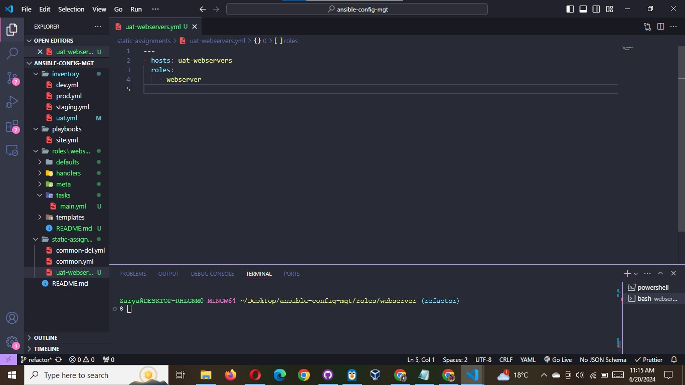
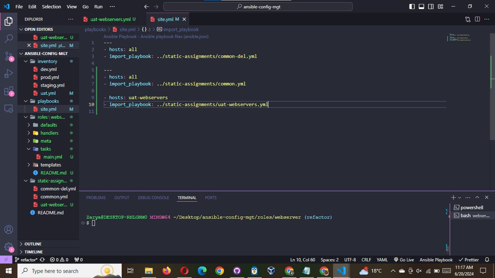

# Reference `Webserver` role

Within the static-assignments folder, create a new assignment for uat-webservers `uat-webservers.yml`. This is where you will reference the role.

```yaml
---
- hosts: uat-webservers
  roles:
    - webserver
```



Remember that the entry point to our ansible configuration is the site.yml file. Therefore, you need to refer your `uat-webservers.yml` role inside `site.yml`.

So, we should have this in `site.yml`

```yaml
---
- hosts: all
- import_playbook: ../static-assignments/common.yml

- hosts: uat-webservers
- import_playbook: ../static-assignments/uat-webservers.yml
```


