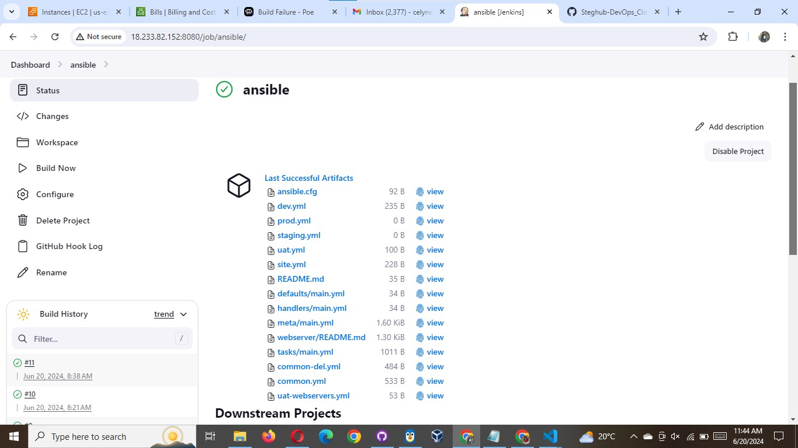
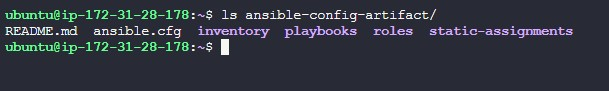
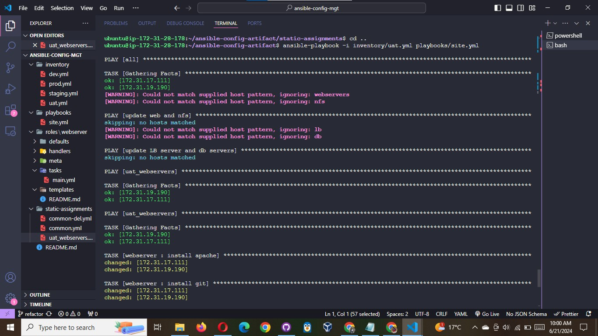
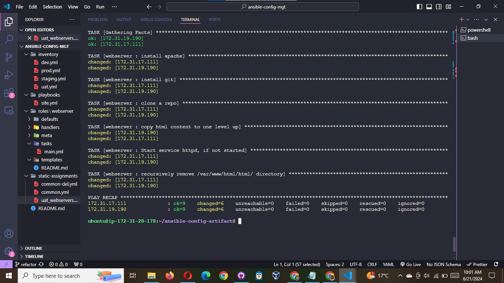
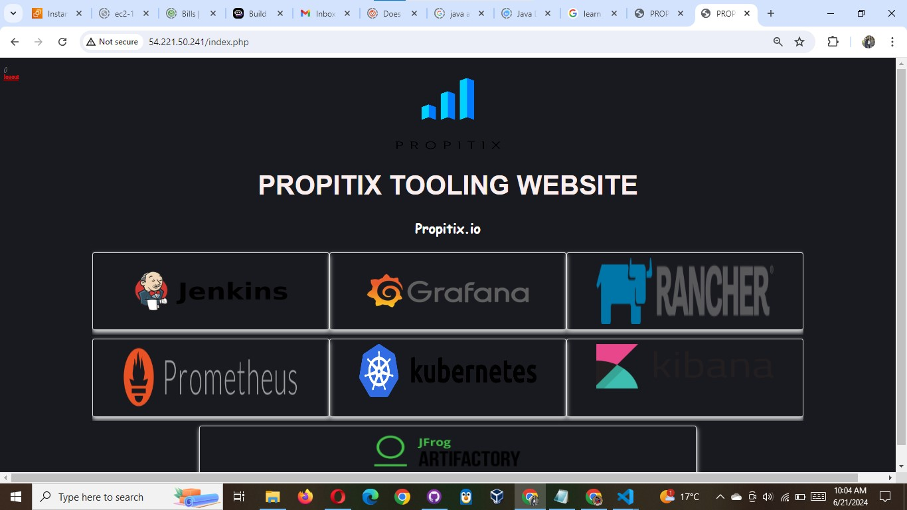
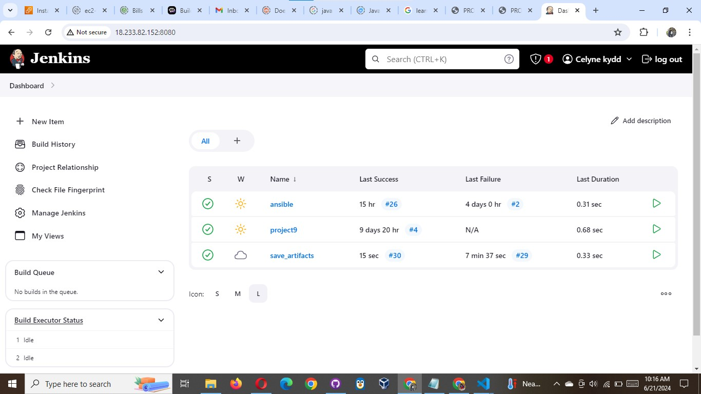
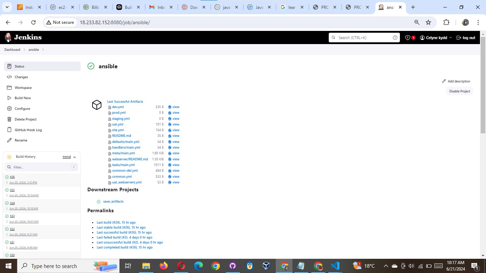

# Commit & Test

Commit your changes, create a Pull Request and `main` them to master branch, make sure webhook triggered two consequent Jenkins jobs, they ran successfully and copied all the files to your `Jenkins-Ansible` server into `/home/ubuntu/ansible-config-artifact/` directory.





Now run the playbook against your uat inventory and see what happens:

**NOTE:** Before running your playbook, ensure you have tunneled into your Jenkins-Ansible server via ssh-agent For windows users, see this [video](https://www.youtube.com/watch?v=TYyTXxVWOYA) For [Linux] users, see this [video](https://www.youtube.com/watch?v=EoLrCX1VVog)

```bash
cd /home/ubuntu/ansible-config-artifact

ansible-playbook -i /inventory/uat.yml playbooks/site.yaml
```





You should be able to see both of your UAT Web servers configured and you can try to reach them from your browser:

```html
http://<Web1-UAT-Server-Public-IP-or-Public-DNS-Name
  >/index.php or http://<Web1-UAT-Server-Public-IP-or-Public-DNS-Name
    >/index.php</Web1-UAT-Server-Public-IP-or-Public-DNS-Name
  ></Web1-UAT-Server-Public-IP-or-Public-DNS-Name
>
```

**Access Web1-UAT**


**Access Web2-UAT**



**Our Jenkins**




**Our Ansible architecture now looks like this:**


