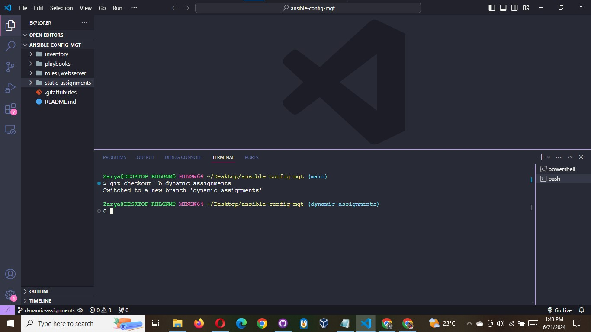
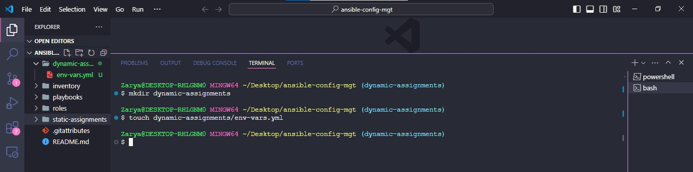
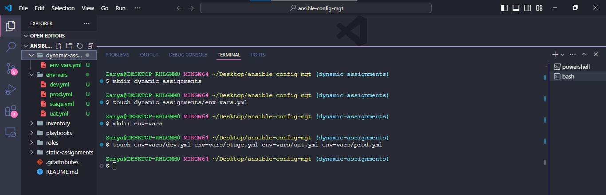
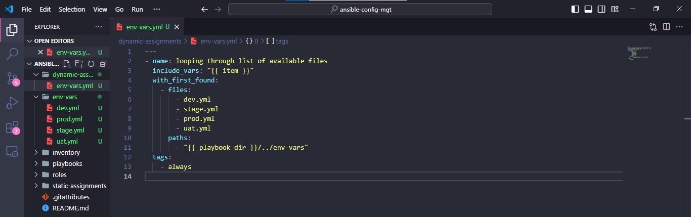

# INTRODUCING DYNAMIC ASSIGNMENT INTO OUR STRUCTURE

In your https://github.com/<your-name>/ansible-config-mgt GitHub repository start a new branch and call it dynamic-assignments.



Create a new folder, name it dynamic-assignments. Then inside this folder, create a new file and name it env-vars.yml.



We will instruct site.yml to include this playbook later. For now, let us keep building up the structure.

Your GitHub shall have following structure by now.

**Note**: Depending on what method you used in the previous project you may have or not have roles folder in your GitHub repository – if
you used ansible-galaxy, then roles directory was only created on your Jenkins-Ansible server locally. It is recommended to have all
the codes managed and tracked in GitHub, so you might want to recreate this structure manually in this case – it is up to you.

```bash
├── dynamic-assignments
│   └── env-vars.yml
├── inventory
│   └── dev
    └── stage
    └── uat
    └── prod
└── playbooks
    └── site.yml
└── roles (optional folder)
    └──...(optional subfolders & files)
└── static-assignments
    └── common.yml
```

Since we will be using the same Ansible to configure multiple environments, and each of these environments will have certain
unique attributes, such as servername, ip-address etc., we will need a way to set values to variables per specific environment.

For this reason, we will now create a folder to keep each environment’s variables file. Therefore, create a new folder env-vars, then for each environment, create new YAML files which we will use to set variables.



Your layout should now look like this

```bash
├── dynamic-assignments
│   └── env-vars.yml
├── env-vars
    └── dev.yml
    └── stage.yml
    └── uat.yml
    └── prod.yml
├── inventory
    └── dev
    └── stage
    └── uat
    └── prod
├── playbooks
    └── site.yml
└── static-assignments
    └── common.yml
    └── webservers.yml
```

Now paste the instruction below into the env-vars.yml file.

```yaml
---
- name: collate variables from env specific file, if it exists
  hosts: all
  tasks:
    - name: looping through list of available files
      include_vars: "{{ item }}"
      with_first_found:
        - files:
            - dev.yml
            - stage.yml
            - prod.yml
            - uat.yml
          paths:
            - "{{ playbook_dir }}/../env-vars"
      tags:
        - always
```



Notice 3 things to notice here:

We used include*vars syntax instead of include, this is because Ansible developers decided to separate different features of the
module. From Ansible version 2.8, the include module is deprecated and variants of include*\* must be used. These are:

- include_role ( https://docs.ansible.com/ansible/latest/collections/ansible/builtin/include_role_module.html#include-role-module )
- include_tasks ( https://docs.ansible.com/ansible/latest/collections/ansible/builtin/include_tasks_module.html#include-tasks-module )
- include_vars ( https://docs.ansible.com/ansible/latest/collections/ansible/builtin/include_vars_module.html#include-vars-module )

In the same version, variants of import were also introduces, such as:

- import_role ( https://docs.ansible.com/ansible/latest/collections/ansible/builtin/import_role_module.html#import-role-module )
- import_tasks ( https://docs.ansible.com/ansible/latest/collections/ansible/builtin/import_tasks_module.html#import-tasks-module )

2. We made use of a special variables( https://docs.ansible.com/ansible/latest/reference_appendices/special_variables.html )
   { playbook_dir } and { inventory_file }. { playbook_dir } will help Ansible to determine the location of the running playbook, and
   from there navigate to other path on the filesystem. { inventory_file } on the other hand will dynamically resolve to the name of
   the inventory file being used, then append .yml so that it picks up the required file within the env-vars folder.

3. We are including the variables using a loop. with_first_found implies that, looping through the list of files, the first one found
   is used. This is good so that we can always set default values in case an environment specific env file does not exist.
