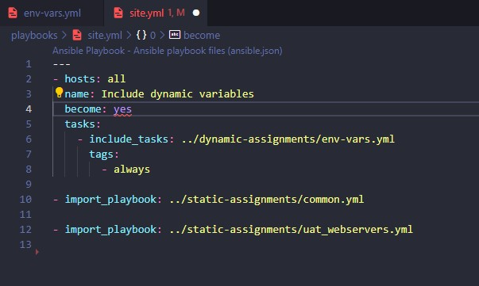
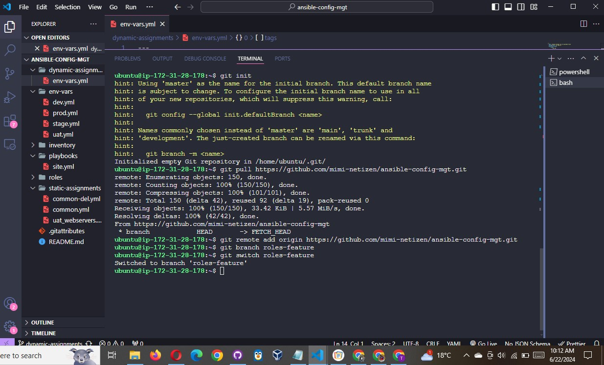
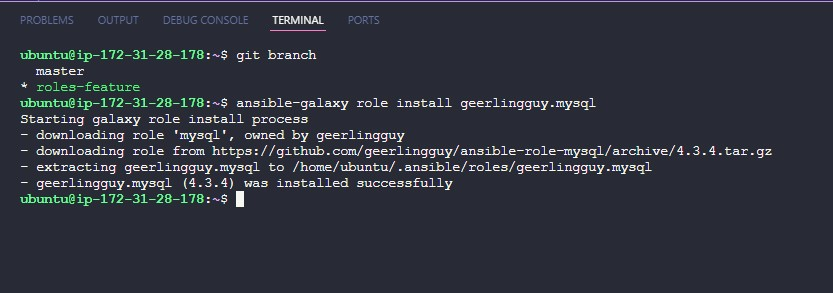
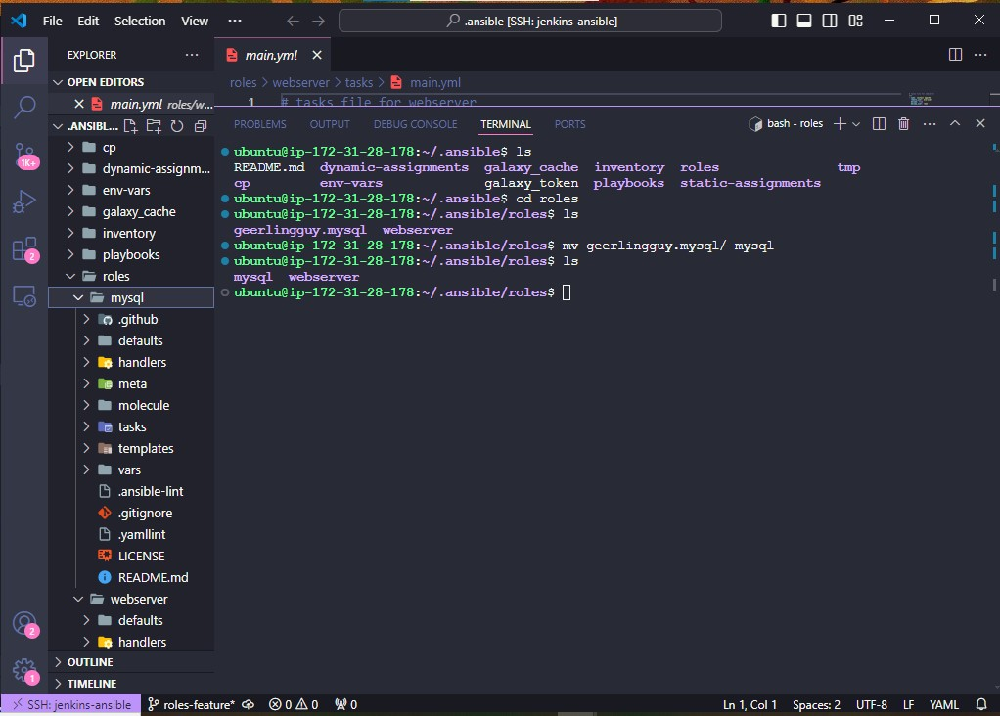
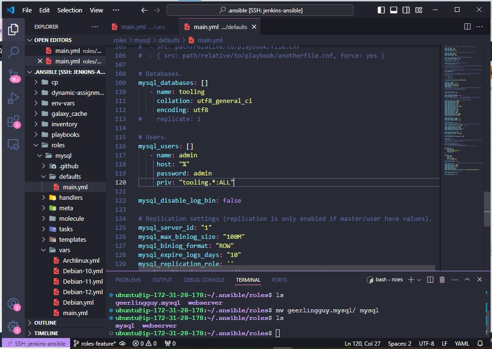
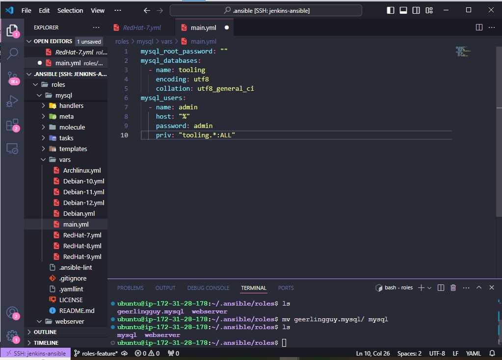
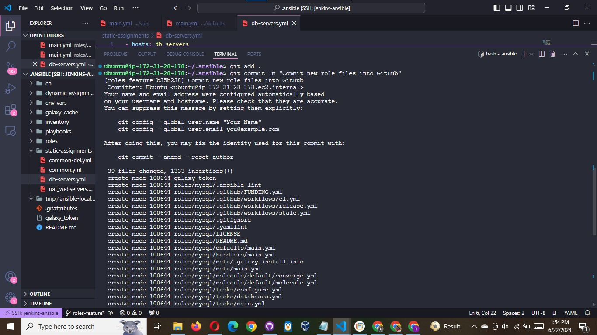
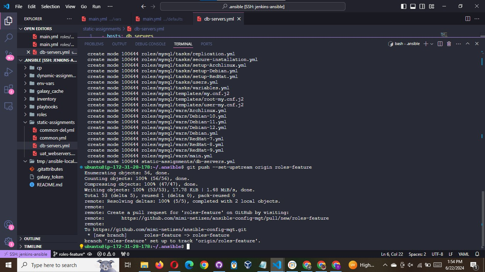
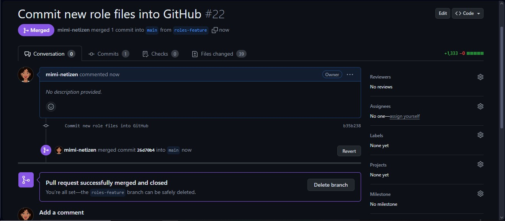

# UPDATE SITE.YML WITH DYNAMIC ASSIGNMENTS

Update site.yml file to make use of the dynamic assignment. (At this point, we cannot test it yet. We are just setting the stage
for what is yet to come. So hang on to your hats)

`site.yml` should now look like this.

```bash
---
- hosts: all
  name: Include dynamic variables
  become: yes
  tasks:
    - include_tasks: ../dynamic-assignments/env-vars.yml
      tags:
        - always

- import_playbook: ../static-assignments/common.yml

- import_playbook: ../static-assignments/uat-webservers.yml

```



## Community Roles

Now it is time to create a role for MySQL database – it should install the MySQL package, create a database and configure users. But
why should we re-invent the wheel? There are tons of roles that have already been developed by other open source engineers out there.
These roles are actually production ready, and dynamic to accomodate most of Linux flavours. With Ansible Galaxy again, we can
simply download a ready to use ansible role, and keep going.

### Download Mysql Ansible Role

You can browse available community roles here ( https://galaxy.ansible.com/home )

We will be using a MySQL role developed by geerlingguy. ( https://galaxy.ansible.com/geerlingguy/mysql )

Hint: To preserve your your GitHub in actual state after you install a new role – make a commit and push to master your
‘ansible-config-mgt’ directory. Of course you must have git installed and configured on Jenkins-Ansible server and, for more
convenient work with codes, you can configure Visual Studio Code to work with this directory. In this case, you will no longer
need webhook and Jenkins jobs to update your codes on Jenkins-Ansible server, so you can disable it – we will be using Jenkins
later for a better purpose.

On Jenkins-Ansible server make sure that git is installed with git --version, then go to ‘ansible-config-mgt’ directory and run

```bash
git init
git pull https://github.com/<your-name>/ansible-config-mgt.git
git remote add origin https://github.com/<your-name>/ansible-config-mgt.git
git branch roles-feature
git switch roles-feature
```



Inside roles directory create your new MySQL role with `ansible-galaxy install geerlingguy.mysql` and rename the folder to mysql

```bash
mv geerlingguy.mysql/ mysql
```





Read README.md file, and edit roles configuration to use correct credentials for MySQL required for the tooling website.



or

Create Database and mysql user (`roles/mysql/vars/main.yml`)

```yaml
mysql_root_password: ""
mysql_databases:
  - name: tooling
    encoding: utf8
    collation: utf8_general_ci
mysql_users:
  - name: webaccess
    host: "<Webserver subnet cidr>"
    password: Admin123
    priv: "tooling.*:ALL"
```



### Create a new playbook inside `static-assignments` folder and name it `db-servers.yml` , update it with `mysql` roles.

```yaml
- hosts: db_servers
  become: yes
  vars_files:
    - vars/main.yml
  roles:
    - { role: mysql }
```

Now it is time to upload the changes into your GitHub:

```bash
git add .
git commit -m "Commit new role files into GitHub"
git push --set-upstream origin roles-feature
```




Now, if you are satisfied with your codes, you can create a Pull Request and merge it to main branch on GitHub.


