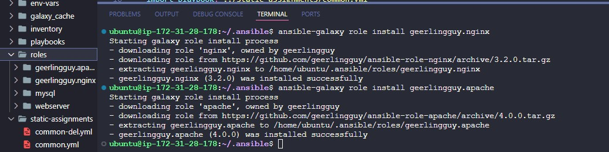
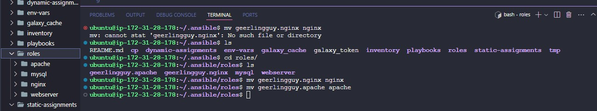
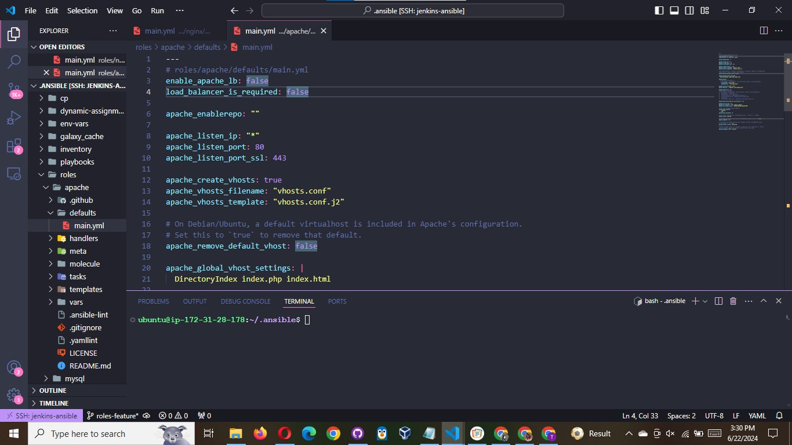
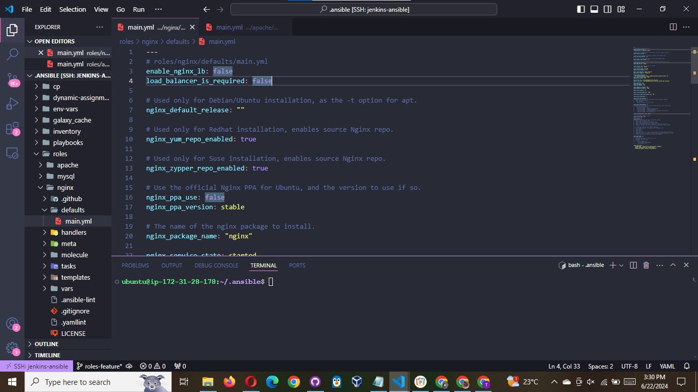
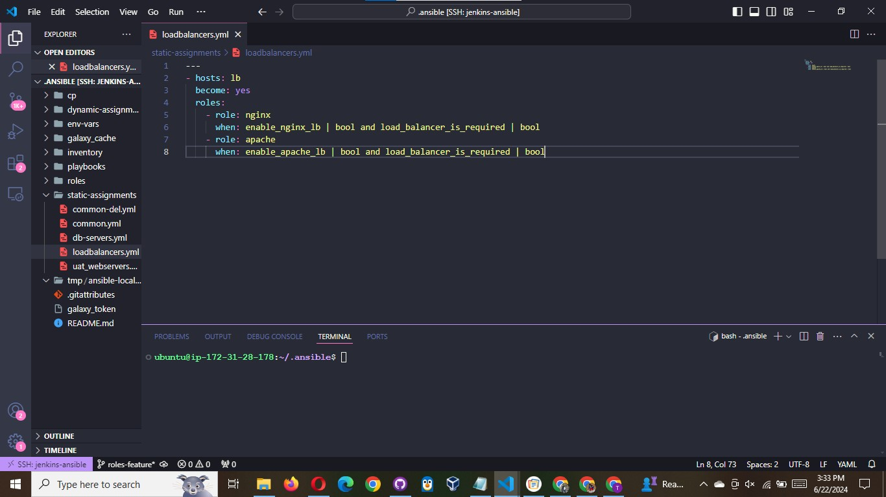
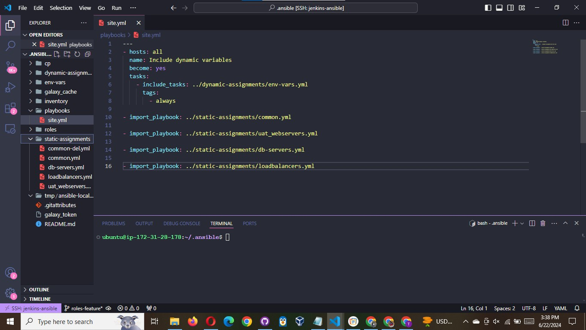

# Creating roles for load balancer

for this project , we will be making use of NGINX and APACHE as load balancers, so we need to create roles for them using same method as we did for mysql

- Download and install roles for apache , we can get this role from same source as mysql

```bash
ansible-galaxy role install geerlingguy.apache
```

- Rename the folder to apache

```bash
mv geerlingguy.apache/ apache
```

- Download and install roles for nginx also.

```bash
ansible-galaxy role install geerlingguy.nginx
```

- Rename the folder to nginx

```bash
mv geerlingguy.nginx/ nginx
```




#### Since we cannot use both apache and nginx load balancer at the same time, it is advisable to create a condition that enables either one of the two, to do this:

- Declare a variable in `roles/apache/defaults/main.yml` file inside the apache role , name the variable `enable_apache_lb`



- Declare a variable in `roles/nginx/defaults/main.yml` file inside the Nginx role , name the variable `enable_nginx_lb`



- declare another variable that ensures either one of the load balancer is required and set it to `false`.

```bash
load_balancer_is_required : false
```

- Create a new playbook in `static-assignments` and call it `loadbalancers.yml`, update it with code below:

```bash
---
- hosts: lb
  become: yes
  roles:
    - role: nginx
      when: enable_nginx_lb | bool and load_balancer_is_required | bool
    - role: apache
      when: enable_apache_lb | bool and load_balancer_is_required | bool
```



Now , inside your general playbook (site.yml) file, dynamically import the load balancer playbook so it can use the roles weve created

```bash
---
- hosts: all
  name: Include dynamic variables
  become: yes
  tasks:
    - include_tasks: ../dynamic-assignments/env-vars.yml
      tags:
        - always

- import_playbook: ../static-assignments/common.yml

- import_playbook: ../static-assignments/uat_webservers.yml

- import_playbook: ../static-assignments/loadbalancers.yml

- import_playbook: ../static-assignments/db-servers.yml
```

Your `site.yml` should like the output below



### To activate load balancer, and enable either of Apache or Nginx load balancer, we can achieve this by setting these in the respective environment's env-vars file.

- Open the `env-vars/uat.yml` file and set it . here is how is how the code should be

```bash
---
load_balancer_is_required: true
enable_nginx_lb: true
enable_apache_lb: false
```

- To use apache, we can set the `enable_apache_lb` variable to true, and `enable_nginx_lb` to false. do the same thing for nginx if you want to enable nginx load balancer
