# Configuring the apache and Nginx roles to work as load balancer

## For Apache

- in the `roles/apache/tasks/main.yml` file, wwe need to include a task that tells ansible to first check if nginx is currently running and enabled, if it is, ansible should first stop and disable nginx before proceeding to install and enable apache. this is to avoid confliction and should always free up the port 80 for the required load balancer. use the code beow to achieve this :

```bash
                        - name: Check if nginx is running
                          ansible.builtin.service_facts:

                        - name: Stop and disable nginx if it is running
                          ansible.builtin.service:
                            name: nginx
                            state: stopped
                            enabled: no
                          when: "'nginx' in services and services['nginx'].state == 'running'"
                          become: yes
```

- Save and exit


##### To use apache as a load balancer, we will need to allow certain apache modules that will enable the load balancer. this is the APACHE A2ENMOD

- in the `roles/apache/tasks/configure-debian.yml` file, Create a task to install and enable the required `apache a2enmod modules`, use the code below :

```bash
                          - name: Enable Apache modules
                            ansible.builtin.shell:
                              cmd: "a2enmod {{ item }}"
                            loop:
                              - rewrite
                              - proxy
                              - proxy_balancer
                              - proxy_http
                              - headers
                              - lbmethod_bytraffic
                              - lbmethod_byrequests
                            notify: restart apache
                            become: yes
```

- Create another task to update the apache configurations with required code block needed for the load balancer to function. use the code below :

```bash
                          - name: Insert load balancer configuration into Apache virtual host
                            ansible.builtin.blockinfile:
                              path: /etc/apache2/sites-available/000-default.conf
                              block: |
                                <Proxy "balancer://mycluster">
                                  BalancerMember http://<webserver1-ip-address>:80
                                  BalancerMember http://<webserver2-ip-address>:80
                                  ProxySet lbmethod=byrequests
                                </Proxy>
                                ProxyPass "/" "balancer://mycluster/"
                                ProxyPassReverse "/" "balancer://mycluster/"
                              marker: "# {mark} ANSIBLE MANAGED BLOCK"
                              insertbefore: "</VirtualHost>"
                            notify: restart apache
                            become: yes
```

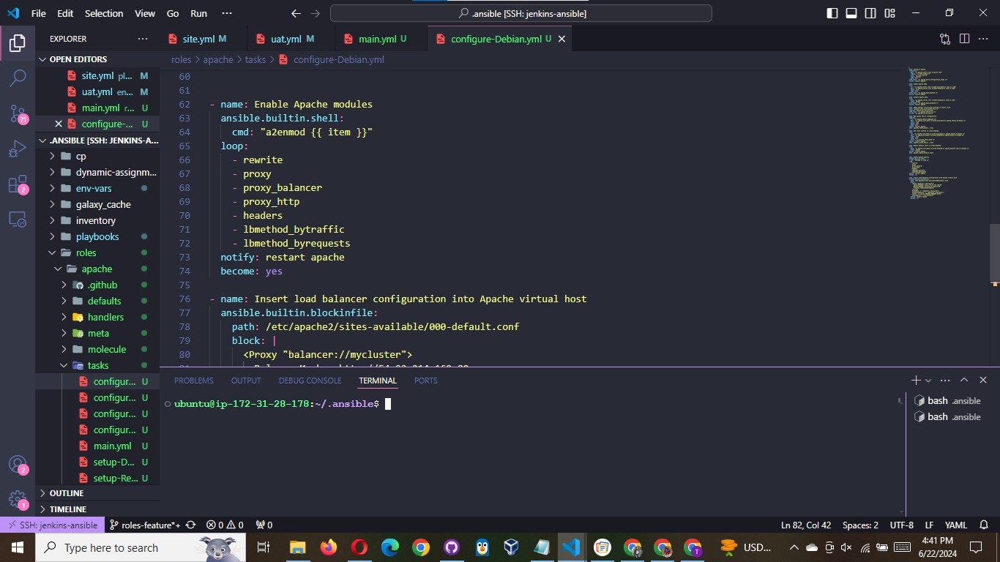

Enable Apache (in env-vars/uat.yml)

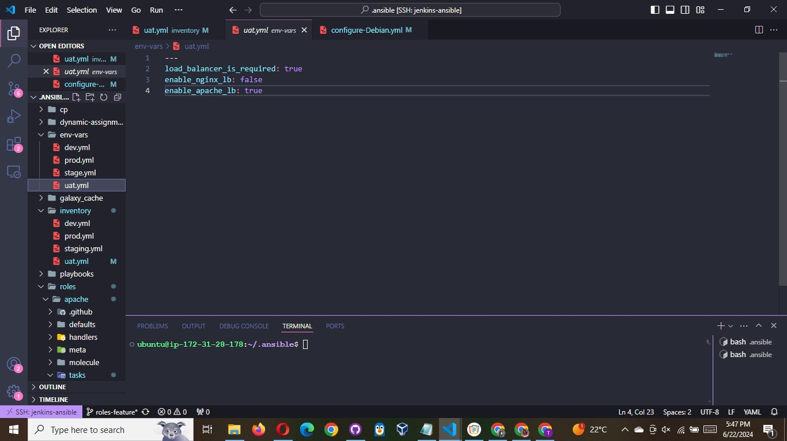

- Save and create a pull request to merge with the main branch of your github repo.

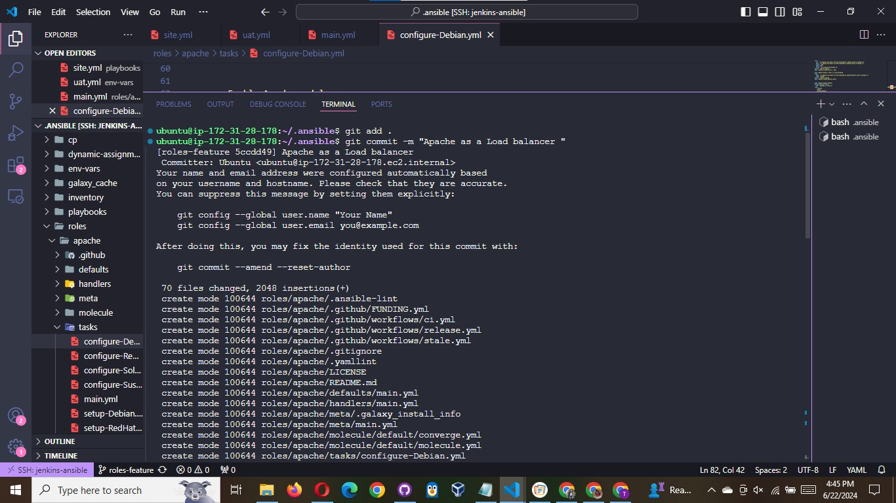

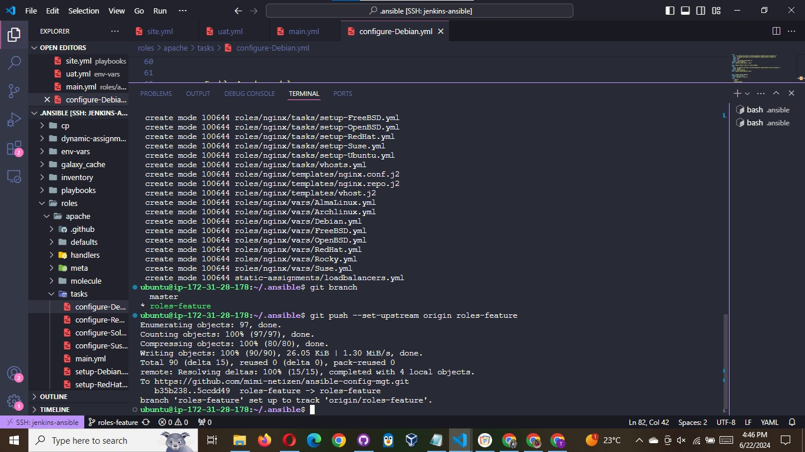

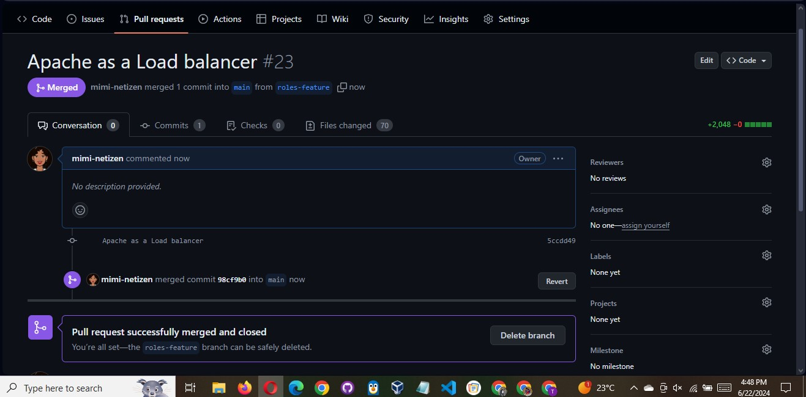

## For Nginx

- In the `roles/nginx/tasks/main.yml` file, create a similar task like we did above to check if apache is active and enabled, if it is, it should disable and stop apache before proceeding with the tasks of installing nginx. use the code below :

```bash
                              - name: Check if Apache is running
                                ansible.builtin.service_facts:

                              - name: Stop and disable Apache if it is running
                                ansible.builtin.service:
                                  name: apache2
                                  state: stopped
                                  enabled: no
                                when: "'apache2' in services and services['apache2'].state == 'running'"
                                become: yes
```

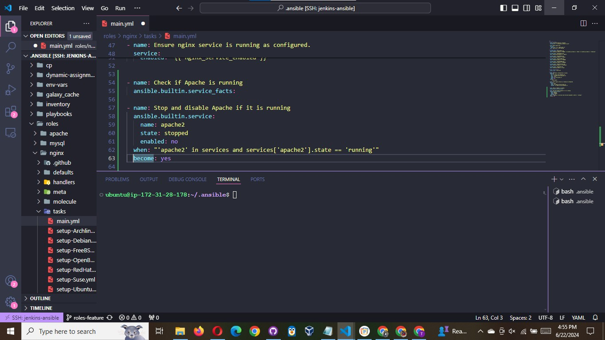

- In the `roles/nginx/handlers/main.yml` file, set nginx to always perform the tasks with sudo privileges, use the function : `become: yes` to achieve this
- Do the same for all tasks that require sudo privileges

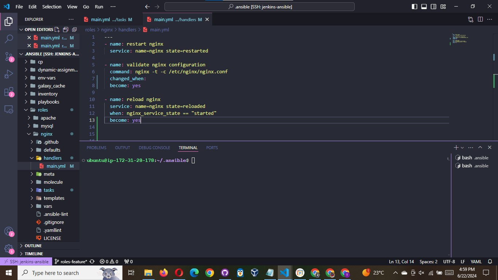

- In the `role/nginx/defaults/main.yml` file, uncomment the **nginx_vhosts, and nginx_upstream section**
- Under the nginx_vhosts section, ensure you have the same code :

```bash

                             nginx_vhosts:
                              - listen: "80" # default: "80"
                                server_name: "example.com"
                                server_name_redirect: "example.com"
                                root: "/var/www/html"
                                index: "index.php index.html index.htm" # default: "index.html index.htm"
                                # filename: "nginx.conf" # Can be used to set the vhost filename.

                                locations:
                                          - path: "/"
                                            proxy_pass: "http://myapp1"

                              # Properties that are only added if defined:
                                server_name_redirect: "www.example.com" # default: N/A
                                error_page: ""
                                access_log: ""
                                error_log: ""
                                extra_parameters: "" # Can be used to add extra config blocks (multiline).
                                template: "{{ nginx_vhost_template }}" # Can be used to override the `nginx_vhost_template` per host.
                                state: "present" # To remove the vhost configuration.
```

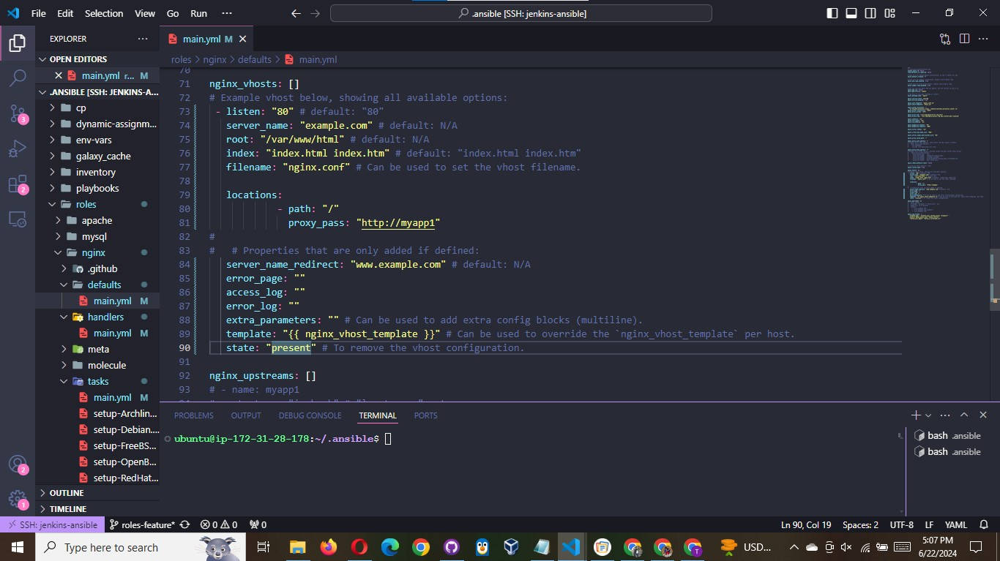

- Under the `nginx_upstream` section, you wil need to update the servers address to include your webservers or uat servers.

```powershell
                              nginx_upstreams:
                              - name: myapp1
                                strategy: "ip_hash" # "least_conn", etc.
                                keepalive: 16 # optional
                                servers:
                                  - "<uat-server2-ip-address> weight=5"
                                  - "<uat-server1-ip-address> weight=5"
```

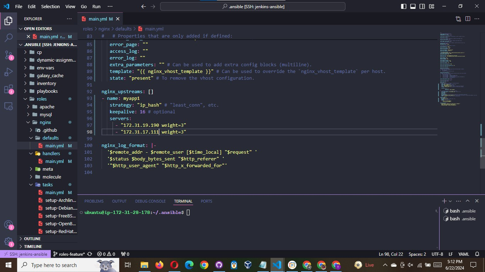

- Save and exit.

Update `roles/nginx/templates/nginx.conf.j2`
Comment the line include `{{ nginx_vhost_path }}/*;`


This line renders the `/etc/nginx/sites-enabled/` to the http configuration of Nginx.

Create a server block template in `Nginx.conf.j2` for nginx configuration file to override the default in nginx role.

```bash

    server {
        listen {{ vhost.listen }};
        server_name {{ vhost.server_name }};
        root {{ vhost.root }};
        index {{ vhost.index }};

    
        location {{ location.path }} {
            proxy_pass {{ location.proxy_pass }};
        }
    
  }

```

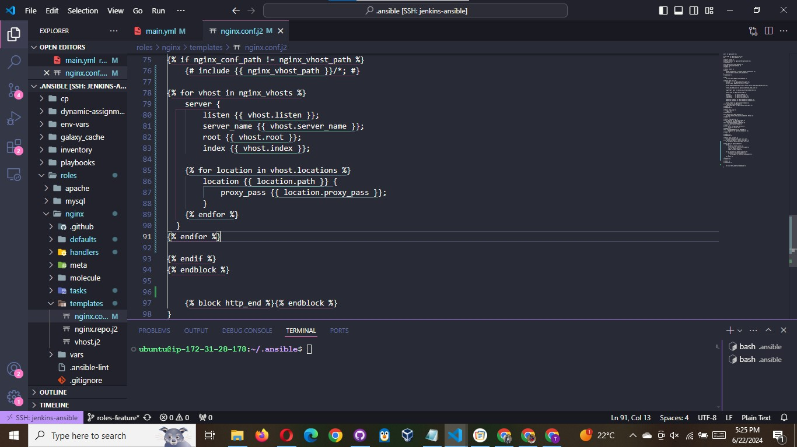

finally, update the `inventory/uat.yml` to include the neccesary details for ansible to connect to each of these servers to perform all the roles we have specified. use the code below :

```bash

[uat-webservers]
<server1-ipaddress> ansible_ssh_user=<ec2-username>
<server2-ip address> ansible_ssh_user=<ec2-username>

[lb]
<lb-instance-ip> ansible_ssh_user=<ec2-username>

[db-servers]
<db-isntance-ip> ansible_ssh_user=<ec2-user>
```


Save and create a pull request to merge with the main branch of your github repo.

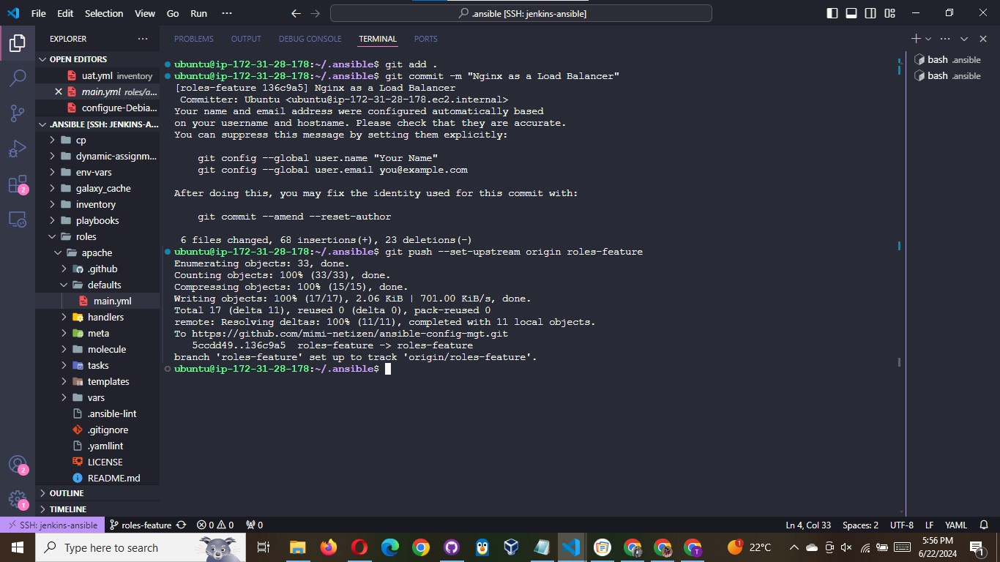

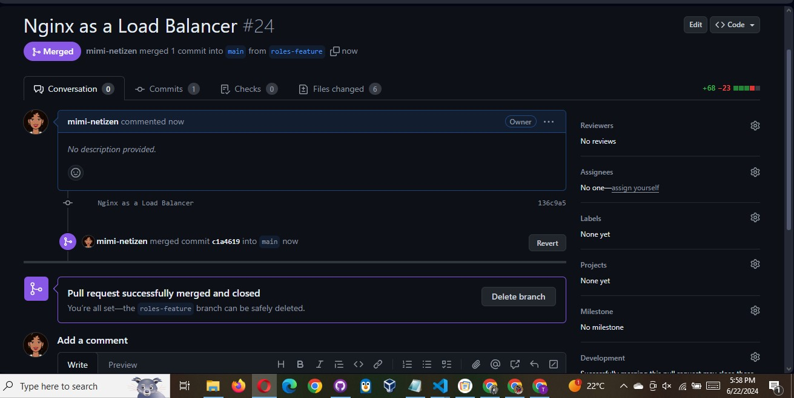
