# Configure your webserver roles to install php and all its dependencies , as well as cloning your tooling website from your github repo

- In the `roles/webserver/tasks/main.yml` , write the following tasks. use the code below :

```bash
# tasks file for webserver
---
- name: install apache
  remote_user: ec2-user
  become: true
  become_user: root
  ansible.builtin.yum:
    name: "httpd"
    state: present

- name: Enable apache
  remote_user: ec2-user
  become: true
  become_user: root
  ansible.builtin.command:
    cmd: sudo systemctl enable httpd

- name: Install EPEL release
  remote_user: ec2-user
  become: true
  become_user: root
  ansible.builtin.command:
    cmd: sudo dnf install https://dl.fedoraproject.org/pub/epel/epel-release-latest-9.noarch.rpm -y

- name: Install dnf-utils and Remi repository
  remote_user: ec2-user
  become: true
  become_user: root
  ansible.builtin.command:
    cmd: sudo dnf install dnf-utils http://rpms.remirepo.net/enterprise/remi-release-9.rpm -y

- name: Reset PHP module
  remote_user: ec2-user
  become: true
  become_user: root
  ansible.builtin.command:
    cmd: sudo dnf module reset php -y

- name: Enable PHP 8.2 module
  remote_user: ec2-user
  become: true
  become_user: root
  ansible.builtin.command:
    cmd: sudo dnf module enable php:remi-8.2 -y

- name: Install PHP and extensions
  remote_user: ec2-user
  become: true
  become_user: root
  ansible.builtin.yum:
    name:
      - php
      - php-opcache
      - php-gd
      - php-curl
      - php-mysqlnd
    state: present

- name: Install MySQL client
  remote_user: ec2-user
  become: true
  become_user: root
  ansible.builtin.yum:
    name: "mysql"
    state: present

- name: Start PHP-FPM service
  remote_user: ec2-user
  become: true
  become_user: root
  ansible.builtin.service:
    name: php-fpm
    state: started

- name: Enable PHP-FPM service
  remote_user: ec2-user
  become: true
  become_user: root
  ansible.builtin.service:
    name: php-fpm
    enabled: true

- name: Set SELinux policies for web servers
  remote_user: ec2-user
  become: true
  become_user: root
  ansible.builtin.command:
    cmd: sudo setsebool -P httpd_execmem 1
    cmd: sudo setsebool -P httpd_can_network_connect=1
    cmd: sudo setsebool -P httpd_can_network_connect_db=1

- name: install git
  remote_user: ec2-user
  become: true
  become_user: root
  ansible.builtin.yum:
    name: "git"
    state: present

- name: clone a repo
  remote_user: ec2-user
  become: true
  become_user: root
  ansible.builtin.git:
    repo: https://github.com/mimi-netizen/tooling.git
    dest: /var/www/html
    force: yes

- name: copy html content to one level up
  remote_user: ec2-user
  become: true
  become_user: root
  command: cp -r /var/www/html/html/ /var/www/

- name: Start service httpd, if not started
  remote_user: ec2-user
  become: true
  become_user: root
  ansible.builtin.service:
    name: httpd
    state: started

- name: recursively remove /var/www/html/html/ directory
  remote_user: ec2-user
  become: true
  become_user: root
  ansible.builtin.file:
    path: /var/www/html/html
    state: absent
```

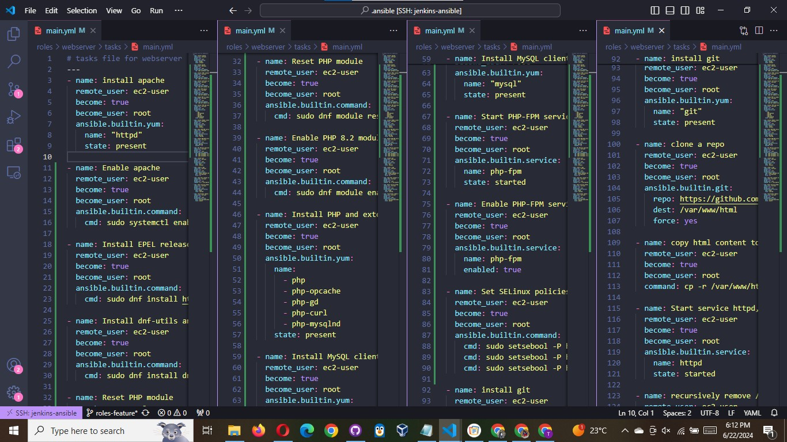

The code block above tells ansible to install apache on the webservers , install git, install php and all its dependencies, clone the website from out github repo,as well ascopy the website files into the /var/www/html directory.

Save and exit.

Create a pull request and merge with your main branch of your github repo

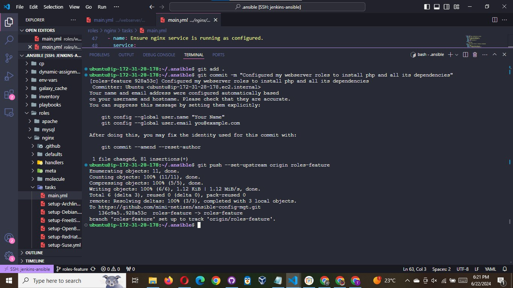

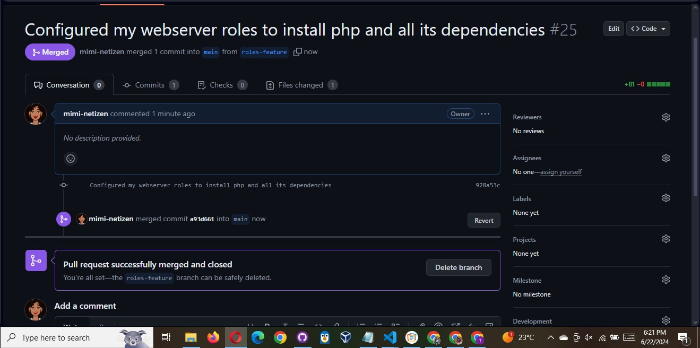

Run the playbook command against the inventory/uat files

```bash
ansible-playbook -i inventory/uat.yml playbooks/site.yml
```

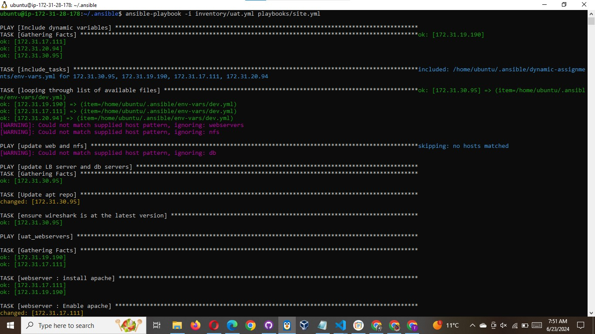

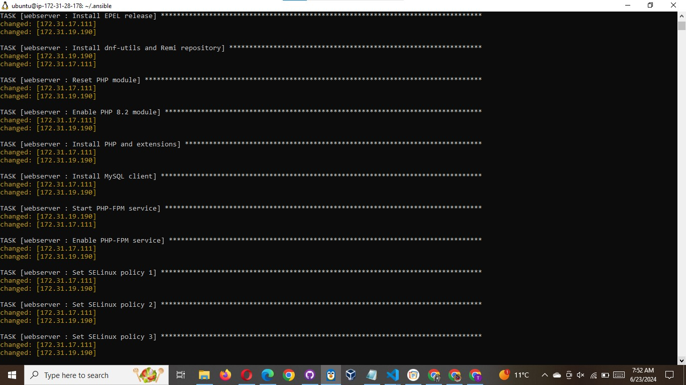

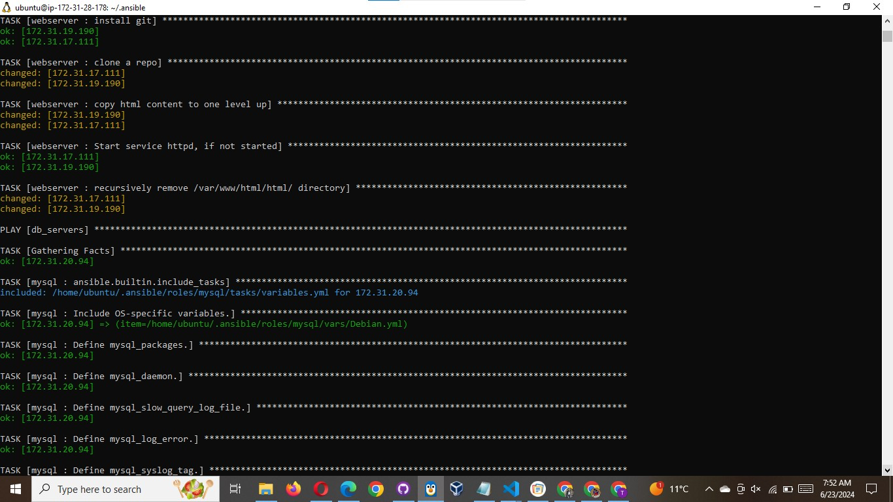

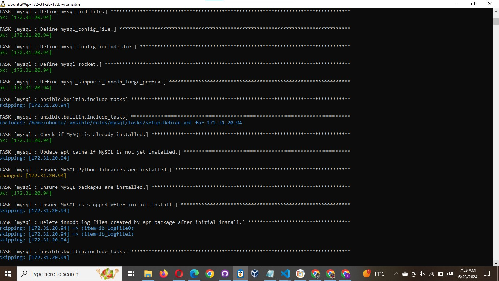

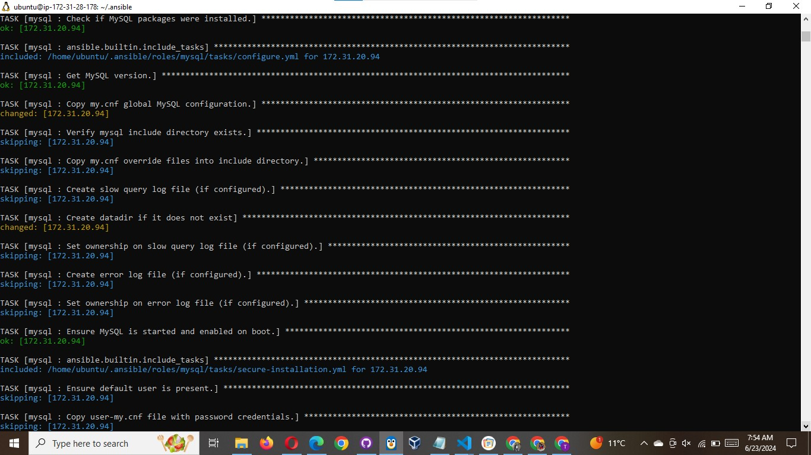

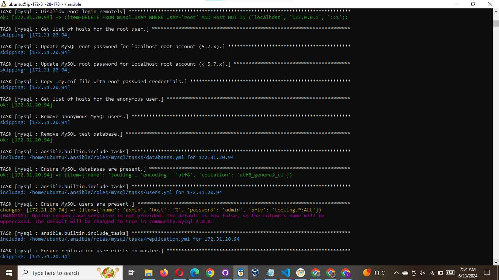

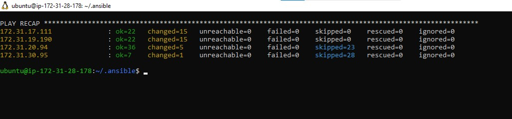

### Additional step : To be able to login to your database from the tooling website uploaded,

- Login to the uat-webservers , update the functions.php in the `/var/www/html` directory, input the credentials we specified in the mysql roles, in our case, admin, admin, use the mysql db server private ip as host name. save and exit.
- Ensure you can login remotely to the mysql server from the uat-server.
- import the tooling-db.sql file into the database. ( check previous projects for how to do this ).
- Create a user in the tooling database, use `myuser` for username and `password` for password. exit .
- visit your uat servers ip address and attempt to login. use same password and username we inputed into the db table.
- As well visit yor load balncer and ensure you can login as well

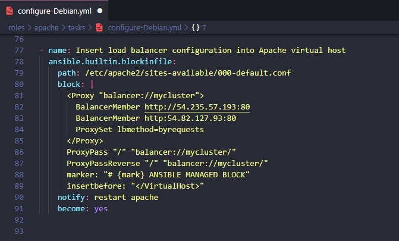

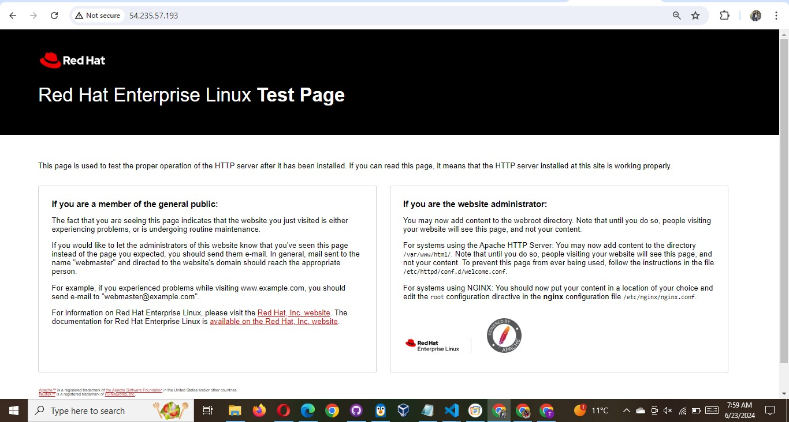

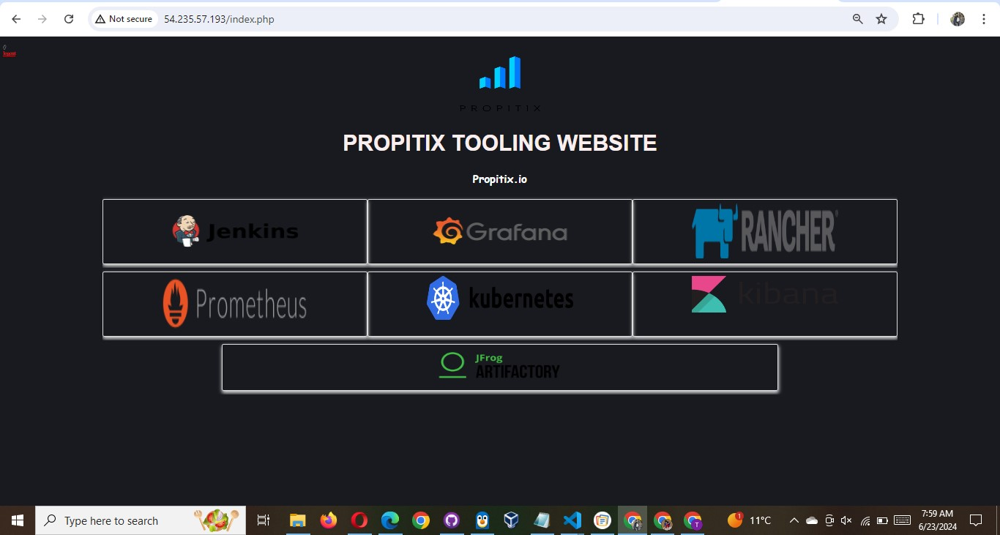


