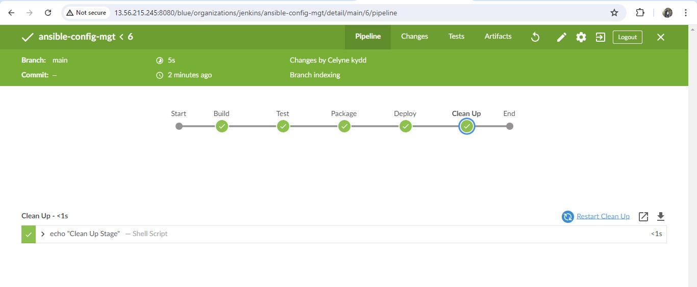

# ANSIBLE ROLES FOR CI ENVIRONMENT

Now go ahead and Add two more roles to ansible:

1. [SonarQube](https://www.sonarsource.com/products/sonarqube/) (Scroll down to the Sonarqube section to see instructions on how to
   set up and configure SonarQube manually)

2. [Artifactory](https://jfrog.com/artifactory/)

### Why do we need SonarQube?

**SonarQube** is an open-source platform developed by SonarSource for continuous inspection of code quality, it is used to perform
automatic reviews with static analysis of code to detect bugs, code smells, and security vulnerabilities.
[Watch a short description here](https://youtu.be/vE39Fg8pvZg). There is a lot more hands on work ahead with SonarQube and Jenkins.
So, the purpose of SonarQube will be clearer to you very soon.

### Why do we need Artifactory?

**Artifactory** is a product by [JFrog](https://jfrog.com/) that serves as a binary repository manager. The binary repository is a natural extension to the
source code repository, in that the outcome of your build process is stored. It can be used for certain other automation,
but we will it strictly to manage our build artifacts.

[Watch a short description here](https://youtu.be/upJS4R6SbgM) Focus more on the first 10.08 mins

### Configuring Ansible For Jenkins Deployment

In previous projects, you have been launching Ansible commands manually from a CLI. Now, with Jenkins, we will start running Ansible
from Jenkins UI.

**To do this**

## 1. Install Jenkins

Let's lunch a AWS ec2 with an Ubuntu OS instance and configure the jenkins server on it.


Install jenkins and it's dependencies using the terminal.

```bash
sudo apt-get update  # Update the instance

# Download jenkins key
sudo wget -q -O /tmp/jenkins.io.key https://pkg.jenkins.io/debian/jenkins.io.key

# Add the key to the trusted keyring
sudo apt-key add /tmp/jenkins.io.key

# Verify that the key was added successfully
sudo apt-key list

# Create a new file in the trusted.gpg.d directory to permanently store the Jenkins repository key
sudo sh -c 'echo "deb https://pkg.jenkins.io/debian binary/" > /etc/apt/sources.list.d/jenkins.list'


# Install Java
sudo add-apt-repository ppa:openjdk-r/ppa
sudo apt-get update
sudo apt install openjdk-11-jdk

# Install Jenkins
sudo apt-get update
sudo apt-get install jenkins -y

# Enable and start Jenkins
sudo systemctl enable jenkins
sudo systemctl start jenkins
sudo systemctl status jenkins

```


### 1.2. Open TCP port 8080


## 2. Navigate to Jenkins URL

```
<Jenkins-server-Elastic-IP>:8080
```


## 3. Install & Open Blue Ocean Jenkins Plugin

In the Jenkins dashboard, click on **Manage Jenkins** -> **Manage plugins** and search for `Blue Ocean plugin`. Install and open Blue Ocean plugin


## Configure blue ocean pipeline with git repo

### Follow the steps below:

- **Click "Open blue oceans" plugin and create a new pipeline**


- **Connect Jenkins with GitHub**


- **Login to GitHub & Generate an Access Token**

To generate a GitHub personal access token, you can follow these steps:

1. **Log in to your GitHub account**: Go to the GitHub website (https://github.com/) and log in to your account.

2. **Go to the Settings page**: Click on your profile picture in the top-right corner of the page, and then select "Settings" from the dropdown menu or go to https://github.com/settings/tokens


3. **Navigate to the Developer Settings**: In the left-hand menu, scroll down and click on "Developer settings".

4. **Create a new personal access token**: In the left-hand menu, click on "Personal access tokens", then click on the "Generate new token" button.

5. **Configure the token**: You will be presented with a form to configure your personal access token. Here are the steps:

   - **Note**: Give your token a descriptive name, such as "My Personal Access Token".
   - **Expiration**: Choose the expiration date for your token. You can select "No expiration" if you want the token to never expire.
   - **Select scopes**: Choose the permissions you want to grant to your token. The specific scopes you need will depend on the actions you want to perform with the token. Common scopes include `repo` (for accessing private repositories), `gist` (for creating and managing gists), and `user` (for accessing your user profile).

6. **Generate the token**: After configuring the token, click the "Generate token" button at the bottom of the page.

7. **Copy the token**: Once the token is generated, make sure to copy it immediately, as you won't be able to view it again after leaving the page. You can copy the token by clicking on the "Copy" button next to the token.

Remember to keep your personal access token secure, as it provides access to your GitHub account. You should treat it like a password and not share it with anyone.

If you need to revoke or delete a personal access token, you can do so by going to the "Personal access tokens" page in your GitHub settings and clicking on the "Delete" button next to the token you want to remove.

- **Copy Access Token , Paste the token and connect**


- **Create a new Pipeline**


At this point you may not have a [Jenkinsfile](https://www.jenkins.io/doc/book/pipeline/jenkinsfile/) in the Ansible repository, so
Blue Ocean will attempt to give you some guidance to create one. But we do not need that. We will rather create one ourselves.
So, click on Administration to exit the Blue Ocean console.

**Here is our newly created pipeline. It takes the name of your GitHub repository**


## Let us create our Jenkinsfile

In Vscode, inside the Ansible project, create a new directory and name it `deploy`, create a new file `Jenkinsfile` inside the directory


Add the code snippet below to start building the Jenkinsfile gradually. This pipeline currently has just one stage called Build and
the only thing we are doing is using the shell script module to echo Building Stage

```bash
pipeline {
    agent any

  stages {
    stage('Build') {
      steps {
        script {
          sh 'echo "Building Stage"'
        }
      }
    }
    }
}
```


**Now go back into the Ansible pipeline in Jenkins, and select configure**


**Scroll down to Build Configuration section and specify the location of the Jenkinsfile at `deploy/Jenkinsfile`**


**Back to the pipeline again, this time click `scan repository now` then `Scan Repository Log`**


**`Build now`**

This will trigger a build and you will be able to see the effect of our basic `Jenkinsfile` configuration by going through the console
output of the build.


To really appreciate and feel the difference of Cloud Blue UI, it is recommended to try triggering the build again from Blue Ocean
interface.

1. Click on Blue Ocean

2. Select your project

3. Click on the play button against the branch

   

   

   

   

   

\

> Notice that this pipeline is a multibranch one. This means, if there were more than one branch in GitHub, Jenkins would have scanned
> the repository to discover them all and we would have been able to trigger a build for each branch.

**Let us see this in action**

1. Create a new git branch and name it `feature/jenkinspipeline-stages`

```bash
git checkout -b feature/jenkinspipeline-stages

```


2. Currently we only have the _Build stage_. Let us add another stage called _Test_. Paste the code snippet below and push the new changes
   to GitHub.

```bash
pipeline {
    agent any

  stages {
    stage('Build') {
      steps {
        script {
          sh 'echo "Building Stage"'
        }
      }
    }

    stage('Test') {
      steps {
        script {
          sh 'echo "Testing Stage"'
        }
      }
    }
    }
}
```


4. To make your new branch show up in Jenkins, we need to tell Jenkins to scan the repository.

1. Click on the "Administration" button

1. Navigate to the Ansible project and click on `Scan repository now` then `Scan repository Log`


1. Refresh the page and both branches will start building automatically. You can go into Blue Ocean and see both branches there too.

   

1. In Blue Ocean, you can now see how the Jenkinsfile has caused a new step in the pipeline launch build for the new branch.


### A QUICK TASK FOR YOU!

```bash
1. Create a pull request to merge the latest code into the main branch

2. After merging the PR, go back into your terminal and switch into the main branch.

3. Pull the latest change.

4. Create a new branch, add more stages into the Jenkins file to simulate below phases. (Just add an echo command like we have in build
and test stages)

   1. Package

   2. Deploy

   3. Clean up
```


```bash
5. Verify in Blue Ocean that all the stages are working, then merge your feature branch to the main branch

6. Eventually, your main branch should have a successful pipeline like this in blue ocean
```



