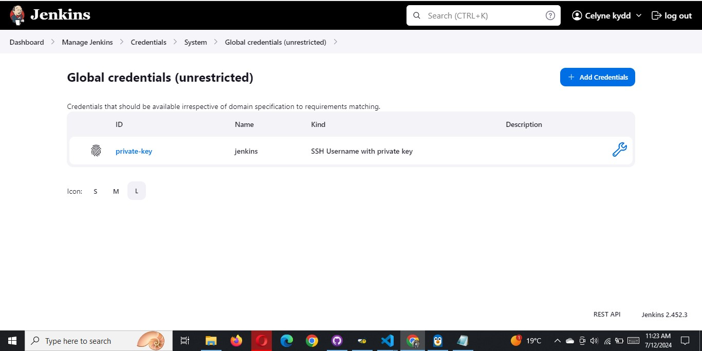
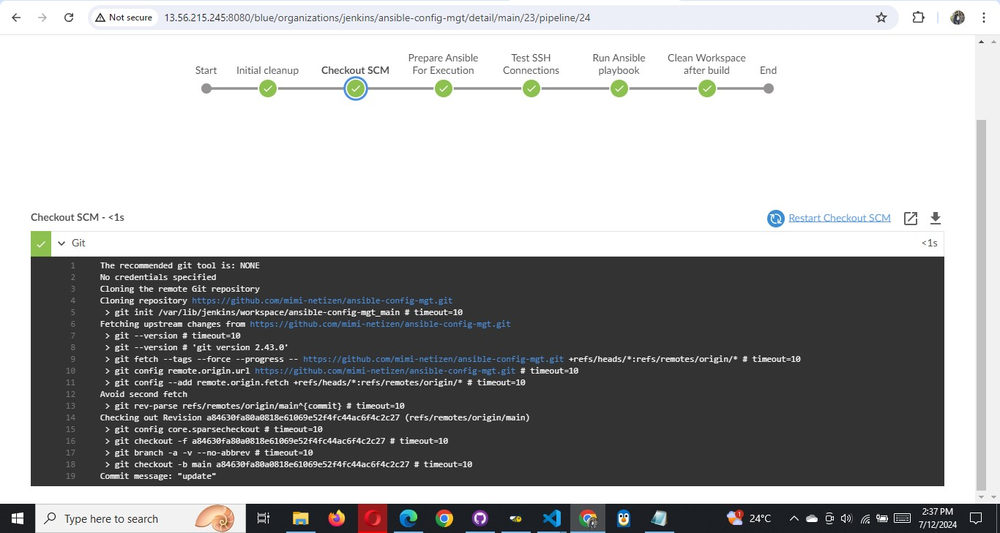
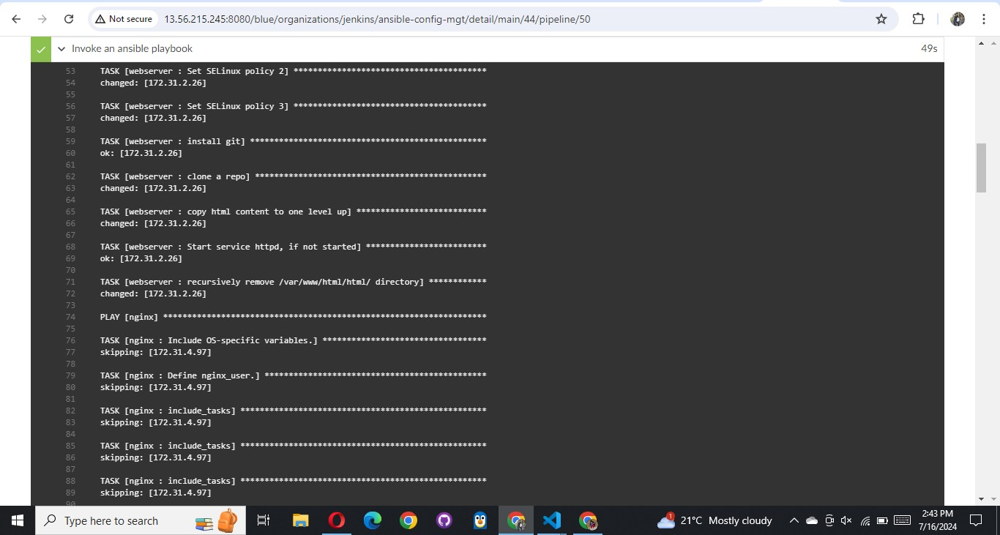

# Running Ansible Playbook from Jenkins

Now that you have a broad overview of a typical **Jenkins pipeline**. Let us get the actual Ansible deployment to work by:

1. Installing Ansible on Jenkins

```
sudo apt update
sudo apt upgrade -y
```

Install Required Dependencies

```
sudo apt install software-properties-common -y
```

Add the Ansible PPA (Personal Package Archive)

```
sudo add-apt-repository --yes --update ppa:ansible/ansible
```

```
sudo apt update
sudo apt install ansible -y
```

Verify the Installation

```
ansible --version
```


2. Installing Ansible plugin in Jenkins UI On the dashboard page, click on Manage Jenkins > Manage plugins > Available type in ansible and install without restart

   

   

Click on Dashboard > Manage Jenkins > Global Tool Configuration > Add Ansible. Add a name and the path ansible is installed on the jenkins server

get path

```
 which ansible
```


3. Creating Jenkinsfile from scratch. (Delete all you currently have in there and start all over to get Ansible to run successfully)

You can [watch a 10 minutes video here](https://youtu.be/PRpEbFZi7nI) to guide you through the entire setup

Let's delete the content of current Jenkinsfile nad create a new Jenkinsfile from scratch to run the ansible playbook against the dev environment.

To do this let's ensure git module is checking out SCM from main branch.

```
pipeline {
    agent any

    environment {
        ANSIBLE_CONFIG = "${WORKSPACE}/deploy/ansible.cfg"
    }

    stages {
        stage('Initial cleanup') {
            steps {
                dir("${WORKSPACE}") {
                    deleteDir()
                }
            }
        }

        stage('Checkout SCM') {
            steps {
                git branch: 'main', url: 'https://github.com/mimi-netizen/ansible-config-mgt.git'
            }
        }

        stage('Prepare Ansible For Execution') {
            steps {
                sh 'echo ${WORKSPACE}'
                sh 'sed -i "3 a roles_path=${WORKSPACE}/roles" ${WORKSPACE}/deploy/ansible.cfg'
            }
        }

        stage('Test SSH Connections') {
            steps {
                script {
                    def allHosts = [
                        'ubuntu@172.31.4.97',
                        'ec2-user@172.31.4.97'
                    ]

                    sshagent(['private-key']) {
                        allHosts.each { host ->
                            sh "ssh -o StrictHostKeyChecking=no ${host} exit"
                        }
                    }
                }
            }
        }

        stage('Run Ansible playbook') {
            steps {
                sshagent(['private-key']) {
                    ansiblePlaybook(
                        become: true,
                        credentialsId: 'private-key',
                        disableHostKeyChecking: true,
                        installation: 'ansible',
                        inventory: '${WORKSPACE}/inventory/dev.yml',
                        playbook: '${WORKSPACE}/playbooks/site.yml'
                    )
                }
            }
        }

        stage('Clean Workspace after build') {
            steps {
                cleanWs(cleanWhenAborted: true, cleanWhenFailure: true, cleanWhenNotBuilt: true, cleanWhenUnstable: true, deleteDirs: true)
            }
        }
    }
}
```


> **Note**: Ensure that Ansible runs against the Dev environment successfully.


4. To ensure jenkins properly connects to all servers, install another plugin called ssh agent


Then go to manage jenkins > credentials > global > add credentials

**Then follow the steps below:**

Kind: SSH Username with private key
Scope: Global (Jenkins, nodes, items, all child items, etc)

ID: private-key (or any ID you prefer)
Username: Leave it blank or set a default value (e.g., defaultuser) # This is because we are using servers of different username i.e ubbuntu and ec2-user. This value won’t be used because the actual usernames will be specified in the Ansible inventory file.

Private Key: Enter the private key directly




Update inventory/dev.yml by specifying the private IP address of the servers


Update the playbook as well


**Possible errors to watch out for:**

1. Ensure that the git module in `Jenkinsfile` is checking out SCM to main branch instead of master (GitHub has discontinued the use of
   Master due to Black Lives Matter. You can read more here)

2. Jenkins needs to export the `ANSIBLE_CONFIG` environment variable. You can put the .`ansible.cfg` file alongside Jenkinsfile in the
   deploy directory. This way, anyone can easily identify that everything in there relates to deployment. Then, using the Pipeline
   Syntax tool in Ansible, generate the syntax to create environment variables to set.

https://wiki.jenkins.io/display/JENKINS/Building+a+software+project

**Possible issues to watch out for when you implement this**

1. Remember that `ansible.cfg` must be exported to environment variable so that Ansible knows where to find Roles. But because you will
   possibly run `Jenkins` from different git branches, the location of Ansible roles will change. Therefore, you must handle this
   dynamically. You can use Linux [Stream Editor sed](https://www.gnu.org/software/sed/manual/sed.html) to update the section
   roles_path each time there is an execution. You may not have this issue if you run only from the main branch.

2. If you push new changes to Git so that Jenkins failure can be fixed. You might observe that your change may sometimes have no effect.
   Even though your change is the actual fix required. This can be because Jenkins did not download the latest code from GitHub. Ensure
   that you start the **Jenkinsfile** with a clean up step to always delete the previous workspace before running a new one. Sometimes
   you might need to login to the **Jenkins Linux server** to verify the files in the workspace to confirm that what you are actually
   expecting is there. Otherwise, you can spend hours trying to figure out why Jenkins is still failing, when you have pushed up
   possible changes to fix the error.

3. Another possible reason for Jenkins failure sometimes, is because you have indicated in the Jenkinsfile to check out the main git
   branch, and you are running a pipeline from another branch. So, always verify by logging onto the Jenkins box to check the workspace,
   and run git branch command to confirm that the branch you are expecting is there.

**After fixing all errors final result looks**





If everything goes well for you, it means, the Dev environment has an up-to-date configuration. But what if we need to deploy to
other environments?

- Are we going to manually update the Jenkinsfile to point inventory to those environments? such as sit, uat, pentest, etc.

- Or do we need a dedicated git branch for each environment, and have the inventory part hard coded there.

Think about those for a minute and try to work out which one sounds more like a better solution.

**Manually updating the Jenkinsfile** is definitely not an option. And that should be obvious to you at this point. Because we try to
automate things as much as possible.

Well, unfortunately, we will not be doing any of the highlighted options. What we will be doing is to **parameterise the deployment**. So that at the point of execution, the appropriate values are applied.

### Parameterizing `Jenkinsfile` For Ansible Deployment

To deploy to other environments, we will need to use parameters

1. Update `sit inventory` with new servers `(inventory/sit.yml)`

```
[tooling]
<SIT-Tooling-Web-Server-Private-IP-Address>

[todo]
<SIT-Todo-Web-Server-Private-IP-Address>

[nginx]
<SIT-Nginx-Private-IP-Address>

[db:vars]
ansible_user=ec2-user
ansible_python_interpreter=/usr/bin/python

[db]
<SIT-DB-Server-Private-IP-Address>
```


2. Update `Jenkinsfile` to introduce parameterization. Below is just one parameter. It has a default value in case if no value is
   specified at execution. It also has a description so that everyone is aware of its purpose.

```
pipeline {
    agent any

    parameters {
      string(name: 'inventory', defaultValue: 'dev',  description: 'This is the inventory file for the environment to deploy
      configuration')
    }
...
```


3. In the Ansible execution section, remove the hardcoded inventory/dev and replace with `${inventory}
   From now on, each time you hit on execute, it will expect an input.
   

> Notice that the default value loads up, but we can now specify which environment we want to deploy the configuration to. Simply type
> `sit` and `hit` Run


4. Add another parameter. This time, introduce tagging in Ansible. You can limit the Ansible execution to a specific role or playbook
   desired. Therefore, add an Ansible tag to run against webserver only. Test this locally first to get the experience. Once you
   understand this, update Jenkinsfile and run it from Jenkins

- Update `playbook/site.yml` with tags


- Add another parameter to the jenkinsfile. Name the parameter ansible_tags and the default value webserver

```bash
string(name: 'ansible_tags', defaultValue: 'webserver', description: 'Ansible tags to run specific roles or tasks')
```


- Update the Ansible execution section to prompt for tag


- Click on the play button and update the inventory field to sit and the ansible_tags to webserver


- Click on Run to run the build





