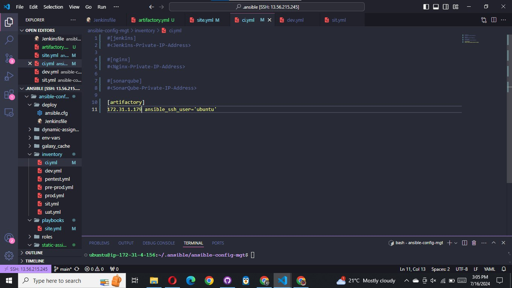
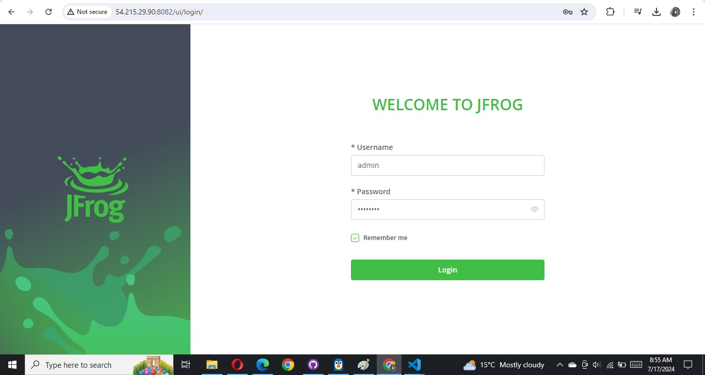

# CI/CD Pipline for TODO Application

We already have **tooling** website as a part of deployment through Ansible. Here we will introduce another PHP application to add to the
list of software products we are managing in our infrastructure. The good thing with this particular application is that it has
unit tests, and it is an ideal application to show an end-to-end CI/CD pipeline for a particular application.

Our goal here is to deploy the application onto servers directly from Artifactory rather than from `git` If you have not updated
Ansible with an Artifactory role, simply use this guide to create an Ansible role for Artifactory (ignore the Nginx part).
[Configure Artifactory on Ubuntu 20.04](https://www.howtoforge.com/tutorial/ubuntu-jfrog/)

```bash
/path/to/your/laravel/project
├── app
│   ├── Console
│   ├── Exceptions
│   ├── Http
│   │   ├── Controllers
│   │   ├── Middleware
│   ├── Models
│   ├── Providers
├── bootstrap
│   ├── cache
├── config
│   ├── app.php
│   ├── database.php
│   └── ...
├── database
│   ├── factories
│   ├── migrations
│   ├── seeders
├── public
│   ├── index.php
│   ├── css
│   ├── js
│   ├── ...
├── resources
│   ├── js
│   ├── lang
│   ├── views
│   └── ...
├── routes
│   ├── api.php
│   ├── channels.php
│   ├── console.php
│   ├── web.php
├── storage
│   ├── app
│   ├── framework
│   ├── logs
├── tests
│   ├── Feature
│   ├── Unit
├── vendor
├── .env
├── artisan
├── composer.json
├── composer.lock
├── package.json
├── phpunit.xml
└── webpack.mix.js

```

**Prerequests**  Make sure port 8082 is opened in artifactory server

```
ansible-galaxy collection install jfrog.platform
```


Update `playbook/site.yml`


Update `inventory/ci.yml`




Run the playbook against `ci.yml` to install jfrog artifactory


In the browser, login into artifactory with the default authentication `admin` and `password`




Create a local repository `todo-dev-local`


### Phase 1 – Prepare Jenkins

1. Fork the repository below into your GitHub account

```
https://github.com/StegTechHub/php-todo.git
```


2. On you Jenkins server, install PHP, its dependencies and Composer tool (Feel free to do this manually at first, then update
   your Ansible accordingly later)

```
sudo apt update
```

**Install dependancies**

```
sudo apt install -y zip libapache2-mod-php phploc php-{xml,bcmath,bz2,intl,gd,mbstring,mysql,zip}
```

**Install Composer** Download the Installer:

```
php -r "copy('https://getcomposer.org/installer', 'composer-setup.php');"
```

**Install Composer Globally**

```
sudo php composer-setup.php --install-dir=/usr/local/bin --filename=composer
```

**Remove the Installer**

```
php -r "unlink('composer-setup.php');"
```

**Verify Installation**

```
php -v
```

```
composer -v
```


3.  Install Jenkins plugins

        1 .  Plot plugin

    

        2 .  Artifactory plugin

    

- We will use _plot_ plugin to display tests reports, and code coverage information.
- The _Artifactory_ plugin will be used to easily upload code artifacts into an Artifactory server.

4. In Jenkins UI configure Artifactory

Configure the server ID, URL and Credentials, run Test Connection.


### Phase 2 – Integrate Artifactory repository with Jenkins

1.  Create a dummy Jenkinsfile in the todo app repository > In VScode create a new Jenkinsfile in the Todo repository:

    1.1 First step, Fork the TODO repository below into your GitHub account.

        `https://github.com/StegTechHub/php-todo.git`

    1.2 Create a basic Jenkinsfile in the root of the TODO application repository. This file will define your pipeline stages.

```bash
    pipeline {
    agent any

  stages {

     stage("Initial cleanup") {
          steps {
            dir("${WORKSPACE}") {
              deleteDir()
            }
          }
        }

    stage('Checkout SCM') {
      steps {
            git branch: 'main', url: 'https://github.com/mimi-netizen/php-todo.git'
      }
    }

    stage('Prepare Dependencies') {
      steps {
             sh 'composer install'
             sh 'php artisan migrate'
             sh 'php artisan db:seed'
             sh 'php artisan key:generate'
      }
    }
  }
}
```


2.  Using Blue Ocean, create a multibranch Jenkins pipeline

- Use Blue Ocean in Jenkins to create a new multibranch pipeline.


- Connect it to your GitHub repository where the TODO application is forked.


3.  In jenkins server Install my sql client:

```
sudo apt install mysql-client -y
```


On the database server, create database and user

- On your database server, create the necessary database and user as specified in the TODO application `.env`.

```
Create database homestead;
CREATE USER 'homestead'@'%' IDENTIFIED BY 'sePret^i';
GRANT ALL PRIVILEGES ON * . * TO 'homestead'@'%';
```


Login into the DB-server(mysql server) and set the the bind address to 0.0.0.0:

```
sudo vi /etc/mysql/mysql.conf.d/mysqld.cnf
```


Restart the my sql- server:

```
sudo systemctl restart mysql
```


4. Create a `.env` file in TODO repo and update it with the credentials to connect the database, use sample the code below :

```bash
APP_ENV=local
APP_DEBUG=true
APP_KEY=SomeRandomString
APP_URL=http://localhost

DB_HOST=172.31.8.236
DB_DATABASE=homestead
DB_USERNAME=homestead
DB_PASSWORD=sePret^i

CACHE_DRIVER=file
SESSION_DRIVER=file
QUEUE_DRIVER=sync

REDIS_HOST=127.0.0.1
REDIS_PASSWORD=null
REDIS_PORT=6379

MAIL_DRIVER=smtp
MAIL_HOST=mailtrap.io
MAIL_PORT=2525
MAIL_USERNAME=null
MAIL_PASSWORD=null
MAIL_ENCRYPTION=null
```


5. Update _Jenkinsfile_ with proper pipeline configuration

```
pipeline {
    agent any

  stages {

     stage("Initial cleanup") {
          steps {
            dir("${WORKSPACE}") {
              deleteDir()
            }
          }
        }

    stage('Checkout SCM') {
      steps {
            git branch: 'main', url: 'https://github.com/mimi-netizen/php-todo.git'
      }
    }

    stage('Prepare Dependencies') {
      steps {
             sh 'mv .env.sample .env'
             sh 'composer install'
             sh 'php artisan migrate'
             sh 'php artisan db:seed'
             sh 'php artisan key:generate'
      }
    }
  }
}
```

> **Notice the Prepare Dependencies section**

- Composer is used by PHP to install all the dependent libraries used by the application
- php artisan uses the .env file to setup the required database objects

_Note_ : The php version installed by the composer is 8.3.6 while the php version of the todo application is 7.4. Ensure to remove the current version and install php 7.4 and its dependencies to avoid error.

5. Run the TODO Pipeline:


– After successful run of this step,
login to the database,password:`root`

```
mysql -u root -p
```

run show tables and you will see the tables being created for you


1. Update the Jenkinsfile to include Unit tests step

   first install

```
composer require --dev phpunit/phpunit
```

then update Jenkinsfile

```
stage('Execute Unit Tests') {
      steps {
             sh './vendor/bin/phpunit'
      }
```


### Phase 3 – Code Quality Analysis

This is one of the areas where developers, architects and many stakeholders are mostly interested in as far as product development
is concerned. As a DevOps engineer, you also have a role to play. Especially when it comes to setting up the tools.

For PHP the most commonly tool used for code quality analysis is [phploc](https://phpqa.io/projects/phploc.html).
[Read the article here for more](https://matthiasnoback.nl/2019/09/using-phploc-for-quick-code-quality-estimation-part-1/)

The data produced by **phploc** can be ploted onto graphs in Jenkins.

1. Add the code analysis step in Jenkinsfile. The output of the data will be saved in build/logs/phploc.csv file.

```
stage('Code Analysis') {
  steps {
        sh 'phploc app/ --log-csv build/logs/phploc.csv'

  }
}
```


2. Plot the data using _plot Jenkins_ plugin.

This plugin provides generic plotting (or graphing) capabilities in Jenkins. It will plot one or more single values variations
across builds in one or more plots. Plots for a particular job (or project) are configured in the job configuration screen,
where each field has additional help information. Each plot can have one or more lines (called data series). After each build
completes the plots’ data series latest values are pulled from the CSV file generated by **phploc**


You should now see a Plot menu item on the left menu. Click on it to see the charts. (The analytics may not mean much to you as
it is meant to be read by developers. So, you need not worry much about it – this is just to give you an idea of the real-world
implementation).
 3. Bundle the application code for into an artifact (archived package) upload to Artifactory

```
stage ('Package Artifact') {
    steps {
            sh 'zip -qr php-todo.zip ${WORKSPACE}/*'
     }
    }

```

4. Publish the resulted artifact into Artifactory

```
stage ('Upload Artifact to Artifactory') {
          steps {
            script {
                 def server = Artifactory.server 'artifactory-server'
                 def uploadSpec = """{
                    "files": [
                      {
                       "pattern": "php-todo.zip",
                       "target": "<name-of-artifact-repository>/php-todo",
                       "props": "type=zip;status=ready"

                       }
                    ]
                 }"""

                 server.upload spec: uploadSpec
               }
            }

        }
```


5. Deploy the application to the dev environment by launching Ansible pipeline

```
stage ('Deploy to Dev Environment') {
    steps {
    build job: 'ansible-project/main', parameters: [[$class: 'StringParameterValue', name: 'env', value: 'dev']], propagate: false, wait: true
    }
  }
```

The build job used in this step tells **Jenkins to start another job**. In this case it is the ansible-project job, and we are
targeting the main branch. Hence, we have ansible-project/main. Since the Ansible project requires parameters to be passed in,
we have included this by specifying the parameters section. The name of the parameter is env and its value is dev. Meaning,
deploy to the Development environment.
**Make sure to update artifactory login details in the todo deployment configuration file in ansible-config-mgt project**


Make sure zip is install

$ sudo apt install zip -y


But how are we certain that the code being deployed has the quality that meets corporate and customer requirements? Even though we
have implemented **Unit Tests** and **Code Coverage Analysis** with **phpunit** and **phploc**, we still need to implement **Quality Gate** to ensure
that ONLY code with the required code coverage, and other quality standards make it through to the environments.

To achieve this, we need to configure **SonarQube** – An open-source platform developed by **SonarSource for continuous inspection** of
code quality to perform automatic reviews with static analysis of code to detect bugs, code smells, and security vulnerabilities.
