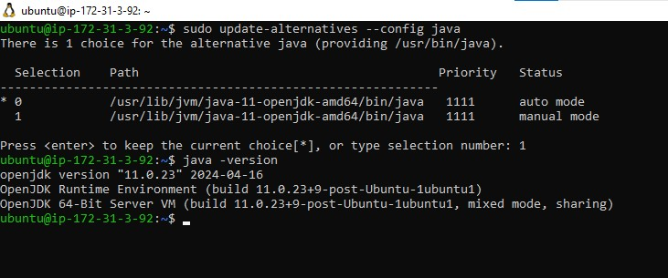
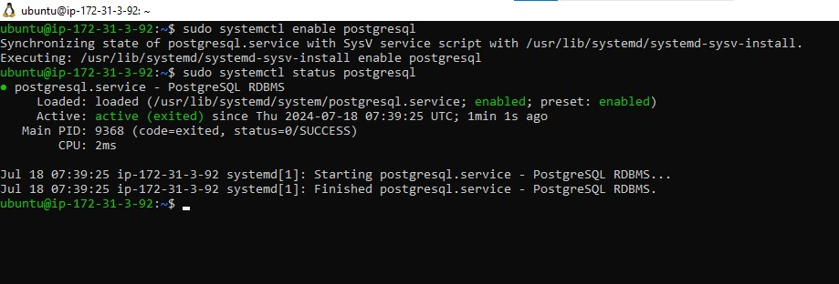
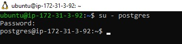
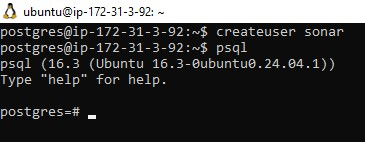
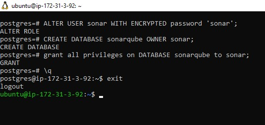

# SONARQUBE INSTALLATION

Before we start getting hands on with **SonarQube** configuration, it is incredibly important to understand a few concepts:

- [Software Quality](https://en.wikipedia.org/wiki/Software_quality) – The degree to which a software component, system or process
  meets specified requirements based on user needs and expectations.
- [Software Quality Gates](https://docs.sonarqube.org/latest/user-guide/quality-gates/) – Quality gates are basically acceptance
  criteria which are usually presented as a set of predefined quality criteria that a software development project must meet in order
  to proceed from one stage of its lifecycle to the next one.

SonarQube is a tool that can be used to create quality gates for software projects, and the ultimate goal is to be able to ship
only quality software code.

Despite that DevOps CI/CD pipeline helps with fast software delivery, it is of the same importance to ensure the quality of such
delivery. Hence, we will need **SonarQube** to set up Quality gates. In this project we will use predefined Quality Gates (also known as
[The Sonar Way](https://docs.sonarsource.com/sonarqube/latest/instance-administration/quality-profiles/) ). Software testers and developers would normally work with project leads and architects to create custom quality gates.

### Install SonarQube on Ubuntu 24.04 With PostgreSQL as Backend Database

Here is a manual approach to installation. Ensure that you can to automate the same with Ansible.

Below is a step by step guide how to install **SonarQube 7.9.3 version**. It has a strong prerequisite to have Java installed since the
tool is Java-based. MySQL support for SonarQube is deprecated, therefore we will be using PostgreSQL.

We will make some Linux Kernel configuration changes to ensure optimal performance of the tool – we will increase vm.max_map_count,
file discriptor and ulimit.

**Tune Linux Kernel**

This can be achieved by making session changes which does not persist beyond the current session terminal.

```bash
sudo sysctl -w vm.max_map_count=262144
sudo sysctl -w fs.file-max=65536
ulimit -n 65536
ulimit -u 4096
```

To make a permanent change, edit the file /etc/security/limits.conf and append the below

```bash
vi /etc/security/limits.conf
```

```bash
sonarqube   -   nofile   65536
sonarqube   -   nproc    4096
```

Before installing, let us update and upgrade system packages:

```bash
sudo apt-get update
sudo apt-get upgrade
```

Install [wget](https://www.gnu.org/software/wget/) and [unzip](https://linux.die.net/man/1/unzip) packages

```bash
sudo apt-get install wget unzip -y
```

Install [OpenJDK](https://openjdk.org/) and [Java Runtime Environment](https://docs.oracle.com/goldengate/1212/gg-winux/GDRAD/java.htm#BGBFJHAB) (JRE) 11

```bash
sudo apt-get install openjdk-11-jdk -y
sudo apt-get install openjdk-11-jre -y
```

Set default JDK – To set default JDK or switch to OpenJDK enter below command:

```bash
sudo update-alternatives --config java
```

If you have multiple versions of Java installed, you should see a list like below:

```bash
Selection    Path                                            Priority   Status

------------------------------------------------------------

  0            /usr/lib/jvm/java-11-openjdk-amd64/bin/java      1111      auto mode

  1            /usr/lib/jvm/java-11-openjdk-amd64/bin/java      1111      manual mode

  2            /usr/lib/jvm/java-8-openjdk-amd64/jre/bin/java   1081      manual mode

* 3            /usr/lib/jvm/java-8-oracle/jre/bin/java          1081      manual mode
```

Type "1" to switch OpenJDK 11

Verify the set JAVA Version:

```bash
java -version
```

**Output**



### Install and Setup PostgreSQL 10 Database for SonarQube

The command below will add PostgreSQL repo to the repo list:

```bash
sudo sh -c 'echo "deb http://apt.postgresql.org/pub/repos/apt/ `lsb_release -cs`-pgdg main" >> /etc/apt/sources.list.d/pgdg.list'
```

**Download PostgreSQL software**

```bash
wget -q https://www.postgresql.org/media/keys/ACCC4CF8.asc -O - | sudo apt-key add -
```

I**nstall PostgreSQL Database Server**

```bash
sudo apt-get -y install postgresql postgresql-contrib
```

**Start PostgreSQL Database Server**

```bash
sudo systemctl start postgresql
```

**Enable it to start automatically at boot time**

```bash
sudo systemctl enable postgresql
```



**Change the password for default postgres user (Pass in the password you intend to use, and remember to save it somewhere)**

```bash
sudo passwd postgres
```

**Switch to the postgres user**

```bash
su - postgre
```



**Create a new user by typing**

```bash
createuser sonar
```

**Switch to the PostgreSQL shell**

```bash
psql
```



**Set a password for the newly created user for SonarQube database**

```bash
ALTER USER sonar WITH ENCRYPTED password 'sonar';
```

**Create a new database for PostgreSQL database by running:**

```bash
CREATE DATABASE sonarqube OWNER sonar;
```

**Grant all privileges to sonar user on sonarqube Database.**

```bash
grant all privileges on DATABASE sonarqube to sonar;
```

**Exit from the psql shell:**

```bash
\q
```

**Switch back to the sudo user by running the exit command**

```bash
exit
```



### Install SonarQube on Ubuntu 24.04 LTS

**Navigate to the tmp directory to temporarily download the installation files**

```bash
cd /tmp && sudo wget https://binaries.sonarsource.com/Distribution/sonarqube/sonarqube-7.9.3.zip
```

**Unzip the archive setup to /opt directory**

```bash
sudo unzip sonarqube-7.9.3.zip -d /opt
```

**Move extracted setup to /opt/sonarqube directory**

```bash
sudo mv /opt/sonarqube-7.9.3 /opt/sonarqube
```
