# CONFIGURE SONARQUBE

We cannot run SonarQube as a root user, if you run using root user it will stop automatically. The ideal approach will be to create
a separate group and a user to run SonarQube

Create a group sonar

```bash
sudo groupadd sonar
```

Now add a user with control over the /opt/sonarqube directory

```bash
sudo useradd -c "user to run SonarQube" -d /opt/sonarqube -g sonar sonar
sudo chown sonar:sonar /opt/sonarqube -R
```

Open SonarQube configuration file using your favourite text editor (e.g., nano or vim)

```bash
sudo vim /opt/sonarqube/conf/sonar.properties
```

Find the following lines:

```bash
#sonar.jdbc.username=
#sonar.jdbc.password=
```

Uncomment them and provide the values of PostgreSQL Database username and password:

```bash
#--------------------------------------------------------------------------------------------------

# DATABASE

#

# IMPORTANT:

# - The embedded H2 database is used by default. It is recommended for tests but not for

#   production use. Supported databases are Oracle, PostgreSQL and Microsoft SQLServer.

# - Changes to database connection URL (sonar.jdbc.url) can affect SonarSource licensed products.

# User credentials.

# Permissions to create tables, indices and triggers must be granted to JDBC user.

# The schema must be created first.

sonar.jdbc.username=sonar
sonar.jdbc.password=sonar
sonar.jdbc.url=jdbc:postgresql://localhost:5432/sonarqube

```

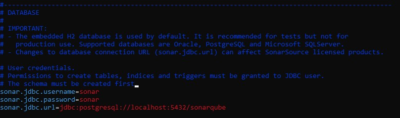

Edit the sonar script file and set RUN_AS_USER

```bash
sudo nano /opt/sonarqube/bin/linux-x86-64/sonar.sh
```

```bash
# If specified, the Wrapper will be run as the specified user.

# IMPORTANT - Make sure that the user has the required privileges to write

#  the PID file and wrapper.log files.  Failure to be able to write the log

#  file will cause the Wrapper to exit without any way to write out an error

#  message.

# NOTE - This will set the user which is used to run the Wrapper as well as

#  the JVM and is not useful in situations where a privileged resource or

#  port needs to be allocated prior to the user being changed.

RUN_AS_USER=sonar

```

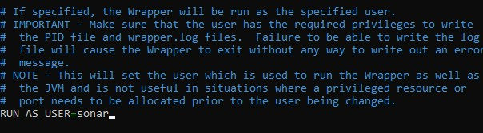

Now, to start SonarQube we need to do following: Switch to sonar user

```bash
sudo su sonar
```

Move to the script directory

```bash
cd /opt/sonarqube/bin/linux-x86-64/
```

Run the script to start SonarQube

```bash
./sonar.sh start
```

Expected output shall be as:

```bash
Starting SonarQube...

Started SonarQube
```

Check SonarQube running status:

```bash
./sonar.sh status
```

Sample Output below:

```bash
./sonar.sh status

SonarQube is running (176483).
```

To check SonarQube logs, navigate to /opt/sonarqube/logs/sonar.log directory

```bash
tail /opt/sonarqube/logs/sonar.log
```

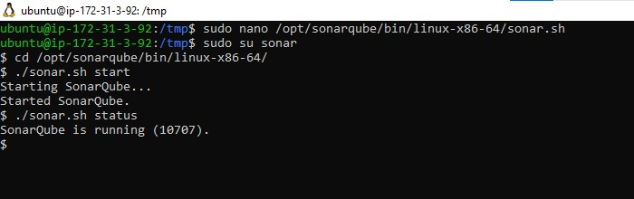

## Output

You can see that SonarQube is up and running

**Configure SonarQube to run as a systemd service**

Stop the currently running SonarQube service

```bash
cd /opt/sonarqube/bin/linux-x86-64/
```

Run the script to start SonarQube

```bash
./sonar.sh stop
```

Create a systemd service file for SonarQube to run as System Startup.

```bash
 sudo nano /etc/systemd/system/sonar.service
```

Add the configuration below for systemd to determine how to start, stop, check status, or restart the SonarQube service.

```bash
[Unit]
Description=SonarQube service
After=syslog.target network.target

[Service]
Type=forking

ExecStart=/opt/sonarqube/bin/linux-x86-64/sonar.sh start
ExecStop=/opt/sonarqube/bin/linux-x86-64/sonar.sh stop

User=sonar
Group=sonar
Restart=always

LimitNOFILE=65536
LimitNPROC=4096

[Install]
WantedBy=multi-user.target

```

Save the file and control the service with systemctl

```bash
sudo systemctl start sonar
sudo systemctl enable sonar
sudo systemctl status sonar
```

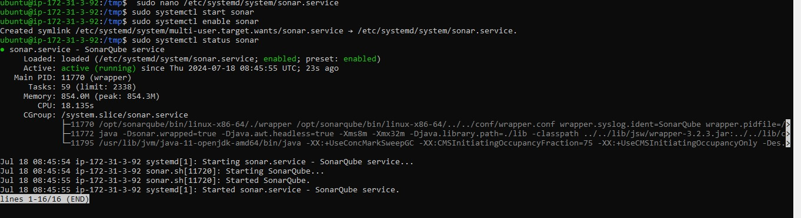

### Access SonarQube

To access SonarQube using browser, type server's IP address followed by port 9000

```bash
http://server_IP:9000 OR http://localhost:9000
```

Login to SonarQube with default administrator username - admin and password - admin

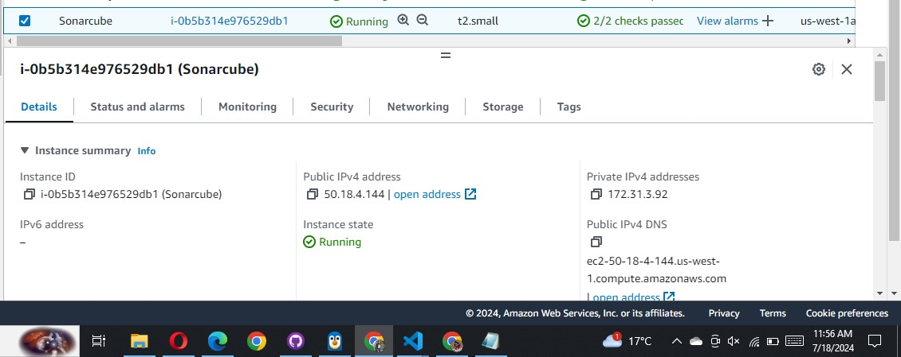


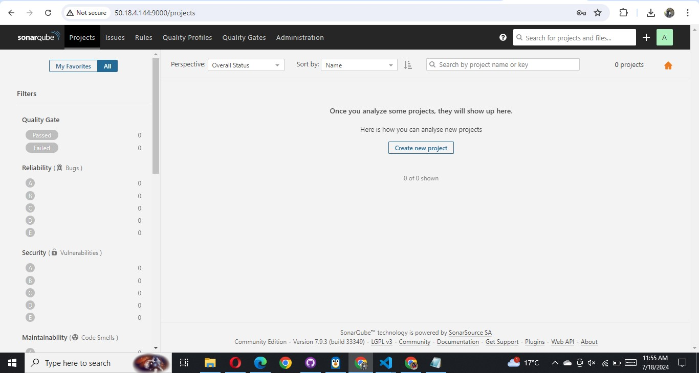

### We understand how to manually install SonarQube on Ubuntu 20.04 with PostgreSQL as the backend database here let us Launch a instance for sonarqube and configure the environemnt using ansible:

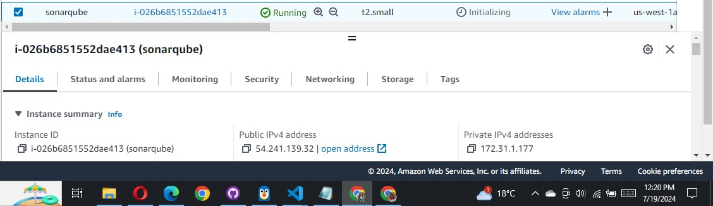

sonarqube installation let us update our ansible config project

1. Set Up Inventory File:
   Define our target host(s) in an inventory file.

   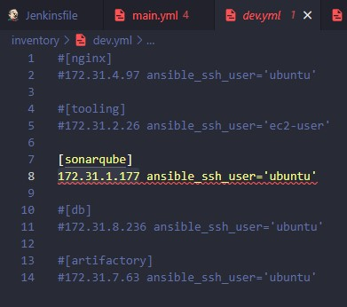

2. Update Ansible Playbook:
   update a playbook that includes tasks for installing PostgreSQL, creating the SonarQube database and user, installing SonarQube, and configuring it to use PostgreSQL. Use the codes below:

   - `playbooks/site.yml`

   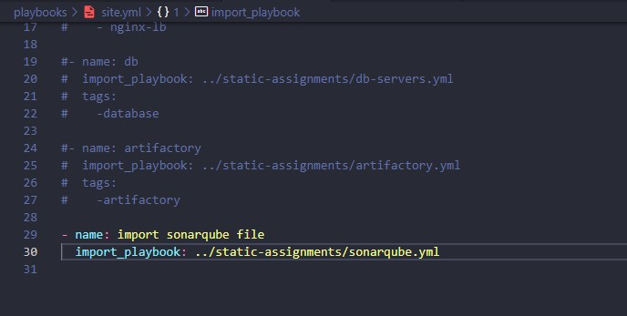

3. Update Role by adding role fo PostgreSQL and SonarQube :

   - `roles/sonar/tasks(main.yml, postgres.yml,sonarqube.yml)`

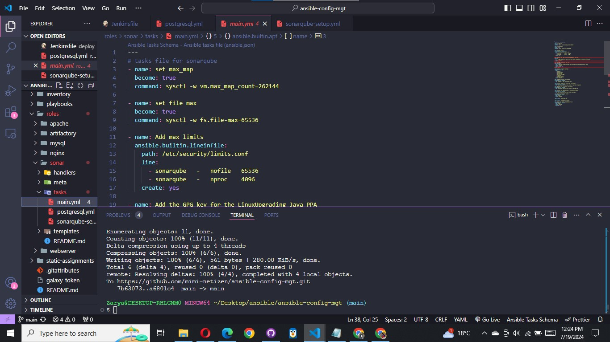

#### main.yml

```bash
---

# Tasks file for SonarQube setup

- name: Gather facts
  ansible.builtin.setup:

- name: Set vm.max_map_count
  ansible.builtin.command:
    cmd: sysctl -w vm.max_map_count=262144

- name: Set fs.file-max
  ansible.builtin.command:
    cmd: sysctl -w fs.file-max=65536

- name: Add max limits to limits.conf
  ansible.builtin.lineinfile:
    path: /etc/security/limits.conf
    line: "{{ item }}"
    create: yes
  with_items:
    - "sonarqube   -   nofile   65536"
    - "sonarqube   -   nproc    4096"

- name: Add PPA repository for Java
  ansible.builtin.apt_repository:
    repo: 'deb http://ppa.launchpad.net/linuxuprising/java/ubuntu bionic main'
    state: present
    update_cache: yes

- name: Update apt package cache
  ansible.builtin.apt:
    update_cache: yes

- name: Install required packages
  ansible.builtin.apt:
    name:
      - python3
      - python3-venv
      - python3-dev
      - libpq-dev
      - openjdk-11-jdk
      - openjdk-11-jre
    state: present

- name: Create a virtual environment
  ansible.builtin.command:
    cmd: python3 -m venv /opt/sonar_venv

- name: Install setuptools in virtual environment
  ansible.builtin.command:
    cmd: /opt/sonar_venv/bin/pip install --upgrade setuptools

- name: Upgrade pip in virtual environment
  ansible.builtin.command:
    cmd: /opt/sonar_venv/bin/pip install --upgrade pip

- name: Install pip dependencies in virtual environment
  ansible.builtin.command:
    cmd: /opt/sonar_venv/bin/pip install psycopg2

- name: Ensure group sonar exists
  ansible.builtin.group:
    name: sonar
    state: present

- import_tasks: postgresql.yml

- import_tasks: sonarqube-setup.yml

- name: Start and enable SonarQube service
  ansible.builtin.service:
    name: sonar
    state: started
    enabled: yes
```

#### postgresql.yml

```bash
---
- name: add PostgreSQL repo to the repo list
  ansible.builtin.lineinfile:
    path: /etc/apt/sources.list.d/pgdg.list
    line: "deb http://apt.postgresql.org/pub/repos/apt/ noble-pgdg main"
    create: yes

- name: Download PostgreSQL software key
  ansible.builtin.apt_key:
    url: https://www.postgresql.org/media/keys/ACCC4CF8.asc
    state: present

- name: Update apt package cache
  ansible.builtin.apt:
    update_cache: yes

- name: Install PostgreSQL
  ansible.builtin.apt:
    name:
      - postgresql
      - postgresql-contrib
    state: present

- name: Start and enable PostgreSQL
  ansible.builtin.service:
    name: postgresql
    state: started
    enabled: yes

- name: Set password for user postgres
  ansible.builtin.command:
    cmd: passwd postgres
  args:
    stdin: "postgres\npostgres"

- name: Create SonarQube database
  become_user: postgres
  community.postgresql.postgresql_db:
    name: sonarqube
    encoding: UTF-8

- name: Create SonarQube user
  become_user: postgres
  community.postgresql.postgresql_user:
    name: sonar
    password: sonar
    db: sonarqube
    priv: "ALL"
```

#### sonarqube.yml

```bash
- name: install unzip and wget
  ansible.builtin.apt:
    name:
      - unzip
      - wget

- name: download the zip file
  ansible.builtin.get_url:
    url: https://binaries.sonarsource.com/Distribution/sonarqube/sonarqube-7.9.3.zip
    dest: /opt/
    mode: 0755

- name: Create /opt/sonarqube/
  ansible.builtin.file:
    path: /opt/sonarqube/
    state: directory
    mode: '0755'

- name: Extract the zip file
  ansible.builtin.unarchive:
    src: /opt/sonarqube-7.9.3.zip
    dest: /opt/
    remote_src: yes

- name: Copy /opt/sonarqube/
  ansible.builtin.copy:
    src: /opt/sonarqube-7.9.3/
    dest: /opt/sonarqube/
    remote_src: yes
    follow: yes

- name: remove the zip file
  ansible.builtin.file:
    path: /opt/sonarqube-7.9.3.zip
    state: absent

- name: add user to run sonar
  ansible.builtin.shell: useradd -c "user to run SonarQube" -d /opt/sonarqube -g sonar sonar

- name: change ownership
  ansible.builtin.shell: chown sonar:sonar /opt/sonarqube -R

- name: Configuring the SonarQube Server
  ansible.builtin.template:
    src: templates/sonar.properties.j2
    dest: /opt/sonarqube/conf/sonar.properties
    force: yes

- name: Update user in sonar.sh filee
  ansible.builtin.lineinfile:
    path: /opt/sonarqube/bin/linux-x86-64/sonar.sh
    regexp: '^#RUN_AS_USER='
    state: present
    line: RUN_AS_USER=sonar


- name: create a service file
  ansible.builtin.template:
    src: templates/sonarqube.service.j2
    dest:  /etc/systemd/system/sonar.service
    force: yes
```

4. Execute the Playbook

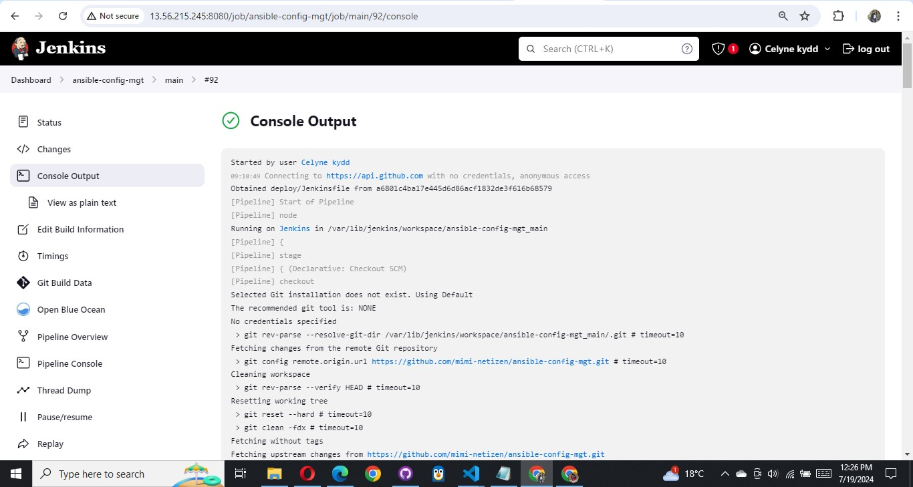

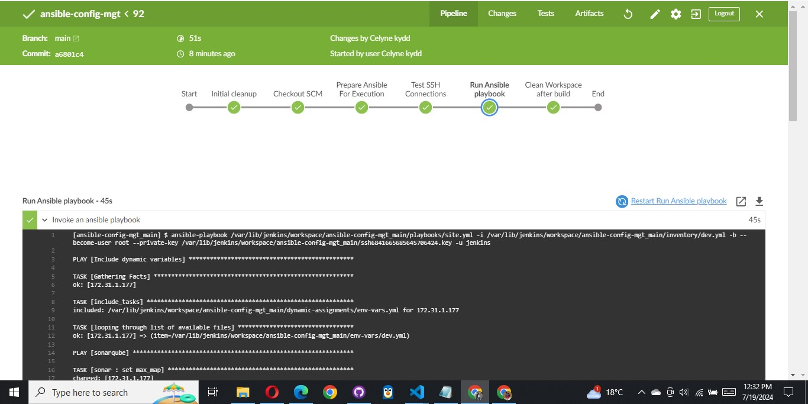

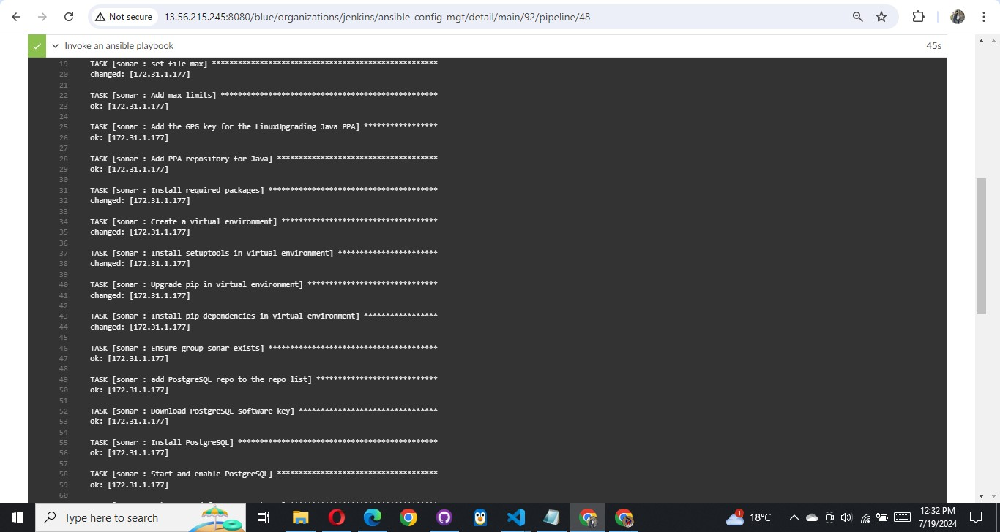

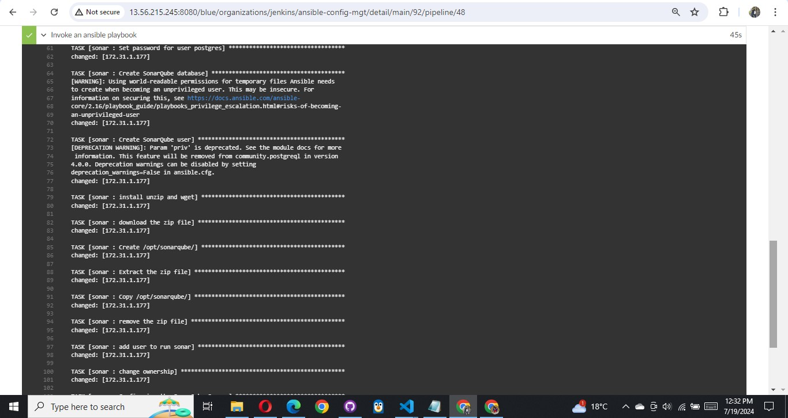

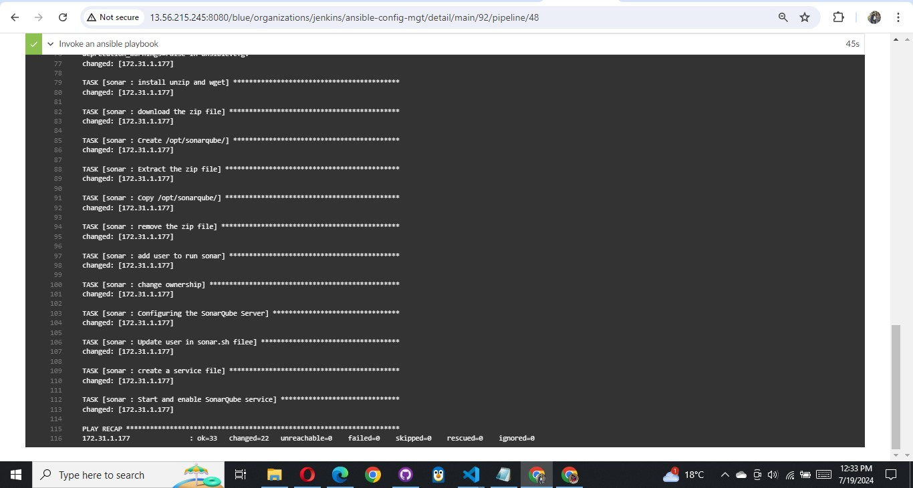

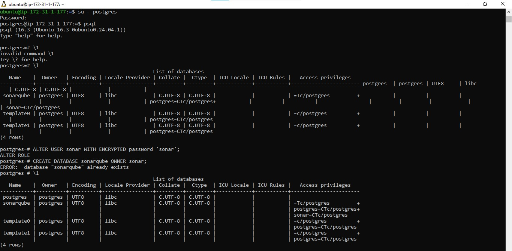

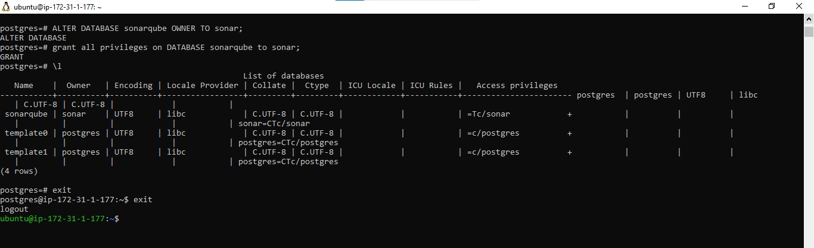

**Access SonarQube**

```bash
http://server_IP:9000 OR http://localhost:9000 or http://public_ip:9000/sonar
```

Login to SonarQube with default administrator username and password – admin

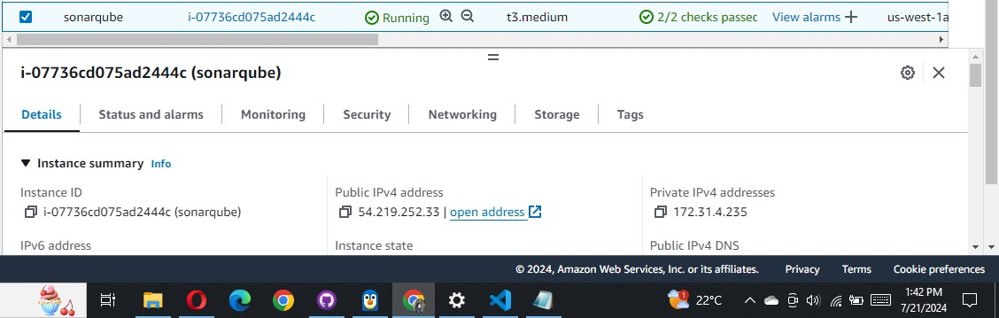

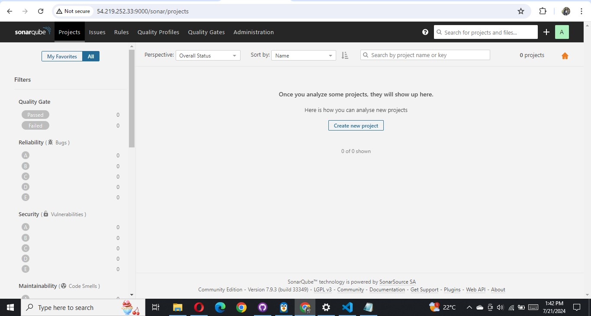

Now, when SonarQube is up and running, it is time to setup our Quality gate in Jenkins.
