# Configure SonarQube and Jenkins For Quality Gate

- In Jenkins, install [SonarScanner plugin](https://docs.sonarsource.com/sonarqube/latest/analyzing-source-code/scanners/jenkins-extension-sonarqube/)

  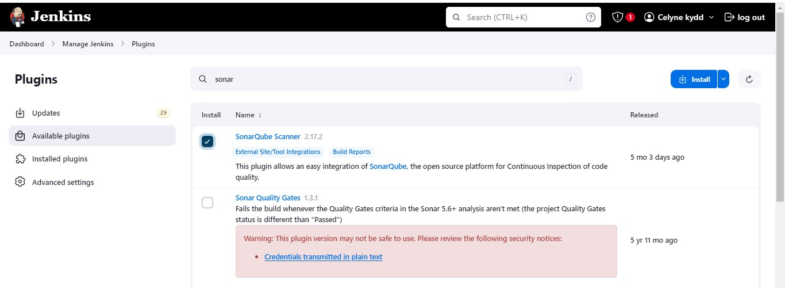

- Navigate to configure system in Jenkins. Add SonarQube server as shown below: Manage **Jenkins** > **Configure System**

  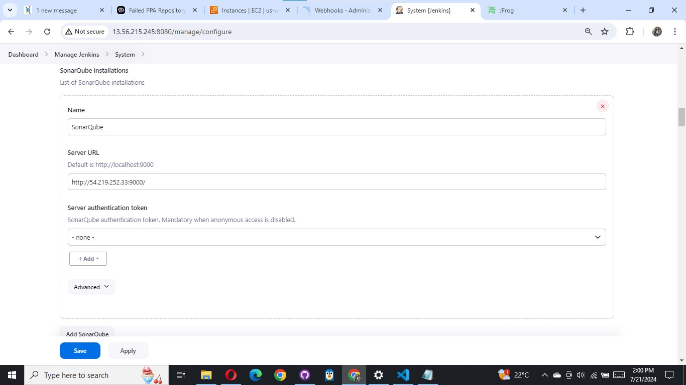

- Generate authentication token in SonarQube

  **User** > **My Account** > **Security** > **Generate Tokens**

  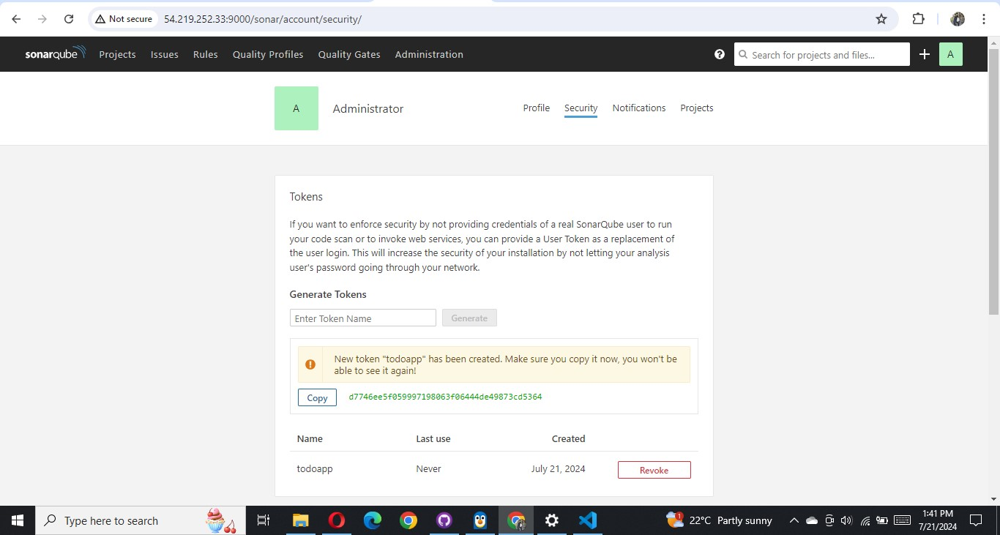

- Configure Quality Gate Jenkins Webhook in SonarQube – The URL should point to your Jenkins server
  http://{JENKINS_HOST}/sonarqube-webhook/

**Administration** > **Configuration** > **Webhook**s > **Create**

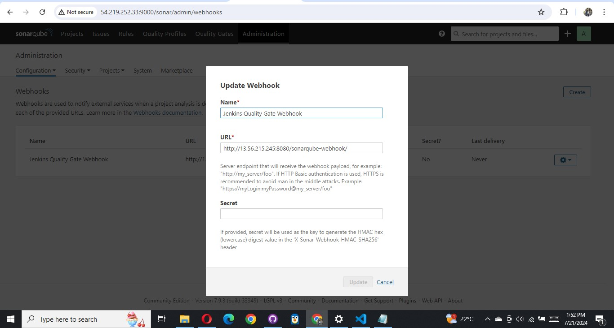

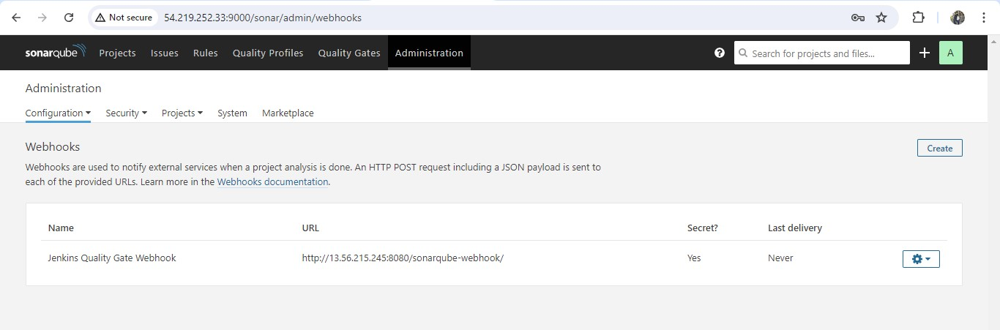

- Setup SonarQube scanner from Jenkins – Global Tool Configuration

`Manage Jenkins` > `Global Tool Configuration`

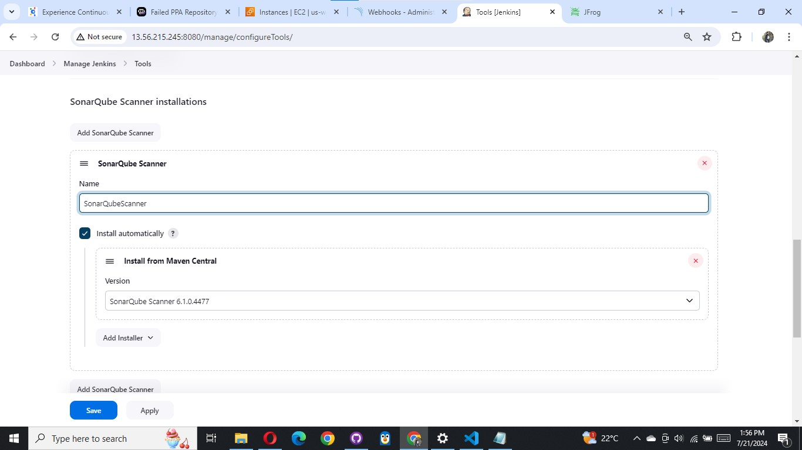

### Update Jenkins Pipeline to include SonarQube scanning and Quality Gate

Below is the snippet for a Quality Gate stage in Jenkinsfile

```
  stage('SonarQube Quality Gate') {
        environment {
            scannerHome = tool 'SonarQubeScanner'
        }
        steps {
            withSonarQubeEnv('sonarqube') {
                sh "${scannerHome}/bin/sonar-scanner"
            }

        }
    }
```

> NOTE: The above step will fail because we have not updated `sonar-scanner.properties`

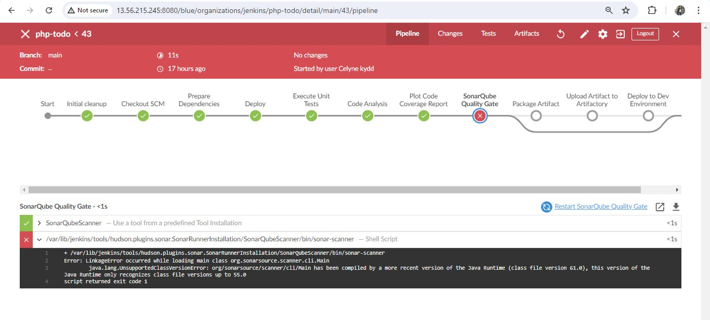

- Configure sonar-scanner.properties – From the step above, Jenkins will install the scanner tool on the Linux server. You will need
  to go into the tools directory on the server to configure the properties file in which SonarQube will require to function during
  pipeline execution.

```bash
cd /var/lib/jenkins/tools/hudson.plugins.sonar.SonarRunnerInstallation/SonarQubeScanner/conf/
```

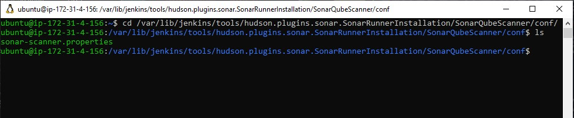

Open sonar-scanner.properties file

```bash
sudo vi sonar-scanner.properties
```

Add configuration related to `php-todo` project

```bash
sonar.host.url=http://<SonarQube-Server-IP-address>:9000
sonar.projectKey=php-todo
#----- Default source code encoding
sonar.sourceEncoding=UTF-8
sonar.php.exclusions=**/vendor/**
sonar.php.coverage.reportPaths=build/logs/clover.xml
sonar.php.tests.reportPath=build/logs/junit.xml

```

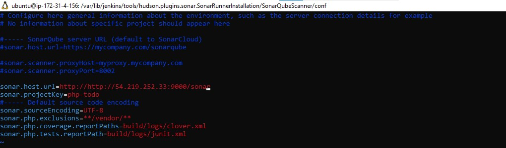

> HINT: To know what exactly to put inside the `sonar-scanner.properties` file, SonarQube has a configurations page where you can get
> some directions.


A brief explanation of what is going on the the stage – set the environment variable for the scannerHome use the same name used
when you configured SonarQube Scanner from Jenkins **Global Tool Configuration**. If you remember, the name was SonarQubeScanner.
Then, within the steps use shell to run the scanner from `bin` directory.

To further examine the configuration of the scanner tool on the Jenkins server – navigate into the tools directory

```bash
cd /var/lib/jenkins/tools/hudson.plugins.sonar.SonarRunnerInstallation/SonarQubeScanner/bin
```

List the content to see the scanner tool `sonar-scanner`. That is what we are calling in the pipeline script.

Output of (`ls -latr`)

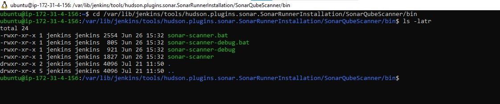

So far you have been given code snippets on each of the stages within the Jenkinsfile. But, you should also be able to generate
Jenkins configuration code yourself.

- To generate Jenkins code, navigate to the dashboard for the php-todo pipeline and click on the Pipeline Syntax menu item

```
**Dashboard** > **php-todo** > Pipeline Syntax
```


- Click on Steps and select withSonarQubeEnv – This appears in the list because of the previous SonarQube configurations you
  have done in Jenkins. Otherwise, it would not be there.
  

Within the generated block, you will use the sh command to run shell on the server. For more advanced usage in other projects,
you can add to bookmarks this
[SonarQube documentation page](https://docs.sonarqube.org/latest/analyzing-source-code/scanners/jenkins-extension-sonarqube/)
in your browser.

### End-to-End Pipeline Overview

Indeed, this has been one of the longest projects from Project 1, and if everything has worked out for you so far, you should have
a view like below:

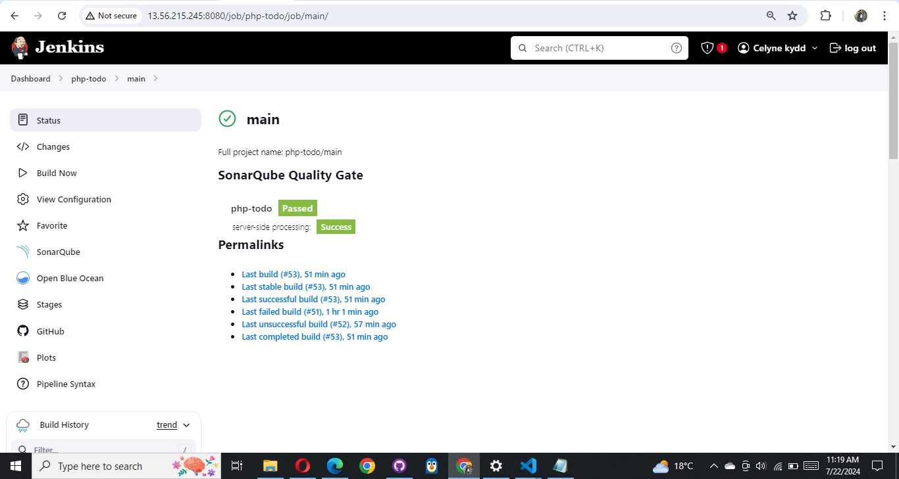

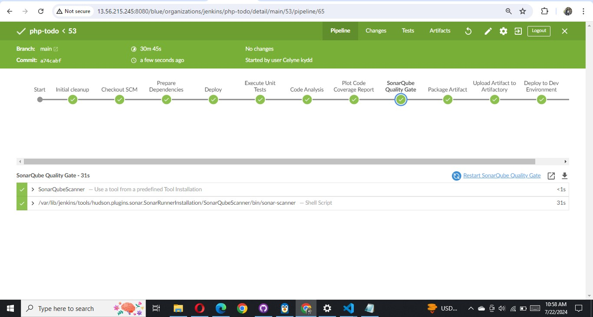

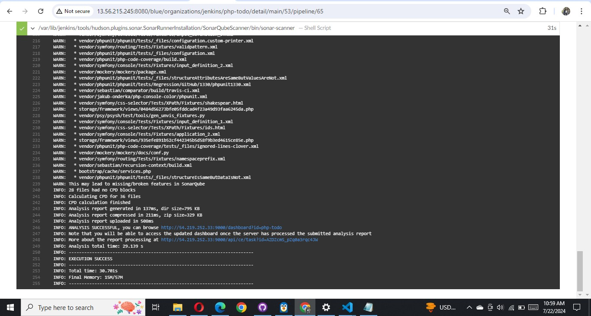

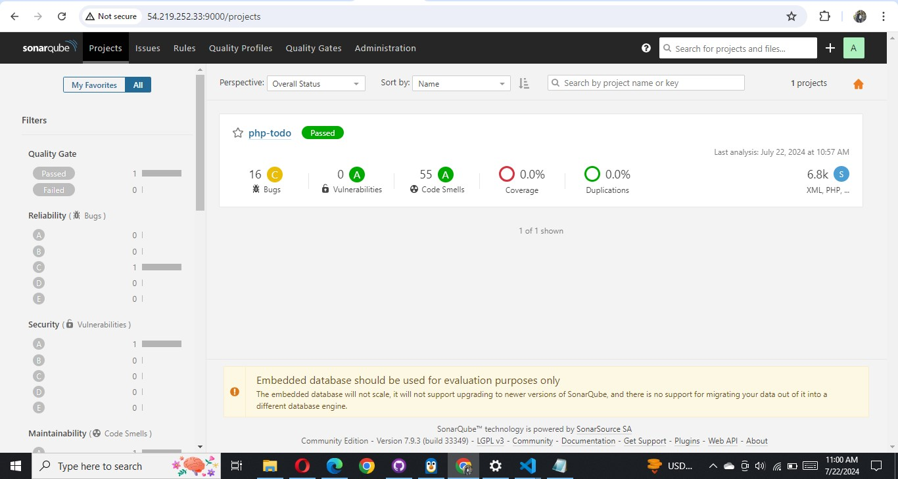

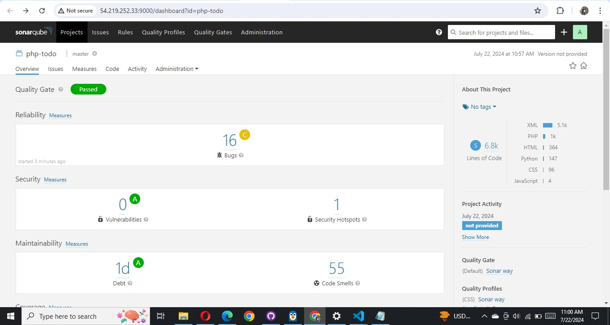

**But we are not completely done yet!**

The quality gate we just included has no effect. Why? Well, because if you go to the SonarQube UI, you will realise that we just
pushed a poor-quality code onto the development environment.

- Navigate to php-todo project in SonarQube


There are bugs, and there is 0.0% code coverage. (code coverage is a percentage of unit tests added by developers to test functions
and objects in the code)

- If you click on php-todo project for further analysis, you will see that there is 6 hours’ worth of technical debt, code smells
  and security issues in the code.

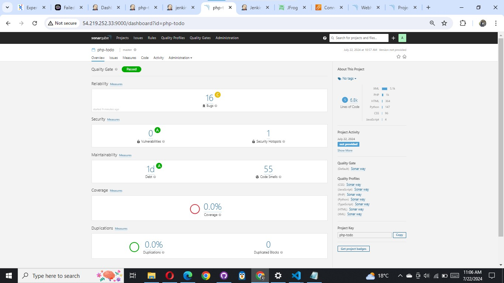

In the development environment, this is acceptable as developers will need to keep iterating over their code towards perfection.

But as a DevOps engineer working on the pipeline, we must ensure that the quality gate step causes the pipeline to fail if the
conditions for quality are not met.

### Conditionally deploy to higher environments

In the real world, developers will work on feature branch in a repository (e.g., GitHub or GitLab). There are other branches that
will be used differently to control how software releases are done. You will see such branches as:

1. Develop
2. Master or Main
   (The \* is a place holder for a version number, Jira Ticket name or some description. It can be something like Release-1.0.0)
3. Feature/\*
4. Release/\*
5. Hotfix/\*
   etc.

There is a very wide discussion around release strategy, and git branching strategies which in recent years are considered under
what is known as GitFlow (Have a read and keep as a bookmark – it is a possible candidate for an interview discussion, so take it
seriously!)

Assuming a basic `gitflow` implementation restricts only the develop branch to deploy code to Integration environment like sit.

Let us update our Jenkinsfile to implement this:

- First, we will include a When condition to run Quality Gate whenever the running branch is either develop, hotfix, release, main,
  or master

```bash
when { branch pattern: "^develop*|^hotfix*|^release*|^main*", comparator: "REGEXP"}
```

Then we add a timeout step to wait for SonarQube to complete analysis and successfully finish the pipeline only when code quality
is acceptable.

```bash
 timeout(time: 1, unit: 'MINUTES') {
        waitForQualityGate abortPipeline: true
    }
```

The complete stage will now look like this:

```bash
 stage('SonarQube Quality Gate') {
      when { branch pattern: "^develop*|^hotfix*|^release*|^main*", comparator: "REGEXP"}
        environment {
            scannerHome = tool 'SonarQubeScanner'
        }
        steps {
            withSonarQubeEnv('sonarqube') {
                sh "${scannerHome}/bin/sonar-scanner -Dproject.settings=sonar-project.properties"
            }
            timeout(time: 1, unit: 'MINUTES') {
                waitForQualityGate abortPipeline: true
            }
        }
    }

```

To test, create different branches and push to GitHub. You will realise that only branches other than develop, hotfix, release,
main, or master will be able to deploy the code.

**Create a new branch sonar and commit, push the new code.**

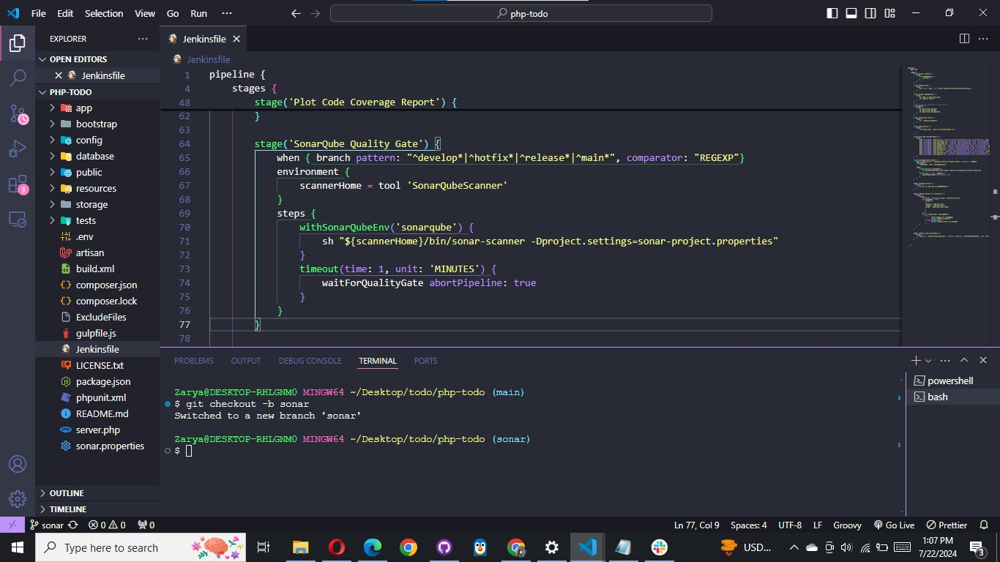

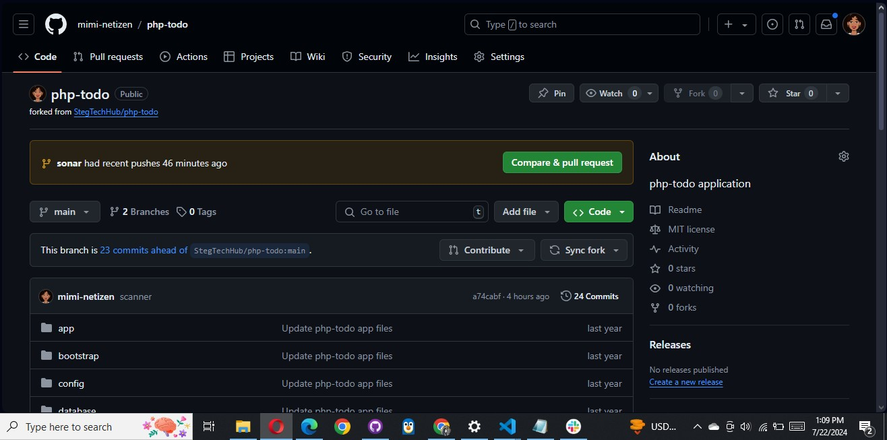

If everything goes well, you should be able to see something like this:

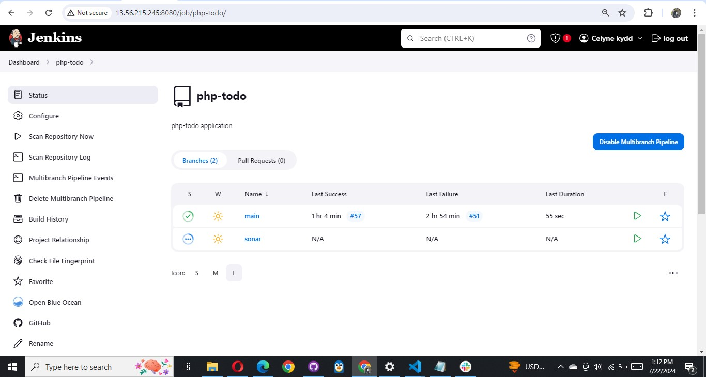

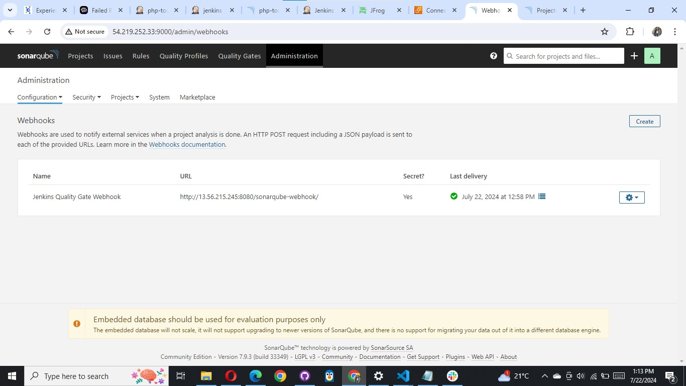

For main branch

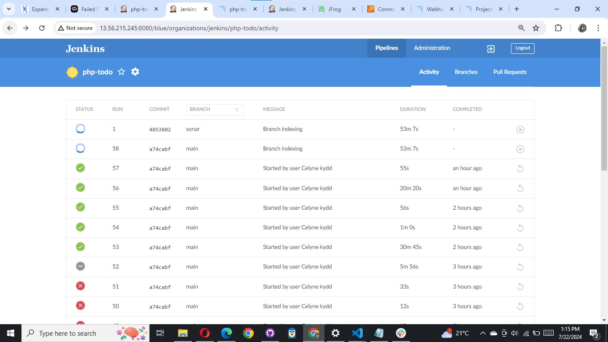

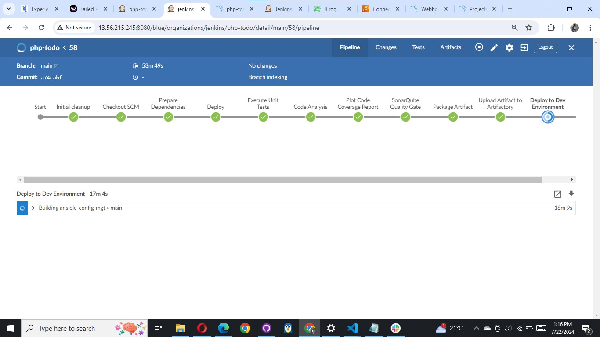

For Branch sonar


> Notice that with the current state of the code, it cannot be deployed to Integration environments due to its quality.
> In the real world, DevOps engineers will push this back to developers to work on the code further, based on SonarQube quality report.
> Once everything is good with code quality, the pipeline will pass and proceed with sipping the codes further to a higher environment.

## Complete the following tasks to finish Project 14

1. Introduce Jenkins agents/slaves – Add 2 more servers to be used as Jenkins slave. Configure Jenkins to run its pipeline jobs
   randomly on any available slave nodes.
   Let's add 2 more servers to be used as Jenkins slave and install java in them.

   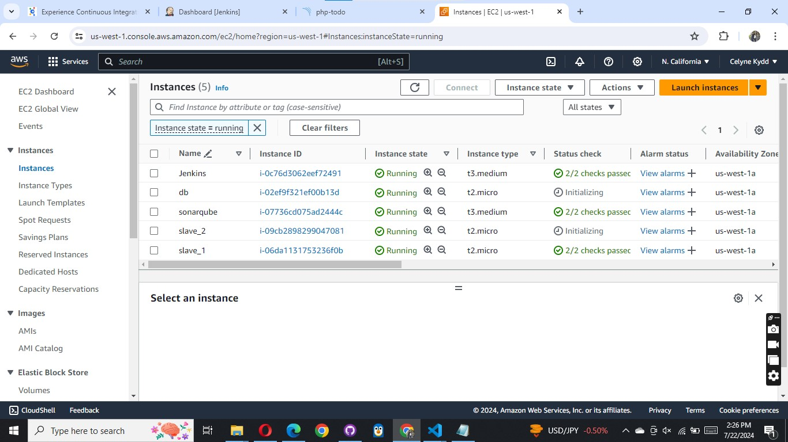

```bash
# Install  java on slave nodes
sudo yum install java-11-openjdk-devel -y

# Check the java version
java --version

# Update packages
sudo apt update

# Install ansible on slave nodes
sudo apt install ansible -y
```

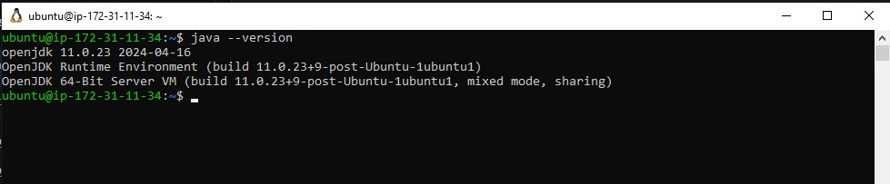

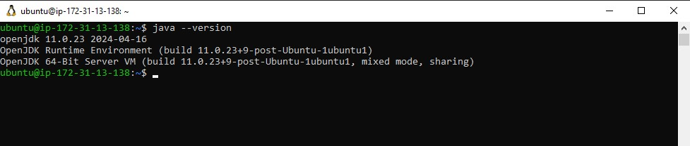

2. Configure webhook between Jenkins and GitHub to automatically run the pipeline when there is a code push. Let's Configure the new nodes on Jenkins Server.

   Navigate to **Dashboard** > **Manage Jenkins** > **Nodes**, click on New node and enter a Name and click on create.

   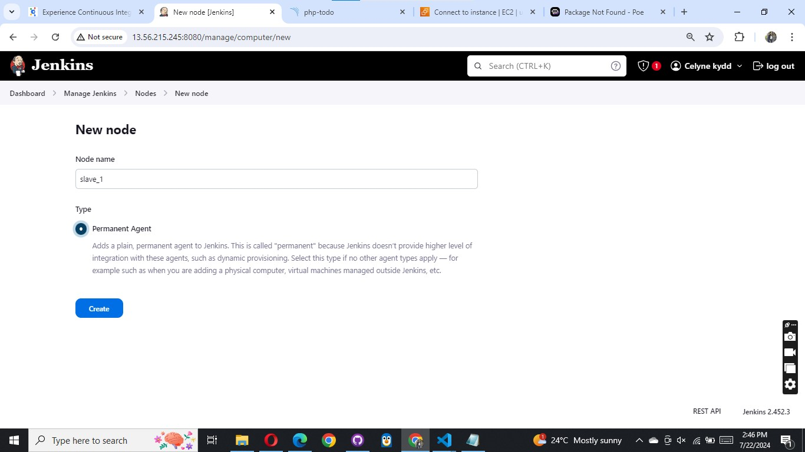

**To connect to slave_one completed this fields and save.**

- Name: slave_one

- Remote root directory: /opt/build (This can be any directory for the builds)

- Labels: slave_one

- save

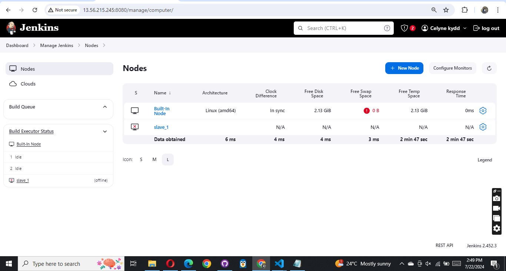

To connect to slave_one, click on the `slave_one` and if you finish configuration save it you see

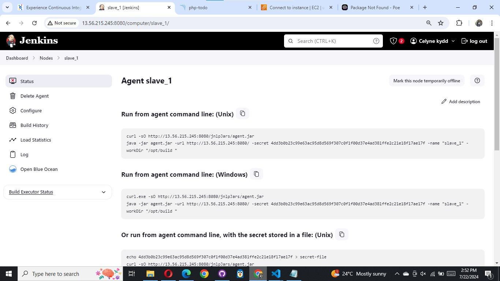

Use either options. In this case, I use the first option

Ensure to open port `5000` on the slave node server

Go to `dashboard` > `manage jenkins` > `security` > `Agents`, on Jenkins Set the TCP port for inbound agents to fixed and set the port at 5000

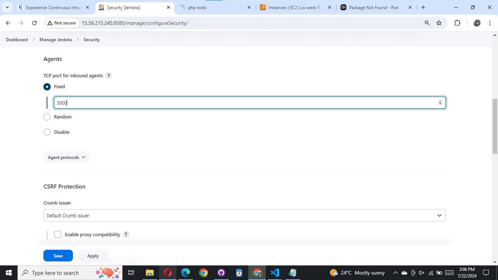

> before running please check your public ip address of your jenkins is same as the if not go to `Dashboard`> `manage Jenkins` > `system` and update current IP

```bash
sudo mkdir -p /opt/build
sudo chown -R ubuntu:ubuntu /opt/build
sudo chmod -R 755 /opt/build
ls -ld /opt/build

# Download agent.jar to /opt/build. Make sure it has Jenkins IP here
curl -sO http://13.56.215.245:8080/jnlpJars/agent.jar

# Download agent.jar to /opt/build. Ensure it has Jenkins IP here
sudo java -jar agent.jar -url http://13.56.215.245:8080/ -secret 4dd3b0b23c99e63ac95d8d569f307c0f1f00d37e4ad381ffe2c21e18f17ae17f -name "slave_1" -workDir "/opt/build "

```

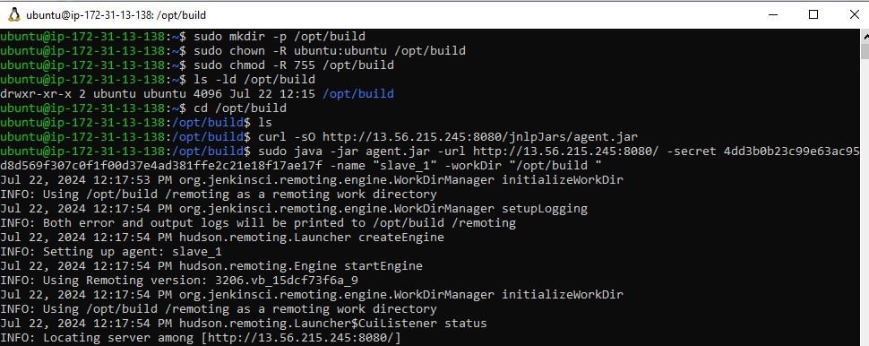

Verify that slave_1 is connected in jenkins

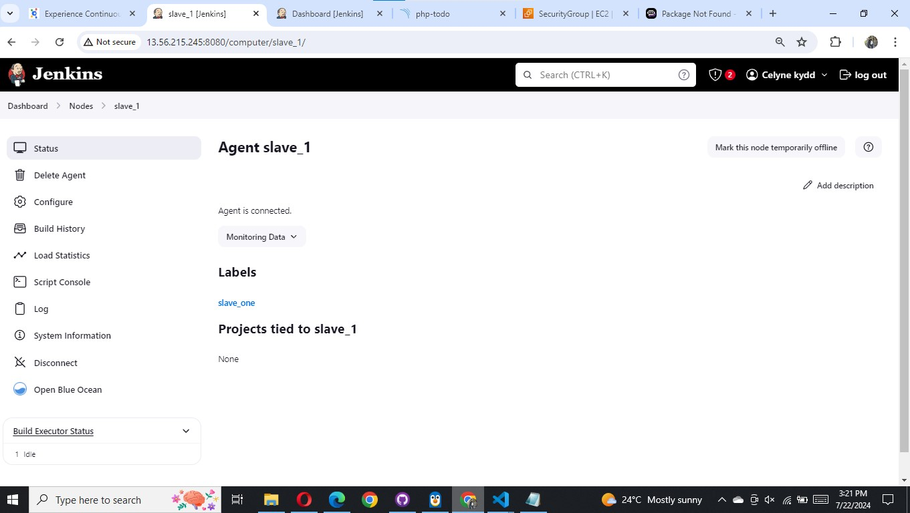

**Repeat same thing for the second**

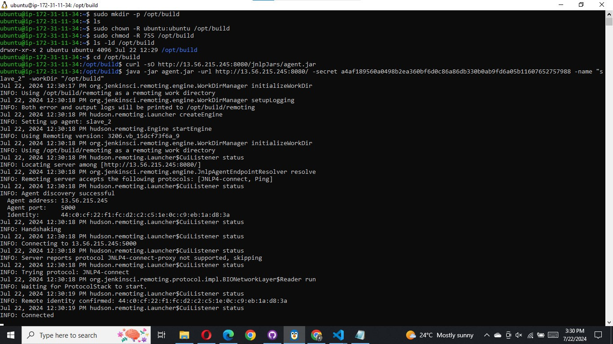

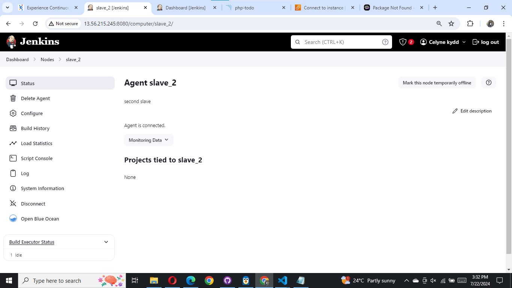

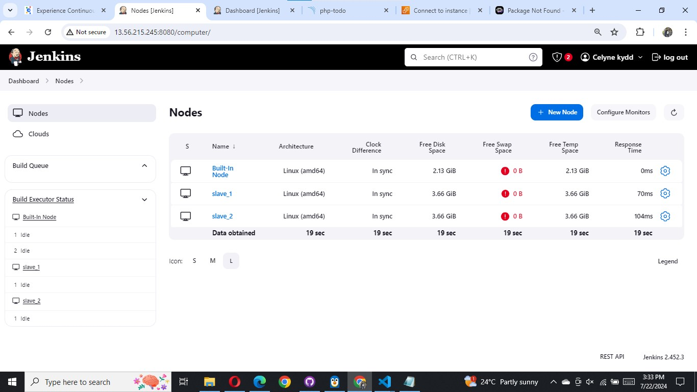

- Configure webhook between Jenkins and GitHub to automatically run the pipeline when there is a code push.

  - Configure webhook between Jenkins and GitHub to automatically run the pipeline when there is a code push. The PHP-Todo repo, click on `Settings` > `Webhooks`. For the Payload URL input - `http://<jenkins-publib-ip>:8080/github-webhook/` and in content-type, select application/json and save.

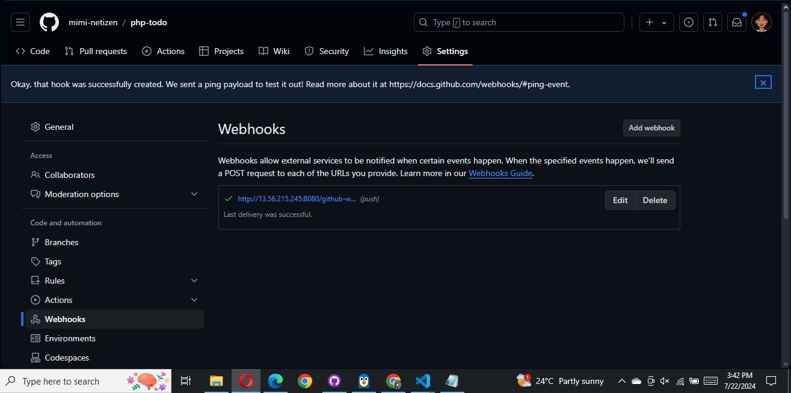

3. Deploy the application to all the environments in order to deploy to all environment we Add these stages to our existing Jenkins pipeline script

**Development**

```bash
stage ('Deploy to Dev Environment') {
            agent { label 'slave_one' } // Specify the Jenkins slave to use for deployment
            steps {
                build job: 'ansible-config-mgt/main', parameters: [[$class: 'StringParameterValue', name: 'env', value: 'dev']], propagate: false, wait: true
            }
        }
```

**Test Environment**

```bash
        stage ('Deploy to Test Environment') {
            agent { label 'slave_two' } // Specify another Jenkins slave for deployment
            steps {
                build job: 'ansible-config-mgt/main', parameters: [[$class: 'StringParameterValue', name: 'env', value: 'pentest']], propagate: false, wait: true
            }
        }
```

**Production Environment**

```bash
        stage ('Deploy to Production Environment') {
            agent any
            steps {
                build job: 'ansible-config-mgt/main', parameters: [[$class: 'StringParameterValue', name: 'env', value: 'ci']], propagate: false, wait: true
            }
        }
```

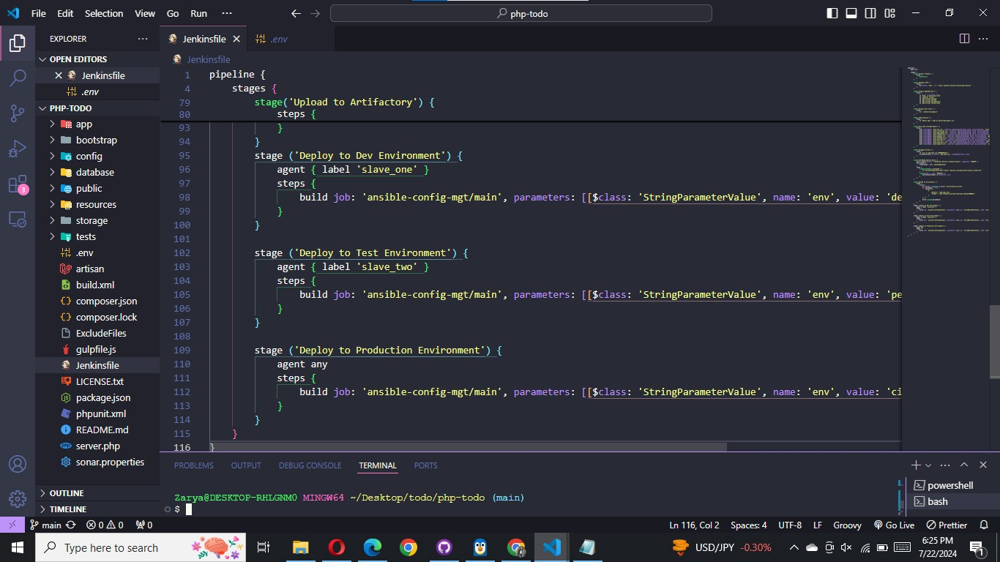

4. **Optional** – Experience pentesting in pentest environment by configuring [Wireshark](https://www.wireshark.org/) there and just explore for information sake only.[Watch Wireshark Tutorial here](https://youtu.be/lb1Dw0elw0Q)

- Ansible Role for Wireshark:
- https://github.com/ymajik/ansible-role-wireshark (Ubuntu)
- https://github.com/wtanaka/ansible-role-wireshark (RedHat)

  ### The End of Project 14

  We have just experienced one of the most interesting and complex projects in our Project Based Learning journey
  so far.
