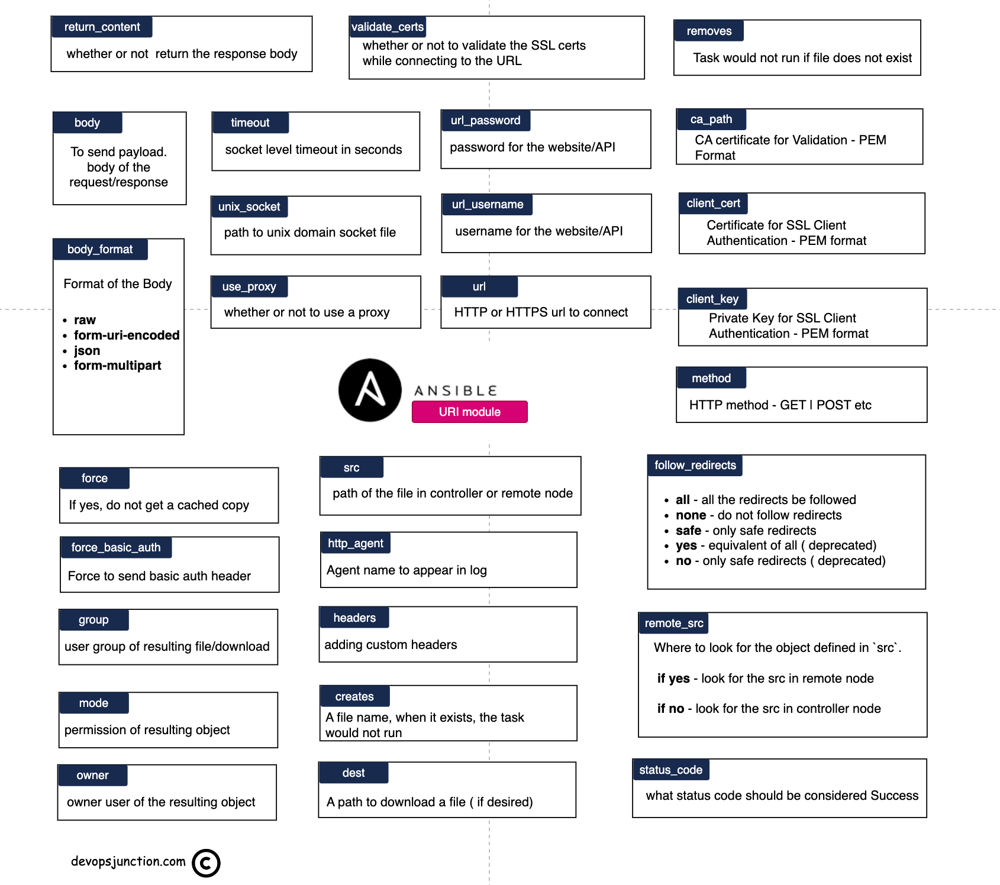

# The Comprehensive Guide to the Ansible URI Module



## Introduction

In the world of IT automation, Ansible stands out as a powerful tool that simplifies the management of complex systems. One of its versatile modules is the `uri` module, which allows users to interact with web services and APIs. This comprehensive guide will delve into the intricacies of the Ansible `uri` module, exploring its capabilities, usage, and best practices. Whether you're an IT professional or a developer, understanding the `uri` module is essential for automating web service interactions.

## What is the Ansible URI Module?

The Ansible `uri` module is a built-in module that enables users to send HTTP requests to web services and APIs. It supports various HTTP methods, including GET, POST, PUT, DELETE, HEAD, and OPTIONS. The module is particularly useful for interacting with RESTful APIs, retrieving data, and performing actions on remote servers.

## Key Features of the Ansible URI Module

The `uri` module offers several key features that make it a valuable tool for automation:

- **Support for Multiple HTTP Methods**: The module supports GET, POST, PUT, DELETE, HEAD, and OPTIONS methods, allowing for a wide range of interactions with web services.
- **Authentication**: It supports basic authentication, token-based authentication, and custom headers, enabling secure communication with APIs.
- **Data Handling**: The module can send data in various formats, including JSON and form-encoded data, making it flexible for different API requirements.
- **Response Handling**: It can parse and handle responses, allowing users to extract and use data from API responses.
- **Timeouts and Retries**: The module supports configurable timeouts and retries, ensuring robust and reliable communication with web services.

## How to Use the Ansible URI Module

Using the `uri` module involves specifying the URL, HTTP method, and any necessary data or headers. Here's a basic example of how to use the module to send a GET request:

```yaml
- name: Send a GET request to a web service
  uri:
    url: https://api.example.com/data
    method: GET
    return_content: yes
  register: result

- name: Display the response
  debug:
    var: result.content
```

### Sending a POST Request

To send a POST request with JSON data, you can use the following example:

```yaml
- name: Send a POST request with JSON data
  uri:
    url: https://api.example.com/data
    method: POST
    headers:
      Content-Type: application/json
    body: '{"key": "value"}'
    status_code: 201
    return_content: yes
  register: result

- name: Display the response
  debug:
    var: result.content
```

### Handling Authentication

The `uri` module supports various authentication methods. Here's an example using basic authentication:

```yaml
- name: Send a GET request with basic authentication
  uri:
    url: https://api.example.com/data
    method: GET
    user: myusername
    password: mypassword
    return_content: yes
  register: result

- name: Display the response
  debug:
    var: result.content
```

### Handling Response Data

You can extract and use data from the API response. Here's an example of how to parse JSON response data:

```yaml
- name: Send a GET request and parse JSON response
  uri:
    url: https://api.example.com/data
    method: GET
    return_content: yes
  register: result

- name: Parse JSON response
  set_fact:
    response_data: "{{ result.json }}"

- name: Display parsed data
  debug:
    var: response_data
```

# Best Practices for Using the Ansible URI Module

## Introduction

The Ansible `uri` module is a powerful tool for automating interactions with web services and APIs. To maximize its effectiveness and ensure robust, maintainable playbooks, it's essential to follow best practices. Below are key strategies for using the `uri` module efficiently and securely.

## Use Variables for URLs and Credentials

### Why Use Variables?

Storing URLs and credentials in variables enhances maintainability and security. It allows for easy updates and reduces the risk of exposing sensitive information.

### Example

```yaml
- name: Define variables
  vars:
    api_url: https://api.example.com/data
    api_user: myusername
    api_password: mypassword

- name: Send a GET request using variables
  uri:
    url: "{{ api_url }}"
    method: GET
    user: "{{ api_user }}"
    password: "{{ api_password }}"
    return_content: yes
  register: result

- name: Display the response
  debug:
    var: result.content
```

## Handle Errors Gracefully

### Why Handle Errors?

Handling errors ensures that your playbooks can continue running even if a request fails. This is crucial for maintaining the overall workflow and avoiding disruptions.

### Example

```yaml
- name: Send a GET request with error handling
  uri:
    url: https://api.example.com/data
    method: GET
    return_content: yes
  register: result
  failed_when: result.status != 200
  ignore_errors: yes

- name: Display the response or error
  debug:
    var: result.content
```

## Use Secure Authentication Methods

### Why Secure Authentication?

Using secure authentication methods, such as token-based authentication, enhances the security of your interactions with web services.

### Example

```yaml
- name: Send a GET request with token-based authentication
  uri:
    url: https://api.example.com/data
    method: GET
    headers:
      Authorization: "Bearer {{ api_token }}"
    return_content: yes
  register: result

- name: Display the response
  debug:
    var: result.content
```

## Validate SSL Certificates

### Why Validate SSL Certificates?

Validating SSL certificates ensures that your requests are secure and that you are communicating with trusted servers.

### Example

```yaml
- name: Send a GET request with SSL validation
  uri:
    url: https://api.example.com/data
    method: GET
    validate_certs: yes
    return_content: yes
  register: result

- name: Display the response
  debug:
    var: result.content
```

## Use JSON for Data Handling

### Why Use JSON?

JSON is a widely-used data format for APIs. Using JSON simplifies data handling and ensures compatibility with most web services.

### Example

```yaml
- name: Send a POST request with JSON data
  uri:
    url: https://api.example.com/data
    method: POST
    headers:
      Content-Type: application/json
    body: '{"key": "value"}'
    status_code: 201
    return_content: yes
  register: result

- name: Display the response
  debug:
    var: result.content
```

## Implement Timeouts and Retries

### Why Use Timeouts and Retries?

Configuring timeouts and retries ensures that your playbooks can handle network issues gracefully and avoid hanging indefinitely.

### Example

```yaml
- name: Send a GET request with timeout and retries
  uri:
    url: https://api.example.com/data
    method: GET
    return_content: yes
    timeout: 30
    retries: 3
    delay: 5
  register: result

- name: Display the response
  debug:
    var: result.content
```

## Log and Monitor Requests

### Why Log and Monitor?

Logging and monitoring requests help in troubleshooting issues and ensuring that your playbooks are functioning as expected.

### Example

```yaml
- name: Send a GET request and log the response
  uri:
    url: https://api.example.com/data
    method: GET
    return_content: yes
  register: result

- name: Log the response
  copy:
    content: "{{ result.content }}"
    dest: /var/log/ansible/api_response.log

- name: Display the response
  debug:
    var: result.content
```
