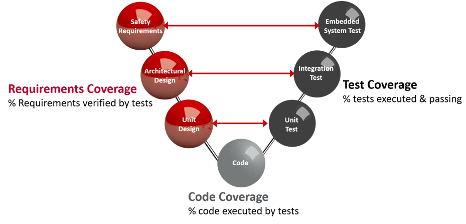
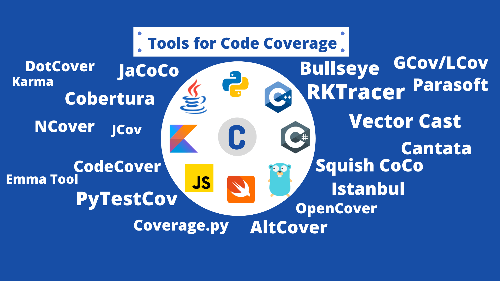

# Introduction to Code Coverage Analysis

Code coverage analysis is a crucial aspect of software testing that measures the extent to which the source code of a program is executed during testing. This metric helps developers understand which parts of the codebase are adequately tested and which are not, thereby improving the overall quality and reliability of the software. This article explores the intricacies of code coverage analysis, its benefits, popular tools, and best practices for maximizing code coverage.

## What is Code Coverage Analysis?

Code coverage analysis involves running a suite of tests and measuring the proportion of the code that is executed. The primary goal is to identify untested parts of the codebase and ensure that they are covered by tests. Code coverage is typically expressed as a percentage, representing the ratio of executed code to the total code.

### Types of Code Coverage

1. **Statement Coverage**: Measures the percentage of executed statements in the code.
2. **Branch Coverage**: Measures the percentage of executed branches in control structures like if-else statements.
3. **Function Coverage**: Measures the percentage of executed functions or methods.
4. **Condition Coverage**: Measures the percentage of executed boolean expressions in control structures.
5. **Path Coverage**: Measures the percentage of executed paths through the code.

## Benefits of Code Coverage Analysis

### Improved Test Quality

Code coverage analysis helps identify gaps in the test suite, ensuring that all critical parts of the code are tested. This leads to higher test quality and more reliable software.

### Early Bug Detection

By ensuring comprehensive test coverage, code coverage analysis helps identify and fix bugs early in the development process, reducing the cost and effort required for debugging later.

### Enhanced Code Quality

Code coverage analysis encourages developers to write tests for all parts of the code, leading to cleaner, more maintainable code.

### Increased Confidence

High code coverage provides confidence that the software has been thoroughly tested and is less likely to contain undiscovered bugs.

### Compliance

Code coverage analysis can help ensure compliance with industry standards and regulations that require a certain level of test coverage.

## Popular Code Coverage Tools

### JaCoCo

[JaCoCo](https://www.jacoco.org/) is a popular code coverage tool for Java applications. It integrates with various build tools and CI/CD pipelines, providing detailed coverage reports.

### Istanbul

[Istanbul](https://istanbul.js.org/) is a code coverage tool for JavaScript applications. It provides detailed coverage reports and integrates with various testing frameworks.

### Coverage.py

[Coverage.py](https://coverage.readthedocs.io/) is a code coverage tool for Python applications. It supports multiple reporting formats and integrates with various CI/CD tools.

### Cobertura

[Cobertura](http://cobertura.github.io/cobertura/) is a code coverage tool for Java applications. It provides detailed coverage reports and integrates with various build tools.

### OpenCover

[OpenCover](https://github.com/OpenCover/opencover) is a code coverage tool for .NET applications. It provides detailed coverage reports and integrates with various CI/CD pipelines.

## Best Practices for Code Coverage Analysis

### Aim for High Coverage, But Be Realistic

While high code coverage is desirable, it is essential to focus on meaningful coverage rather than achieving 100%. Aim for a balance between coverage and test quality.

### Integrate with CI/CD Pipelines

Integrate code coverage tools into your CI/CD pipelines to ensure that coverage is measured automatically with each commit. This provides continuous feedback and helps maintain high coverage.

### Review Coverage Reports Regularly

Regularly review code coverage reports to identify untested parts of the codebase and add tests as needed. This helps ensure comprehensive coverage.

### Focus on Critical Code Paths

Prioritize testing critical code paths and high-risk areas of the codebase. This helps ensure that the most important parts of the code are thoroughly tested.

### Combine with Other Testing Methods

Code coverage analysis should be used in conjunction with other testing methods, such as static code analysis and dynamic testing, to provide comprehensive coverage.

## Challenges in Code Coverage Analysis

### False Sense of Security

High code coverage does not guarantee the absence of bugs. It is essential to focus on the quality of tests rather than just achieving high coverage.

### Performance Overhead

Running code coverage analysis can add overhead to the testing process, especially for large codebases. Optimizing the analysis process and using incremental analysis can help mitigate this.

### Tool Limitations

No single code coverage tool can catch all potential issues. Combining multiple tools and testing methods can provide more comprehensive coverage.

## Conclusion

Code coverage analysis is a powerful technique for improving test quality, detecting bugs early, and enhancing code quality. By integrating code coverage tools into your development workflow and following best practices, you can ensure comprehensive coverage and build more reliable software.
