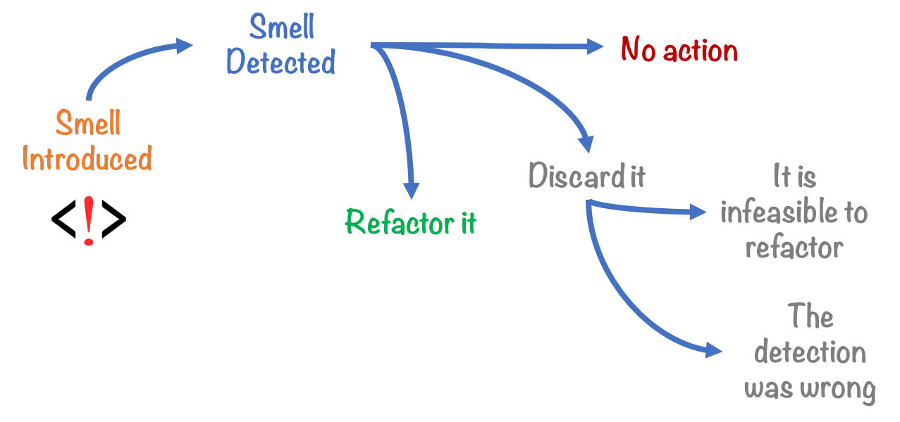

# The Ultimate Guide to Code Smells Analysis

## Introduction to Code Smells Analysis

Code smells are indicators of potential problems in the source code that may not necessarily be bugs but can lead to issues in the future. These are often signs of deeper problems in the codebase, such as poor design choices or lack of adherence to coding standards. This article delves into the intricacies of code smells analysis, its benefits, popular tools, and best practices for identifying and addressing code smells.

## What are Code Smells?

Code smells are characteristics in the source code that suggest the presence of deeper problems. They are usually not bugs but can make the code harder to understand, maintain, and extend. Identifying and addressing code smells early can improve the overall quality and maintainability of the software.

### Common Types of Code Smells

1. **Long Method**: Methods that are too long and do too much.
2. **Large Class**: Classes that have too many responsibilities.
3. **Duplicated Code**: Code that is repeated in multiple places.
4. **Feature Envy**: Methods that rely heavily on data from other classes.
5. **Data Clumps**: Groups of data that are often used together but are not encapsulated in a class.
6. **Switch Statements**: Overly complex switch or case statements.
7. **Lazy Class**: Classes that do too little and do not justify their existence.
8. **Speculative Generality**: Code that is more general than necessary.
9. **Temporary Field**: Fields that are only used in certain circumstances.
10. **Message Chains**: Long chains of method calls.

## Benefits of Code Smells Analysis

### Improved Code Quality

Identifying and addressing code smells leads to cleaner, more maintainable code, which is easier to understand and modify.

### Enhanced Maintainability

By refactoring code smells, you make the codebase more maintainable, reducing the effort required for future changes and bug fixes.

### Early Detection of Issues

Code smells can be early indicators of deeper problems in the codebase. Identifying and addressing them early can prevent more significant issues down the line.

### Increased Developer Productivity

Cleaner code is easier to work with, leading to increased developer productivity and faster development cycles.

### Better Collaboration

A codebase free of code smells is easier for multiple developers to work on, fostering better collaboration and reducing the risk of conflicts.

## Popular Tools for Code Smells Analysis

### SonarQube

[SonarQube](https://www.sonarqube.org/) is an open-source platform that provides continuous inspection of code quality. It can identify various code smells and integrates with multiple CI/CD tools.

### PMD

[PMD](https://pmd.github.io/) is a static code analysis tool that supports multiple programming languages. It can identify common code smells and other programming flaws.

### Checkstyle

[Checkstyle](https://checkstyle.sourceforge.io/) is a static code analysis tool for Java. It helps ensure that the code adheres to coding standards and can identify various code smells.

### ESLint

[ESLint](https://eslint.org/) is a popular static code analysis tool for JavaScript. It helps identify and fix problems in the code, including various code smells.

### RuboCop

[RuboCop](https://rubocop.org/) is a static code analysis tool for Ruby. It enforces coding standards and can identify various code smells.

## Best Practices for Code Smells Analysis

### Regular Code Reviews

Conduct regular code reviews to identify and address code smells. This helps ensure that the codebase remains clean and maintainable.

### Use Automated Tools

Use automated static code analysis tools to continuously monitor the codebase for code smells. These tools provide quick feedback and help maintain high code quality.

### Refactor Regularly

Regularly refactor the code to address identified code smells. This helps keep the codebase clean and maintainable.

### Educate Developers

Educate developers on common code smells and how to address them. This fosters a culture of code quality and continuous improvement.

### Integrate with CI/CD Pipelines

Integrate code smells analysis tools into your CI/CD pipelines to ensure that code is automatically analyzed with each commit. This provides continuous feedback and helps maintain high code quality.

## Challenges in Code Smells Analysis

### False Positives

Automated tools can sometimes generate false positives, identifying issues that are not actually problems. Regularly reviewing and fine-tuning the rules can help minimize false positives.

### Performance Overhead

Running code smells analysis can add overhead to the development process, especially for large codebases. Optimizing the analysis process and using incremental analysis can help mitigate this.

### Tool Limitations

No single code smells analysis tool can catch all potential issues. Combining multiple tools and testing methods can provide more comprehensive coverage.
