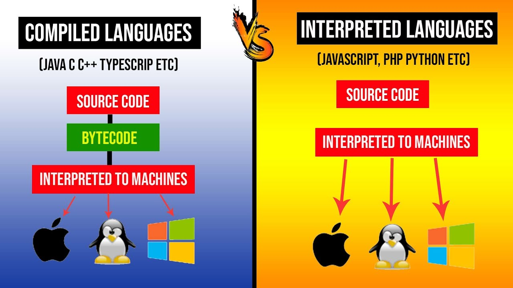
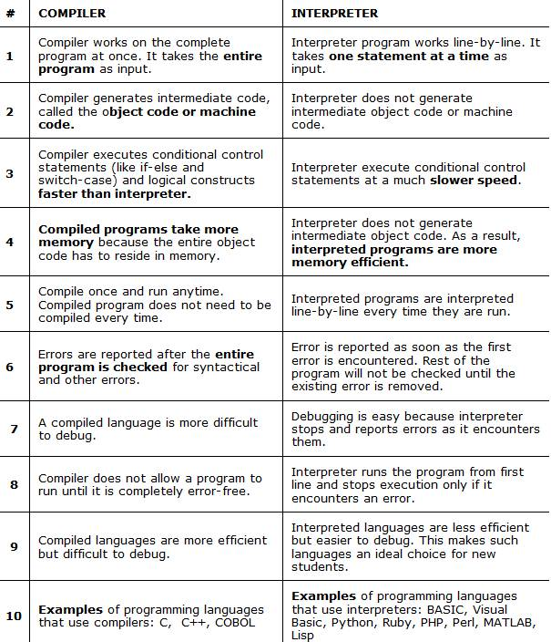

# Compiled Programming Languages

## What Are Compiled Programming Languages?

Compiled programming languages are those that require a compiler to translate the source code into executable machine code. This process involves several stages, including lexical analysis, syntax analysis, semantic analysis, optimization, and code generation. The end result is a binary file that the computer's processor can execute directly.

### Benefits of Compiled Programming Languages

- **Performance**: Compiled languages generally offer superior performance compared to interpreted languages because the code is translated directly into machine language.
- **Optimization**: Compilers can optimize code to make it run faster and more efficiently.
- **Error Detection**: The compilation process can catch many types of errors before the program is run, making debugging easier.
- **Portability**: Once compiled, the executable can run on any system with the same architecture without needing the source code or a compiler.

## Popular Compiled Programming Languages

### C

C is one of the oldest and most widely used compiled programming languages. Known for its efficiency and control over system resources, C is often used in system programming, embedded systems, and high-performance applications.

### C++

An extension of C, C++ introduces object-oriented programming features while maintaining the efficiency of its predecessor. It is commonly used in game development, real-time simulations, and large-scale software systems.

### Java

Java is a unique case as it is both compiled and interpreted. The source code is compiled into bytecode, which is then interpreted by the Java Virtual Machine (JVM). This allows Java programs to be platform-independent.

### Rust

Rust is a modern compiled language designed for safety and performance. It is particularly popular for system-level programming and applications where concurrency and memory safety are critical.

### Go

Developed by Google, Go (or Golang) is known for its simplicity and efficiency. It is often used in cloud services, distributed systems, and other performance-critical applications.

## Compiled vs. Interpreted Languages

### Performance

Compiled languages generally offer better performance because the code is translated directly into machine code. In contrast, interpreted languages translate code on the fly, which can introduce overhead.

### Development Speed

Interpreted languages often allow for faster development cycles because they do not require a separate compilation step. This can be beneficial for scripting, rapid prototyping, and applications where execution speed is less critical.

### Portability

Interpreted languages are generally more portable because they rely on an interpreter that can run on different platforms. Compiled languages require recompilation for each target platform, although some, like Java, offer platform independence through intermediate bytecode.

## The Compilation Process

### Lexical Analysis

The first stage of compilation involves breaking down the source code into tokens, which are the smallest units of meaning, such as keywords, operators, and identifiers.

### Syntax Analysis

In this stage, the compiler checks the code's syntax against the language's grammar rules. This involves constructing a syntax tree that represents the hierarchical structure of the source code.

### Semantic Analysis

Semantic analysis ensures that the code makes sense in the context of the language's rules. This includes type checking, scope resolution, and other semantic checks.

### Optimization

The compiler optimizes the code to improve performance and efficiency. This can involve a variety of techniques, such as inlining functions, loop unrolling, and dead code elimination.

### Code Generation

The final stage involves generating the machine code that the computer's processor can execute. This code is typically stored in an executable file or binary.

## Common Use Cases for Compiled Languages

### System Programming

Compiled languages like C and Rust are often used for system programming, where performance and control over hardware are critical.

### Game Development

C++ is a popular choice for game development due to its performance and support for object-oriented programming.

### High-Performance Computing

For applications that require intensive computation, such as scientific simulations and financial modeling, compiled languages offer the necessary performance.

### Embedded Systems

Embedded systems, which have limited resources and require efficient code, often rely on compiled languages like C.

## Challenges and Considerations

### Compilation Time

One of the main drawbacks of compiled languages is the time required for compilation, which can slow down the development process.

### Debugging

While the compilation process can catch many errors, debugging compiled code can be more challenging compared to interpreted languages, especially when dealing with low-level issues.

### Portability

Although compiled code can be highly optimized for a specific platform, it may require recompilation to run on different architectures.
