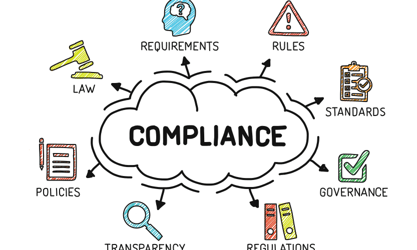

# Introduction to Compliance Analysis

Compliance analysis is a critical process for ensuring that an organization's operations, policies, and procedures adhere to regulatory requirements and industry standards. This article explores the intricacies of compliance analysis, its benefits, popular tools, and best practices for integrating it into your organizational workflow.

## What is Compliance Analysis?

Compliance analysis involves evaluating an organization's adherence to legal, regulatory, and industry standards. This process helps identify areas of non-compliance and implement corrective actions to mitigate risks. Compliance analysis is essential for maintaining the integrity, reputation, and legal standing of an organization.

### Key Components of Compliance Analysis

1. **Regulatory Requirements**: Understanding and adhering to laws and regulations relevant to the industry.
2. **Internal Policies**: Ensuring that internal policies and procedures align with regulatory requirements.
3. **Risk Assessment**: Identifying and assessing risks associated with non-compliance.
4. **Monitoring and Reporting**: Continuously monitoring compliance and reporting findings to stakeholders.
5. **Corrective Actions**: Implementing corrective actions to address areas of non-compliance.

## Benefits of Compliance Analysis

### Risk Mitigation

Compliance analysis helps identify and mitigate risks associated with non-compliance, reducing the likelihood of legal penalties, fines, and reputational damage.

### Improved Operational Efficiency

By ensuring adherence to regulatory requirements and industry standards, compliance analysis can streamline operations and improve overall efficiency.

### Enhanced Reputation

Maintaining compliance with regulations and standards enhances an organization's reputation and builds trust with customers, partners, and stakeholders.

### Legal Protection

Compliance analysis provides legal protection by ensuring that the organization adheres to all applicable laws and regulations, reducing the risk of legal disputes.

### Competitive Advantage

Organizations that demonstrate strong compliance practices can gain a competitive advantage by differentiating themselves from competitors and attracting customers who value compliance.

## Popular Tools for Compliance Analysis

### Compliance 360

[Compliance 360](https://www.sai360.com/) is a comprehensive compliance management platform that helps organizations manage regulatory requirements, policies, and risks.

### MetricStream

[MetricStream](https://www.metricstream.com/) is a leading provider of governance, risk, and compliance (GRC) solutions. It offers tools for compliance management, risk assessment, and reporting.

### RSA Archer

[RSA Archer](https://www.rsa.com/en-us/products/integrated-risk-management/archer-suite) is a GRC platform that provides tools for compliance management, risk assessment, and incident management.

### LogicGate

[LogicGate](https://www.logicgate.com/) is a GRC platform that helps organizations manage compliance, risk, and audit processes through customizable workflows and reporting.

### NAVEX Global

[NAVEX Global](https://www.navexglobal.com/) offers a suite of compliance management solutions, including policy management, risk assessment, and incident reporting.

## Best Practices for Compliance Analysis

### Stay Informed

Stay informed about relevant laws, regulations, and industry standards. Regularly review and update your compliance policies and procedures to ensure they align with current requirements.

### Conduct Regular Audits

Conduct regular compliance audits to identify areas of non-compliance and implement corrective actions. Audits help ensure that your organization remains compliant and addresses any issues promptly.

### Implement a Compliance Management System

Implement a compliance management system to streamline compliance processes, monitor adherence to regulations, and generate reports for stakeholders.

### Educate Employees

Educate employees on the importance of compliance and provide training on relevant laws, regulations, and internal policies. This fosters a culture of compliance and ensures that employees understand their responsibilities.

### Monitor and Report

Continuously monitor compliance and generate reports to keep stakeholders informed. Regular reporting helps track progress, identify trends, and address issues proactively.

## Challenges in Compliance Analysis

### Evolving Regulations

Regulations and industry standards are constantly evolving, making it challenging to stay up-to-date and ensure ongoing compliance. Regularly reviewing and updating compliance policies can help address this challenge.

### Resource Constraints

Compliance analysis can be resource-intensive, requiring time, effort, and expertise. Investing in compliance management tools and training can help optimize resources and streamline processes.

### Complexity

Compliance requirements can be complex and vary across industries and regions. Collaborating with legal and compliance experts can help navigate these complexities and ensure comprehensive compliance.

### Data Management

Managing and analyzing large volumes of data for compliance purposes can be challenging. Implementing data management tools and practices can help ensure accurate and efficient compliance analysis.

## Conclusion

Compliance analysis is a critical process for ensuring that an organization adheres to regulatory requirements and industry standards. By integrating compliance analysis into your organizational workflow and following best practices, you can mitigate risks, improve operational efficiency, and enhance your organization's reputation.
