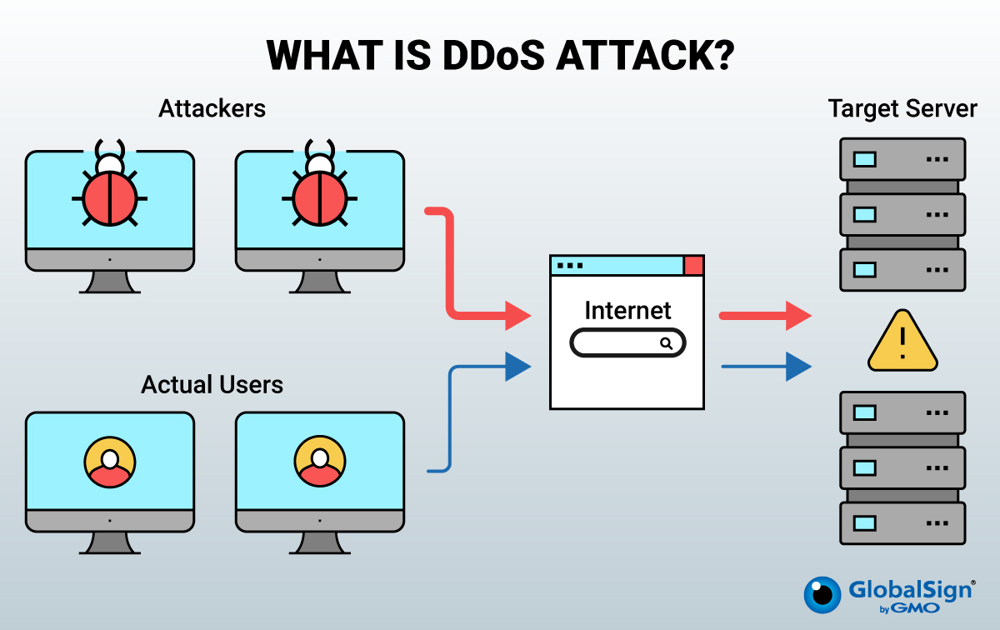
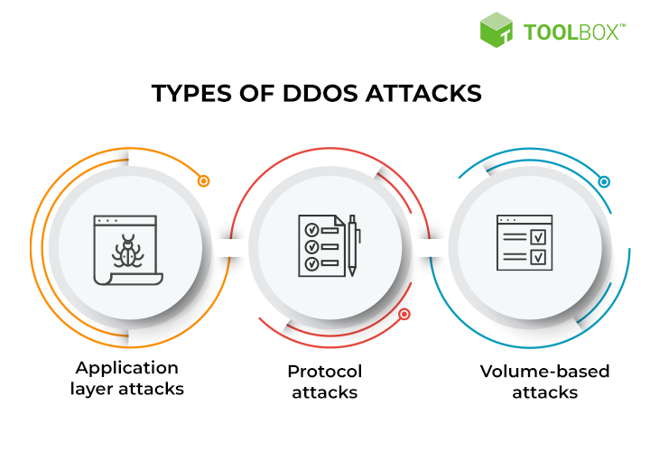

# The Comprehensive Guide to DDoS Attacks

A Distributed Denial of Service (DDoS) attack is a malicious attempt to disrupt the normal traffic of a targeted server, service, or network by overwhelming it with a flood of Internet traffic. Unlike a Denial of Service (DoS) attack, which typically uses a single machine, a DDoS attack leverages multiple compromised systems, often distributed globally, to launch a coordinated attack.

## How Does a DDoS Attack Work?

DDoS attacks exploit the limitations of network resources, such as the infrastructure that powers a website. Here’s a breakdown of how a typical DDoS attack unfolds:

### 1. Botnet Creation

Attackers first create a botnet, a network of compromised devices (bots) that can be controlled remotely. These devices can include computers, IoT devices, and even smartphones.

### 2. Command and Control

The attacker uses a command-and-control (C&C) server to manage the botnet. Through this server, the attacker can issue commands to the bots, instructing them to target a specific server or network.

### 3. Traffic Flooding

The bots generate a massive amount of traffic, overwhelming the target's network infrastructure. This can include sending numerous requests, consuming bandwidth, or exploiting vulnerabilities.

### 4. Service Disruption

The target server or network becomes overwhelmed, leading to slowdowns, crashes, or complete unavailability of services. This disruption can last from a few minutes to several days, depending on the attack's scale and the target's defenses.

## Types of DDoS Attacks

DDoS attacks can be categorized into several types based on the attack vector used. Here are some of the most common types:

### 1. Volume-Based Attacks

These attacks aim to consume the target's bandwidth by sending a massive amount of traffic. Examples include:

- **UDP Floods**: Sending large numbers of User Datagram Protocol (UDP) packets to random ports.
- **ICMP Floods**: Overwhelming the target with Internet Control Message Protocol (ICMP) Echo Request (ping) packets.

### 2. Protocol Attacks

Protocol attacks exploit weaknesses in network protocols to consume server resources. Examples include:

- **SYN Floods**: Exploiting the TCP handshake process by sending numerous SYN requests without completing the handshake.
- **Ping of Death**: Sending malformed or oversized packets to crash the target system.

### 3. Application Layer Attacks

These attacks target specific applications or services, aiming to exhaust server resources. Examples include:

- **HTTP Floods**: Sending numerous HTTP requests to overwhelm a web server.
- **Slowloris**: Holding multiple connections open by sending partial HTTP requests.

## Impact of DDoS Attacks

DDoS attacks can have severe consequences for businesses and organizations, including:

- **Financial Loss**: Downtime can lead to lost revenue, especially for e-commerce websites.
- **Reputation Damage**: Prolonged service disruptions can harm a company's reputation and customer trust.
- **Operational Disruption**: Critical services and operations can be halted, affecting productivity.
- **Increased Costs**: Mitigating and recovering from a DDoS attack can be costly.

## Preventive Measures Against DDoS Attacks

While it's challenging to prevent DDoS attacks entirely, several measures can help mitigate their impact:

### 1. Network Security

Implement robust network security measures, including:

- **Firewalls**: Use firewalls to filter and block malicious traffic.
- **Intrusion Detection Systems (IDS)**: Deploy IDS to monitor and detect suspicious activity.

### 2. Traffic Analysis

Regularly analyze network traffic to identify unusual patterns that may indicate an impending attack.

### 3. Load Balancing

Distribute traffic across multiple servers to prevent any single server from becoming overwhelmed.

### 4. Rate Limiting

Implement rate limiting to control the number of requests a server can handle within a specific time frame.

### 5. DDoS Protection Services

Consider using third-party DDoS protection services that offer advanced mitigation techniques and real-time monitoring.

## Conclusion

DDoS attacks are a significant threat in today's digital landscape. Understanding their mechanisms, impact, and preventive measures is crucial for protecting your digital assets. By implementing robust security practices and staying vigilant, you can mitigate the risks associated with DDoS attacks
