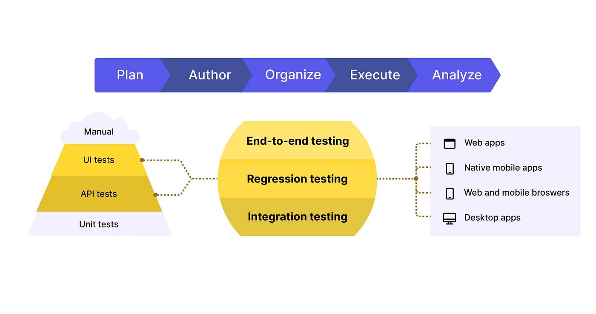

# Introduction to Integration Testing

Integration testing is a critical phase in the software development lifecycle that focuses on verifying the interactions between different components or modules of a system. This article explores the intricacies of integration testing, its benefits, popular tools, and best practices for ensuring a seamless and efficient integration process.

## What is Integration Testing?

Integration testing involves combining individual software modules and testing them as a group to identify any issues in their interactions. The primary goal is to detect defects that may arise when different components are integrated, ensuring that they work together as expected.

### Types of Integration Testing

1. **Big Bang Integration Testing**: All modules are integrated simultaneously, and the system is tested as a whole.
2. **Top-Down Integration Testing**: Testing starts from the top-level modules and progresses down to the lower-level modules.
3. **Bottom-Up Integration Testing**: Testing begins with the lower-level modules and moves up to the higher-level modules.
4. **Sandwich Integration Testing**: A combination of top-down and bottom-up approaches, also known as hybrid integration testing.
5. **Incremental Integration Testing**: Modules are integrated and tested incrementally, either one at a time or in small groups.

## Benefits of Integration Testing

### Early Detection of Issues

Integration testing helps identify issues in the interactions between different components early in the development process, reducing the cost and effort required for debugging later.

### Improved System Reliability

By verifying that different modules work together as expected, integration testing enhances the overall reliability and stability of the system.

### Enhanced Code Quality

Integration testing encourages developers to write modular and well-defined code, leading to improved code quality and maintainability.

### Reduced Risk

Integration testing reduces the risk of system failures by ensuring that all components work seamlessly together, providing confidence in the system's functionality.

### Better Collaboration

Integration testing fosters better collaboration between development teams by ensuring that different modules developed by different teams integrate smoothly.

## Popular Tools for Integration Testing

### JUnit

[JUnit](https://junit.org/junit5/) is a widely-used testing framework for Java applications. It supports integration testing by allowing developers to write and run tests for combined modules.

### TestNG

[TestNG](https://testng.org/doc/) is a testing framework inspired by JUnit but designed to be more powerful and flexible. It supports integration testing and provides advanced features like parallel execution and data-driven testing.

### PyTest

[PyTest](https://pytest.org/) is a popular testing framework for Python applications. It supports integration testing and provides powerful features like fixtures and parameterized testing.

### NUnit

[NUnit](https://nunit.org/) is a testing framework for .NET applications. It supports integration testing and provides features like assertions, test runners, and test case management.

### Cucumber

[Cucumber](https://cucumber.io/) is a behavior-driven development (BDD) tool that supports integration testing by allowing developers to write tests in plain language. It integrates with various programming languages and testing frameworks.

## Best Practices for Integration Testing

### Define Clear Test Cases

Define clear and comprehensive test cases that cover all possible interactions between different modules. This helps ensure thorough testing and accurate identification of issues.

### Use Mock Objects

Use mock objects to simulate the behavior of dependent modules that are not yet integrated. This helps isolate and test individual modules in a controlled environment.

### Automate Testing

Automate integration testing to ensure consistent and repeatable test execution. Automated tests provide quick feedback and help maintain high code quality.

### Perform Continuous Integration

Integrate and test code changes continuously using a continuous integration (CI) pipeline. This helps identify and address integration issues early in the development process.

### Monitor and Report

Monitor test results and generate detailed reports to keep stakeholders informed. Regular reporting helps track progress, identify trends, and address issues proactively.

## Challenges in Integration Testing

### Complexity

Integration testing can be complex, especially for large and distributed systems. Breaking down the system into smaller, manageable modules and testing incrementally can help address this challenge.

### Dependency Management

Managing dependencies between different modules can be challenging. Using dependency injection and mock objects can help isolate and test individual modules effectively.

### Test Data Management

Managing test data for integration testing can be challenging. Using a centralized test data management system and creating reusable test data sets can help streamline the process.

### Performance Overhead

Running integration tests can add overhead to the development process, especially for large codebases. Optimizing the test suite and using parallel execution can help mitigate this.

## Conclusion

Integration testing is a critical phase in the software development lifecycle that ensures the seamless interaction between different components of a system. By following best practices and using the right tools, you can ensure thorough and efficient integration testing, leading to a more reliable and stable system.
