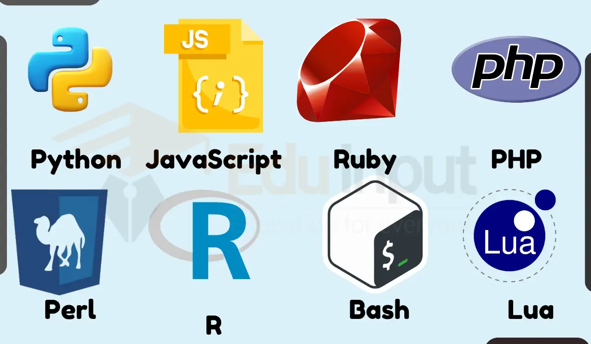

# Interpreted Programming Languages

## What Are Interpreted Programming Languages?

Interpreted programming languages are those that execute instructions directly, typically through an interpreter. The interpreter reads and executes the source code line by line, translating it into machine code on the fly. This approach offers several benefits, including ease of debugging and rapid development cycles.

### Benefits of Interpreted Programming Languages

- **Ease of Use**: Interpreted languages often have simpler syntax and are easier to learn and use.
- **Rapid Development**: The absence of a separate compilation step allows for quicker iteration and prototyping.
- **Portability**: Interpreted languages can run on any platform with the appropriate interpreter, making them highly portable.
- **Dynamic Typing**: Many interpreted languages support dynamic typing, allowing for more flexible and adaptive code.

## Popular Interpreted Programming Languages

### Python

Python is one of the most popular interpreted languages, known for its readability and simplicity. It is widely used in web development, data science, artificial intelligence, and scripting.

### JavaScript

JavaScript is the backbone of web development, enabling dynamic and interactive web pages. It is executed by web browsers, making it an essential tool for front-end developers.

### Ruby

Ruby is an interpreted language known for its elegant syntax and focus on developer happiness. It is commonly used in web development, particularly with the Ruby on Rails framework.

### PHP

PHP is a server-side scripting language widely used for web development. It is embedded in HTML and executed on the server, generating dynamic web pages.

### Perl

Perl is a versatile interpreted language known for its text-processing capabilities. It is often used for system administration, web development, and network programming.

## Interpreted vs. Compiled Languages

### Performance

Interpreted languages generally have slower execution speeds compared to compiled languages because the code is translated on the fly. However, advancements in Just-In-Time (JIT) compilation have narrowed this gap.

### Development Speed

Interpreted languages offer faster development cycles due to the absence of a separate compilation step. This makes them ideal for rapid prototyping and scripting.

### Portability

Interpreted languages are highly portable, as they rely on an interpreter that can run on different platforms. This eliminates the need for recompilation for each target platform.

## The Interpretation Process

### Lexical Analysis

Similar to compiled languages, the first stage of interpretation involves breaking down the source code into tokens, which are the smallest units of meaning.

### Syntax Analysis

The interpreter checks the code's syntax against the language's grammar rules, constructing a syntax tree that represents the hierarchical structure of the source code.

### Execution

Instead of generating machine code, the interpreter executes the code directly, translating each instruction into machine code on the fly.

## Common Use Cases for Interpreted Languages

### Web Development

Interpreted languages like JavaScript, PHP, and Ruby are widely used in web development due to their ease of use and rapid development cycles.

### Scripting

Interpreted languages are ideal for scripting tasks, such as automating repetitive tasks, system administration, and data processing.

### Prototyping

The rapid development cycles of interpreted languages make them perfect for prototyping and experimenting with new ideas.

### Data Science

Python, an interpreted language, has become the go-to language for data science, thanks to its extensive libraries and ease of use.

## Challenges and Considerations

### Performance

One of the main drawbacks of interpreted languages is their slower execution speed compared to compiled languages. However, this is often mitigated by the ease of development and flexibility they offer.

### Debugging

While interpreted languages allow for easier debugging during development, runtime errors can be harder to catch compared to compile-time errors in compiled languages.

### Dependency on Interpreter

Interpreted languages require an interpreter to execute, which can add an additional layer of complexity and dependency.

## Future Trends in Interpreted Languages

### Just-In-Time (JIT) Compilation

JIT compilation is a technique that combines the benefits of both interpreted and compiled languages. It compiles code at runtime, improving performance while maintaining the flexibility of interpretation.

### Increased Adoption in Data Science

Interpreted languages like Python are seeing increased adoption in data science, machine learning, and artificial intelligence due to their ease of use and extensive libraries.

### Enhanced Performance

Ongoing advancements in interpreter technology and optimization techniques are continually improving the performance of interpreted languages.
