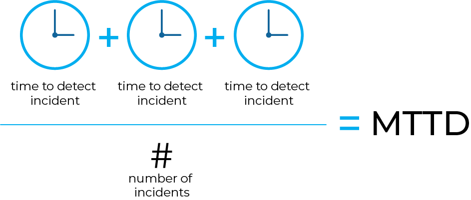

# The Comprehensive Guide to Mean Time to Detection (MTTD)

## Introduction

In the realm of cybersecurity and IT operations, the ability to swiftly detect and respond to incidents is paramount. One critical metric that organizations use to measure their detection capabilities is Mean Time to Detection (MTTD). This comprehensive guide will delve into the intricacies of MTTD, exploring its significance, calculation methods, and strategies for improvement. Whether you're an IT professional or a business leader, understanding MTTD is essential for enhancing your organization's security posture.

## What is Mean Time to Detection (MTTD)?

Mean Time to Detection (MTTD) is a key performance indicator (KPI) that measures the average time it takes for an organization to detect a security incident or system failure. It is a crucial metric for evaluating the effectiveness of an organization's monitoring and detection capabilities. A lower MTTD indicates a more efficient detection process, allowing for quicker response and mitigation of potential threats.

## Importance of MTTD

MTTD is a vital metric for several reasons:

- **Early Detection**: Faster detection of incidents allows for quicker response, reducing the potential impact on the organization.
- **Risk Mitigation**: Early detection helps in mitigating risks associated with security breaches, such as data loss, financial damage, and reputational harm.
- **Operational Efficiency**: Monitoring MTTD helps organizations identify weaknesses in their detection processes and implement improvements.
- **Compliance**: Many regulatory frameworks and standards require organizations to demonstrate their ability to detect and respond to incidents promptly.

## How to Calculate MTTD

Calculating MTTD involves measuring the time taken to detect incidents over a specific period and then averaging these times. The formula for MTTD is:

Here's a step-by-step guide to calculating MTTD:

1. **Identify Incidents**: Record the time of occurrence and time of detection for each incident.
2. **Calculate Detection Times**: Subtract the time of occurrence from the time of detection for each incident.
3. **Sum Detection Times**: Add up all the detection times.
4. **Divide by Number of Incidents**: Divide the total detection time by the number of incidents to get the average.

### Example Calculation

Suppose an organization detected five incidents with the following detection times (in hours):

- Incident 1: 2 hours
- Incident 2: 3 hours
- Incident 3: 1 hour
- Incident 4: 4 hours
- Incident 5: 2 hours

The MTTD would be calculated as follows:

## Factors Affecting MTTD

Several factors can influence an organization's MTTD, including:

### 1. Monitoring Tools

The effectiveness of monitoring tools plays a significant role in MTTD. Advanced tools with real-time monitoring and alerting capabilities can significantly reduce detection times.

### 2. Incident Response Team

The skills and experience of the incident response team are crucial. A well-trained team can quickly identify and respond to incidents, reducing MTTD.

### 3. Network Visibility

Comprehensive network visibility is essential for detecting incidents. Organizations with robust network monitoring and logging capabilities can detect anomalies faster.

### 4. Automation

Automation can streamline the detection process by automatically identifying and alerting on suspicious activities. Automated systems can significantly reduce MTTD.

## Strategies to Improve MTTD

Improving MTTD requires a combination of technology, processes, and people. Here are some strategies to enhance your organization's MTTD:

### 1. Implement Advanced Monitoring Tools

Invest in advanced monitoring tools that offer real-time visibility and alerting. Tools with machine learning capabilities can identify patterns and anomalies more effectively.

### 2. Enhance Incident Response Capabilities

Train your incident response team regularly and ensure they have the necessary skills and resources to detect and respond to incidents promptly.

### 3. Increase Network Visibility

Implement comprehensive network monitoring solutions that provide visibility into all network traffic. Ensure that logs are collected and analyzed continuously.

### 4. Automate Detection Processes

Leverage automation to streamline the detection process. Automated systems can quickly identify and alert on suspicious activities, reducing MTTD.

### 5. Conduct Regular Assessments

Regularly assess your detection capabilities and identify areas for improvement. Conducting penetration testing and red teaming exercises can help identify weaknesses in your detection processes.
