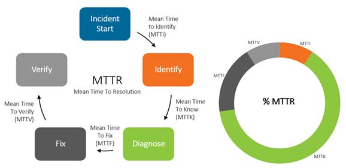

# The Comprehensive Guide to Mean Time to Recovery (MTTR)

Mean Time to Recovery (MTTR) is a key performance indicator (KPI) that measures the average time it takes for an organization to recover from a system failure or security incident. It encompasses the entire recovery process, from the moment an incident is detected to the point where normal operations are fully restored. A lower MTTR indicates a more efficient recovery process, minimizing downtime and reducing the impact on the organization.

## Importance of MTTR

MTTR is a vital metric for several reasons:

- **Minimizing Downtime**: Faster recovery times reduce the duration of service disruptions, minimizing the impact on business operations and customer satisfaction.
- **Cost Efficiency**: Reducing downtime can lead to significant cost savings, as prolonged outages can result in lost revenue and increased operational costs.
- **Operational Resilience**: Monitoring MTTR helps organizations identify weaknesses in their recovery processes and implement improvements to enhance resilience.
- **Compliance**: Many regulatory frameworks and standards require organizations to demonstrate their ability to recover from incidents promptly.

## How to Calculate MTTR

Calculating MTTR involves measuring the time taken to recover from incidents over a specific period and then averaging these times. The formula for MTTR is:

\[ \text{MTTR} = \frac{\sum (\text{Time of Recovery} - \text{Time of Detection})}{\text{Number of Incidents}} \]

Here's a step-by-step guide to calculating MTTR:

1. **Identify Incidents**: Record the time of detection and time of recovery for each incident.
2. **Calculate Recovery Times**: Subtract the time of detection from the time of recovery for each incident.
3. **Sum Recovery Times**: Add up all the recovery times.
4. **Divide by Number of Incidents**: Divide the total recovery time by the number of incidents to get the average.

### Example Calculation

Suppose an organization recovered from five incidents with the following recovery times (in hours):

- Incident 1: 4 hours
- Incident 2: 6 hours
- Incident 3: 3 hours
- Incident 4: 5 hours
- Incident 5: 4 hours

The MTTR would be calculated as follows:

\[ \text{MTTR} = \frac{4 + 6 + 3 + 5 + 4}{5} = \frac{22}{5} = 4.4 \text{ hours} \]

## Factors Affecting MTTR

Several factors can influence an organization's MTTR, including:

### 1. Incident Response Team

The skills and experience of the incident response team are crucial. A well-trained team can quickly diagnose and resolve issues, reducing MTTR.

### 2. Recovery Procedures

Well-documented and tested recovery procedures can streamline the recovery process, ensuring that incidents are resolved efficiently.

### 3. Automation

Automation can expedite the recovery process by automatically executing predefined recovery actions. Automated systems can significantly reduce MTTR.

### 4. Monitoring Tools

Effective monitoring tools can provide real-time visibility into system performance and alert the incident response team to issues promptly.

## Strategies to Improve MTTR

Improving MTTR requires a combination of technology, processes, and people. Here are some strategies to enhance your organization's MTTR:

### 1. Enhance Incident Response Capabilities

Train your incident response team regularly and ensure they have the necessary skills and resources to diagnose and resolve issues promptly.

### 2. Implement Robust Recovery Procedures

Develop and document comprehensive recovery procedures. Regularly test these procedures to ensure they are effective and up-to-date.

### 3. Leverage Automation

Implement automation to streamline the recovery process. Automated systems can quickly execute predefined recovery actions, reducing MTTR.

### 4. Invest in Monitoring Tools

Invest in advanced monitoring tools that offer real-time visibility and alerting. Tools with machine learning capabilities can identify patterns and anomalies more effectively.

### 5. Conduct Regular Assessments

Regularly assess your recovery capabilities and identify areas for improvement. Conducting disaster recovery drills and tabletop exercises can help identify weaknesses in your recovery processes.

## Conclusion

Mean Time to Recovery (MTTR) is a critical metric for evaluating an organization's recovery capabilities. By understanding and improving MTTR, organizations can minimize downtime, reduce costs, and enhance operational resilience. Implementing robust recovery procedures, leveraging
