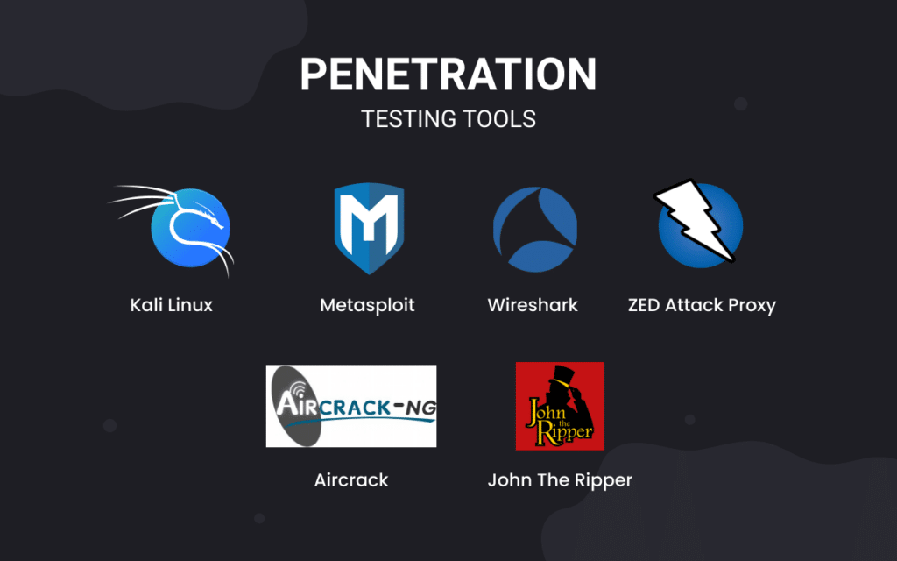

# A Simple Guide to Penetration Testing

## Introduction to Penetration Testing

Penetration testing, often referred to as pen testing, is a critical aspect of cybersecurity that involves simulating cyberattacks on a system to identify vulnerabilities. This article delves into the intricacies of penetration testing, its benefits, popular tools, and best practices for conducting effective pen tests.

## What is Penetration Testing?

Penetration testing is a simulated cyberattack on a computer system, network, or web application to evaluate its security. The primary goal is to identify vulnerabilities that could be exploited by attackers and to provide recommendations for mitigating these risks.

### Types of Penetration Testing

1. **Black Box Testing**: The tester has no prior knowledge of the system and tests it from an external perspective.
2. **White Box Testing**: The tester has full knowledge of the system, including source code, architecture, and internal structures.
3. **Gray Box Testing**: The tester has partial knowledge of the system, combining elements of both black box and white box testing.
4. **External Testing**: Focuses on external-facing assets such as web applications, servers, and network infrastructure.
5. **Internal Testing**: Simulates an attack from within the organization, testing the internal network and systems.
6. **Social Engineering**: Tests the human element of security by attempting to manipulate employees into revealing sensitive information.

## Benefits of Penetration Testing

### Identifying Vulnerabilities

Penetration testing helps identify vulnerabilities in a system that could be exploited by attackers, allowing organizations to address these issues before they can be exploited.

### Enhancing Security Posture

By identifying and addressing vulnerabilities, penetration testing enhances the overall security posture of an organization, making it more resilient to cyberattacks.

### Compliance Requirements

Penetration testing is often required to comply with industry regulations and standards such as PCI DSS, HIPAA, and GDPR. Regular pen tests help ensure compliance and avoid legal penalties.

### Risk Mitigation

Penetration testing helps mitigate risks by identifying and addressing vulnerabilities that could lead to data breaches, financial losses, and reputational damage.

### Improved Incident Response

Penetration testing provides valuable insights into the effectiveness of an organization's incident response plan, helping to identify areas for improvement.

## Popular Tools for Penetration Testing

### Metasploit

[Metasploit](https://www.metasploit.com/) is a widely-used penetration testing framework that provides tools for discovering, exploiting, and validating vulnerabilities.

### Nmap

[Nmap](https://nmap.org/) is a powerful network scanning tool that helps identify open ports, services, and potential vulnerabilities on a network.

### Burp Suite

[Burp Suite](https://portswigger.net/burp) is a comprehensive web application security testing tool that provides features for scanning, crawling, and exploiting web vulnerabilities.

### OWASP ZAP

[OWASP ZAP](https://www.zaproxy.org/) is an open-source web application security scanner that helps identify vulnerabilities in web applications.

### Wireshark

[Wireshark](https://www.wireshark.org/) is a network protocol analyzer that helps capture and analyze network traffic to identify potential security issues.

## Best Practices for Penetration Testing

### Define Clear Objectives

Define clear objectives for the penetration test, including the scope, goals, and success criteria. This helps ensure that the test is focused and effective.

### Obtain Proper Authorization

Obtain proper authorization from relevant stakeholders before conducting a penetration test. This helps avoid legal issues and ensures that all parties are aware of the test.

### Use a Methodical Approach

Use a methodical approach to penetration testing, following established methodologies such as OWASP, PTES, or NIST. This helps ensure thorough and consistent testing.

### Document Findings

Document all findings, including identified vulnerabilities, exploitation methods, and recommended mitigations. This provides valuable insights for improving security.

### Conduct Regular Tests

Conduct regular penetration tests to ensure ongoing security and to identify new vulnerabilities that may arise over time.

## Challenges in Penetration Testing

### Evolving Threat Landscape

The threat landscape is constantly evolving, making it challenging to stay up-to-date with the latest attack techniques and vulnerabilities. Continuous learning and adaptation are essential.

### Resource Constraints

Penetration testing can be resource-intensive, requiring specialized skills, tools, and time. Investing in training and leveraging automated tools can help optimize resources.

### False Positives

Penetration testing tools can sometimes generate false positives, identifying issues that are not actually vulnerabilities. Manual validation and fine-tuning of tools can help minimize false positives.

### Balancing Security and Usability

Enhancing security through penetration testing can sometimes impact system usability. Balancing security measures with user experience is crucial for maintaining a functional and secure system.
