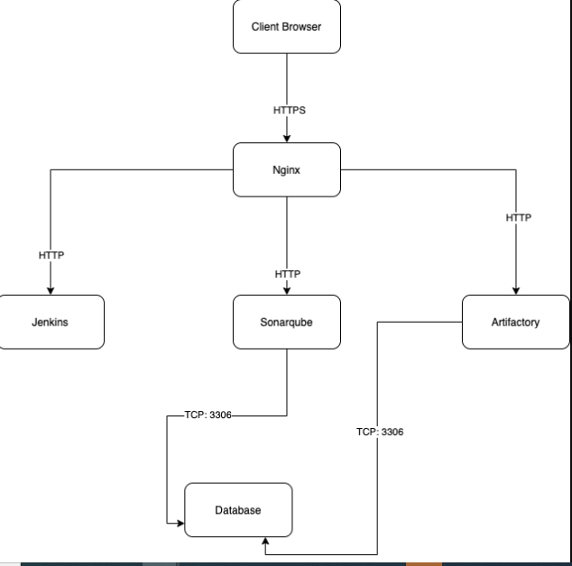
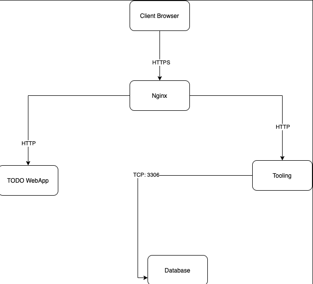

## SIMULATING A TYPICAL CI/CD PIPELINE FOR A PHP BASED APPLICATION

This document outlines the setup and implementation of a simulated CI/CD pipeline for a PHP-based application, utilizing Ansible for infrastructure automation. This project aims to provide a hands-on experience with CI/CD principles and practices, encompassing various environments from development to production.

### Project Overview

This project builds upon previous Ansible work, incorporating a new setup that simulates a complete CI/CD pipeline. The pipeline will involve multiple virtual machines representing different environments, including:

- **CI (Continuous Integration):** Handles code compilation, testing, and artifact generation.
- **Dev (Development):** Provides a development environment for developers to work on the application.
- **SIT (System Integration Testing):** A staging environment for testing application integration with other systems.
- **UAT (User Acceptance Testing):** A staging environment for user testing before production deployment.
- **Pentest (Penetration Testing):** An environment specifically designed for security testing and vulnerability assessments.
- **Preprod (Pre-Production):** A staging environment for final testing and validation before production deployment.
- **Prod (Production):** The live environment where the application is accessible to end-users.

### Environment Setup

This project utilizes cloud-based virtual machines to simulate the different environments. You can leverage AWS free tier or Google Cloud Platform (GCP) for this purpose.

- **AWS:** Utilize your existing AWS account or create a new one to take advantage of the free tier.
- **GCP:** Utilize GCP for virtual machines, utilizing the $300 credit available for new users.

**Note:** This project is not cloud-focused. The focus is on setting up virtual machines that can be accessed via SSH. Cloud-specific configurations will be addressed in later projects.

**Server Creation:**

To minimize cloud costs, create servers only as needed for the environment you are currently working on. For example, when setting up the development environment, do not create servers for integration, pentest, or production yet.

### Environment Configuration

The following table and diagrams depict the configuration of each environment:

| Environment | Nginx | SonarQube | Artifactory | Jenkins | Tooling | TODO WebApp |
| ----------- | ----- | --------- | ----------- | ------- | ------- | ----------- |
| CI          | Yes   | Yes       | Yes         | Yes     | -       | -           |
| Dev         | Yes   | -         | Yes         | -       | Yes     | Yes         |
| SIT         | Yes   | -         | Yes         | -       | -       | Yes         |
| UAT         | Yes   | -         | Yes         | -       | -       | Yes         |
| Pentest     | Yes   | -         | Yes         | -       | -       | Yes         |
| Preprod     | Yes   | -         | Yes         | -       | -       | Yes         |
| Prod        | Yes   | -         | Yes         | -       | -       | Yes         |

**Diagram:**

### Key Components

- **Nginx:** Serves as a reverse proxy for the application and tools in each environment.
- **SonarQube:** A code quality analysis tool used in the CI environment.
- **Artifactory:** A repository manager for storing and managing application artifacts.
- **Jenkins:** A continuous integration and delivery server used for automating builds, tests, and deployments.
- **Tooling:** A web application that provides tools for developers and testers.
- **TODO WebApp:** The main application being developed and deployed.

### Deployment Strategy

Instead of directly downloading code from Git, the project utilizes the Ansible `uri` module for deployments. This approach allows for better packaging and versioning of the software for different releases.

### Getting Started

1. **Set up the necessary cloud infrastructure:** Create virtual machines for the CI, Dev, and Pentest environments.
2. **Install Ansible:** Install Ansible on a separate machine or use a cloud-based Ansible service.
3. **Configure inventory:** Create an inventory file that maps the virtual machines to their respective environments.
4. **Write Ansible playbooks:** Create playbooks to automate the setup and configuration of each environment.
5. **Implement the CI/CD pipeline:** Configure Jenkins to trigger builds, tests, and deployments based on code changes.

### Conclusion

This project provides a practical simulation of a CI/CD pipeline for a PHP-based application. By utilizing Ansible for infrastructure automation, we can streamline the deployment process and achieve continuous delivery of your application. Remember to focus on the core concepts of CI/CD and utilize the provided resources to build a robust and efficient pipeline.
