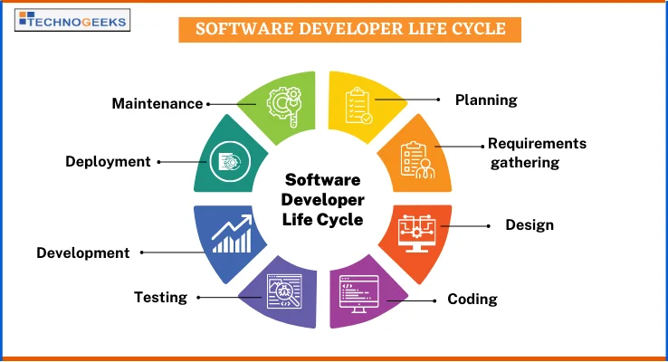
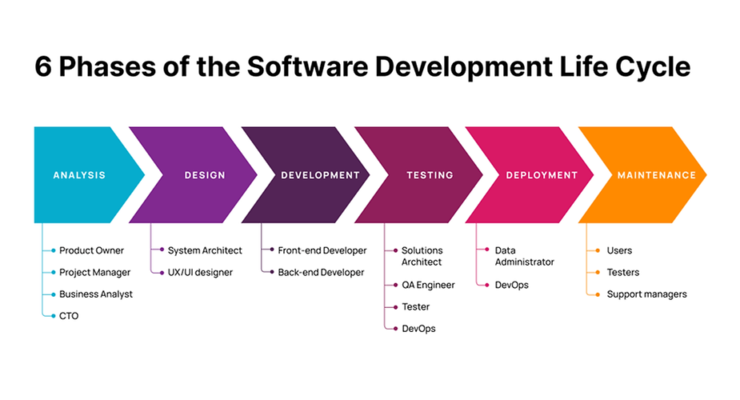

# The Comprehensive Introduction to Software Development Life Cycle (SDLC)

## Introduction

The Software Development Life Cycle (SDLC) is a systematic process used by software developers to design, develop, test, and deploy high-quality software. This guide will delve into the intricacies of SDLC, exploring its various phases, methodologies, and best practices. Whether you're a seasoned developer or a newcomer, understanding SDLC is crucial for successful software development.

## What is SDLC?

The Software Development Life Cycle is a framework that defines the steps involved in the development of software applications. It provides a structured approach to software development, ensuring that the final product meets the desired requirements and quality standards. The primary goal of SDLC is to produce high-quality software that is efficient, reliable, and cost-effective.

## Phases of SDLC

### 1. Planning

The planning phase is the foundation of the SDLC process. During this phase, project goals, scope, and feasibility are determined. Key activities include:

- **Requirement Analysis**: Gathering and analyzing user requirements.
- **Feasibility Study**: Assessing technical, operational, and economic feasibility.
- **Project Planning**: Defining project scope, timelines, and resource allocation.

### 2. System Design

In the system design phase, the software architecture is created based on the requirements gathered during the planning phase. This phase involves:

- **High-Level Design (HLD)**: Defining the overall system architecture.
- **Low-Level Design (LLD)**: Detailing the internal design of individual components.

### 3. Implementation

The implementation phase involves the actual coding of the software. Developers write code based on the design documents, following coding standards and guidelines. Key activities include:

- **Coding**: Writing and compiling code.
- **Unit Testing**: Testing individual components for functionality.

### 4. Testing

The testing phase is critical for ensuring the quality and functionality of the software. Various testing methods are employed to identify and fix defects. Key activities include:

- **Integration Testing**: Testing combined components for interaction.
- **System Testing**: Verifying the entire system's functionality.
- **User Acceptance Testing (UAT)**: Ensuring the software meets user requirements.

### 5. Deployment

During the deployment phase, the software is released to the production environment. This phase involves:

- **Deployment Planning**: Preparing for software release.
- **Installation**: Installing the software in the production environment.
- **User Training**: Training end-users on how to use the software.

### 6. Maintenance

The maintenance phase involves ongoing support and updates to the software. Key activities include:

- **Bug Fixes**: Addressing any issues that arise post-deployment.
- **Updates**: Implementing enhancements and new features.
- **Performance Monitoring**: Ensuring the software continues to perform optimally.

## SDLC Methodologies

Several methodologies can be used to implement the SDLC process. Each methodology has its own set of principles and practices. Some of the most popular SDLC methodologies include:

### Waterfall Model

The Waterfall Model is a linear and sequential approach to software development. Each phase must be completed before the next phase begins. This model is suitable for projects with well-defined requirements.

### Agile Methodology

Agile is an iterative and incremental approach to software development. It emphasizes flexibility, collaboration, and customer feedback. Agile methodologies, such as Scrum and Kanban, are widely used in modern software development.

### DevOps

DevOps is a cultural and technical approach that integrates development and operations teams to improve collaboration and efficiency. It focuses on continuous integration, continuous delivery, and automation.

### Spiral Model

The Spiral Model combines elements of both iterative and Waterfall models. It emphasizes risk analysis and iterative refinement. This model is suitable for complex and high-risk projects.

## Best Practices for SDLC

To ensure the success of your software development project, consider the following best practices:

- **Clear Requirements**: Ensure that all requirements are well-documented and understood by all stakeholders.
- **Effective Communication**: Foster open and transparent communication among team members.
- **Regular Testing**: Conduct thorough testing at each phase to identify and fix defects early.
- **Documentation**: Maintain comprehensive documentation throughout the development process.
- **Continuous Improvement**: Continuously evaluate and improve your development processes.

## Conclusion

The Software Development Life Cycle is a critical framework for developing high-quality software. By understanding and implementing the various phases and methodologies of SDLC, you can ensure the success of your software development projects. Remember to follow best practices and continuously improve your processes to stay ahead in the ever-evolving world of software development.
