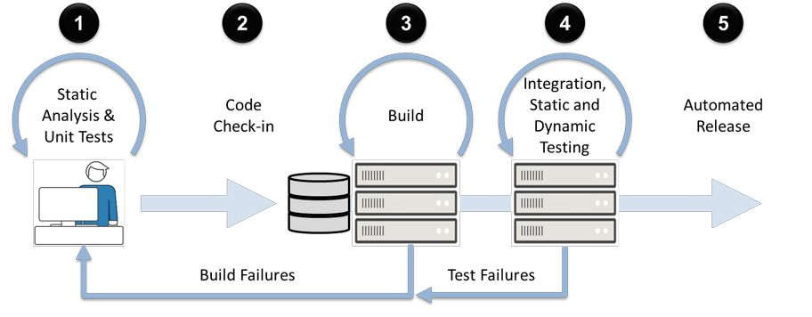
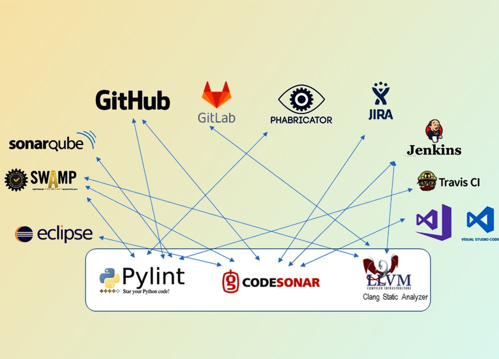

# The Definitive Guide to Static Code Analysis

## Introduction to Static Code Analysis

Static code analysis is a method of debugging that examines source code before it is run. Unlike dynamic analysis, which requires executing the code, static analysis inspects the code's structure, syntax, and semantics to identify potential issues. This article delves into the intricacies of static code analysis, its benefits, popular tools, and best practices for integrating it into your development workflow.

## What is Static Code Analysis?

Static code analysis involves analyzing source code without executing it. This analysis can be performed manually or with automated tools that scan the code for predefined patterns and potential issues. The primary goal is to identify bugs, vulnerabilities, and code quality issues early in the development process.

### Key Components of Static Code Analysis

- **Syntax Analysis**: Checking the code for syntax errors and ensuring it adheres to the language's grammar rules.
- **Semantic Analysis**: Examining the code's meaning and ensuring that it follows best practices and coding standards.
- **Code Metrics**: Measuring various aspects of the code, such as complexity, maintainability, and readability.
- **Pattern Matching**: Identifying common coding patterns and anti-patterns that may indicate potential issues.

## Benefits of Static Code Analysis

### Early Bug Detection

Static code analysis helps identify bugs and vulnerabilities early in the development process, reducing the cost and effort required to fix them later.

### Improved Code Quality

By enforcing coding standards and best practices, static code analysis ensures that the codebase remains clean, maintainable, and readable.

### Enhanced Security

Static code analysis can identify security vulnerabilities, such as SQL injection and cross-site scripting (XSS), helping to secure the application.

### Faster Development Cycles

Automated static code analysis tools provide quick feedback, allowing developers to address issues promptly and reduce the time spent on manual code reviews.

### Compliance

Static code analysis can help ensure that the codebase complies with industry standards and regulations, such as MISRA for automotive software or OWASP for web applications.

## Popular Static Code Analysis Tools

### SonarQube

[SonarQube](https://www.sonarqube.org/) is an open-source platform that provides continuous inspection of code quality. It supports multiple programming languages and integrates with various CI/CD tools.

### ESLint

[ESLint](https://eslint.org/) is a popular static code analysis tool for JavaScript. It helps identify and fix problems in the code, ensuring adherence to coding standards and best practices.

### Pylint

[Pylint](https://www.pylint.org/) is a static code analysis tool for Python. It checks for errors, enforces coding standards, and provides code metrics.

### Checkstyle

[Checkstyle](https://checkstyle.sourceforge.io/) is a static code analysis tool for Java. It helps ensure that the code adheres to coding standards and best practices.

### PMD

[PMD](https://pmd.github.io/) is a static code analysis tool that supports multiple programming languages. It identifies common programming flaws, such as unused variables and empty catch blocks.

## Best Practices for Static Code Analysis

### Integrate with CI/CD Pipelines

Integrate static code analysis tools into your CI/CD pipelines to ensure that code is automatically analyzed with each commit. This provides continuous feedback and helps maintain code quality.

### Customize Rules and Standards

Customize the rules and standards used by static code analysis tools to match your project's specific requirements. This ensures that the analysis is relevant and effective.

### Regularly Review and Update Rules

Regularly review and update the rules and standards used by static code analysis tools to keep up with evolving best practices and industry standards.

### Combine with Other Testing Methods

Static code analysis should be used in conjunction with other testing methods, such as unit testing and dynamic analysis, to provide comprehensive coverage.

### Educate Developers

Educate developers on the importance of static code analysis and how to interpret and address the issues identified by the tools. This fosters a culture of code quality and continuous improvement.

## Challenges in Static Code Analysis

### False Positives

Static code analysis tools can sometimes generate false positives, identifying issues that are not actually problems. Regularly reviewing and fine-tuning the rules can help minimize false positives.

### Performance Overhead

Running static code analysis can add overhead to the development process, especially for large codebases. Optimizing the analysis process and using incremental analysis can help mitigate this.

### Tool Limitations

No single static code analysis tool can catch all potential issues. Combining multiple tools and testing methods can provide more comprehensive coverage.

## Conclusion

Static code analysis is a powerful technique for improving code quality, enhancing security, and ensuring compliance with industry standards. By integrating static code analysis into your development workflow and following best practices, you can identify and address potential issues early, leading to more robust and maintainable software.
