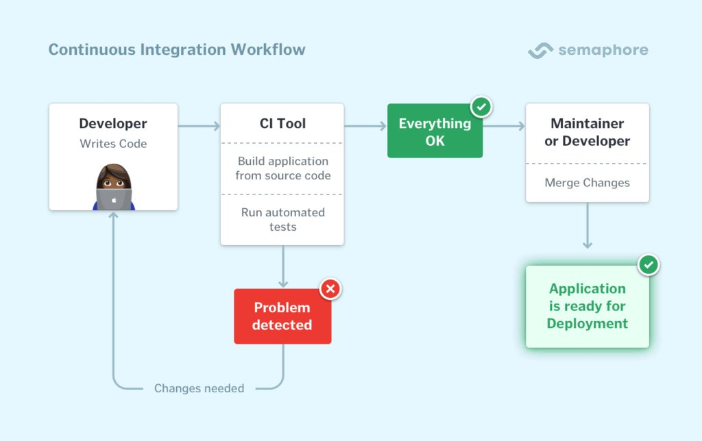
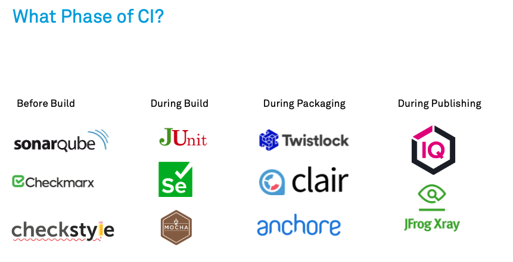

# Introduction to Continuous Integration (CI)

Continuous Integration (CI) is a software development practice where developers frequently integrate their code changes into a shared repository. Each integration is automatically verified by running a suite of tests, ensuring that the codebase remains stable and functional. This article explores the role of tests in CI, their benefits, popular CI tools, and best practices for implementing effective CI pipelines.

## What is Continuous Integration?

Continuous Integration involves the frequent merging of code changes into a shared repository, followed by automated builds and tests. The goal is to detect and address integration issues early, reducing the risk of bugs and improving the overall quality of the software.

### Key Components of CI

- **Version Control System (VCS)**: A system like Git or SVN where developers commit their code changes.
- **Build Server**: A server that automatically builds the code and runs tests whenever changes are committed.
- **Automated Tests**: A suite of tests that verify the functionality and stability of the codebase.
- **Feedback Mechanism**: Notifications or reports that inform developers of the build and test results.

## Benefits of Tests in CI

### Early Detection of Issues

Automated tests in CI help identify issues as soon as code changes are integrated, allowing developers to address them promptly.

### Improved Code Quality

Regular testing ensures that the codebase remains stable and functional, leading to higher code quality and fewer bugs.

### Faster Development Cycles

By automating the testing process, CI reduces the time spent on manual testing, allowing developers to focus on writing code.

### Enhanced Collaboration

CI fosters collaboration among team members by providing a shared repository and automated feedback on code changes.

### Reduced Integration Risk

Frequent integration and testing minimize the risk of integration issues, making it easier to merge code changes from multiple developers.

## Types of Tests in CI

### Unit Tests

Unit tests verify the functionality of individual components or units of code. They are typically fast and provide quick feedback on code changes.

### Integration Tests

Integration tests verify the interactions between different components or modules. They ensure that the integrated components work together as expected.

### Functional Tests

Functional tests verify the functionality of the software from an end-user perspective. They test the software's features and ensure that they meet the specified requirements.

### Regression Tests

Regression tests ensure that new code changes do not introduce new bugs or break existing functionality. They are essential for maintaining the stability of the codebase.

### Performance Tests

Performance tests measure the software's performance under various conditions, such as load and stress testing. They help identify performance bottlenecks and ensure that the software meets performance requirements.

## Popular CI Tools

### Jenkins

[Jenkins](https://www.jenkins.io/) is an open-source CI tool that provides a wide range of plugins for building, testing, and deploying code. It is highly customizable and supports various version control systems.

### Travis CI

[Travis CI](https://travis-ci.org/) is a cloud-based CI service that integrates seamlessly with GitHub. It supports multiple programming languages and provides a simple configuration file for defining build and test processes.

### CircleCI

[CircleCI](https://circleci.com/) is a cloud-based CI tool that offers fast and scalable builds. It supports Docker, parallelism, and various version control systems.

### GitLab CI

[GitLab CI](https://about.gitlab.com/stages-devops-lifecycle/continuous-integration/) is a built-in CI/CD tool in GitLab. It provides a seamless integration with GitLab repositories and supports various build and test configurations.

### Bamboo

[Bamboo](https://www.atlassian.com/software/bamboo) is a CI tool by Atlassian that integrates with other Atlassian products like Jira and Bitbucket. It provides powerful build and deployment capabilities.

## Best Practices for Implementing Tests in CI

### Write Comprehensive Tests

Ensure that your test suite covers all critical functionality, including edge cases and potential failure scenarios.

### Keep Tests Fast

Fast tests provide quick feedback, allowing developers to address issues promptly. Focus on writing efficient tests that run quickly.

### Use Version Control

Store your test scripts and configurations in a version control system to ensure consistency and track changes.

### Automate Test Execution

Automate the execution of tests to reduce manual effort and ensure that tests are run consistently.

### Monitor Test Results

Regularly monitor test results and address any failing tests promptly. Use notifications and reports to keep the team informed.

### Maintain Test Suites

Regularly review and update your test suites to ensure that they remain effective and relevant. Remove obsolete tests and add new ones as needed.
