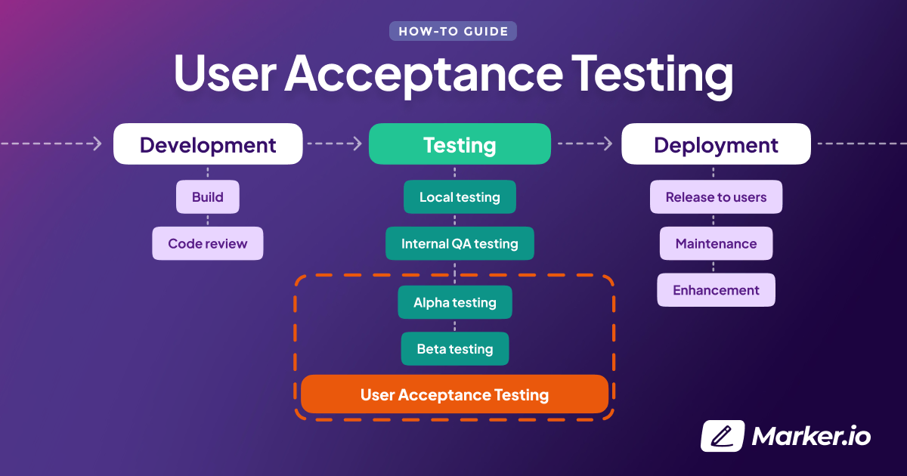

# The Ultimate Guide to User Acceptance Testing (UAT)

## Introduction to User Acceptance Testing (UAT)

User Acceptance Testing (UAT) is a critical phase in the software development lifecycle that ensures the final product meets the end-users' requirements and expectations. This article explores the nuances of UAT, its benefits, popular tools, and best practices for conducting effective user acceptance tests.

## What is User Acceptance Testing (UAT)?

User Acceptance Testing (UAT) is the final phase of the software testing process, where real users test the software in a production-like environment to validate that it meets their needs and requirements. UAT is essential for ensuring that the software is ready for deployment and that it delivers the expected value to the end-users.

### Key Components of User Acceptance Testing

1. **Test Planning**: Defining the scope, objectives, and criteria for UAT, including the test environment, test cases, and test data.
2. **Test Execution**: Conducting the tests according to the plan, involving real users to perform specific tasks and scenarios.
3. **Defect Management**: Identifying, documenting, and resolving any issues or defects discovered during UAT.
4. **Test Reporting**: Summarizing the results of UAT, including any defects found and their resolution status, and providing recommendations for deployment.

## Benefits of User Acceptance Testing

### Validating Requirements

UAT ensures that the software meets the specified requirements and delivers the expected functionality to the end-users.

### Enhancing User Satisfaction

By involving real users in the testing process, UAT helps ensure that the software meets their needs and expectations, leading to higher user satisfaction.

### Reducing Deployment Risks

UAT helps identify and address any issues before deployment, reducing the risk of defects and ensuring a smooth transition to production.

### Ensuring Business Alignment

UAT ensures that the software aligns with business objectives and delivers the intended value to the organization.

### Improving Quality

By identifying and resolving defects during UAT, the overall quality of the software is improved, leading to a more reliable and robust product.

## Popular Tools for User Acceptance Testing

### TestRail

[TestRail](https://www.gurock.com/testrail/) is a test management tool that helps organize and manage UAT test cases, track test results, and generate reports.

### JIRA

[JIRA](https://www.atlassian.com/software/jira) is a popular project management and issue tracking tool that supports UAT by managing test cases, tracking defects, and facilitating collaboration.

### Zephyr

[Zephyr](https://www.getzephyr.com/) is a comprehensive test management solution that integrates with JIRA and supports UAT planning, execution, and reporting.

### HP ALM

[HP ALM](https://www.microfocus.com/en-us/products/application-lifecycle-management/overview) (Application Lifecycle Management) is an enterprise-level test management tool that supports UAT by providing features for test planning, execution, and defect management.

### PractiTest

[PractiTest](https://www.practitest.com/) is a cloud-based test management tool that helps manage UAT test cases, track test results, and generate detailed reports.

## Best Practices for User Acceptance Testing

### Define Clear Objectives

Define clear and measurable objectives for UAT, including the scope, success criteria, and expected outcomes. This helps ensure that UAT is focused and effective.

### Involve Real Users

Involve real users who represent the target audience in the UAT process. This helps ensure that the software meets their needs and expectations.

### Create Detailed Test Cases

Create detailed test cases that cover all critical functionalities and scenarios. This helps ensure comprehensive testing and identifies any potential issues.

### Use a Production-Like Environment

Conduct UAT in a production-like environment to simulate real-world conditions and ensure that the software performs as expected.

### Document and Track Defects

Document and track any defects discovered during UAT, and ensure that they are resolved before deployment. This helps ensure a smooth transition to production.

## Challenges in User Acceptance Testing

### Resource Constraints

UAT can be resource-intensive, requiring time, effort, and participation from real users. Planning and scheduling UAT effectively can help manage resource constraints.

### Changing Requirements

Requirements can change during the development process, making it challenging to ensure that the software meets the latest requirements. Regular communication and collaboration with stakeholders can help manage changing requirements.

### User Availability

Ensuring the availability of real users for UAT can be challenging. Scheduling UAT sessions in advance and providing clear instructions can help ensure user participation.

### Balancing Speed and Quality

Balancing the need for speed with the need for quality can be challenging. Implementing agile methodologies and continuous integration can help achieve this balance.
