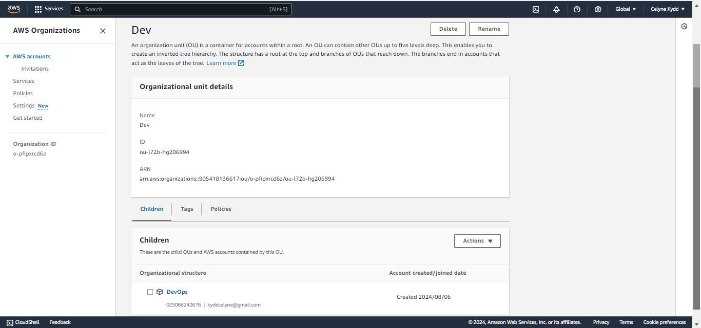
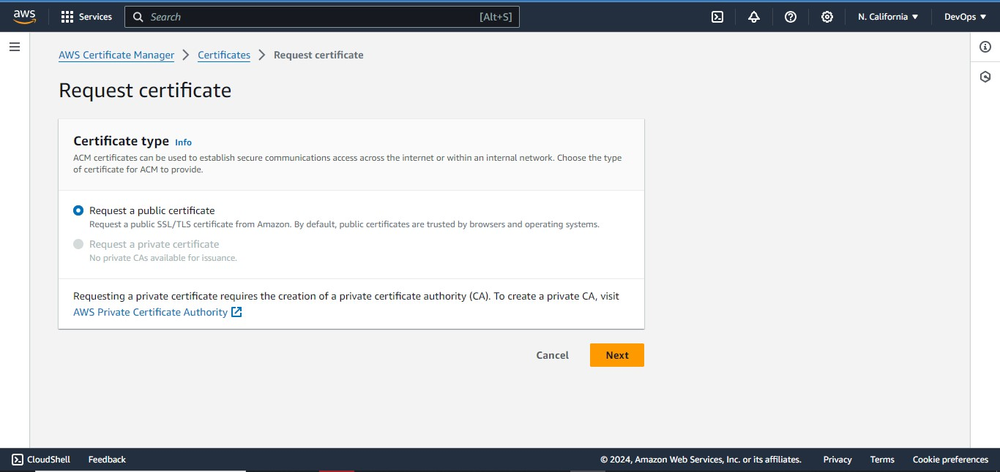

# AWS CLOUD SOLUTION FOR 2 COMPANY WEBSITES USING A REVERSE PROXY TECHNOLOGY

## INTRODUCTION

This project demostrates how a secure infrastructure inside AWS VPC (Virtual Private Cloud) network is built for a particular company, who uses [WordPress CMS](https://wordpress.com/) for its main business website, and a [Tooling Website](https://github.com/mimi-netizen/tooling.git) for their DevOps team. As part of the company’s desire for improved security and performance, a decision has been made to use a [reverse proxy technology from NGINX](https://docs.nginx.com/nginx/admin-guide/web-server/reverse-proxy/) to achieve this. The infrastructure will look like following diagram:

# Starting Off Your AWS Cloud Project

## Set Up a Sub-account And Create A Hosted Zone

There are few requirements that must be met before you begin:

1. Properly configure your AWS account and Organization Unit [Watch How To Do This Here](https://www.youtube.com/watch?v=9PQYCc_20-Q)

   - Create an `AWS Master account`. (Also known as Root Account)

     Go to AWS console, and navigate to Services > All Services > Management & Governance > AWS Organizations

     If you haven't already created an organization, click "Create an organization" and select "Enable All Features".

   

   - Within the Root account, create a sub-account and name it `DevOps`. (You will need another email address to complete this)

     Navigate to Add an AWS accout > Fill in the required details:

     - Account name: DevOps

     - Email address: Provide a new email address (different from the root account). 1.6. Click "Create". AWS will send a verification email to the provided email address.

     - Verify the email address by following the instructions in the email sent by AWS.

   

   

   - Within the Root account, create an `AWS Organization Unit (OU)`. Name it `Dev`. (We will launch Dev resources in there)

     From the AWS Organization page, Click on root > Action > Create new

   

   - Move the `DevOps` account into the `Dev OU`.

     Select the account to move, then Click Action > Move, then select the OU to move the account to and click move AWS account.

   

   

   - Login to the newly created AWS account using the new email address.

     - Go to the AWS Management Console login page.
     - Enter the email address used for the DevOps account and click Next.
     - Click on "Forgot your password?" if you don't have the initial password.
     - Follow the instructions to reset the password and Log in with the new password

   

2. Create a free domain name for your fictitious company at Freenom domain registrar here. We use [cloudns](https://www.cloudns.net) instead.

3. Create a hosted zone in AWS, and map it to your free domain from Freenom. Watch how to do that here

   - In the search bar, type Route 53 and select Route 53 from the results. > In the Route 53 dashboard, click on Hosted zones in the left-hand navigation pane > Click Create hosted zone Fill in the following details:

     - Domain name: Enter your Freenom domain name (e.g., example.tk).
     - Comment: Optional.
     - Type: Select Public hosted zone.
     - VPC: Leave this blank for a public hosted zone.
     - Click Create hosted zone

- Let's map the hosted zone to our free domain

Copy the name server (NS) values from AWS, then go to your free domain, edit the default `NS` values and update them with the values from AWS.

The next step is to get a certificate from `AWS Certificate Manager`. The reason we are creating a certificate first is because when creating `ALB` we need to select a certificate.

- Click on request a Cert > Request public cert > Next

In the domain name, we are going to use a wild card i.e (\*.). should in case we want to have another `name` or `subdomain`, the `WILDCARD` will make sure that any name before the domain name is attached to the `certificate`. e.g kydd.cdk-aws.dns-dynamic.net

NOTE: Because we are using DNS verification is going to automatically write to the Rout53 to confirm

**_NOTE : As you proceed with configuration, ensure that all resources are appropriately tagged, for example:_**

Project: Give your project a name `Project-15`

Environment: `dev`

Automated:`No` (If you create a recource using an automation tool, it would be Yes)

## Set Up a Virtual Private Network (VPC)

Always make reference to the architectural diagram and ensure that your configuration is aligned with it.

### 1. Create a [VPC](https://docs.aws.amazon.com/vpc/latest/userguide/what-is-amazon-vpc.html).

### Enable DNS hostnames.

Actions > Edit VPC Settings > Enable DNS hostnames

### 2. Create subnets as shown in the architecture

Create public and private subnets in each availablity zones respectively. Thus, we create public subnet in availability zone A and B respectively. We create 4 private subnets with respect to the diagram we are working with as such we create 2 private subnets each in availability zone A and B.

Enable Auto-assign public IPv4 address in the public subnets.
Actions > Edit subnet settings > Enable auto-assign public IPv4

All Subnets

### 3. Create a route table and associate it with public subnets

Create a public route table for the public subnets

Associate it with public subnets.
Click on the route table > Subnet Association > Edit Subnet Association.

The public route table and it's associated public subnets

### 4. Create a route table and associate it with private subnets

Create a private route table for the private subnets

Associate it with private subnets

The route tables

### 5. Create an [Internet Gateway](https://docs.aws.amazon.com/vpc/latest/userguide/VPC_Internet_Gateway.html)

Attach it to the created VPC.

### 6. Edit a route in public route table, and associate it with the Internet Gateway. (This is what allows a public subnet to be accisble from the Internet)

In the public route table, Click route tab > Edit route > Add route
since we are routing traffic to the internet, the destination will be `0.0.0.0/0`

### 7. Create 3 [Elastic IPs](https://docs.aws.amazon.com/AWSEC2/latest/UserGuide/elastic-ip-addresses-eip.html)

### 8. Create a [Nat Gateway](https://docs.aws.amazon.com/vpc/latest/userguide/vpc-nat-gateway.html) and assign one of the Elastic IPs (\*The other 2 will be used by [Bastion hosts](https://aws.amazon.com/solutions/implementations/linux-bastion/))

- Edit a route in private route table, and associate it with the Nat Gateway.

  

### 9. Create a [Security Group](https://docs.aws.amazon.com/vpc/latest/userguide/vpc-security-groups.html#CreatingSecurityGroups) for:

- **External [Application Load Balancer](https://aws.amazon.com/elasticloadbalancing/application-load-balancer/):** External `ALB` will be available from the Internet

- **Bastion Servers:** Access to the Bastion servers should be allowed only from workstations that need to SSH into the bastion servers. Hence, you can use your workstation public IP address. To get this information, simply go to your terminal and type `curl www.canhazip.com`

- **Nginx Servers:** Access to Nginx should only be allowed from an external Application Load balancer (ALB).

- **Internal Application Load Balancer:** This is `not` an internet facing `ALB` rather used to distribute internal traffic comming from Nginx (reverse proxy) to our Webservers Auto Scalling Groups in our private subnets. It also helps us to prevent single point of failure.

- **Webservers:** Access to Webservers should only be allowed from the internal ALB.

- **Data Layer:** Access to the Data layer, which is comprised of [Amazon Relational Database Service (`RDS`)](https://aws.amazon.com/rds/) and [Amazon Elastic File System (EFS)](https://aws.amazon.com/efs/) must be carefully desinged - only webservers should be able to connect to `RDS`, while Nginx and Webservers will have access to `EFS Mountpoint`.

All Security Groups

## TLS Certificates From Amazon Certificate Manager (ACM)

We will need TLS certificates to handle secured connectivity to our Application Load Balancers (ALB).

1. Navigate to AWS ACM
2. Request a public wildcard certificate for the domain name we registered in Cloudns
3. Use DNS to validate the domain name
4. Tag the resource

- Ensure to create record on Route 53 after creating the certificate. This will generate a CNAME record type in Route 53. We will attach this certificate to all the load balancers.

  - Click, Create records in Route 53 > Create records

    

    

    Copy the CNAME name and the CNAME value generated then
    Go to Cloudns, Click on CNAME > Add new record. Paste the CNAME name and value to validate the record for AWS to issue the certificate (The Certificate status remain pending unitl the record is validated by the Domain provider.)

    

    

    After validating the record, AWS will issue the Certificate and the status changes to issued.

    

[def]: ./image/org.jpg
