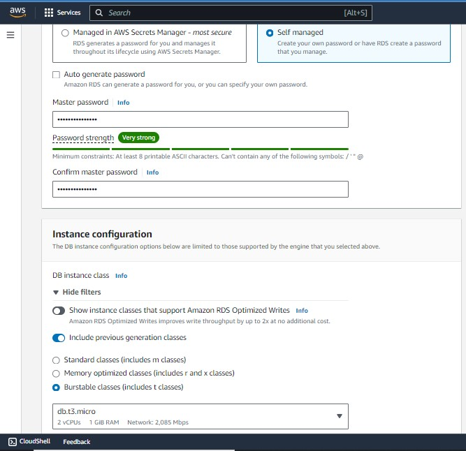
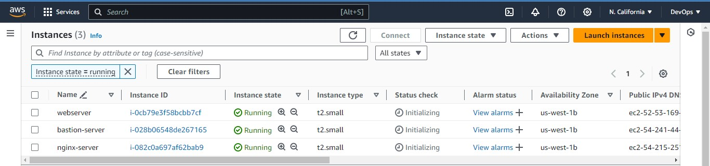
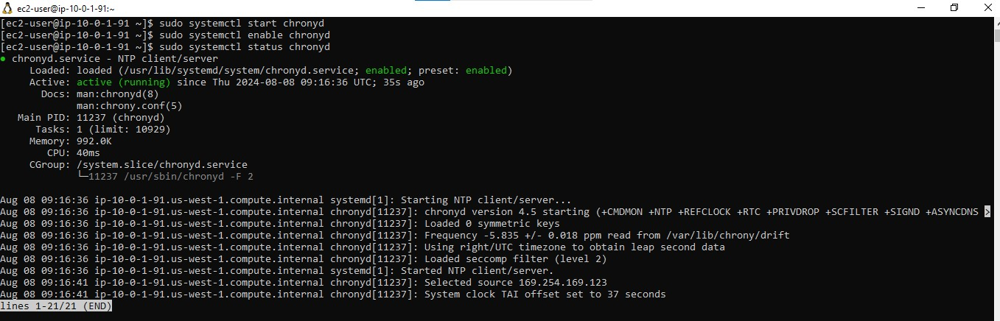
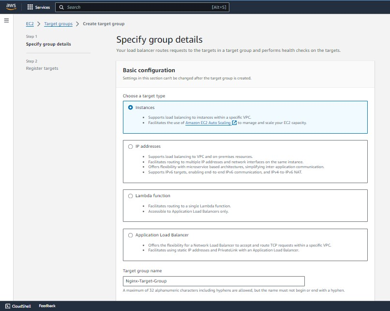

# Setup EFS

[Amazon Elastic File System (Amazon EFS)](https://docs.aws.amazon.com/AWSEC2/latest/UserGuide/AmazonEFS.html) provides a simple, scalable, fully managed elastic [Network File System (NFS)](https://en.wikipedia.org/wiki/Network_File_System) for use with AWS Cloud services and on-premises resources. In this project, we will utilize EFS service and mount filesystems on both Nginx and Webservers to store data.

1. Create an EFS filesystem

2. Create an EFS mount target per AZ in the VPC, associate it with both subnets dedicated for data layer.
   **NB:** Any subnet we specify our mount target, the Amazon EFS becomes available in that subnet. As such, we will specify it in private webserver subnets so that all the resources in that subnet will have the ability to mount to the file system.

3. Associate the Security groups created earlier for data layer.


4. Create an EFS access point.

This will specify where the webservers will mount with, thus creating 2 mount points for Tooling and Wordpress servers each.

Access point for wordpress server


Access point for tooling server


EFS access points


# Setup RDS

### Pre-requisite:

Create a `KMS` key from Key Management Service (KMS) to be used to encrypt the database instance.


Amazon Relational Database Service (Amazon RDS) is a managed distributed relational database service by Amazon Web Services. This web service running in the cloud designed to simplify setup, operations, maintenance & scaling of relational databases. Without RDS, Database Administrators (DBA) have more work to do, due to RDS, some DBAs have become jobless.
To ensure that your databases are highly available and also have failover support in case one availability zone fails, we will configure a [multi-AZ](https://docs.aws.amazon.com/AmazonRDS/latest/UserGuide/Concepts.MultiAZ.html) set up of [RDS MySQL database](https://docs.aws.amazon.com/AmazonRDS/latest/UserGuide/CHAP_MySQL.html) instance. In our case, since we are only using 2 AZs, we can only failover to one, but the same concept applies to 3 Availability Zones. We will not consider possible failure of the whole Region, but for this AWS also has a solution - this is a more advanced concept that will be discussed in following projects.

To configure `RDS`, follow steps below:

1. Create a `subnet group` and add 2 private subnets (data Layer)


2. Create an RDS Instance for `mysql 8.*.*`


3. To satisfy our architectural diagram, you will need to select either `Dev/Test` or `Production` Sample Template. But to minimize AWS cost, you can select the `Do not create a standby instance` option under `Availability & durability` sample template (The production template will enable Multi-AZ deployment)


4. Configure other settings accordingly (For test purposes, most of the default settings are good to go). In the real world, you will need to size the database appropriately. You will need to get some information about the usage. If it is a highly transactional database that grows at 10GB weekly, you must bear that in mind while configuring the initial storage allocation, storage autoscaling, and maximum storage threshold.



5. Configure VPC and security (ensure the database is not available from the Internet)


6. Configure backups and retention
7. Encrypt the database using the KMS key created earlier
8. Enable [CloudWatch](https://docs.aws.amazon.com/AmazonRDS/latest/UserGuide/monitoring-cloudwatch.html) monitoring and export Error and Slow Query logs (for production, also include Audit)


# Proceed With Compute Resources

We will need to set up and configure compute resources inside our VPC. The recources related to compute are:

- [EC2 Instances](https://www.amazonaws.cn/en/ec2/instance-types/)
- [Launch Templates](https://docs.aws.amazon.com/autoscaling/ec2/userguide/launch-templates.html)
- [Target Groups](https://docs.aws.amazon.com/elasticloadbalancing/latest/application/load-balancer-target-groups.html)
- [Autoscaling Groups](https://docs.aws.amazon.com/autoscaling/ec2/userguide/auto-scaling-groups.html)
- [TLS Certificates](https://en.wikipedia.org/wiki/Transport_Layer_Security)
- [Application Load Balancers (ALB)](https://docs.aws.amazon.com/elasticloadbalancing/latest/application/introduction.html)

## Set Up Compute Resources for Nginx, Bastion and Webservers

NB:
To create the `Autoscaling Groups`, we need `Launch Templates` and `Load Balancers`.
The Launch Templates requires `AMI` and `Userdata` while the Load balancer requires `Target Group`

### Provision EC2 Instances for Nginx, Bastion and Webservers

1. Create EC2 Instances based on CentOS [Amazon Machine Image (AMI)](https://docs.aws.amazon.com/AWSEC2/latest/UserGuide/AMIs.html) per each [Availability Zone in the same Region](https://docs.aws.amazon.com/AWSEC2/latest/UserGuide/using-regions-availability-zones.html). Use EC2 instance of [T2 family](https://aws.amazon.com/ec2/instance-types/t2/) (e.g. t2.micro or similar) with security group (All traffic - anywhere).



2. Ensure that it has the following software installed:

- python
- ntp
- net-tools
- vim
- wget
- telnet
- epel-release
- htop

### For Nginx, Bastion and Webserver.

**For Nginx**

```bash
sudo yum install -y https://dl.fedoraproject.org/pub/epel/epel-release-latest-9.noarch.rpm
```


```bash
sudo yum install -y dnf-utils http://rpms.remirepo.net/enterprise/remi-release-9.rpm
```


```bash
sudo yum install wget vim python3 telnet htop net-tools ntp -y
```


The error occured because the ntp package is not available in the repositories for our Enterprise Linux 9 system. Instead of ntp, chrony can be used, which is the default NTP implementation in newer versions of RHEL and its derivatives, including Enterprise Linux 9.

```bash
sudo yum install wget vim python3 telnet htop git mysql net-tools chrony -y
```


```bash
sudo systemctl start chronyd
sudo systemctl enable chronyd
sudo systemctl status chronyd
```


**NB**: **Repeat the above steps for Bastion and Webservers**

bastion


webserver


### Nginx and Webserver (Set SELinux policies so that our servers can function properly on all the redhat instance).

**For Nginx**

```bash
sudo setsebool -P httpd_can_network_connect=1
sudo setsebool -P httpd_can_network_connect_db=1
sudo setsebool -P httpd_execmem=1
sudo setsebool -P httpd_use_nfs 1
```


**Repeat the step above for Webservers**


### Install Amazon EFS utils for mounting the targets on the Elastic file system (Nginx and Webserver).

**For Nginx**

```bash
git clone https://github.com/aws/efs-utils

cd efs-utils
```


```bash
sudo yum install -y make
```


```bash
sudo yum install -y rpm-build
```


```bash
# openssl-devel is needed by amazon-efs-utils-2.0.4-1.el9.x86_64
sudo yum install openssl-devel -y
```


```bash
# Cargo command needs to be installed as it is necessary for building the Rust project included in the source.
sudo yum install cargo -y
```


```bash
sudo make rpm
```


```bash
sudo yum install -y  ./build/amazon-efs-utils*rpm
```


**Repeat the steps above for Webservers**

We are using an ACM (Amazon Certificate Manager) certificate for both our external and internal load balancers.
But for some reasons, we might want to add a self-signed certificate:

- **Compliance Requirements:**

  - Certain industry regulations and standards (e.g., PCI DSS, HIPAA) require end-to-end encryption, including between internal load balancers and backend servers (within a private network).

- **Defense in Depth:**
  - Adding another layer of security by encrypting traffic between internal load balancers and web servers can provide additional protection.

When generating the certificate, In the common name, enter the private IPv4 dns of the instance (for Webserver and Nginx). We use the certificate by specifying the path to the file fnc.crt and fnc.key in the nginx configuration.

## Set up self-signed certificate for the nginx instance

```bash
sudo mkdir /etc/ssl/private

sudo chmod 700 /etc/ssl/private

sudo openssl req -x509 -nodes -days 365 -newkey rsa:2048 -keyout /etc/ssl/private/cdk.key -out /etc/ssl/certs/cdk.crt
```

```bash
sudo openssl dhparam -out /etc/ssl/certs/dhparam.pem 2048
```


## Set up self-signed certificate for the Apache Webserver instance

```bash
sudo yum install -y mod_ssl
```


```bash
sudo openssl req -newkey rsa:2048 -nodes -keyout /etc/pki/tls/private/cdk.key -x509 -days 365 -out /etc/pki/tls/certs/cdk.crt
```


```bash
# Edit the ssl.conf to conform with the key and crt file created.
sudo vim /etc/httpd/conf.d/ssl.conf
```


## [Create an AMI](https://docs.aws.amazon.com/toolkit-for-visual-studio/latest/user-guide/tkv-create-ami-from-instance.html) out of the EC2 instances

On the EC2 instance page, Go to Actions > Image and templates > Create image

**For Bastion AMI**


**For Nginx AMI**


**For Webservers AMI**


**All AMIs**


## CONFIGURE TARGET GROUPS

Create Target groups for Nginx, Worpress and Tooling

- Select Instances as the target type
- Ensure the protocol HTTPS on secure TLS port 443
- Ensure that the health check path is /healthstatus
- Register Nginx Instances as targets
- Ensure that health check passes for the target group

**For Nginx Target Group**




**For Wordpress Target Group**


**For Tooling Target Group**


**All Target Groups**


