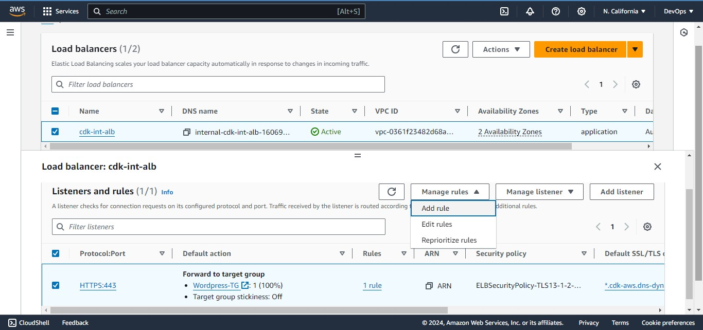
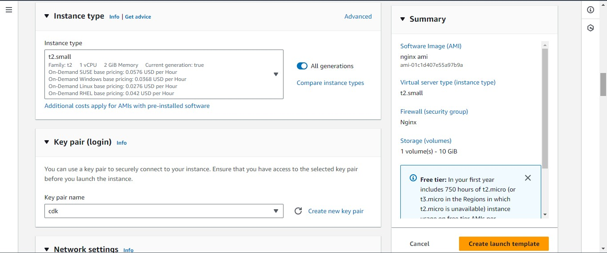

# Configure Application Load Balancer (ALB)

### External Application Load Balancer To Route Traffic To NGINX

Nginx EC2 Instances will have configurations that accepts incoming traffic only from Load Balancers. No request should go directly to Nginx servers. With this kind of setup, we will benefit from intelligent routing of requests from the ALB to Nginx servers across the 2 Availability Zones. We will also be able to [offload](https://avinetworks.com/glossary/ssl-offload/) SSL/TLS certificates on the ALB instead of Nginx. Therefore, Nginx will be able to perform faster since it will not require extra compute resources to validate certificates for every request.

1. Create an Internet facing ALB
2. Ensure that it listens on HTTPS protocol (TCP port 443)
3. Ensure the ALB is created within the appropriate VPC | AZ | Subnets
4. Choose the Certificate from ACM
5. Select Security Group
6. Select Nginx Instances as the target group


### Application Load Balancer To Route Traffic To Webservers

Since the webservers are configured for auto-scaling, there is going to be a problem if servers get dynamically scalled out or in. Nginx will not know about the new IP addresses, or the ones that get removed. Hence, Nginx will not know where to direct the traffic.

To solve this problem, we must use a load balancer. But this time, it will be an internal load balancer. Not Internet facing since the webservers are within a private subnet, and we do not want direct access to them.

1. Create an Internal ALB
2. Ensure that it listens on HTTPS protocol (TCP port 443)
3. Ensure the ALB is created within the appropriate VPC | AZ | Subnets
4. Choose the Certificate from ACM
5. Select Security Group
6. Select webserver Instances as the target group
7. Ensure that health check passes for the target group

**NOTE:** This process must be repeated for both WordPress and Tooling websites.


The default target configured on the listener while creating the internal load balancer is to forward traffic to wordpress on port 443. Hence, we need to create a rule to route traffic to tooling as well.

1. Select internal load balancer from the list of load balancers created:
   - Choose the load balancer where you want to add the rule.
2. Listeners Tab:
   - Click on the Listeners tab.
   - Select the listener (HTTPS:443) and click Manage listener.
3. Add Rules:
   - Click on Add rule.
4. Configure the Rule:
   - Give the rule a name and click next.
   - Add a condition by selecting `Host header`.
   - Enter the `hostnames` for which you want to route traffic. (tooling.com and www.tooling.com).
   - Choose the appropriate target group for the `hostname`.




## PREPARE LAUNCH TEMPLATE FOR NGINX (ONE PER SUBNET)

1. Make use of the AMI to set up a launch template
2. Ensure the Instances are launched into a public subnet.
3. Assign appropriate security group.
4. Configure [Userdata](https://docs.aws.amazon.com/AWSEC2/latest/UserGuide/user-data.html) to update yum package repository and install nginx.
   Ensure to `enable auto-assign public IP` in the Advance Network Configuration





**NB:Don't forget to update the reverse.conf file by updating proxy_pass value to the end point of the internal load balancer (DNS name) before using the userdata so as to clone the updated repository.**

**Repeat the same setting for Bastion, the difference here is the userdata input, AMI and security group**.


### Wordpress Userdata

NB: Both Wordpress and Tooling make use of Webserver AMI.

Update the mount point to the file system, this should be done on access points for tooling and wordpress respectively.

      Go to EFS > access points and select wordpress, click on attach, and there you can seen the command to attach the access points mount points

`sudo mount -t efs -o tls,accesspoint=fsap-0d7f6bbe26976b344 fs-09f8367a7f9f0857c:/ /var/www/`


The RDS end point is also needed

         Go to RDS > Databases > select the database you created earlier


Paste the rds end-point in the wordpress userdata and tooling userdata

```bash
#!/bin/bash

exec > /var/log/wordpress.log 2>&1

mkdir -p /var/www/
sudo mount -t efs -o tls,accesspoint=fsap-0d7f6bbe26976b344 fs-09f8367a7f9f0857c:/ /var/www/

# Install and start Apache

sudo yum install -y httpd
sudo systemctl start httpd
sudo systemctl enable httpd

# Install PHP and necessary extensions

sudo yum module reset php -y
sudo yum module enable php:remi-7.4 -y
sudo yum install -y php php-common php-mbstring php-opcache php-intl php-xml php-gd php-curl php-mysqlnd php-fpm php-json
sudo systemctl start php-fpm
sudo systemctl enable php-fpm

wget http://wordpress.org/latest.tar.gz
tar xzvf latest.tar.gz
rm -rf latest.tar.gz
cp wordpress/wp-config-sample.php wordpress/wp-config.php

mkdir -p /var/www/html/
cp -R /wordpress/\* /var/www/html/

cd /var/www/html/
touch healthstatus

sed -i "s/localhost/cdk-rds.cly8ayoym3bc.us-west-1.rds.amazonaws.com/g" wp-config.php
sed -i "s/username_here/celyne/g" wp-config.php
sed -i "s/password_here/devopspbl/g" wp-config.php
sed -i "s/database_name_here/wordpressdb/g" wp-config.php

chcon -t httpd_sys_rw_content_t /var/www/html/ -R

# Restart Apache

systemctl restart httpd

```


### Tooling userdata

```bash
#!/bin/bash

exec > /var/log/tooling.log 2>&1

# Create directory and mount EFS

mkdir -p /var/www/
sudo mount -t efs -o tls,accesspoint=fsap-09c86085067becad5 fs-09f8367a7f9f0857c:/ efs /var/www/

# Install and start Apache

sudo yum install -y httpd
sudo systemctl start httpd
sudo systemctl enable httpd

# Install PHP and necessary extensions

sudo yum module reset php -y
sudo yum module enable php:remi-7.4 -y
sudo yum install -y php php-common php-mbstring php-opcache php-intl php-xml php-gd php-curl php-mysqlnd php-fpm php-json
sudo systemctl start php-fpm
sudo systemctl enable php-fpm

# Clone the tooling repository

git clone https://github.com/mimi-netizen/tooling.git
mkdir -p /var/www/html/
cp -R tooling/html/\* /var/www/html/

# Setup MySQL database

cd /tooling
mysql -h cdk-rds.cly8ayoym3bc.us-west-1.rds.amazonaws.com -u celyne -p toolingdb < tooling-db.sql

cd /var/www/html/
touch healthstatus

sed -i "s/$db = mysqli_connect('mysql.tooling.svc.cluster.local', 'admin', 'admin', 'tooling');/$db = mysqli_connect('cdk-rds.cly8ayoym3bc.us-west-1.rds.amazonaws.com', 'celyne', 'devopspbl', 'toolingdb');/g" functions.php

chcon -t httpd_sys_rw_content_t /var/www/html/ -R

# Disable Apache welcome page and restart Apache

sudo mv /etc/httpd/conf.d/welcome.conf /etc/httpd/conf.d/welcome.conf_backup
sudo systemctl restart httpd
```


**All launch templates created**.


## CONFIGURE AUTOSCALING FOR NGINX

1. Select the right launch template
2. Select the VPC
3. Select both public subnets
4. Enable Application Load Balancer for the AutoScalingGroup (ASG)
5. Select the target group you created before
6. Ensure that you have health checks for both EC2 and ALB
7. The desired capacity is 2
8. Minimum capacity is 2
9. Maximum capacity is 4
10. Set [scale out](https://docs.aws.amazon.com/autoscaling/ec2/userguide/ec2-auto-scaling-lifecycle.html) if CPU utilization reaches 90%
11. Ensure there is an [SNS](https://docs.aws.amazon.com/sns/latest/dg/welcome.html) topic to send scaling notifications

### Create Auto Scaling Group for Bation


**Access RDS through Bastion connection to craete database for wordpress and tooling.**

Copy the RDS endpoint to be used as host


### Create Auto Scaling Group for Nginx


### Repeat the Nginx Auto Scaling Group steps above for Wordpress and Tooling with their right launch template

All Auto Scaling Groups


# Configuring DNS with Route53

Earlier in this project we registered a free domain with `Cloudns` and configured a hosted zone in [Route53](https://docs.aws.amazon.com/Route53/latest/DeveloperGuide/Welcome.html). But that is not all that needs to be done as far as `DNS` configuration is concerned.

We need to ensure that the main domain for the WordPress website can be reached, and the subdomain for Tooling website can also be reached using a browser.

Create other records such as [CNAME, alias and A records](https://docs.aws.amazon.com/Route53/latest/DeveloperGuide/route-53-concepts.html).

NOTE: You can use either CNAME or alias records to achieve the same thing. But alias record has better functionality because it is a faster to resolve DNS record, and can coexist with other records on that name. Read [here](https://support.dnsimple.com/articles/differences-between-a-cname-alias-url/#:~:text=The%20A%20record%20maps%20a,a%20name%20to%20another%20name.&text=The%20ALIAS%20record%20maps%20a,the%20HTTP%20301%20status%20code) to get to know more about the differences.

- Create an alias record for the root domain and direct its traffic to the ALB DNS name.
- Create an alias record for `tooling.fncloud.dns-dynamic.net` and direct its traffic to the ALB DNS name.


### Ensure that health check passes for the target groups

**Nginx Target Group Health Check**


**Wordpress Target Group Health Check**


**Tooling Target Group Health Check**


All instances


**Access the tooling webserver using Bastion to Confirm the userdata configuration for database connection in functions.php file**.


**Now let us access our tooling website via a browser using our DNS name**


**Let's access our wordpress website**


We have just created a secured, scalable and cost-effective infrastructure to host 2 enterprise websites using various Cloud services from AWS. At this point, our infrastructure is ready to host real websites' load.
