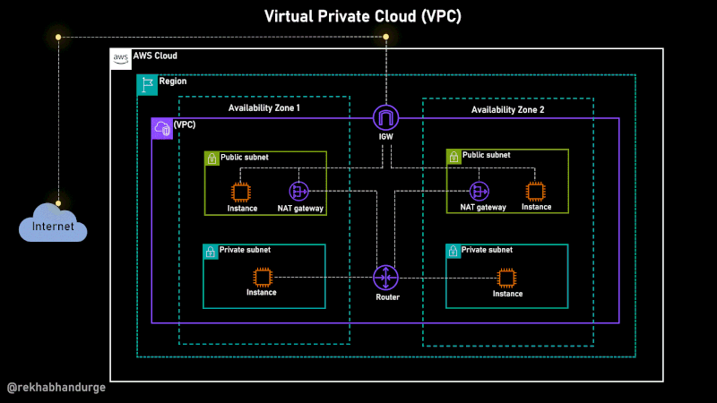
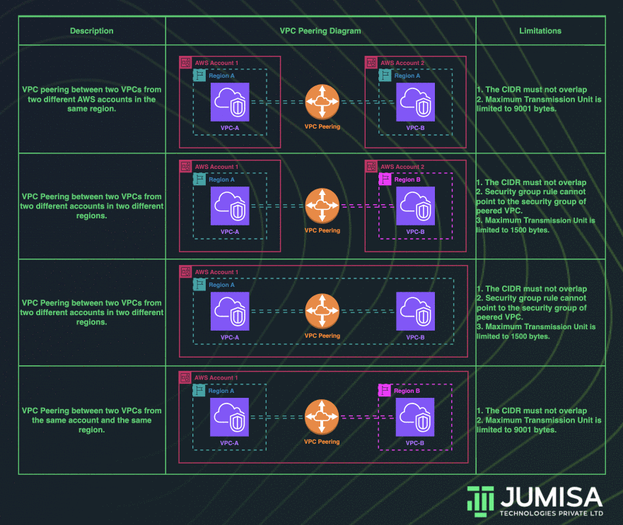
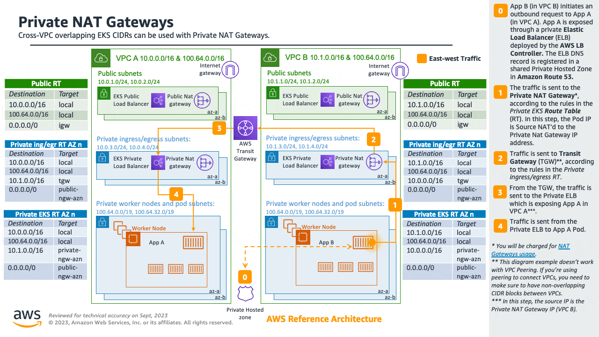
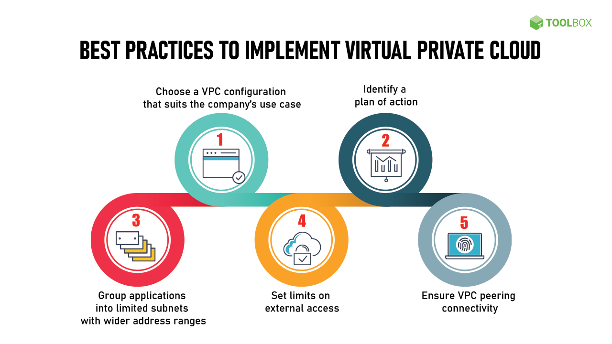

# AWS VPC (Virtual Private Cloud)

## Introduction to AWS VPC

Amazon Web Services (AWS) offers a robust and scalable cloud computing platform, and one of its core components is the [Virtual Private Cloud (VPC)](https://aws.amazon.com/vpc/). A VPC allows users to create a logically isolated section of the AWS cloud where they can launch AWS resources in a virtual network that they define. This article delves into the intricacies of AWS VPC, its features, benefits, and best practices for optimizing your cloud infrastructure.

## What is AWS VPC?

An [AWS VPC](https://aws.amazon.com/vpc/) is a virtual network dedicated to your AWS account. It is logically isolated from other virtual networks in the AWS cloud, providing you with complete control over your virtual networking environment, including selection of your own IP address range, creation of subnets, and configuration of route tables and network gateways.

### Key Features of AWS VPC

AWS VPC offers a plethora of features that make it a versatile and powerful tool for managing your cloud infrastructure:

- **Isolation**: Each VPC is logically isolated from other VPCs, ensuring a high level of security.
- **Subnets**: You can create multiple subnets within a VPC, allowing for segmentation of your network.
- **Route Tables**: Customizable route tables enable you to control the traffic flow within your VPC.
- **Internet Gateways**: These gateways allow communication between your VPC and the internet.
- **Security Groups and Network ACLs**: These provide granular control over inbound and outbound traffic to your instances.

## Benefits of Using AWS VPC

### Enhanced Security

One of the primary benefits of using an AWS VPC is the enhanced security it offers. By isolating your resources in a private network, you can implement stringent security measures to protect your data and applications. Security groups and network ACLs provide additional layers of security by controlling traffic at the instance and subnet levels.

### Customizable Network Configuration

AWS VPC allows you to customize your network configuration to meet your specific needs. You can define your own IP address range, create subnets, and configure route tables and gateways. This flexibility enables you to design a network that aligns with your business requirements.

### Scalability and Flexibility

With AWS VPC, you can easily scale your network infrastructure as your business grows. You can add or remove subnets, modify route tables, and adjust security settings on the fly. This scalability ensures that your network can adapt to changing demands without compromising performance or security.

### Cost-Effective

AWS VPC is a cost-effective solution for managing your cloud infrastructure. By leveraging the pay-as-you-go pricing model, you can optimize your costs based on your actual usage. Additionally, the ability to create multiple subnets within a single VPC allows for efficient resource allocation and management.

## Setting Up an AWS VPC

### Step-by-Step Guide

1. **Create a VPC**: Log in to the [AWS Management Console](https://aws.amazon.com/console/), navigate to the VPC dashboard, and click on "Create VPC." Specify the IP address range and other settings as required.

2. **Create Subnets**: Within your VPC, create subnets to segment your network. You can specify the availability zone and IP address range for each subnet.

3. **Configure Route Tables**: Set up route tables to control the traffic flow within your VPC. You can create custom routes to direct traffic to specific subnets or gateways.

4. **Set Up Internet Gateway**: If you need your VPC to communicate with the internet, create and attach an internet gateway to your VPC.

5. **Configure Security Groups and Network ACLs**: Define security groups and network ACLs to control inbound and outbound traffic to your instances.

## Communication across VPCs¶

There are many scenarios when you require multiple VPCs and separate EKS clusters deployed to these VPCs.

You can use [Amazon VPC Lattice](https://aws.amazon.com/vpc/lattice/) to consistently and securely connect services across multiple VPCs and accounts (without requiring additional connectivity to be provided by services like VPC peering, AWS PrivateLink or AWS Transit Gateway). Learn more [here](https://aws.amazon.com/blogs/networking-and-content-delivery/build-secure-multi-account-multi-vpc-connectivity-for-your-applications-with-amazon-vpc-lattice/).

Amazon VPC Lattice operates in the link-local address space in IPv4 and IPv6, providing connectivity between services that may have overlapping IPv4 addresses. For operational efficiency, we strongly recommend deploying EKS clusters and nodes to IP ranges that do not overlap. In case your infrastructure includes VPCs with overlapping IP ranges, you need to architect your network accordingly. We suggest [Private NAT Gateway](https://docs.aws.amazon.com/vpc/latest/userguide/vpc-nat-gateway.html#nat-gateway-basics), or VPC CNI in [custom networking](https://aws.github.io/aws-eks-best-practices/networking/custom-networking/) mode in conjunction with [transit gateway](https://docs.aws.amazon.com/whitepapers/latest/aws-vpc-connectivity-options/aws-transit-gateway.html) to integrate workloads on EKS to solve overlapping CIDR challenges while preserving routable RFC1918 IP addresses.

Consider utilizing [AWS PrivateLink](https://docs.aws.amazon.com/vpc/latest/privatelink/privatelink-share-your-services.html), also known as an endpoint service, if you are the service provider and would want to share your Kubernetes service and ingress (either ALB or NLB) with your customer VPC in separate accounts.

## Best Practices for AWS VPC

### Implementing Security Best Practices

- **Use Security Groups and Network ACLs**: Implement security groups and network ACLs to control traffic at the instance and subnet levels.
- **Enable Flow Logs**: Use VPC Flow Logs to capture information about the IP traffic going to and from network interfaces in your VPC.
- **Use Private Subnets**: Place sensitive resources in private subnets to restrict direct access from the internet.

### Optimizing Network Performance

- **Use Multiple Availability Zones**: Distribute your resources across multiple availability zones to ensure high availability and fault tolerance.
- **Implement Elastic Load Balancing**: Use [Elastic Load Balancing](https://aws.amazon.com/elasticloadbalancing/) to distribute incoming traffic across multiple instances for improved performance and reliability.
- **Monitor and Analyze Traffic**: Use AWS CloudWatch and VPC Flow Logs to monitor and analyze network traffic for performance optimization.

### Cost Management

- **Optimize Resource Allocation**: Use multiple subnets and route tables to efficiently allocate resources within your VPC.
- **Leverage Reserved Instances**: Consider using [Reserved Instances](https://aws.amazon.com/ec2/pricing/reserved-instances/) for predictable workloads to reduce costs.
- **Monitor Usage**: Regularly monitor your VPC usage and optimize your configuration to minimize costs.

## Common Use Cases for AWS VPC

### Hosting Web Applications

AWS VPC is ideal for hosting web applications that require a high level of security and scalability. By isolating your application in a private network, you can implement stringent security measures and scale your infrastructure as needed.

### Running Big Data Analytics

For organizations running big data analytics, AWS VPC provides a secure and scalable environment for processing large datasets. You can leverage AWS services like [Amazon EMR](https://aws.amazon.com/emr/) and [Amazon Redshift](https://aws.amazon.com/redshift/) within your VPC to analyze data efficiently.

### Hybrid Cloud Architectures

AWS VPC supports hybrid cloud architectures, allowing you to extend your on-premises network to the AWS cloud. By using [AWS Direct Connect](https://aws.amazon.com/directconnect/) or [VPN](https://aws.amazon.com/vpn/) connections, you can create a seamless and secure integration between your on-premises and cloud environments.

## FAQ

### What is the difference between a public and private subnet in AWS VPC?

A public subnet is a subnet that has a route to an internet gateway, allowing instances within the subnet to communicate with the internet. A private subnet, on the other hand, does not have a route to an internet gateway, restricting direct internet access to instances within the subnet.

### How do I secure my AWS VPC?

To secure your AWS VPC, implement security groups and network ACLs to control traffic at the instance and subnet levels. Use VPC Flow Logs to monitor traffic and place sensitive resources in private subnets. Additionally, enable encryption for data at rest and in transit.

### Can I connect my on-premises network to an AWS VPC?

Yes, you can connect your on-premises network to an AWS VPC using AWS Direct Connect or VPN connections. This allows you to create a hybrid cloud architecture and securely extend your on-premises network to the AWS cloud.

### What is VPC Peering?

VPC Peering is a networking connection between two VPCs that enables you to route traffic between them using private IP addresses. This allows you to create a secure and scalable network architecture by connecting multiple VPCs within the same or different AWS accounts.

### How do I monitor traffic in my AWS VPC?

You can monitor traffic in your AWS VPC using VPC Flow Logs, which capture information about the IP traffic going to and from network interfaces in your VPC. Additionally, you can use AWS CloudWatch to monitor and analyze network traffic for performance optimization.

## Conclusion

AWS VPC is a powerful and flexible tool for managing your cloud infrastructure. By providing a secure and scalable environment, it enables you to design a network that meets your specific business requirements. By following best practices and leveraging the features of AWS VPC, you can optimize your cloud infrastructure for performance, security, and cost-effectiveness.

For more information on AWS VPC, visit the [AWS VPC documentation](https://docs.aws.amazon.com/vpc/latest/userguide/what-is-amazon-vpc.html).
