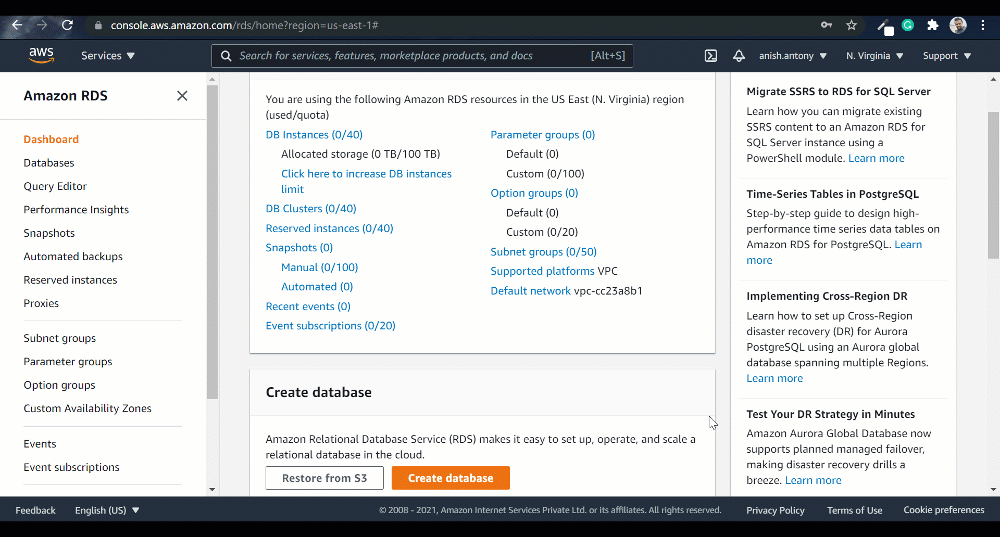

# Amazon Relational Database Service (RDS)

## Introduction to Amazon RDS

In the rapidly evolving landscape of cloud computing, Amazon Web Services (AWS) offers a comprehensive suite of services designed to provide scalable, secure, and efficient solutions for businesses. One such critical component is the Amazon Relational Database Service (RDS), a managed relational database service that simplifies the process of setting up, operating, and scaling a relational database in the cloud. This article will delve into the concept of Amazon RDS, its features, benefits, applications, and best practices for implementation.

## What is Amazon RDS?

Amazon Relational Database Service (RDS) is a managed service that makes it easy to set up, operate, and scale a relational database in the cloud. It provides cost-efficient and resizable capacity while automating time-consuming administrative tasks such as hardware provisioning, database setup, patching, and backups. Amazon RDS supports several database engines, including Amazon Aurora, PostgreSQL, MySQL, MariaDB, Oracle, and Microsoft SQL Server.

### Key Features of Amazon RDS

Amazon RDS offers several features that make it indispensable for managing relational databases in the cloud:

- **Automated Backups**: RDS provides automated backups and the ability to perform point-in-time recovery.
- **High Availability**: RDS supports Multi-AZ deployments for enhanced availability and durability.
- **Scalability**: RDS allows for easy scaling of compute and storage resources.
- **Security**: RDS integrates with AWS Identity and Access Management (IAM), Virtual Private Cloud (VPC), and encryption features to provide robust security.
- **Monitoring and Metrics**: RDS integrates with Amazon CloudWatch to provide monitoring and metrics for your database instances.

## Benefits of Using Amazon RDS

### Simplified Database Management

Amazon RDS automates many of the time-consuming administrative tasks associated with managing a relational database, such as hardware provisioning, database setup, patching, and backups. This allows you to focus on your application and business logic rather than database management.

### High Availability and Durability

Amazon RDS supports Multi-AZ deployments, which provide enhanced availability and durability by automatically replicating data to a standby instance in a different Availability Zone. This ensures that your database remains operational even in the event of an infrastructure failure.

### Scalability

Amazon RDS allows you to easily scale your database's compute and storage resources to meet the demands of your application. This scalability is crucial for applications that experience fluctuating workloads.

### Enhanced Security

Amazon RDS integrates with AWS Identity and Access Management (IAM), Virtual Private Cloud (VPC), and encryption features to provide robust security for your database. This ensures that your data is protected from unauthorized access and potential threats.

### Cost-Effective

Using Amazon RDS is cost-effective as it eliminates the need for additional hardware or infrastructure to manage your database. You only pay for the resources you use, and you can take advantage of various pricing models, such as on-demand and reserved instances, to optimize costs.

## Applications of Amazon RDS

### Web Applications

Amazon RDS is commonly used to manage the relational databases that power web applications. By providing automated backups, high availability, and scalability, RDS ensures that your web application can handle increased traffic and remain operational.

### Enterprise Applications

For enterprise applications that require robust database management, Amazon RDS provides the necessary features and capabilities to support complex workloads and high availability requirements.

### Data Warehousing

Amazon RDS can be used to manage data warehousing workloads, providing the scalability and performance needed to process large volumes of data and generate insights.

### E-Commerce Platforms

E-commerce platforms often require highly available and scalable databases to manage transactions and customer data. Amazon RDS provides the necessary features to support these requirements.

### Mobile and Gaming Applications

Mobile and gaming applications require databases that can handle real-time data processing and high transaction volumes. Amazon RDS provides the scalability and performance needed to support these applications.

## Best Practices for Implementing Amazon RDS

### Use Multi-AZ Deployments

Implement Multi-AZ deployments to enhance the availability and durability of your database. This ensures that your database remains operational even in the event of an infrastructure failure.

### Enable Automated Backups

Enable automated backups to ensure that your data is regularly backed up and can be restored in the event of data loss or corruption.

### Monitor Performance

Use Amazon CloudWatch to monitor the performance of your RDS instances. This helps identify any performance bottlenecks and allows you to take corrective actions.

### Implement Security Best Practices

Implement security best practices, such as using IAM roles, VPC security groups, and encryption, to protect your database from unauthorized access and potential threats.

### Regularly Review and Optimize Costs

Regularly review your RDS usage and costs to identify opportunities for optimization. Consider using reserved instances for predictable workloads to reduce costs.

## FAQ

### What is the purpose of Amazon RDS?

Amazon RDS is a managed service that makes it easy to set up, operate, and scale a relational database in the cloud. It automates time-consuming administrative tasks such as hardware provisioning, database setup, patching, and backups, allowing you to focus on your application and business logic.

### How do I create an Amazon RDS instance?

To create an Amazon RDS instance, navigate to the RDS console, select "Create database," choose the desired database engine, configure the necessary settings, and follow the prompts to complete the setup.

### Can I use Amazon RDS with my existing database?

Yes, you can migrate your existing database to Amazon RDS using AWS Database Migration Service (DMS). DMS supports a wide range of database engines and provides a seamless migration process.

### How does Amazon RDS provide high availability?

Amazon RDS supports Multi-AZ deployments, which provide enhanced availability and durability by automatically replicating data to a standby instance in a different Availability Zone. This ensures that your database remains operational even in the event of an infrastructure failure.

### What are the costs associated with using Amazon RDS?

The costs associated with using Amazon RDS include the compute and storage resources used by your database instances, as well as any additional features such as automated backups and Multi-AZ deployments. For detailed pricing information, visit the [AWS RDS pricing page](https://aws.amazon.com/rds/pricing/).

## Conclusion

Amazon Relational Database Service (RDS) is a vital component in the architecture of modern applications, providing scalable, secure, and efficient database management in the cloud. By understanding its features, benefits, and applications, you can effectively implement and manage Amazon RDS in your AWS environment. Whether you're managing databases for web applications, enterprise applications, or data warehousing, Amazon RDS offers the scalability, availability, and security needed to support your cloud infrastructure.

For more information on Amazon RDS, visit the [AWS RDS documentation](https://docs.aws.amazon.com/AmazonRDS/latest/UserGuide/Welcome.html).
