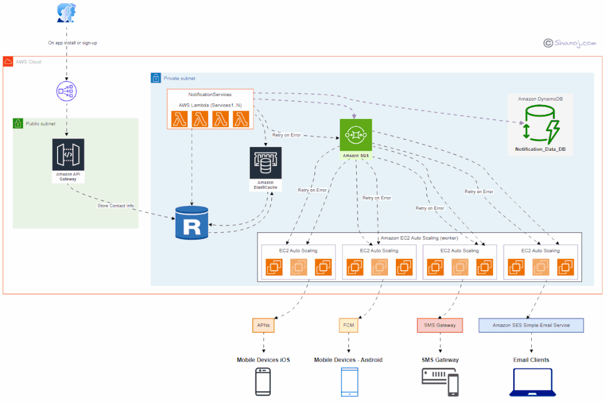

# Amazon Simple Notification Service (SNS) Topic

## Introduction to Amazon SNS

In the ever-evolving realm of cloud computing, Amazon Web Services (AWS) offers a diverse array of services designed to provide scalable, secure, and efficient solutions for businesses. One such critical component is the Amazon Simple Notification Service (SNS), a fully managed messaging service that enables you to decouple and scale microservices, distributed systems, and serverless applications. This article will delve into the concept of Amazon SNS, its features, benefits, applications, and best practices for implementation.

## What is Amazon SNS?

Amazon Simple Notification Service (SNS) is a fully managed messaging service that enables you to send messages to a large number of subscribers or endpoints. SNS topics are the core entities within the service, allowing you to group multiple endpoints (such as email addresses, phone numbers, or AWS Lambda functions) and send messages to all subscribers of the topic simultaneously.

### Key Features of Amazon SNS

Amazon SNS offers several features that make it indispensable for managing messaging and notifications in the cloud:

- **Topic-Based Messaging**: SNS uses topics to group multiple endpoints and send messages to all subscribers of the topic.
- **Multiple Protocols**: SNS supports multiple protocols, including HTTP/S, email, SMS, SQS, and Lambda.
- **Message Filtering**: SNS allows you to filter messages based on attributes, ensuring that subscribers receive only relevant messages.
- **Fanout**: SNS can fan out messages to multiple endpoints, enabling scalable and decoupled architectures.
- **Security**: SNS integrates with AWS Identity and Access Management (IAM) to provide fine-grained access control.

## Benefits of Using Amazon SNS

### Scalability

Amazon SNS is designed to handle high-throughput, push-based messaging, making it ideal for applications that require scalable and reliable message delivery. SNS can fan out messages to a large number of subscribers, ensuring that your messages reach all intended recipients.

### Decoupling

By using SNS topics, you can decouple the components of your application, allowing them to communicate asynchronously. This decoupling enhances the flexibility and maintainability of your architecture.

### Multiple Protocols

Amazon SNS supports multiple protocols, enabling you to send messages to a variety of endpoints, including HTTP/S, email, SMS, SQS, and Lambda. This flexibility allows you to integrate SNS with different types of applications and services.

### Message Filtering

SNS allows you to filter messages based on attributes, ensuring that subscribers receive only relevant messages. This reduces the overhead of processing unnecessary messages and improves the efficiency of your application.

### Enhanced Security

Amazon SNS integrates with AWS Identity and Access Management (IAM) to provide fine-grained access control. This ensures that only authorized users and applications can publish or subscribe to topics, enhancing the security of your messaging system.

## Applications of Amazon SNS

### Event-Driven Architectures

Amazon SNS is commonly used in event-driven architectures to decouple components and enable asynchronous communication. By using SNS topics, you can ensure that events are propagated to all interested subscribers.

### Mobile Push Notifications

SNS can be used to send push notifications to mobile devices, enabling real-time communication with users. SNS supports integration with popular mobile push notification services, such as Apple Push Notification Service (APNS) and Firebase Cloud Messaging (FCM).

### Monitoring and Alerts

For monitoring and alerting systems, SNS can be used to send notifications to administrators or monitoring tools. By integrating SNS with CloudWatch, you can create automated alerts based on predefined metrics and thresholds.

### Workflow Automation

SNS can be used to automate workflows by triggering actions based on specific events. By integrating SNS with AWS Lambda, you can create serverless functions that respond to messages and perform automated tasks.

### Data Processing Pipelines

In data processing pipelines, SNS can be used to fan out messages to multiple endpoints, enabling parallel processing of data. By integrating SNS with SQS and Lambda, you can create scalable and efficient data processing workflows.

## Best Practices for Implementing Amazon SNS

### Use Message Filtering

Implement message filtering to ensure that subscribers receive only relevant messages. This reduces the overhead of processing unnecessary messages and improves the efficiency of your application.

### Secure Your Topics

Use IAM policies to control access to your SNS topics. Ensure that only authorized users and applications can publish or subscribe to topics, enhancing the security of your messaging system.

### Monitor and Log Activity

Use CloudWatch to monitor the activity of your SNS topics and log important events. This helps you identify and troubleshoot issues, ensuring the reliability of your messaging system.

### Optimize Message Delivery

Optimize message delivery by choosing the appropriate protocol for your endpoints. For example, use HTTP/S for web applications, email for notifications, and SMS for urgent alerts.

### Implement Retry Logic

Implement retry logic to handle message delivery failures. By configuring SNS to retry failed deliveries, you can ensure that messages are eventually delivered to all intended recipients.

## FAQ

### What is the purpose of Amazon SNS?

Amazon Simple Notification Service (SNS) is a fully managed messaging service that enables you to send messages to a large number of subscribers or endpoints. SNS topics allow you to group multiple endpoints and send messages to all subscribers simultaneously.

### How do I create an SNS topic?

To create an SNS topic, navigate to the SNS console, select "Create topic," choose the desired topic type (standard or FIFO), configure the necessary settings, and follow the prompts to complete the setup.

### Can I filter messages in Amazon SNS?

Yes, Amazon SNS allows you to filter messages based on attributes. By configuring message filtering policies, you can ensure that subscribers receive only relevant messages.

### How does Amazon SNS ensure message delivery?

Amazon SNS ensures message delivery by supporting multiple protocols (HTTP/S, email, SMS, SQS, Lambda) and implementing retry logic for failed deliveries. This ensures that messages are eventually delivered to all intended recipients.

### What are the costs associated with using Amazon SNS?

The costs associated with using Amazon SNS include the number of messages published, delivered, and the data transfer costs. For detailed pricing information, visit the [AWS SNS pricing page](https://aws.amazon.com/sns/pricing/).

## Conclusion

Amazon Simple Notification Service (SNS) is a vital component in the architecture of modern applications, providing scalable, secure, and efficient messaging and notification solutions. By understanding its features, benefits, and applications, you can effectively implement and manage Amazon SNS in your AWS environment. Whether you're building event-driven architectures, sending mobile push notifications, or automating workflows, Amazon SNS offers the flexibility and reliability needed to support your cloud infrastructure.

For more information on Amazon SNS, visit the [AWS SNS documentation](https://docs.aws.amazon.com/sns/latest/dg/welcome.html).
