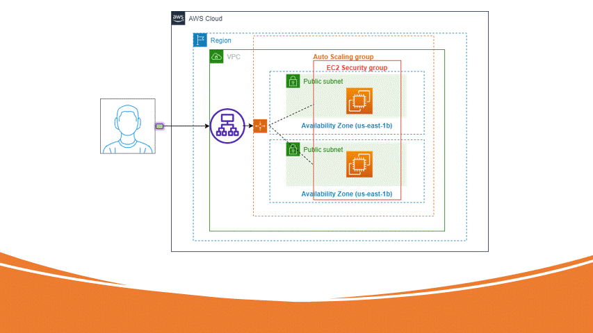

# Auto Scaling Group (ASG)

## Introduction to Auto Scaling Group (ASG)

In the rapidly evolving landscape of cloud computing, Amazon Web Services (AWS) provides a myriad of services designed to offer scalable, secure, and efficient solutions for businesses. One critical component that ensures applications can handle varying levels of traffic and demand is the Auto Scaling Group (ASG). This article will delve into the concept of Auto Scaling Groups, their features, benefits, applications, and best practices for implementation.

## What is an Auto Scaling Group (ASG)?

An Auto Scaling Group (ASG) is a collection of Amazon EC2 instances that are managed as a unit for the purposes of automatic scaling and management. ASGs enable you to automatically adjust the number of instances in your application based on demand, ensuring that you have the right amount of resources available at all times.

### Key Features of Auto Scaling Group

Auto Scaling Groups offer several features that make them indispensable for managing scalable applications in the cloud:

- **Automatic Scaling**: ASGs automatically adjust the number of instances based on predefined policies and metrics.
- **Health Checks**: ASGs perform health checks on instances and replace unhealthy instances to maintain application availability.
- **Load Balancing**: ASGs integrate with Elastic Load Balancing (ELB) to distribute traffic across instances.
- **Scheduled Scaling**: ASGs support scheduled scaling actions to handle predictable changes in demand.
- **Lifecycle Hooks**: ASGs provide lifecycle hooks to perform custom actions during instance launch or termination.

## Benefits of Using Auto Scaling Group

### Scalability

Auto Scaling Groups enable your application to scale automatically based on demand. This ensures that your application can handle varying levels of traffic without manual intervention, providing a seamless user experience.

### Cost Efficiency

By automatically adjusting the number of instances based on demand, ASGs help optimize resource utilization and reduce costs. You only pay for the resources you need, avoiding over-provisioning and under-utilization.

### High Availability

ASGs perform health checks on instances and replace unhealthy instances to maintain application availability. This ensures that your application remains highly available and resilient to failures.

### Load Balancing

ASGs integrate with Elastic Load Balancing (ELB) to distribute traffic across instances. This ensures that your application can handle increased traffic and provides a consistent user experience.

### Flexibility

ASGs support both dynamic and scheduled scaling actions, allowing you to handle unpredictable and predictable changes in demand. This flexibility ensures that your application can adapt to varying workloads.

## Applications of Auto Scaling Group

### Web Applications

Auto Scaling Groups are commonly used to manage web applications in the cloud. By automatically adjusting the number of instances based on traffic, ASGs ensure that web applications can handle varying levels of demand.

### Microservices

In microservices architectures, ASGs enable individual services to scale independently based on their specific demand. This ensures that each service can handle its workload efficiently and provides a scalable and resilient architecture.

### Batch Processing

For batch processing workloads, ASGs can automatically scale the number of instances based on the size of the batch. This ensures that batch jobs are processed efficiently and within the required time frame.

### Data Processing

In data processing pipelines, ASGs enable scalable and efficient processing of large volumes of data. By automatically adjusting the number of instances based on data volume, ASGs ensure that data processing workloads are handled effectively.

### Disaster Recovery

ASGs can be used to create disaster recovery solutions by automatically scaling instances in a secondary region in the event of a failure. This ensures business continuity and minimizes downtime.

## Best Practices for Implementing Auto Scaling Group

### Define Scaling Policies

Define scaling policies based on key metrics such as CPU utilization, memory usage, or request count. This ensures that your ASG scales based on relevant metrics and provides optimal performance.

### Use Health Checks

Configure health checks to monitor the health of instances in your ASG. This ensures that unhealthy instances are replaced automatically, maintaining application availability.

### Integrate with Load Balancers

Integrate your ASG with Elastic Load Balancing (ELB) to distribute traffic across instances. This ensures that your application can handle increased traffic and provides a consistent user experience.

### Implement Lifecycle Hooks

Use lifecycle hooks to perform custom actions during instance launch or termination. This allows you to automate tasks such as configuration management, logging, or notifications.

### Monitor and Optimize

Use CloudWatch to monitor the performance of your ASG and optimize scaling policies based on real-time metrics. This ensures that your ASG provides optimal performance and cost efficiency.

## FAQ

### What is the purpose of an Auto Scaling Group (ASG)?

An Auto Scaling Group (ASG) is a collection of Amazon EC2 instances that are managed as a unit for the purposes of automatic scaling and management. ASGs enable you to automatically adjust the number of instances in your application based on demand, ensuring that you have the right amount of resources available at all times.

### How do I create an Auto Scaling Group?

To create an ASG, navigate to the EC2 console, select "Auto Scaling Groups," and follow the prompts to configure the desired settings, including launch configuration, scaling policies, and health checks.

### Can I use multiple scaling policies in an Auto Scaling Group?

Yes, you can define multiple scaling policies for an ASG based on different metrics and conditions. This allows you to create complex scaling strategies that adapt to varying workloads.

### How does Auto Scaling Group ensure high availability?

ASGs ensure high availability by performing health checks on instances and replacing unhealthy instances automatically. This ensures that your application remains highly available and resilient to failures.

### What are the costs associated with using Auto Scaling Groups?

There are no direct costs associated with creating and using ASGs. However, you will incur costs for the EC2 instances launched by the ASG and any associated resources such as load balancers or storage. For detailed pricing information, visit the [AWS EC2 pricing page](https://aws.amazon.com/ec2/pricing/).

## Conclusion

Auto Scaling Groups (ASGs) are a vital component in the architecture of modern applications, providing scalable, secure, and efficient solutions for managing varying levels of demand. By understanding their features, benefits, and applications, you can effectively implement and manage ASGs in your AWS environment. Whether you're managing web applications, microservices, or data processing pipelines, ASGs offer the flexibility and reliability needed to support your cloud infrastructure.

For more information on Auto Scaling Groups, visit the [AWS Auto Scaling documentation](https://docs.aws.amazon.com/autoscaling/ec2/userguide/what-is-amazon-ec2-auto-scaling.html).
