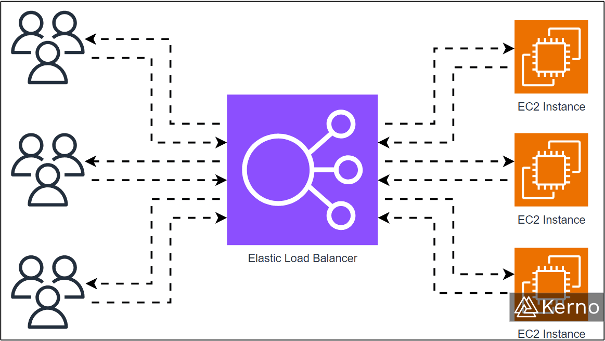
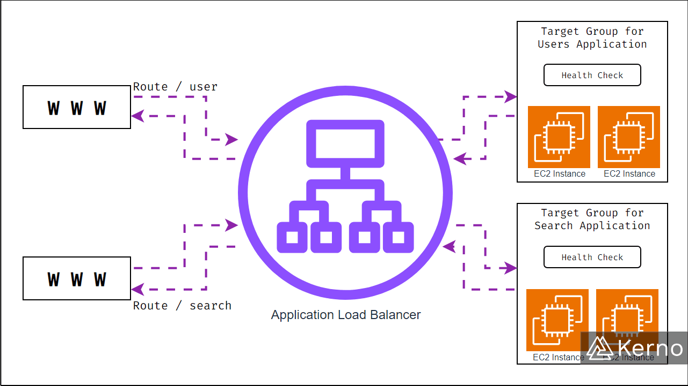
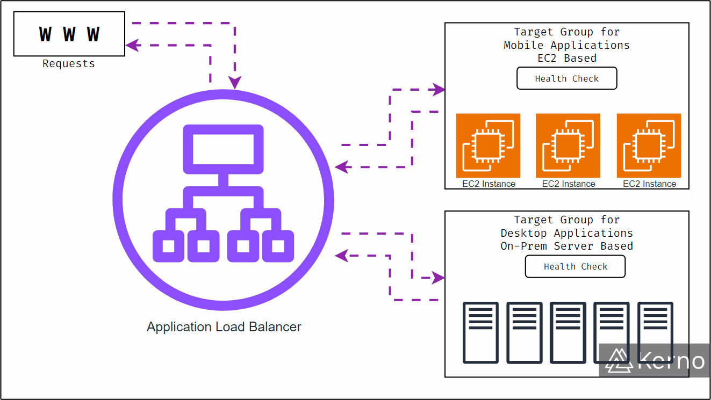
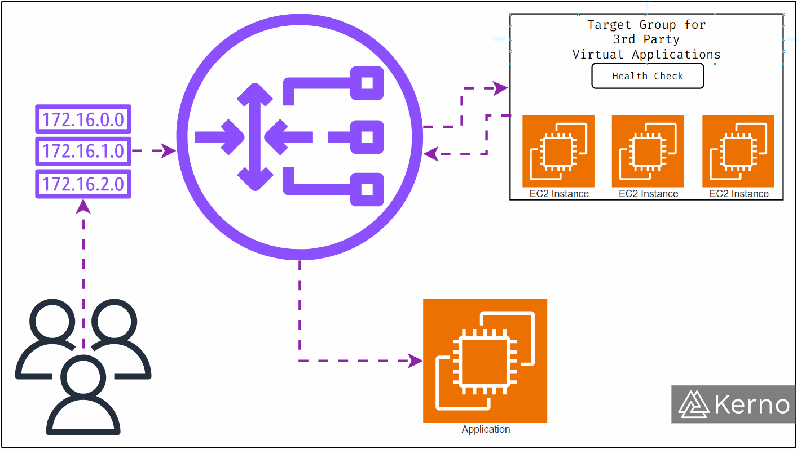

# What is ELB?

ELBs, or Elastic Load Balancers, are servers/applications that **forward incoming traffic to multiple servers (Ex: EC2 Instances) in a standardized fashion**. In the ideal state, the balancer will distribute the traffic equally. However, it is programmatically configured to detect issues within the infrastructure and prioritize accordingly. In other words, an ELB is a smart infrastructure that will balance traffic in real time based on the current state of the infrastructure.



## ELB Key Takeaways

- ELBs distribute traffic evenly among servers and adapt to infrastructure changes.

- ELBs monitor instance health and reroute traffic from unhealthy instances.

- AWS offers four types of load balancers: Classic Load Balancer (CLB), Application Load Balancer (ALB), Network Load Balancer (NLB), and Gateway Load Balancer (GWLB), each designed for specific use cases and protocols.

## Understanding ELB Health Checks

One of the key features of Elastic Load Balancers in AWS is Health Checks. The idea is that the infrastructure / instances / services toward which ELBs are sending traffic may be unavailable for a variety of reasons. The ELB will detect issues with those instances and re-direct the flow of traffic accordingly.

An instance is deemed as “unhealthy” by the load balancer if it receives any HTTP response other than `200` (OK).

## Understanding Different Types of Load Balancers

Not all load balancers are made equal. It’s possible to balance traffic at the instance level, at the infrastructure level, at the gateway level, and at the application level. Here are the four types of load balancers available through AWS:

```bash
01
Classic Load Balancer
CLB v1
Released in 2009
Protocols | HTTP, HTTPS, TCP, SSL
Deprecated, but still available on AWS
```

```bash
02
Application Load Balancer
ALB v2
Released in 2016
Protocols | HTTP, HTTPS, WebSocket
```

```bash
03
Network Load Balancer
NLB v2
Released in 2017
Protocols | TCP, TSL, UDP
```

```bash
04
Gateway Load Balancer
GWLB
Released in 2020
Network Layer
Protocols | IP
```

## Application Load Balancer (v2)

The OSI Model specifies 7 layers - Application layer, Presentation layer, Session layer, Transport layer, Network layer, Data link layer, Physical layer. As the name implies, the Application Load Balancer is going to live on the 7th layer - Application. It is used to balance HTTP / HTTPS traffic between machines or within a single machine / containers.

The application load balancer can route traffic between different URL paths, hostname / subdomain, and query string / headers. Let’s look at a few examples:

### ELB URL Routing

You’ll often notice that URL paths are different for every page. Although a lot of smaller websites will host all of those pages on a single server, larger infrastructures will route users between different compute instances that will run different portions of the website. This practice will be unnoticeable to the user.

- **Ex1**: www.newswebsite.com/article1 ⇔ www.newswebsite.com/article2
- **Ex2**: mywebsite.com/news ⇔ mywebsite.com/tutorials

### ELB Hostname / Subdomain Routing

Subdomains allow for a logical separation between two domains on the same URL. They are a critical component of modern web infrastructure. Users can be routed between multiple services that run on different subdomains via certain actions (Ex: login).

- **Ex1**: learn.kerno.io ⇔ development.kerno.io

- **Ex2**: learn.solisplc.com ⇔ community.solisplc.com

### ELB Query String / Headers Routing

Queries are used to pass certain variables between web pages. By entering information or interacting with a page, it’s possible for web developers to pass data that will be relevant to the subsequent page.

- **Ex1**:kerno.io ⇔ kerno.io?now
- **Ex2**: mywebsite.com ⇔ mywebsite.com/dev?login



### Application Load Balancer Target Groups

Target groups are the endpoints for load balancer traffic. For an application load balancer, the user can choose one of the following targets in AWS:

- EC2 Instances - HTTP

- ECS tasks - HTTP

- Lambda Functions - HTTP

- Private IP Addresses

Note that an application load balancer may mix and match between different target groups. In other words, sending a portion of the traffic to EC2 instances and a portion to lambda functions is possible. The health checks will be performed at the target group level.



## Network Load Balancer (v2)

The OSI model will specify the network layer as the 3rd layer, and the transport layer as the 4th layer. The network load balancer will operate at the 4th layer in order to distribute the traffic to the 3rd layer. The two most known and utilized protocols at the transport layer are UDP and TCP.

- **UDP**, or User Datagram Protocol is used for transmitting data without connection establishment, guarantee of delivery, or error correction.

- **TCP**, or Transmission Control Protocol provides a reliable, ordered, and error-checked delivery of a stream of octets between applications running on hosts in an IP network.

Network Load Balancers can target EC2 Instances, IP Addresses (private), or Application Load Balancers as targets.



### Network Load Balancer Health Checks

The NLB supports three health check protocols unlike the ALB - TCP, HTTP, and HTTPS.

## Gateway Load Balancer (v2)

The Gateway Load Balancer, or GWLB operates on the 3rd layer of the OSI model and thus manipulates IP packets.

The GWLB will serve as a single point of entry / exit for traffic, combined with the functionality of a general load balancer which will distribute traffic according to the configuration.

## Load Balancing Concept - Sticky Sessions / Affinity

An important concept when it comes to load balancing is called sticky sessions, or session affinity. This principle dictates that a unique user that has been assigned an end-point (in most cases this is an EC2 instance) will continue to connect to that same end-point during the same session. In other words, if the load balancer manages traffic between 5 EC2 instances, and it’s meant to equally distribute traffic across all of them, it will not shift one user between those instances; it will instead keep them connected to the same one.

### Sticky Sessions - Cookies

When we visit a website, we’re typically greeted with a message that requires us to accept cookies that will track a portion of our activity. In addition to user interactions, these cookies can be used to track the location of the user within the services mesh and thus better direct their traffic between services.

In the world of load balancers, two cookie types are used - application-based and duration-based.

#### Application Based Cookies

- Can be tied to a specific application and contain the specific parameters / tags for that instance / load balancer / application.

- Generated by the load balancer

- Typical name structure is AWSALBAPP

#### Duration Based Cookies

- Will expire based on a watch-timer that is reset by the load balancer.

- Generated by the load balancer

- Typical name structure is AWSALB for ALB, AWSELB for ELB

## Load Balancing Concept - Cross Zone Balancing

In a growing or established organization, it’s typical to have an uneven distribution of instances between each zone. In other words, it’s very common to have the primary zone contain most of the infrastructure with the secondary containing the substantial leftover. In this scenario, it’s possible to create a balancing scenario that is specifically tailored for such a distribution.

Cross Zone Balancing will take into account the zone and the amount of targets within a zone for balancing purposes. In a scenario where the user wants to distribute to three zones, but zone 1 contains 20 instances, zone 2 contains 3 instances, and zone 3 contains 1 instances, it would be unwise to split the traffic into 3 (or ⅓ each). By using cross zone balancing features, it’s possible to divide traffic across the three zones using a weighted distribution based on the number of instances in each zone.

## Load Balancing Concept - SSL Certificate Management

SSL / TSL are concepts that are covered in many security conversations. Today, users expect their connections to be secured and the data exchange between their machine and the server to be encrypted at all times. Despite that requirement, there’s a way that load balancers will handle and process secure connections and data exchange. There’s no necessity to secure the data exchange at all times while within the same infrastructure. Therefore, it’s possible for the load balancer to terminate SSL encryption, and to forward unencrypted data to an instance.
