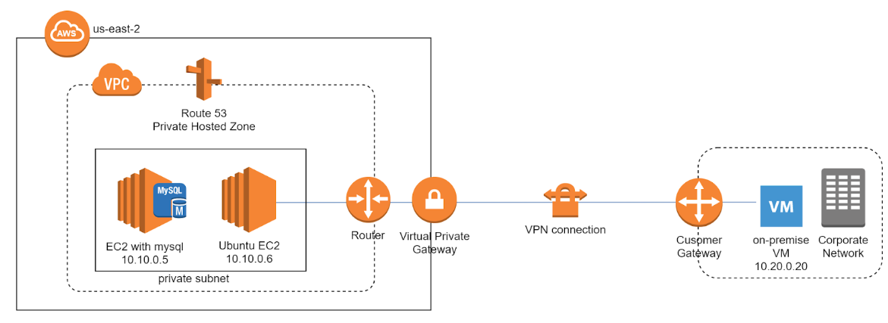

# Hosted Zone in AWS

## Introduction to Hosted Zones in AWS

In the realm of cloud computing, Amazon Web Services (AWS) offers a robust and scalable solution for managing domain names and DNS records through its [Route 53](https://aws.amazon.com/route53/) service. A critical component of Route 53 is the hosted zone, which serves as a container for DNS records for a specific domain. This article delves into the intricacies of hosted zones in AWS, exploring their types, benefits, applications, and best practices for implementation.

## What is a Hosted Zone?

A hosted zone is a collection of DNS records managed by [Amazon Route 53](https://aws.amazon.com/route53/), a scalable and highly available Domain Name System (DNS) web service. Hosted zones are used to manage the DNS settings for a specific domain, including subdomains. They act as a container that holds information about how to route traffic for a domain and its subdomains.

### Key Features of Hosted Zones

Hosted zones in AWS Route 53 offer a range of features that enhance their utility and effectiveness:

- **Scalability**: Hosted zones can handle large volumes of DNS queries without compromising performance.
- **Reliability**: AWS Route 53 provides high availability and low-latency response times.
- **Security**: Hosted zones support DNSSEC (Domain Name System Security Extensions) to protect against DNS spoofing and other attacks.
- **Flexibility**: Hosted zones can manage DNS records for multiple domains and subdomains.
- **Integration**: Hosted zones integrate seamlessly with other AWS services, such as EC2, S3, and CloudFront.

## Types of Hosted Zones

### Public Hosted Zones

A public hosted zone is used to manage DNS records for a domain that is accessible over the internet. Public hosted zones are typically used for websites, web applications, and other internet-facing services.

### Private Hosted Zones

A private hosted zone is used to manage DNS records for a domain that is accessible only within one or more Amazon VPCs (Virtual Private Clouds). Private hosted zones are typically used for internal applications, services, and resources that are not exposed to the internet.

## Benefits of Using Hosted Zones in AWS

### High Availability and Reliability

AWS Route 53 is designed to provide high availability and reliability, ensuring that DNS queries are resolved quickly and accurately. Hosted zones benefit from AWS's global infrastructure, which includes multiple redundant DNS servers distributed across different regions.

### Scalability

Hosted zones in AWS Route 53 can handle large volumes of DNS queries without compromising performance. This scalability is essential for websites and applications that experience high traffic volumes.

### Security

Hosted zones support DNSSEC, which adds an extra layer of security to DNS queries by ensuring that the responses come from the legitimate source. This helps protect against DNS spoofing and other attacks.

### Easy Integration

Hosted zones integrate seamlessly with other AWS services, making it easy to manage DNS settings for resources such as EC2 instances, S3 buckets, and CloudFront distributions. This integration simplifies the process of routing traffic to AWS resources.

### Cost-Effectiveness

AWS Route 53 offers a pay-as-you-go pricing model, allowing you to pay only for the DNS queries and hosted zones you use. This cost-effective approach makes it accessible for businesses of all sizes.

## Applications of Hosted Zones

### Website Hosting

Hosted zones are commonly used to manage DNS records for websites hosted on AWS. By creating a public hosted zone, you can route traffic to your website's EC2 instances, S3 buckets, or CloudFront distributions.

### Internal Applications

Private hosted zones are used to manage DNS records for internal applications and services that are accessible only within an Amazon VPC. This is useful for organizations that want to create a secure and isolated environment for their internal resources.

### Hybrid Cloud Environments

Hosted zones can be used to manage DNS records for hybrid cloud environments, where some resources are hosted on-premises and others are hosted in AWS. This allows for seamless integration and routing of traffic between on-premises and cloud resources.

### Disaster Recovery

Hosted zones can be used as part of a disaster recovery strategy by routing traffic to backup resources in different regions. This ensures that your applications remain available even in the event of a regional outage.

### Multi-Region Deployments

For applications that require low-latency access from different geographical locations, hosted zones can be used to route traffic to resources in multiple AWS regions. This improves performance and provides a better user experience.

## Best Practices for Implementing Hosted Zones

### Use Separate Hosted Zones for Different Environments

For better management and isolation, create separate hosted zones for different environments, such as development, staging, and production. This helps prevent accidental changes to production DNS records and allows for more granular control.

### Enable DNSSEC

Enable DNSSEC for your hosted zones to add an extra layer of security to your DNS queries. DNSSEC helps protect against DNS spoofing and ensures that the responses come from the legitimate source.

### Monitor DNS Queries

Use AWS CloudWatch to monitor DNS queries and track the performance of your hosted zones. This helps identify any issues or anomalies and ensures that your DNS records are resolving correctly.

### Implement Access Controls

Use AWS Identity and Access Management (IAM) to implement access controls for your hosted zones. This ensures that only authorized users can make changes to your DNS records and helps prevent unauthorized access.

### Regularly Review and Update DNS Records

Regularly review and update your DNS records to ensure that they are accurate and up-to-date. This helps prevent issues with traffic routing and ensures that your applications remain accessible.

## FAQ

### What is the difference between a public hosted zone and a private hosted zone?

A public hosted zone is used to manage DNS records for a domain that is accessible over the internet, while a private hosted zone is used to manage DNS records for a domain that is accessible only within one or more Amazon VPCs.

### How do I create a hosted zone in AWS Route 53?

To create a hosted zone in AWS Route 53, navigate to the Route 53 console, select "Hosted Zones," and click "Create Hosted Zone." Enter the domain name and choose whether you want to create a public or private hosted zone. Follow the prompts to complete the setup.

### Can I use AWS Route 53 to manage DNS records for domains registered with other registrars?

Yes, you can use AWS Route 53 to manage DNS records for domains registered with other registrars. To do this, create a hosted zone in Route 53 and update the domain's name server (NS) records with the name servers provided by Route 53.

### How do I enable DNSSEC for my hosted zone?

To enable DNSSEC for your hosted zone, navigate to the Route 53 console, select the hosted zone, and click "Enable DNSSEC." Follow the prompts to configure DNSSEC settings and update your domain's registrar with the necessary DNSSEC information.

### How much does it cost to use AWS Route 53?

AWS Route 53 uses a pay-as-you-go pricing model. You pay for the number of hosted zones you create and the number of DNS queries your hosted zones receive. Additional charges may apply for optional features such as DNSSEC and health checks. For detailed pricing information, visit the [AWS Route 53 pricing page](https://aws.amazon.com/route53/pricing/).

## Conclusion

Hosted zones in AWS Route 53 provide a scalable, reliable, and secure solution for managing DNS records for your domains. By understanding the different types of hosted zones and their applications, you can choose the right hosted zone for your needs and implement best practices to ensure optimal performance and security. Whether you're managing DNS records for websites, internal applications, hybrid cloud environments, or disaster recovery, hosted zones in AWS Route 53 offer valuable benefits that can help you navigate the complexities of DNS management.

For more information on hosted zones and AWS Route 53, visit the [AWS Route 53 documentation](https://docs.aws.amazon.com/Route53/latest/DeveloperGuide/Welcome.html).
