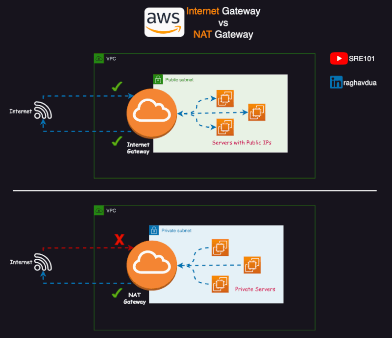

# NAT Gateway in AWS

## Introduction to NAT Gateway in AWS

In the dynamic and ever-evolving world of cloud computing, Amazon Web Services (AWS) provides a plethora of services designed to offer robust, scalable, and secure solutions for businesses. One such critical component is the NAT Gateway, an essential element in the architecture of a Virtual Private Cloud (VPC). This article will delve into the concept of a NAT Gateway in AWS, its features, benefits, applications, and best practices for implementation.

## What is a NAT Gateway?

A NAT Gateway, or Network Address Translation Gateway, is a managed service provided by AWS that enables instances in a private subnet to connect to the internet or other AWS services, while preventing the internet from initiating a connection with those instances. It performs network address translation (NAT) to allow outbound traffic to the internet and return traffic to the instances, but it does not allow inbound traffic initiated from the internet.

### Key Features of NAT Gateway

NAT Gateways in AWS offer several features that make them indispensable for VPC architecture:

- **Scalability**: NAT Gateways are designed to scale automatically to accommodate varying levels of traffic.
- **High Availability**: They are highly available within an Availability Zone.
- **Security**: NAT Gateways work seamlessly with AWS security groups and network ACLs to provide robust security.
- **Managed Service**: NAT Gateways are fully managed by AWS, reducing operational overhead.
- **Integration**: They integrate effortlessly with other AWS services, such as EC2, S3, and Lambda.

## Benefits of Using a NAT Gateway

### High Availability and Redundancy

NAT Gateways are designed to be highly available within an Availability Zone. This ensures that your VPC can handle large volumes of traffic and remain operational even in the event of an infrastructure failure.

### Scalability

NAT Gateways automatically scale to accommodate varying levels of traffic without compromising performance. This scalability is crucial for applications that experience fluctuating traffic patterns.

### Secure Communication

NAT Gateways work in conjunction with AWS security groups and network ACLs to provide secure communication between your private instances and the internet. This ensures that only authorized traffic can enter or leave your VPC.

### Simplified Management

NAT Gateways are fully managed by AWS, reducing the operational overhead associated with managing and maintaining internet connectivity for your private instances. This allows you to focus on your core business activities.

### Cost-Effective

Using a NAT Gateway is cost-effective as it eliminates the need for additional hardware or infrastructure to manage internet connectivity. You only pay for the data transfer out of your VPC to the internet and the hourly usage of the NAT Gateway.

## Applications of NAT Gateway

### Secure Internet Access for Private Instances

NAT Gateways are commonly used to provide secure internet access for instances in private subnets. This allows these instances to download software updates, patches, and other necessary data from the internet without exposing them to inbound internet traffic.

### Hybrid Cloud Environments

In hybrid cloud environments, NAT Gateways enable seamless communication between on-premises infrastructure and AWS resources. This allows for the integration of on-premises applications with cloud-based services.

### Data Transfer

NAT Gateways facilitate secure data transfer between your private instances and external services or users. This is essential for applications that require frequent data exchange with external systems.

### Internet-Facing APIs

For applications that expose APIs to the internet, NAT Gateways provide the necessary connectivity to allow external clients to interact with your APIs while keeping your backend instances secure.

### Disaster Recovery

NAT Gateways play a crucial role in disaster recovery scenarios by providing internet connectivity to backup resources in different regions. This ensures that your applications remain accessible even in the event of a regional outage.

## Best Practices for Implementing NAT Gateway

### Use Security Groups and Network ACLs

Implement security groups and network ACLs to control inbound and outbound traffic to and from your VPC. This ensures that only authorized traffic can access your instances and resources.

### Monitor Traffic

Use AWS CloudWatch to monitor traffic flowing through your NAT Gateway. This helps identify any unusual patterns or potential security threats.

### Enable VPC Flow Logs

Enable VPC Flow Logs to capture information about the IP traffic going to and from network interfaces in your VPC. This provides valuable insights for troubleshooting and security analysis.

### Implement Redundancy

Ensure that your architecture is designed for redundancy by deploying NAT Gateways in multiple Availability Zones. This enhances the availability and fault tolerance of your applications.

### Regularly Review Security Policies

Regularly review and update your security policies to ensure they align with best practices and address any emerging threats. This helps maintain the security and integrity of your VPC.

## FAQ

### What is the purpose of a NAT Gateway in AWS?

A NAT Gateway enables instances in a private subnet to connect to the internet or other AWS services, while preventing the internet from initiating a connection with those instances. It performs network address translation (NAT) to allow outbound traffic to the internet and return traffic to the instances.

### How do I create a NAT Gateway in AWS?

To create a NAT Gateway in AWS, navigate to the VPC console, select "NAT Gateways," and click "Create NAT Gateway." Choose the subnet in which to create the NAT Gateway, assign an Elastic IP address, and follow the prompts to complete the setup.

### Can I have multiple NAT Gateways in a single VPC?

Yes, you can have multiple NAT Gateways in a single VPC. It is recommended to deploy NAT Gateways in multiple Availability Zones for redundancy and high availability.

### How does a NAT Gateway provide security for my VPC?

A NAT Gateway works with AWS security groups and network ACLs to control inbound and outbound traffic. This ensures that only authorized traffic can access your instances and resources, providing an additional layer of security.

### What are the costs associated with using a NAT Gateway?

The costs associated with using a NAT Gateway include the hourly usage fee and data transfer charges for traffic flowing out of your VPC to the internet. For detailed pricing information, visit the [AWS VPC pricing page](https://aws.amazon.com/vpc/pricing/).

## Conclusion

A NAT Gateway is a vital component in the architecture of a VPC, providing scalable, redundant, and secure internet connectivity for your private instances. By understanding its features, benefits, and applications, you can effectively implement and manage NAT Gateways in your AWS environment. Whether you're providing secure internet access for private instances, enabling hybrid cloud environments, or ensuring disaster recovery, NAT Gateways offer the connectivity and security needed to support your cloud infrastructure.

For more information on NAT Gateways and VPCs, visit the [AWS VPC documentation](https://docs.aws.amazon.com/vpc/latest/userguide/what-is-amazon-vpc.html).
