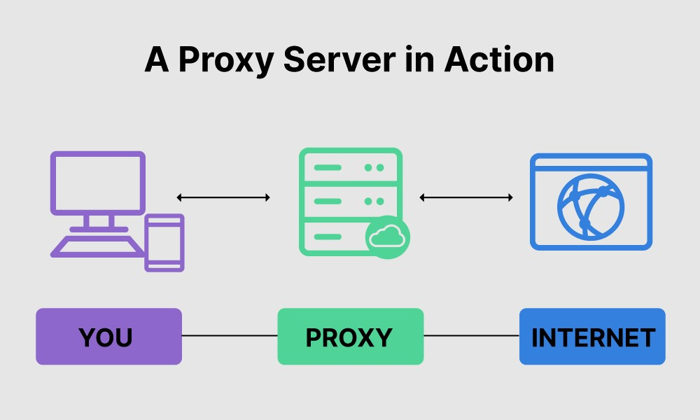
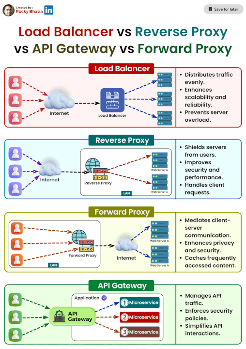

# Proxy Technologies

## Introduction to Proxy Technologies

In today's interconnected digital landscape, [proxy technologies](https://en.wikipedia.org/wiki/Proxy_server) play a crucial role in enhancing security, privacy, and performance. Proxies act as intermediaries between clients and servers, facilitating various functions such as content filtering, load balancing, and anonymity. This comprehensive article delves into the intricacies of proxy technologies, exploring their types, benefits, applications, and best practices for implementation.

## What is a Proxy?

A proxy server is an intermediary server that separates end users from the websites they browse. Proxies provide varying levels of functionality, security, and privacy depending on your needs, company policies, or privacy concerns. They act as a gateway between users and the internet, masking the user's IP address and making requests on behalf of the user.

### Key Features of Proxy Technologies

Proxy technologies offer a range of features that enhance their utility and effectiveness:

- **Anonymity**: Proxies can hide the user's IP address, providing anonymity and protecting privacy.
- **Content Filtering**: Proxies can filter content based on predefined rules, blocking access to certain websites or types of content.
- **Load Balancing**: Proxies can distribute network traffic across multiple servers, improving performance and reliability.
- **Caching**: Proxies can cache frequently accessed content, reducing load times and bandwidth usage.
- **Security**: Proxies can enhance security by blocking malicious traffic and preventing direct access to internal networks.

## Types of Proxy Technologies

### Forward Proxies

A forward proxy is a server that sits between a client and an external server, forwarding client requests to the external server and returning the server's response to the client. Forward proxies are commonly used for content filtering, anonymity, and caching.

### Reverse Proxies

A reverse proxy is a server that sits between external clients and an internal server, forwarding client requests to the internal server and returning the server's response to the client. Reverse proxies are often used for load balancing, security, and caching.

### Transparent Proxies

A transparent proxy intercepts client requests without modifying them or the client's IP address. Transparent proxies are typically used for content filtering and monitoring.

### Anonymous Proxies

Anonymous proxies hide the user's IP address, providing a higher level of privacy and anonymity. These proxies are commonly used to bypass geo-restrictions and access blocked content.

### High Anonymity Proxies

High anonymity proxies, also known as elite proxies, provide the highest level of anonymity by not revealing the user's IP address or the fact that they are using a proxy. These proxies are ideal for users who require maximum privacy and security.

## Benefits of Using Proxy Technologies

### Enhanced Security

Proxies can enhance security by blocking malicious traffic, preventing direct access to internal networks, and filtering out harmful content. By acting as a barrier between users and the internet, proxies can protect against various cyber threats.

### Improved Privacy

Proxies can hide the user's IP address, providing anonymity and protecting privacy. This is particularly important for users who want to browse the internet without being tracked or monitored.

### Content Filtering

Proxies can filter content based on predefined rules, blocking access to certain websites or types of content. This is useful for organizations that want to enforce internet usage policies or protect users from harmful content.

### Load Balancing

Proxies can distribute network traffic across multiple servers, improving performance and reliability. This ensures that no single server is overwhelmed with traffic, reducing the risk of downtime and improving the user experience.

### Caching

Proxies can cache frequently accessed content, reducing load times and bandwidth usage. This is particularly beneficial for websites with high traffic volumes, as it can improve performance and reduce server load.

## Applications of Proxy Technologies

### Corporate Networks

In corporate networks, proxies are used to enforce internet usage policies, filter content, and enhance security. By controlling access to the internet, organizations can protect their networks from cyber threats and ensure that employees adhere to company policies.

### Educational Institutions

Educational institutions use proxies to filter content, block access to inappropriate websites, and monitor internet usage. Proxies help create a safe and productive online environment for students and staff.

### E-Commerce

E-commerce websites use proxies to enhance security, improve performance, and manage traffic. By distributing traffic across multiple servers and caching frequently accessed content, proxies can ensure a smooth and reliable shopping experience for customers.

### Content Delivery Networks (CDNs)

Content delivery networks (CDNs) use proxies to cache and deliver content to users from servers located closer to them. This reduces load times and improves performance, providing a better user experience.

### Personal Use

Individuals use proxies to enhance privacy, bypass geo-restrictions, and access blocked content. Proxies allow users to browse the internet anonymously and access content that may be restricted in their region.

## Best Practices for Implementing Proxy Technologies

### Choose the Right Type of Proxy

Selecting the right type of proxy depends on your specific needs and use case. Consider factors such as security, privacy, performance, and functionality when choosing a proxy.

### Configure Proxy Settings

Properly configure proxy settings to ensure optimal performance and security. This includes setting up access controls, content filtering rules, and caching policies.

### Monitor and Maintain Proxies

Regularly monitor and maintain proxies to ensure they are functioning correctly and efficiently. This includes updating software, checking for security vulnerabilities, and optimizing performance.

### Use Secure Connections

Ensure that proxies use secure connections (e.g., HTTPS) to protect data transmitted between clients and servers. This is particularly important for sensitive information and transactions.

### Educate Users

Educate users on the importance of using proxies and how to configure their devices to use them. This helps ensure that proxies are used effectively and that users understand the benefits and limitations of proxy technologies.

## FAQ

### What is the difference between a forward proxy and a reverse proxy?

A forward proxy sits between a client and an external server, forwarding client requests to the external server and returning the server's response to the client. A reverse proxy, on the other hand, sits between external clients and an internal server, forwarding client requests to the internal server and returning the server's response to the client.

### How do proxies enhance security?

Proxies enhance security by blocking malicious traffic, preventing direct access to internal networks, and filtering out harmful content. By acting as a barrier between users and the internet, proxies can protect against various cyber threats.

### Can proxies improve internet speed?

Yes, proxies can improve internet speed by caching frequently accessed content, reducing load times and bandwidth usage. This is particularly beneficial for websites with high traffic volumes, as it can improve performance and reduce server load.

### Are proxies legal to use?

Yes, proxies are legal to use in most countries. However, using proxies to engage in illegal activities, such as hacking or accessing restricted content, is illegal and can result in legal consequences.

### How do I choose the right proxy for my needs?

When choosing a proxy, consider factors such as security, privacy, performance, and functionality. Determine your specific needs and use case, and select a proxy that meets those requirements. Additionally, check user reviews and ratings to ensure the proxy is reliable and well-supported.

## Conclusion

Proxy technologies are essential tools for enhancing security, privacy, and performance in today's digital landscape. By understanding the different types of proxies and their applications, you can choose the right proxy for your needs and implement best practices to ensure optimal performance and security. Whether you're using proxies for corporate networks, educational institutions, e-commerce, or personal use, proxies provide valuable benefits that can help you navigate the internet safely and efficiently.

For more information on proxy technologies, visit the [Wikipedia page on Proxy Servers](https://en.wikipedia.org/wiki/Proxy_server).
