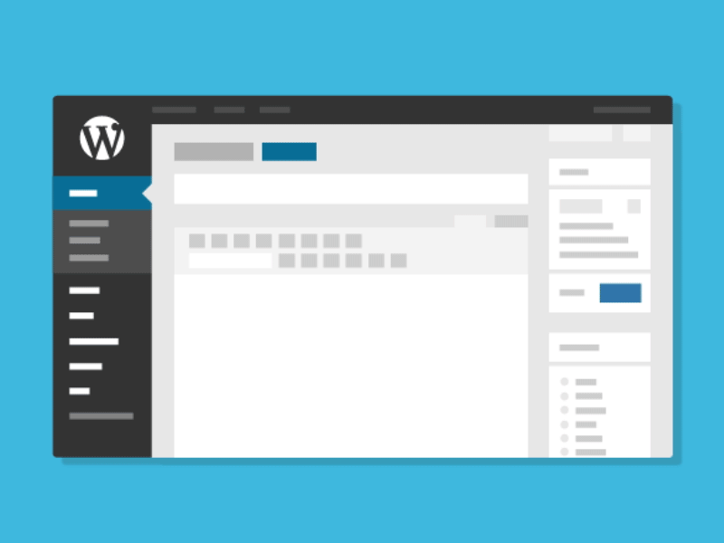
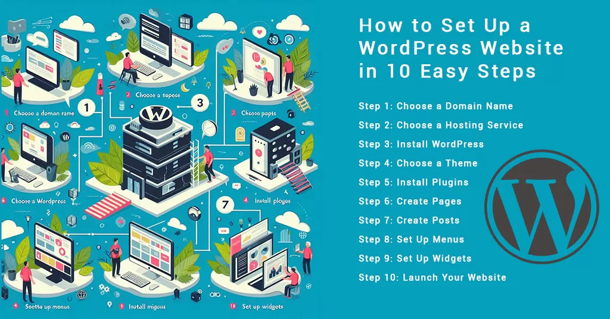

# WordPress CMS

## Introduction to WordPress CMS

[WordPress](https://wordpress.org/) is a versatile and widely-used content management system (CMS) that powers millions of websites across the globe. Initially launched as a blogging platform, WordPress has evolved into a robust CMS capable of handling a variety of website types, from personal blogs to complex e-commerce sites. This article explores the features, benefits, and best practices for using WordPress CMS to create and manage your website.

## What is WordPress CMS?

WordPress is an open-source CMS written in PHP and paired with a MySQL or MariaDB database. It offers a user-friendly interface, making it accessible to both beginners and experienced developers. With thousands of themes and plugins available, WordPress provides extensive customization options to tailor your website to your specific needs.

### Key Features of WordPress CMS

WordPress CMS boasts a range of features that make it a popular choice for website creation and management:

- **User-Friendly Interface**: The intuitive dashboard allows users to easily manage content, media, and site settings.
- **Themes and Plugins**: Thousands of free and premium themes and plugins enable extensive customization and functionality.
- **SEO-Friendly**: Built-in SEO features and plugins like [Yoast SEO](https://yoast.com/wordpress/plugins/seo/) help optimize your site for search engines.
- **Responsive Design**: Many themes are mobile-friendly, ensuring your site looks great on all devices.
- **Community Support**: A large and active community provides extensive documentation, forums, and resources.

## Benefits of Using WordPress CMS

### Ease of Use

One of the primary benefits of using WordPress CMS is its ease of use. The intuitive dashboard allows users to manage content, media, and site settings without needing extensive technical knowledge. This makes WordPress an ideal choice for beginners and small business owners who want to create and manage their websites independently.

### Extensive Customization

WordPress offers extensive customization options through themes and plugins. Themes allow you to change the appearance of your site, while plugins add functionality such as contact forms, e-commerce capabilities, and social media integration. This flexibility enables you to create a website that aligns with your brand and meets your specific needs.

### SEO Optimization

WordPress is designed with SEO in mind, offering built-in features and plugins to help optimize your site for search engines. Plugins like [Yoast SEO](https://yoast.com/wordpress/plugins/seo/) provide tools for keyword optimization, meta descriptions, and XML sitemaps, helping improve your site's visibility in search engine results.

### Scalability

Whether you're running a personal blog or a large e-commerce site, WordPress can scale to meet your needs. The platform supports a wide range of website types and can handle high traffic volumes with the right hosting and optimization. This scalability ensures that your website can grow alongside your business.

### Community and Support

WordPress has a large and active community that provides extensive documentation, forums, and resources. Whether you're looking for tutorials, troubleshooting help, or advice on best practices, the WordPress community is a valuable resource for users of all skill levels.

## Setting Up a WordPress Website

### Step-by-Step Guide

1. **Choose a Domain and Hosting**: Select a domain name and choose a hosting provider that supports WordPress. Many hosting providers offer one-click WordPress installation.
2. **Install WordPress**: Use the one-click installation feature provided by your hosting provider or manually install WordPress by downloading it from [WordPress.org](https://wordpress.org/download/).
3. **Select a Theme**: Choose a theme from the WordPress theme repository or purchase a premium theme from a marketplace like [ThemeForest](https://themeforest.net/).
4. **Install Plugins**: Add functionality to your site by installing plugins from the WordPress plugin repository or purchasing premium plugins.
5. **Create Content**: Start creating pages and posts to populate your site with content. Use the WordPress editor to format your content and add media.
6. **Customize Settings**: Configure site settings, including permalinks, reading settings, and discussion settings, to optimize your site for performance and usability.

## Best Practices for WordPress CMS

### Implementing Security Best Practices

- **Use Strong Passwords**: Ensure all user accounts have strong, unique passwords to prevent unauthorized access.
- **Keep WordPress Updated**: Regularly update WordPress core, themes, and plugins to protect against security vulnerabilities.
- **Install Security Plugins**: Use security plugins like [Wordfence](https://www.wordfence.com/) or [Sucuri](https://sucuri.net/) to monitor and protect your site from threats.
- **Backup Your Site**: Regularly backup your site using plugins like [UpdraftPlus](https://updraftplus.com/) to ensure you can recover your data in case of a security breach.

### Optimizing Performance

- **Use a Caching Plugin**: Install a caching plugin like [W3 Total Cache](https://www.w3-edge.com/solutions/w3-total-cache/) to improve site speed and performance.
- **Optimize Images**: Use image optimization plugins like [Smush](https://wordpress.org/plugins/wp-smushit/) to reduce image file sizes without compromising quality.
- **Choose a Reliable Hosting Provider**: Select a hosting provider that offers fast and reliable performance to ensure your site loads quickly.

### Enhancing SEO

- **Install an SEO Plugin**: Use an SEO plugin like [Yoast SEO](https://yoast.com/wordpress/plugins/seo/) to optimize your site for search engines.
- **Create High-Quality Content**: Publish high-quality, relevant content that provides value to your audience and encourages engagement.
- **Optimize Permalinks**: Use SEO-friendly permalinks that include keywords and accurately describe the content of your pages and posts.

## Common Use Cases for WordPress CMS

### Blogging

WordPress is an excellent platform for blogging, offering a user-friendly interface and a range of features to help you create and manage your blog. With customizable themes and plugins, you can create a unique and engaging blog that attracts and retains readers.

### E-Commerce

With plugins like [WooCommerce](https://woocommerce.com/), WordPress can be transformed into a powerful e-commerce platform. WooCommerce provides all the tools you need to set up and manage an online store, including product listings, payment gateways, and inventory management.

### Business Websites

WordPress is a popular choice for business websites, offering a range of themes and plugins to create a professional online presence. Whether you're a small business or a large corporation, WordPress provides the flexibility and scalability to meet your needs.

### Portfolio Websites

For artists, photographers, and other creative professionals, WordPress offers a range of portfolio themes and plugins to showcase your work. With customizable galleries and media management tools, you can create a visually stunning portfolio that highlights your talents.

## FAQ

### What is the difference between WordPress.org and WordPress.com?

WordPress.org is the self-hosted version of WordPress, allowing you to download and install the software on your own hosting server. WordPress.com, on the other hand, is a hosted service that provides a simplified version of WordPress with hosting included. While WordPress.com is easier to set up, it offers less flexibility and customization compared to WordPress.org.

### How do I choose the right theme for my WordPress site?

When choosing a theme for your WordPress site, consider factors such as design, functionality, and responsiveness. Look for themes that align with your brand and offer the features you need. Additionally, check user reviews and ratings to ensure the theme is well-supported and regularly updated.

### Can I use WordPress for an e-commerce site?

Yes, WordPress can be used to create an e-commerce site using plugins like WooCommerce. WooCommerce provides all the tools you need to set up and manage an online store, including product listings, payment gateways, and inventory management.

### How do I improve the SEO of my WordPress site?

To improve the SEO of your WordPress site, install an SEO plugin like Yoast SEO, create high-quality content, and optimize your permalinks. Additionally, use keywords strategically in your content, meta descriptions, and headings, and ensure your site is mobile-friendly and loads quickly.

### How do I secure my WordPress site?

To secure your WordPress site, use strong passwords, keep WordPress core, themes, and plugins updated, and install security plugins like Wordfence or Sucuri. Additionally, regularly backup your site using plugins like UpdraftPlus to ensure you can recover your data in case of a security breach.

## Conclusion

WordPress CMS is a powerful and flexible platform for creating and managing websites. With its user-friendly interface, extensive customization options, and robust community support, WordPress is an excellent choice for users of all skill levels. By following best practices and leveraging the features of WordPress, you can create a secure, high-performing, and SEO-optimized website that meets your specific needs.

For more information on WordPress CMS, visit the [WordPress documentation](https://wordpress.org/support/).
