# AUTOMATE INFRASTRUCTURE WITH IAC USING TERRAFORM PART 1

After you have built AWS infrastructure for 2 websites manually, it is time to automate the process using Terraform.

Let us start building the same set up with the power of Infrastructure as Code (IaC)


## Prerequisites before you begin writing Terraform code

- You must have completed Terraform course from the Learning dashboard
- Create an IAM user, name it terraform (ensure that the user has only programatic access to your AWS account) and grant this user
  AdministratorAccess permissions.

  - Search IAM > Users > Create user > Attach policies directly

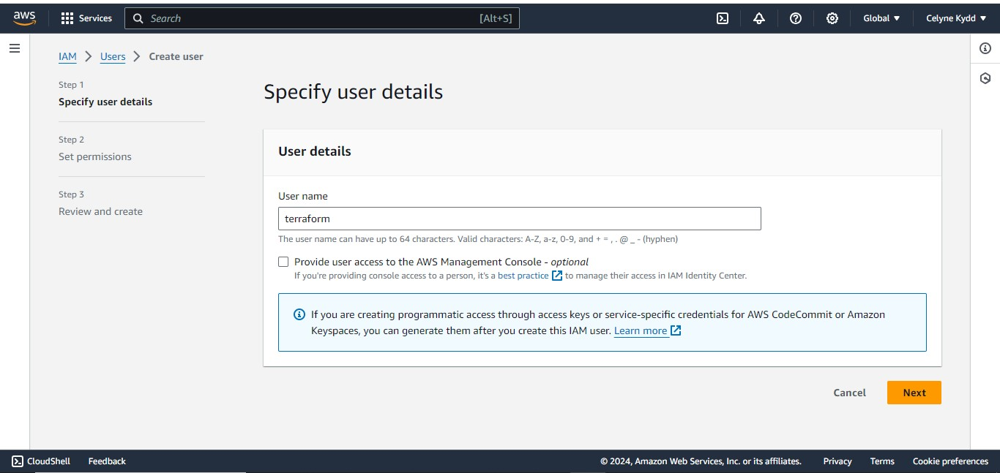

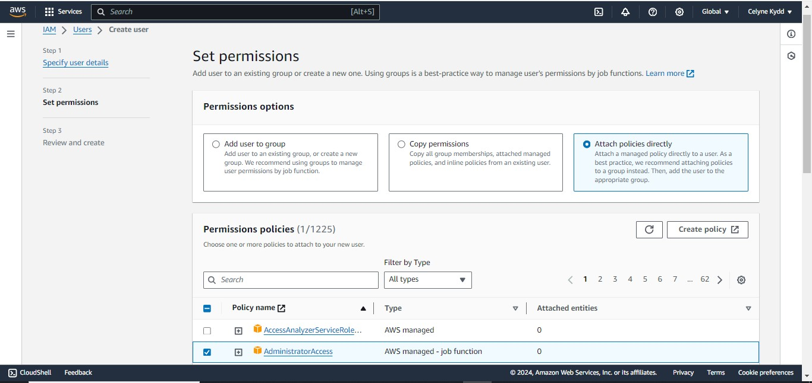

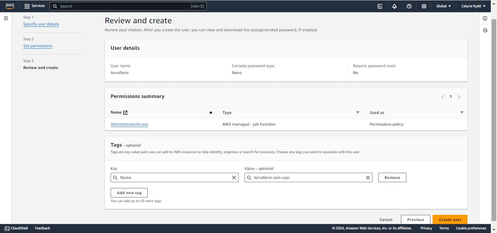

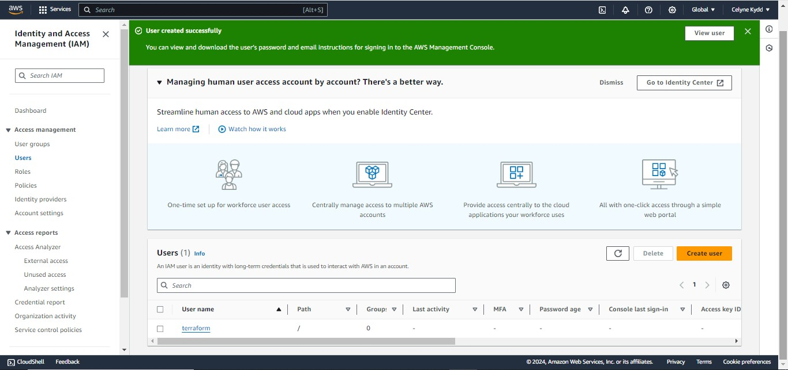

- Copy the secret access key and access key ID. Save them in a notepad temporarily.

  - Create the Access Key

  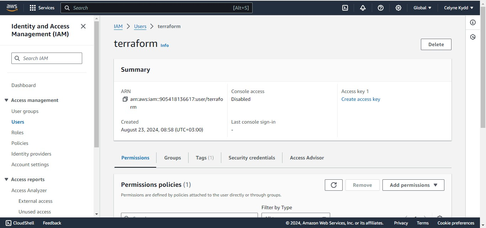

  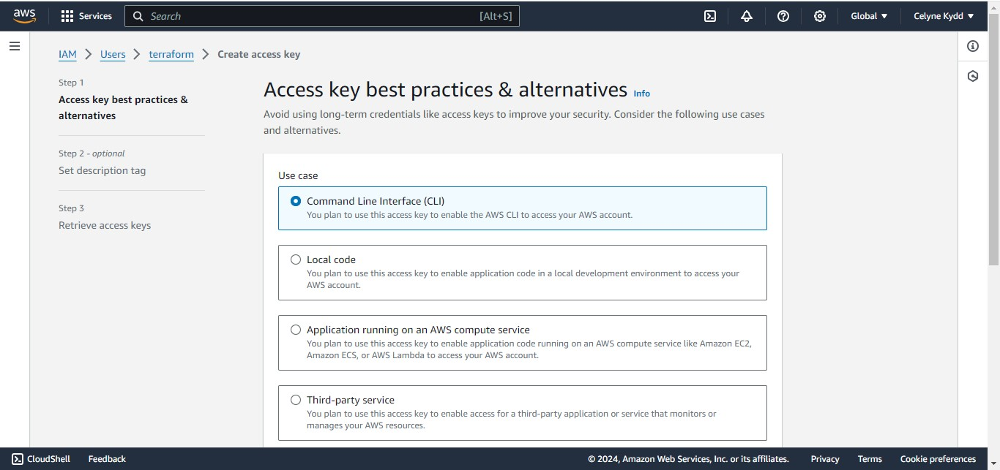

  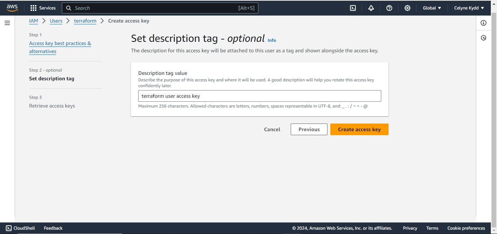

  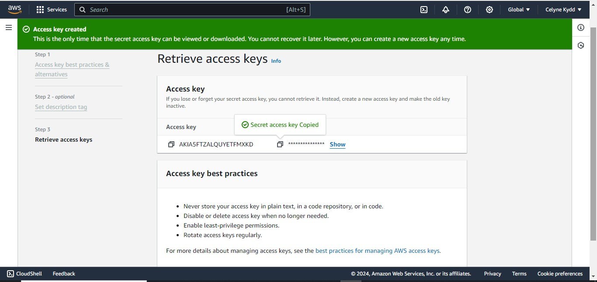

  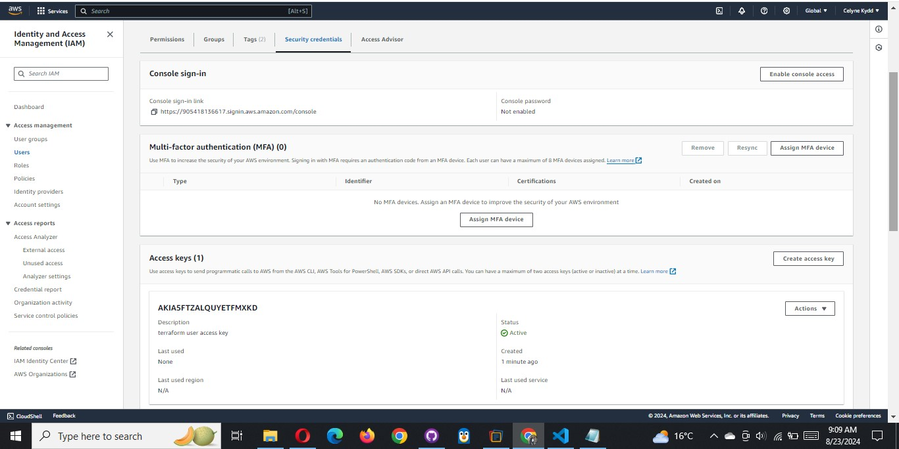

- Configure programmatic access from your workstation to connect to AWS using the access keys copied above and a
  [Python SDK (boto3)](https://boto3.amazonaws.com/v1/documentation/api/latest/index.html).

You must have Python 3.6 or higher on your workstation.

```bash
python --version
```

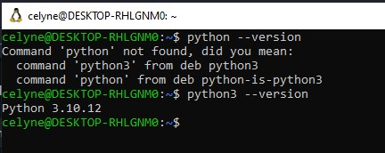

If you are on Windows, use gitbash, if you are on a Mac, you can simply open a terminal. Read here to configure the Python SDK properly.

- Install AWS CLI for Ubuntu 24.04

```bash
sudo apt update

# Ensure snapd is Installed

sudo apt install snapd

# Install AWS CLI Using Snap

sudo snap install aws-cli --classic

# Verify the Installation

aws --version
```

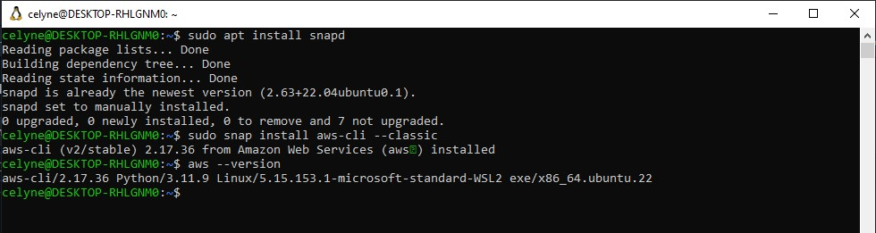

**_For easier authentication configuration – use AWS CLI with aws configure command._**

- Configure AWS CLI in the terminal

```bash
aws configure
```

- Follow the prompt, by inputing your access key id, access key and region and press enter.

```bash
AWS Access Key ID [****************Y6JW]: <Access Key ID>
AWS Secret Access Key [****************YdPL]: <Secret Acess Key>
Default region name [us-east-1]: us-east-1
Default output format [json]: json
```

```bash
cat ~/.aws/credentials

# You will see the output below
[default]
aws_access_key_id = YOUR_ACCESS_KEY
aws_secret_access_key = YOUR_SECRET_KEY
```

Create an S3 bucket to store Terraform state file. You can name it something like `yourname`-dev-terraform-bucket
(Note: S3 bucket names must be unique unique within a region partition, you can read about S3 bucken naming ).

We will use this bucket from Project-17 onwards.
for me `melkamu-dev-terraform-bucket`


**Verfiy this in AWS CLI**

```bash
aws s3 ls
```


Install Boto3 (Boto3 is a AWS SDK for Python) in your local machine

```bash
pip install boto3
```

When you have configured authentication and installed boto3, make sure you can programmatically access your AWS account by running
following commands in >python:

```bash
import boto3
s3 = boto3.resource('s3')
for bucket in s3.buckets.all():
    print(bucket.name)
```

Save the above code to a file (e.g., list_buckets.py) or run it directly in a Python interpreter

```bash
 python list_bucket.py
```

You shall see your previously created S3 bucket name – melkamu-dev-terraform-bucket


