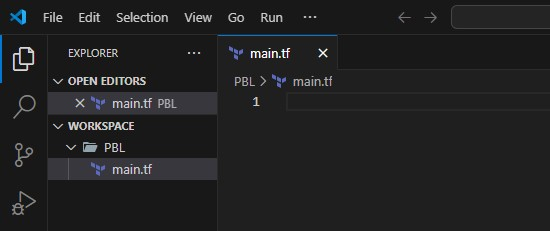
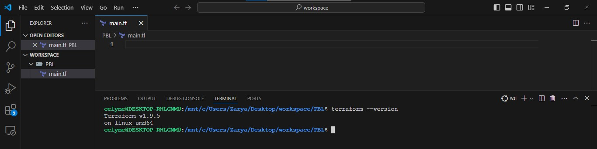
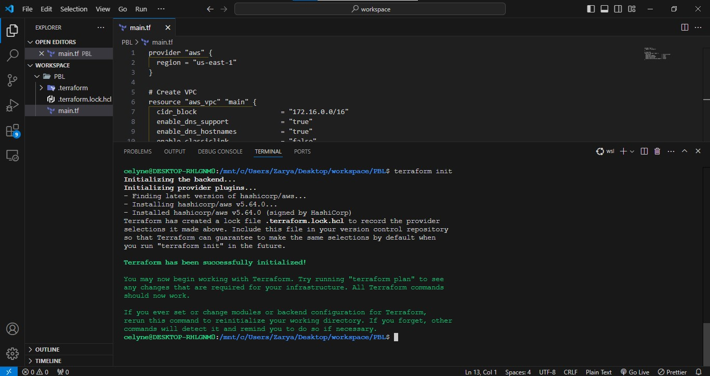
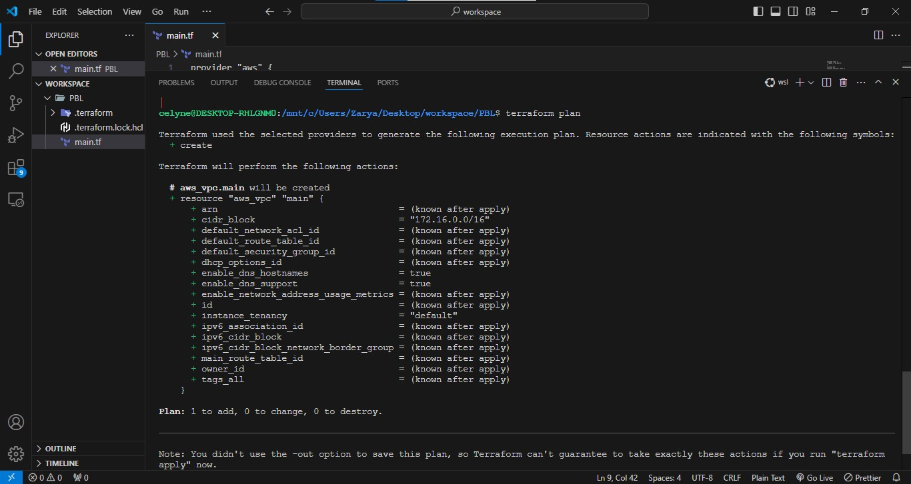
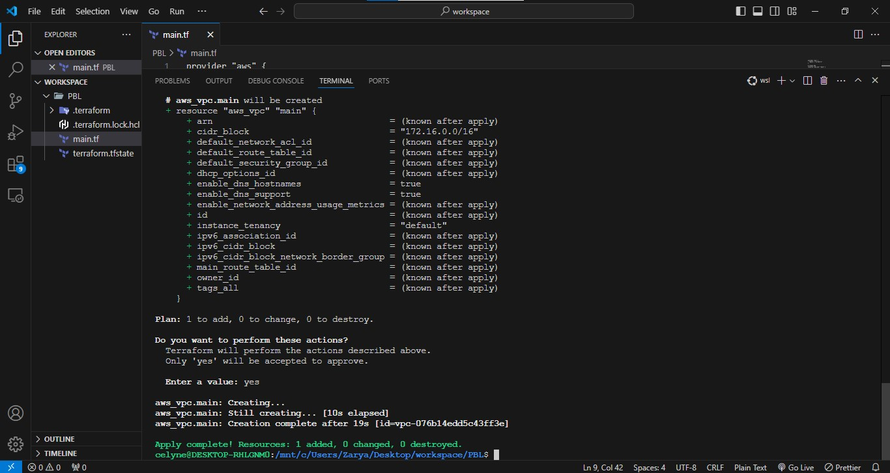

# VPC | SUBNETS | SECURITY GROUPS

Let us create a directory structure
Open your Visual Studio Code and:

- Create a file in the PBL folder, name it main.tf

Your setup should look like this.



## Provider and VPC resource section

Set up Terraform CLI as per this [instruction](https://developer.hashicorp.com/terraform/tutorials/aws-get-started/install-cli).



- Add AWS as a provider, and a resource to create a VPC in the main.tf file.

- Provider block informs Terraform that we intend to build infrastructure within AWS.

- Resource block will create a VPC.

```bash
provider "aws" {
  region = "us-east-1"
}

# Create VPC
resource "aws_vpc" "main" {
  cidr_block                     = "172.16.0.0/16"
  enable_dns_support             = "true"
  enable_dns_hostnames           = "true"
  enable_classiclink             = "false"
  enable_classiclink_dns_support = "false"
}

```

**Note:** You can change the configuration above to create your VPC in other region that is closer to you. The same applies to all
configuration snippets that will follow.

- The next thing we need to do, is to download necessary plugins for Terraform to work. These plugins are used by providers and
  provisioners. At this stage, we only have provider in our main.tf file. So, Terraform will just download plugin for AWS provider.

- Lets accomplish this with terraform init command as seen in the below demonstration.

```bash
> cd PBL

> terraform init
```



**Observations:**

- Notice that a new directory has been created: .terraform\.... This is where Terraform keeps plugins. Generally, it is safe to
  delete this folder. It just means that you must execute terraform init again, to download them.

Moving on, let us create the only resource we just defined. aws_vpc. But before we do that, we should check to see what terraform
intends to create before we tell it to go ahead and create it.
Let's verify what terraform intends to create

```bash
terraform plan
```



- Then, if you are happy with changes planned, execute

```bash
 terraform apply
```



**Observations:**

1. A new file is created terraform.tfstate This is how Terraform keeps itself up to date with the exact state of the infrastructure.
   It reads this file to know what already exists, what should be added, or destroyed based on the entire terraform code that is being
   developed.

2. If you also observed closely, you would realise that another file gets created during planning and apply. But this file gets
   deleted immediately. terraform.tfstate.lock.info This is what Terraform uses to track, who is running its code against the
   infrastructure at any point in time. This is very important for teams working on the same Terraform repository at the same time.
   The lock prevents a user from executing Terraform configuration against the same infrastructure when another user is doing the
   same – it allows to avoid duplicates and conflicts.

Its content is usually like this. (We will discuss more about this later)

```bash
{
        "ID":"e5e5ad0e-9cc5-7af1-3547-77bb3ee0958b",
        "Operation":"OperationTypePlan","Info":"",
        "Who":"ann@ann","Version":"0.13.4",
        "Created":"2020-10-28T19:19:28.261312Z",
        "Path":"terraform.tfstate"
    }
```

It is a json format file that stores information about a user: user’s ID, what operation he/she is doing, timestamp, and location
of the state file.

## Subnets resource section

According to our architectural design, we require 6 subnets:

- 2 public
- 2 private for webservers
- 2 private for data layer

Let us create the first 2 public subnets.

Add below configuration to the main.tf file:

```bash
# Create public subnets1
    resource "aws_subnet" "public1" {
    vpc_id                     = aws_vpc.main.id
    cidr_block                 = "172.16.0.0/24"
    map_public_ip_on_launch    = true
    availability_zone          = "us-east-1a"

}

# Create public subnet2
    resource "aws_subnet" "public2" {
    vpc_id                     = aws_vpc.main.id
    cidr_block                 = "172.16.1.0/24"
    map_public_ip_on_launch    = true
    availability_zone          = "us-east-1b"
}
```

- We are creating 2 subnets, therefore declaring 2 resource blocks – one for each of the subnets.
- We are using the vpc_id argument to interpolate the value of the VPC id by setting it to aws_vpc.main.id. This way, Terraform knows
  inside which VPC to create the subnet.
  Run terraform plan to check the intend infrusture and terraform apply to create the infrusture.

```bash
terraform plan
```

```bash
terraform apply
```


**Observations:**

- Hard coded values: Remember our best practice hint from the beginning? Both the availability_zone and cidr_block arguments are hard
  coded. We should always endeavour to make our work dynamic.
- Multiple Resource Blocks: Notice that we have declared multiple resource blocks for each subnet in the code. This is bad
  coding practice. We need to create a single resource block that can dynamically create resources without specifying multiple blocks.
  Imagine if we wanted to create 10 subnets, our code would look very clumsy. So, we need to optimize this by introducing a count
  argument.

First, destroy the current infrastructure. Since we are still in development, this is totally fine. Otherwise, DO NOT DESTROY an infrastructure that has been deployed to production.

```bash
terraform destroy
```


Now let us improve our code by refactoring it.
