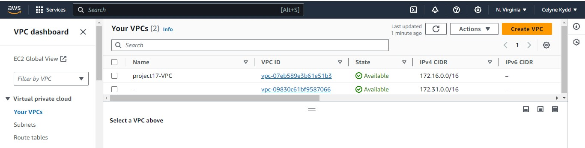
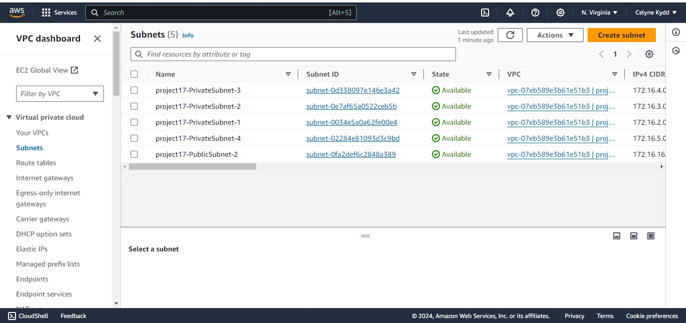
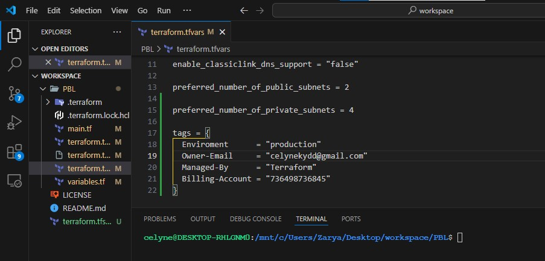
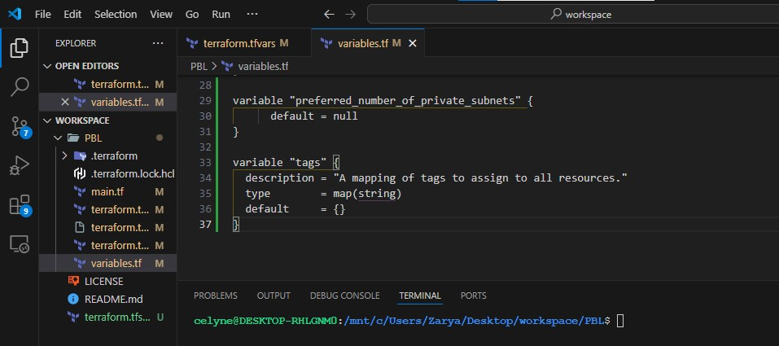

## Automate Infrastructure With IaC using Terraform- 201

[In Previous Project](https://github.com/melkamu372/StegHub-DevOps-Cloud-Engineering/blob/main/Project-16-Automate-Infrastructure-With-IAC-using-Terraform-Part-1/Automate-Infrastructure-With-IAC-using-Terraform-Part-1.md) We created The VPC and the 2 required public subnets were. Let's continue by creating the required 4 private subnets

**Create 4 private subnets**

```bash
resource "aws_subnet" "private" {
  count                   = var.preferred_number_of_private_subnets == null ? length(data.aws_availability_zones.available.names) : var.preferred_number_of_private_subnets
  vpc_id                  = aws_vpc.main.id
  cidr_block              = cidrsubnet(var.vpc_cidr, 8, count.index + 2)
  map_public_ip_on_launch = true
  availability_zone       = data.aws_availability_zones.available.names[count.index]

  tags = {
    Name = "project17-PrivateSubnet-${count.index + 1}"

  }
}
```





### Continue Infrastructure Automation with Terraform

Let us continue from where we have stopped in Project 16. Based on the knowledge from the previous project lets keep on creating AWS resources!

## Networking

Private subnets & best practices Create `4 private subnets` keeping in mind following principles:

- Make sure you use variables or length() function to determine the number of AZs
- Use variables and cidrsubnet() function to allocate vpc_cidr for subnets
- Keep variables and resources in separate files for better code structure and readability
- Tags all the resources you have created so far. Explore how to use format() and count functions to automatically tag subnets with its respective number.

**A little bit more about Tagging**
Tagging is a straightforward, but a very powerful concept that helps you manage your resources much more efficiently:

- Resources are much better organized in 'virtual' groups
- They can be easily filtered and searched from console or programmatically
- Billing team can easily generate reports and determine how much each part of infrastructure costs how much (by department, by type,
  by environment, etc.)
- You can easily determine resources that are not being used and take actions accordingly
- If there are different teams in the organisation using the same account, tagging can help differentiate who owns which resources.

**Note:** You can add multiple tags as a default set. for example, in out terraform.tfvars file we can have default tags
defined.
Assign values for the tags variable in the terraform.tfvars file

```bash
tags = {
  Enviroment      = "production"
  Owner-Email     = "celynekydd@gmail.com"
  Managed-By      = "Terraform"
  Billing-Account = "736498736845"
}
```



Now you can tag all you resources using the format below

```bash
tags = merge(
    var.tags,
    {
      Name = "Project17"
    },
  )
```

**NOTE:** Update the `variables.tf` to declare the variable tags used in the format above;

```bash
variable "tags" {
  description = "A mapping of tags to assign to all resources."
  type        = map(string)
  default     = {}
}
```



The nice thing about this is – anytime we need to make a change to the tags, we simply do that in one single place (terraform.tfvars).

But, our key-value pairs are hard coded. So, go ahead and work out a fix for that. Simply create variables for each value and use var.variable_name as the value to each of the keys.

Apply the same best practices for all other resources you will create further.
