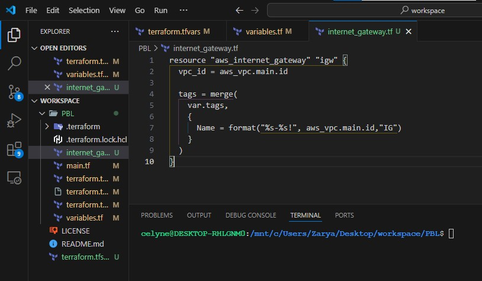
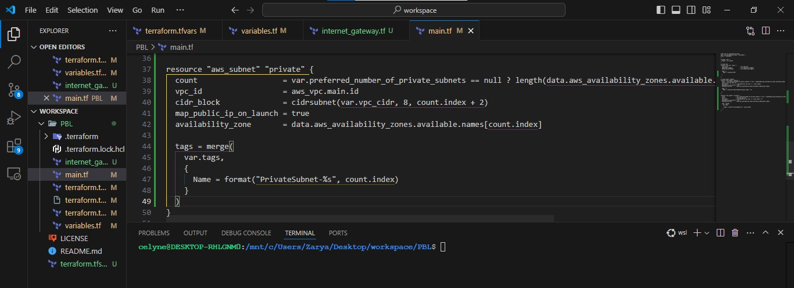
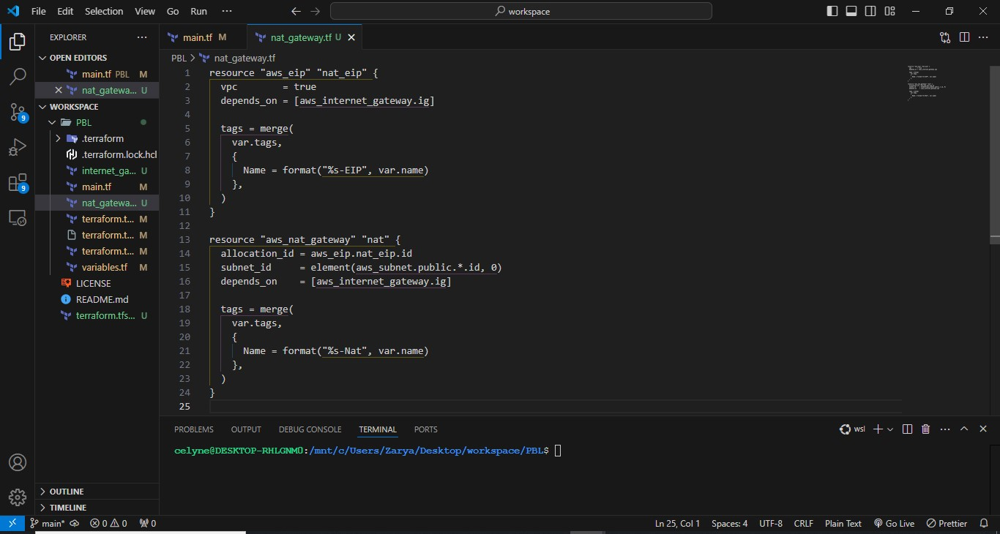
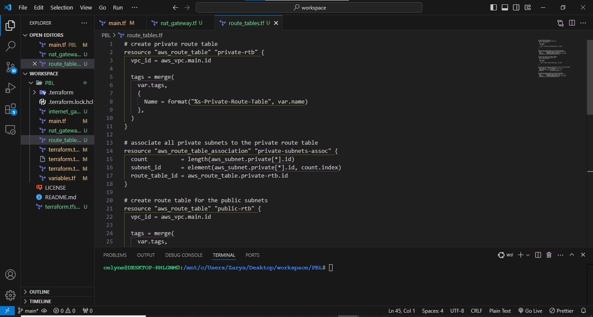
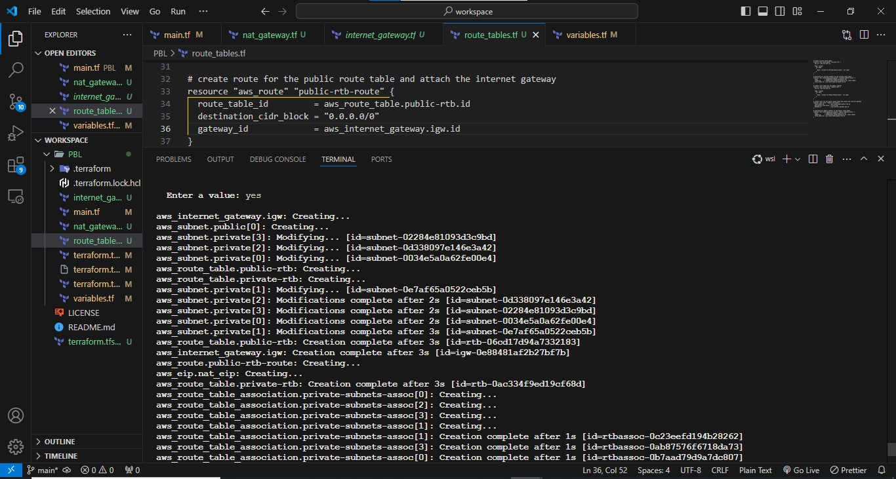
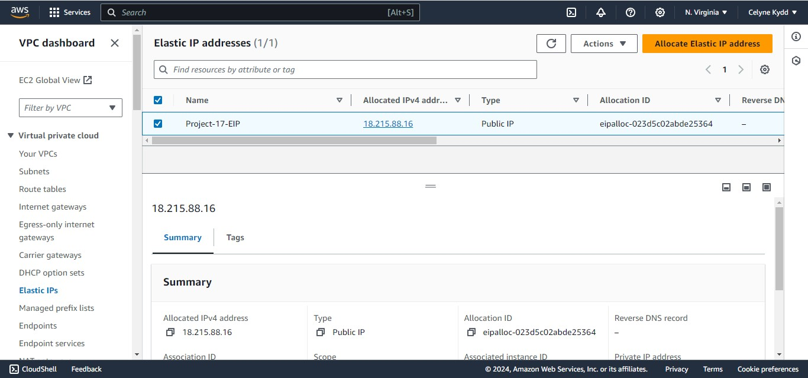
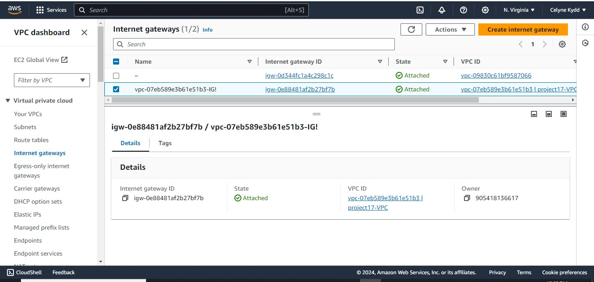
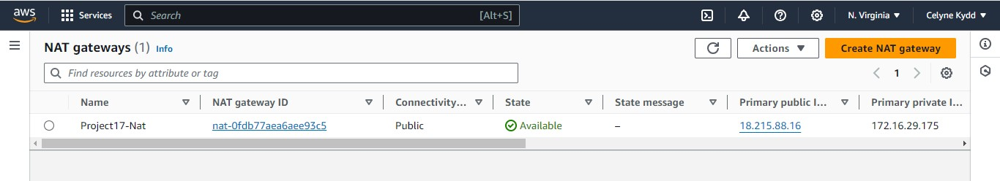
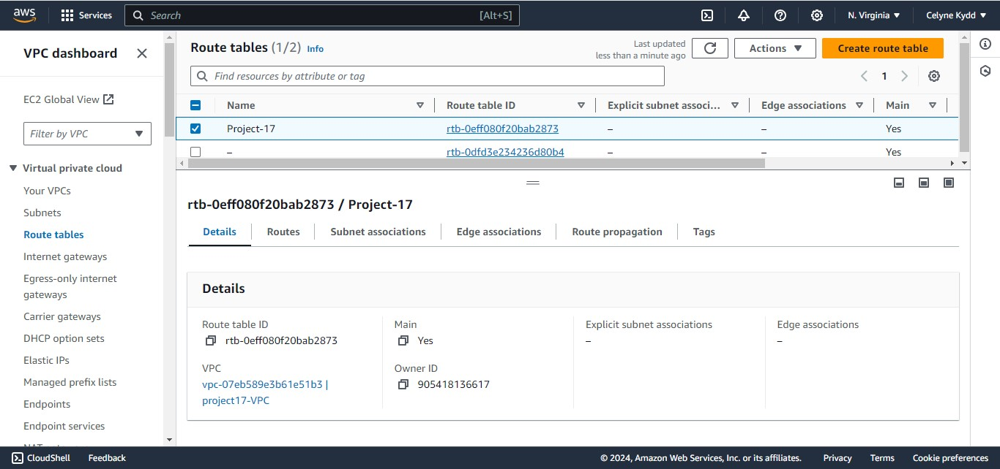

# Internet Gateways & `format()` function

Create an Internet Gateway in a separate Terraform file `internet_gateway.tf`

```bash
resource "aws_internet_gateway" "igw" {
  vpc_id = aws_vpc.main.id

  tags = merge(
    var.tags,
    {
      Name = format("%s-%s!", aws_vpc.main.id,"IG")
    }
  )
}
```



Did you notice how we have used format() function to dynamically generate a unique name for this resource? The first part of the %s
takes the interpolated value of aws_vpc.main.id while the second %s appends a literal string IG and finally an exclamation mark is
added in the end.

If any of the resources being created is either using the count function, or creating multiple resources using a loop, then a
key-value pair that needs to be unique must be handled differently.

For example, each of our subnets should have a unique name in the tag section. Without the format() function, we would not be able
to see uniqueness. With the format function, each private subnet’s tag will look like this.

```bash
Name = PrivateSubnet-0
Name = PrivateSubnet-1
Name = PirvateSubnet-2
```

Lets try and see that in action.

```bash
tags = merge(
    var.tags,
    {
      Name = format("PrivateSubnet-%s", count.index)
    }
  )
```



## NAT Gateways

Create 1 NAT Gateways and 1 Elastic IP (EIP) addresses

Now use similar approach to create the NAT Gateways in a new file called natgateway.tf.

Note: We need to create an Elastic IP for the NAT Gateway, and you can see the use of depends_on to indicate that the Internet Gateway
resource must be available before this should be created. Although Terraform does a good job to manage dependencies, but in some
cases, it is good to be explicit.

You can read more on dependencies [here](https://developer.hashicorp.com/terraform/language/meta-arguments/depends_on)

```bash
resource "aws_eip" "nat_eip" {
  vpc        = true
  depends_on = [aws_internet_gateway.ig]

  tags = merge(
    var.tags,
    {
      Name = format("%s-EIP", var.name)
    },
  )
}

resource "aws_nat_gateway" "nat" {
  allocation_id = aws_eip.nat_eip.id
  subnet_id     = element(aws_subnet.public.*.id, 0)
  depends_on    = [aws_internet_gateway.ig]

  tags = merge(
    var.tags,
    {
      Name = format("%s-Nat", var.name)
    },
  )
}

```



## AWS ROUTES

Create a file called `route_tables.tf` and use it to create routes for both public and private subnets, create the below resources and ensure they are properly tagged.

- aws_route_table
- aws_route
- aws_route_table_association

```bash
# create private route table
resource "aws_route_table" "private-rtb" {
  vpc_id = aws_vpc.main.id

  tags = merge(
    var.tags,
    {
      Name = format("%s-Private-Route-Table", var.name)
    },
  )
}

# associate all private subnets to the private route table
resource "aws_route_table_association" "private-subnets-assoc" {
  count          = length(aws_subnet.private[*].id)
  subnet_id      = element(aws_subnet.private[*].id, count.index)
  route_table_id = aws_route_table.private-rtb.id
}

# create route table for the public subnets
resource "aws_route_table" "public-rtb" {
  vpc_id = aws_vpc.main.id

  tags = merge(
    var.tags,
    {
      Name = format("%s-Public-Route-Table", var.name)
    },
  )
}

# create route for the public route table and attach the internet gateway
resource "aws_route" "public-rtb-route" {
  route_table_id         = aws_route_table.public-rtb.id
  destination_cidr_block = "0.0.0.0/0"
  gateway_id             = aws_internet_gateway.ig.id
}

# associate all public subnets to the public route table
resource "aws_route_table_association" "public-subnets-assoc" {
  count          = length(aws_subnet.public[*].id)
  subnet_id      = element(aws_subnet.public[*].id, count.index)
  route_table_id = aws_route_table.public-rtb.id
}

```



Now if you run terraform plan and terraform apply it will add the following resources to AWS in multi-az set up:

- Our main vpc
- 2 Public subnets
- 4 Private subnets
- 1 Internet Gateway
- 1 NAT Gateway
- 1 EIP
- 2 Route tables











Now, we are done with Networking part of AWS set up, let us move on to Compute and Access Control configuration automation using Terraform!
