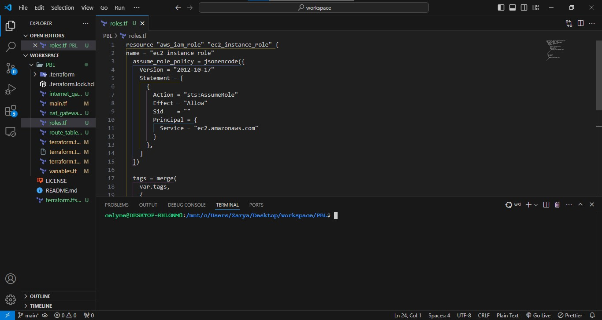
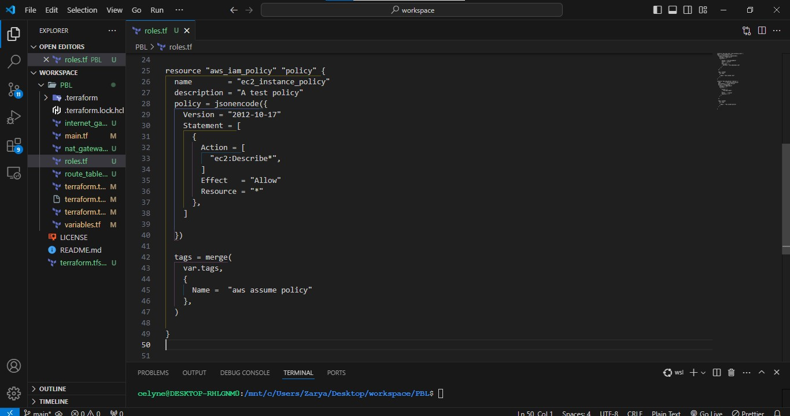
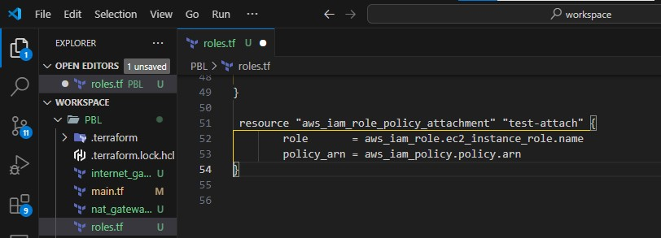
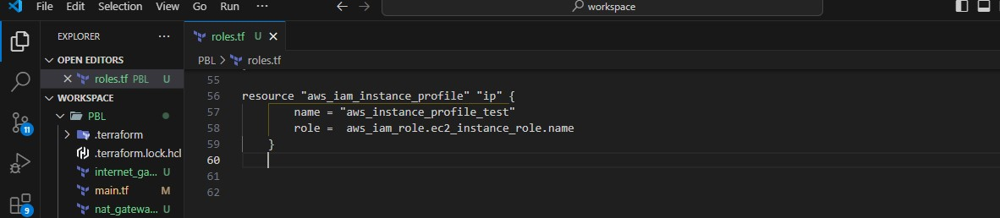

# AWS Identity and Access Management

IaM and Roles We want to pass an IAM role our EC2 instances to give them access to some specific resources, so we need to do the following:

1. Create AssumeRole

Assume Role uses Security Token Service (STS) API that returns a set of temporary security credentials that you can use to access AWS
resources that you might not normally have access to. These temporary credentials consist of an access key ID, a secret access key,
and a security token. Typically, you use AssumeRole within your account or for cross-account access.

Add the following code to a new file named `roles.tf`

```bash
resource "aws_iam_role" "ec2_instance_role" {
name = "ec2_instance_role"
  assume_role_policy = jsonencode({
    Version = "2012-10-17"
    Statement = [
      {
        Action = "sts:AssumeRole"
        Effect = "Allow"
        Sid    = ""
        Principal = {
          Service = "ec2.amazonaws.com"
        }
      },
    ]
  })

  tags = merge(
    var.tags,
    {
      Name = "aws assume role"
    },
  )
}

```



In this code we are creating AssumeRole with AssumeRole policy. It grants to an entity, in our case it is an EC2, permissions to assume the role.

2. Create IAM policy for this role

This is where we need to define a required policy (i.e., permissions) according to our requirements. For example, allowing an IAM
role to perform action describe applied to EC2 instances:

```bash
resource "aws_iam_policy" "policy" {
  name        = "ec2_instance_policy"
  description = "A test policy"
  policy = jsonencode({
    Version = "2012-10-17"
    Statement = [
      {
        Action = [
          "ec2:Describe*",
        ]
        Effect   = "Allow"
        Resource = "*"
      },
    ]

  })

  tags = merge(
    var.tags,
    {
      Name =  "aws assume policy"
    },
  )

}

```



3. Attach the Policy to the IAM Role
   This is where, we will be attaching the policy which we created above, to the role we created in the first step.

```bash
 resource "aws_iam_role_policy_attachment" "test-attach" {
        role       = aws_iam_role.ec2_instance_role.name
        policy_arn = aws_iam_policy.policy.arn
    }

```



4. Create an Instance Profile and interpolate the IAM Role

```bash
resource "aws_iam_instance_profile" "ip" {
        name = "aws_instance_profile_test"
        role =  aws_iam_role.ec2_instance_role.name
    }

```



We are pretty much done with Identity and Management part for now, let us move on and create other resources required.
