# AUTOMATE INFRASTRUCTURE WITH IAC USING TERRAFORM PART 3 – REFACTORING

In two previous projects we have developed AWS Infrastructure code using Terraform and tried to run it from your local workstation.
Now it is time to introduce some more advanced concepts and enhance our code.

Firstly, we will explore alternative Terraform
[backends](https://developer.hashicorp.com/terraform/language/settings/backends/configuration).

## Introducing Backend on S3

Each Terraform configuration can specify a backend, which defines where and how operations are performed, where state snapshots are
stored, etc.Take a peek into what the states file looks like. It is basically where terraform stores all the state of the infrastructure in json
format.

So far, we have been using the default backend, which is the local backend – it requires no configuration, and the states file is
stored locally. This mode can be suitable for learning purposes, but it is not a robust solution, so it is better to store it in some
more reliable and durable storage.

The second problem with storing this file locally is that, in a team of multiple DevOps engineers, other engineers will not have
access to a state file stored locally on your computer.

To solve this, we will need to configure a backend where the state file can be accessed remotely other DevOps team members. There areplenty of different standard backends supported by Terraform that you can choose from. Since we are already using AWS – we can
choose an [S3 bucket as a backend](https://developer.hashicorp.com/terraform/language/settings/backends/s3).

Another useful option that is supported by S3 backend is State Locking – it is used to lock your state for all operations that could
write state. This prevents others from acquiring the lock and potentially corrupting your state.
[State Locking](https://developer.hashicorp.com/terraform/language/state/locking) feature for S3 backend is optional and requires
another AWS service – DynamoDB.

Let us configure it! Here is our plan to Re-initialize Terraform to use S3 backend:

- Add S3 and DynamoDB resource blocks before deleting the local state file
- Update terraform block to introduce backend and locking
- Re-initialize terraform
- Delete the local tfstate file and check the one in S3 bucket
- Add outputs
- terraform apply

To get to know how lock in DynamoDB works, read the following [article](https://angelo-malatacca83.medium.com/aws-terraform-s3-and-dynamodb-backend-3b28431a76c1)

Create a file and name it `backend.tf` Add the below code and replace the name of the S3 bucket you created in Project-16.

```bash
# Note: The bucket name may not work for you since buckets are unique globally in AWS, so you must give it a unique name.

resource "aws_s3_bucket" "terraform_state" {
  bucket = "kydd-dev-terraform-bucket"
  force_destroy = true
}

# Enable versioning so we can see the full revision history of our state files

resource "aws_s3_bucket_versioning" "versioning" {
  bucket = aws_s3_bucket.terraform_state.id
  versioning_configuration {
    status = "Enabled"
  }
}

# Enable server-side encryption by default

resource "aws_s3_bucket_server_side_encryption_configuration" "state_encryption" {
  bucket = aws_s3_bucket.terraform_state.id

  rule {
    apply_server_side_encryption_by_default {
      sse_algorithm     = "AES256"
    }
  }
}
```

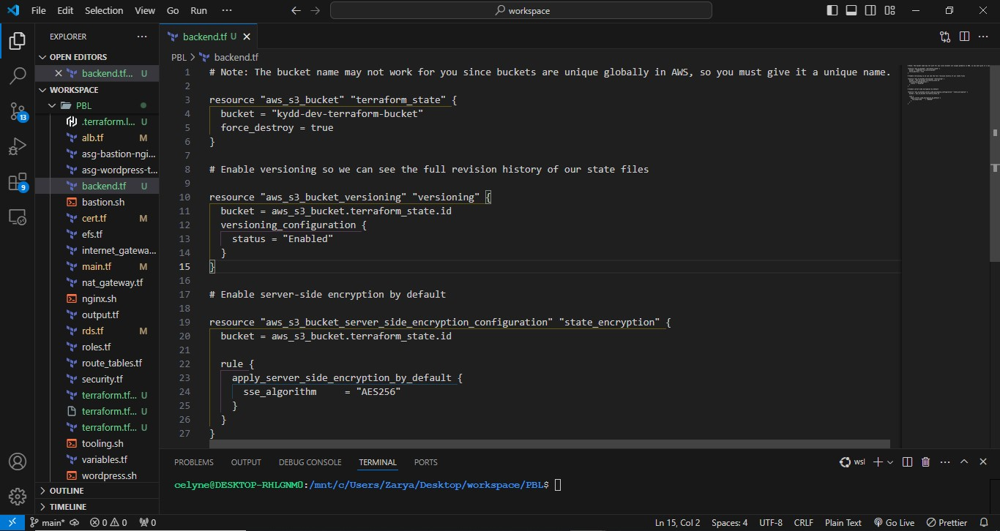

You must be aware that Terraform stores secret data inside the state files. Passwords, and secret keys processed by resources are
always stored in there. Hence, you must consider to always enable encryption. You can see how we achieved that with
server_side_encryption_configuration.

Next, we will create a DynamoDB table to handle locks and perform consistency checks. In previous projects, locks were handled with
a local file as shown in terraform.tfstate.lock.info. Since we now have a team mindset, causing us to configure S3 as our backend
to store state file, we will do the same to handle locking. Therefore, with a cloud storage database like DynamoDB, anyone running
Terraform against the same infrastructure can use a central location to control a situation where Terraform is running at the same
time from multiple different people.

- Dynamo DB resource for locking and consistency checking:

```bash
resource "aws_dynamodb_table" "terraform_locks" {
  name         = "terraform-locks"
  billing_mode = "PAY_PER_REQUEST"
  hash_key     = "LockID"
  attribute {
    name = "LockID"
    type = "S"
  }
}
```

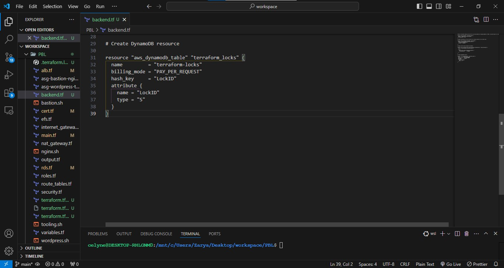

Terraform expects that both S3 bucket and DynamoDB resources are already created before we configure the backend. So, let us run
terraform apply to provision resources.

- Configure S3 Backend

```bash
terraform {
  backend "s3" {
    bucket         = "kydd-dev-terraform-bucket"
    key            = "global/s3/terraform.tfstate"
    region         = "us-east-1"
    dynamodb_table = "terraform-locks"
    encrypt        = true
  }
}
```

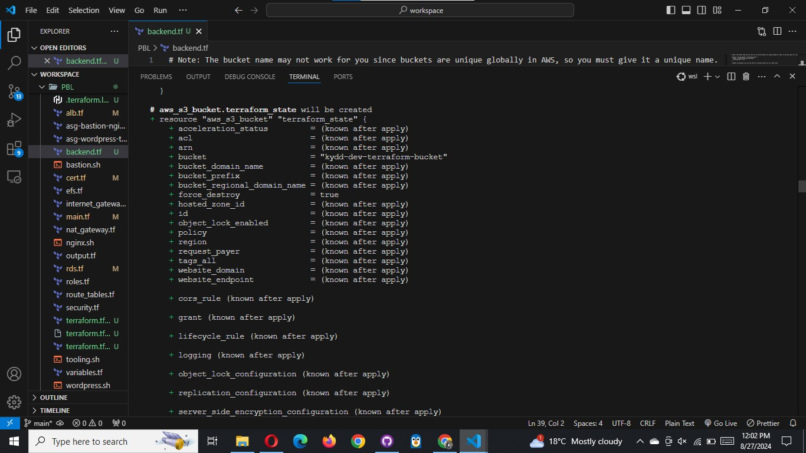

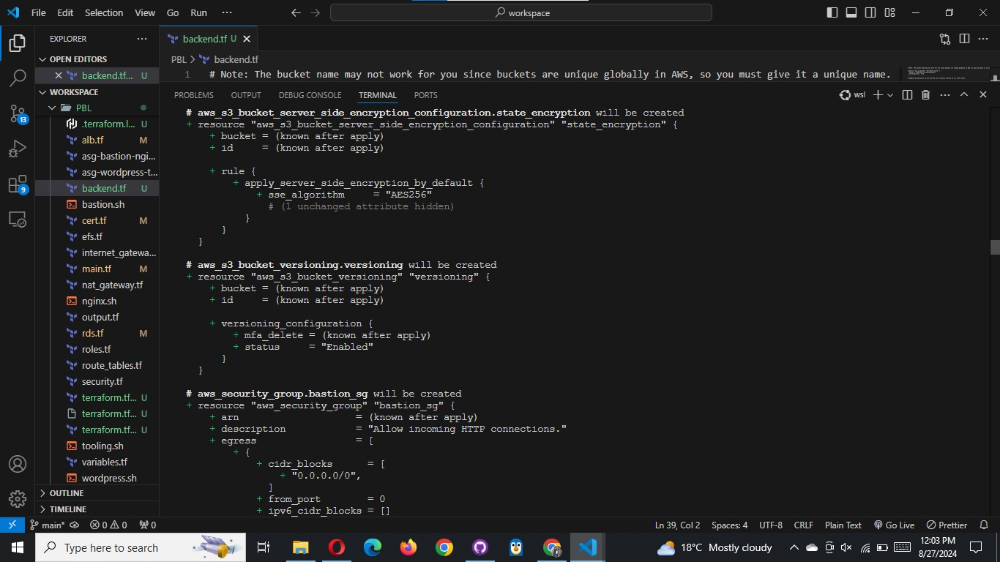

Now its time to re-initialize the backend. Run terraform init and confirm you are happy to change the backend by typing yes

```bash
terraform init
```

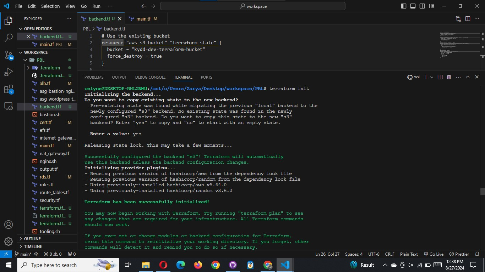

- Verify the changes
  Before doing anything if you opened AWS now to see what happened you should be able to see the following:

- `tfstatefile` is now inside the S3 bucket

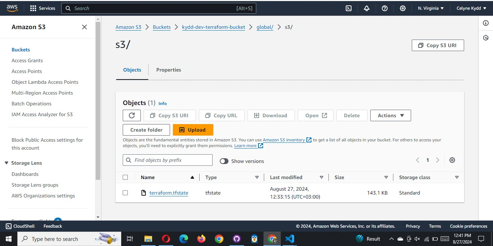

- DynamoDB table which we create has an entry which includes state file status

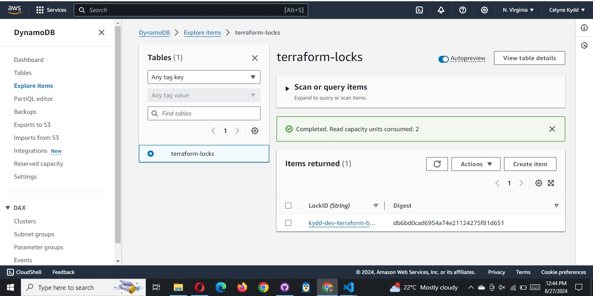

Navigate to the DynamoDB table inside AWS and leave the page open in your browser.
Run terraform plan and while that is running,

```bash
terraform plan
```

refresh the browser and see how the lock is being handled:

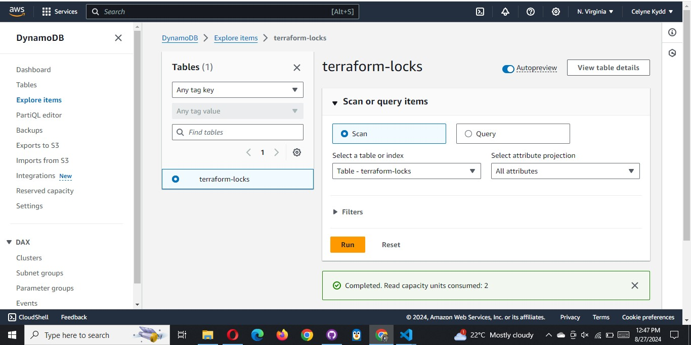

5. Add Terraform Output
   Before you run terraform apply let us add an output so that the S3 bucket Amazon Resource Names ARN and DynamoDB table name can be
   displayed.

Create a new file and name it output.tf and add below code

```bash
output "s3_bucket_arn" {
  value       = aws_s3_bucket.terraform_state.arn
  description = "The ARN of the S3 bucket"
}
output "dynamodb_table_name" {
  value       = aws_dynamodb_table.terraform_locks.name
  description = "The name of the DynamoDB table"
}
```

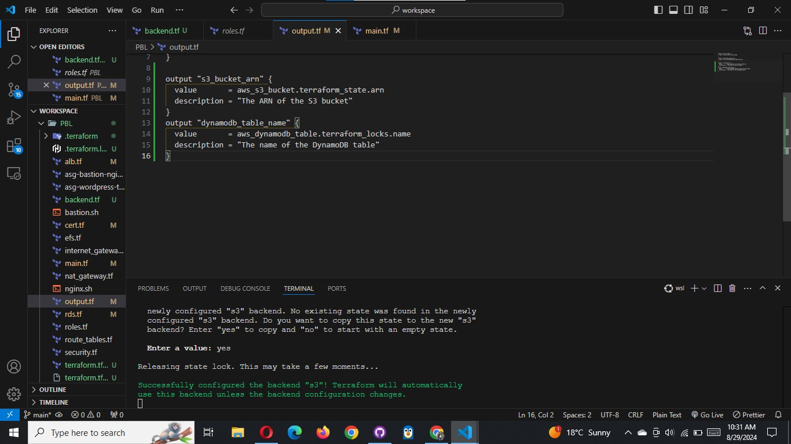

Now we have everything ready to go!

6. Let us run terraform apply
   Terraform will automatically read the latest state from the S3 bucket to determine the current state of the infrastructure. Even if
   another engineer has applied changes, the state file will always be up to date.

Now, head over to the S3 console again, refresh the page, and click the grey “Show” button next to “Versions.” You should now see
several versions of your terraform.tfstate file in the S3 bucket:

```bash
terraform apply
```

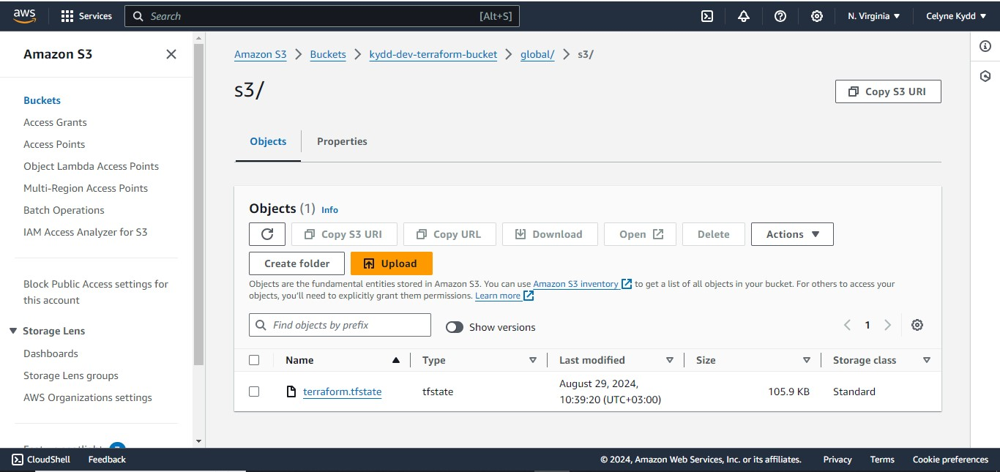

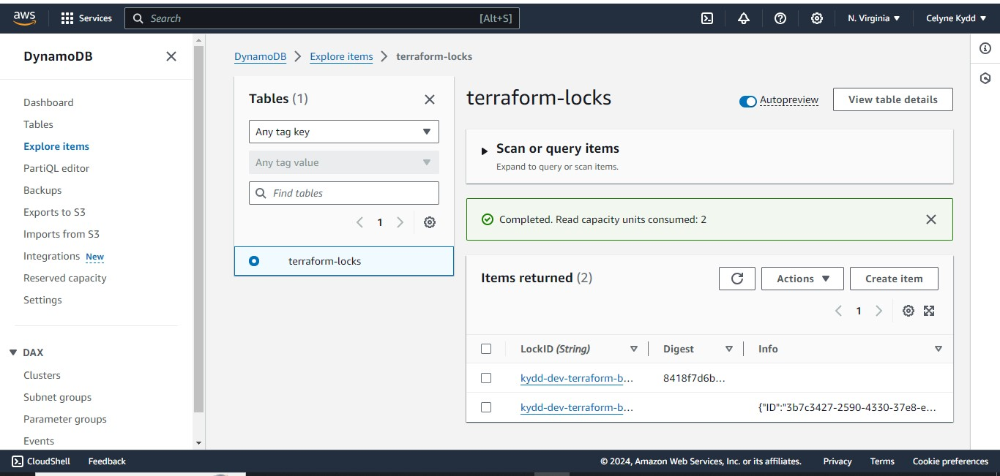

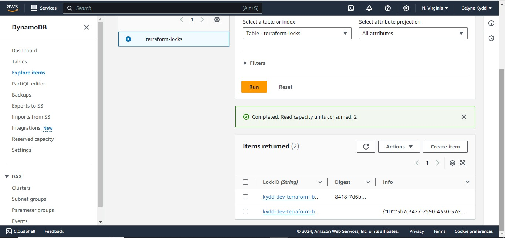

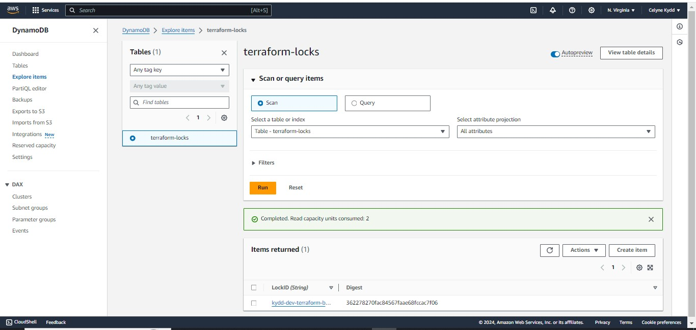

With help of remote backend and locking configuration that we have just configured, **collaboration is no longer a problem**.

However, there is _still one more problem_: Isolation Of Environments. Most likely we will need to create resources for different
environments, such as: Dev, sit, uat, preprod, prod, etc.

This separation of environments can be achieved using one of two methods:

a. [Terraform Workspaces](https://developer.hashicorp.com/terraform/language/state/workspaces)

b. Directory based separation using terraform.tfvars file
