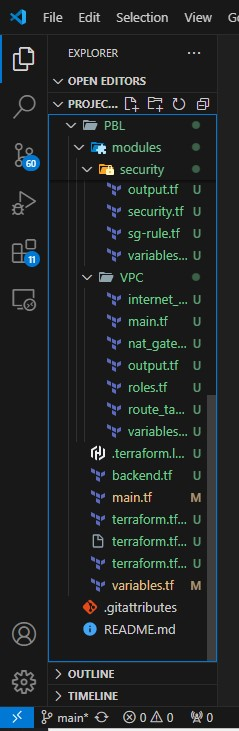
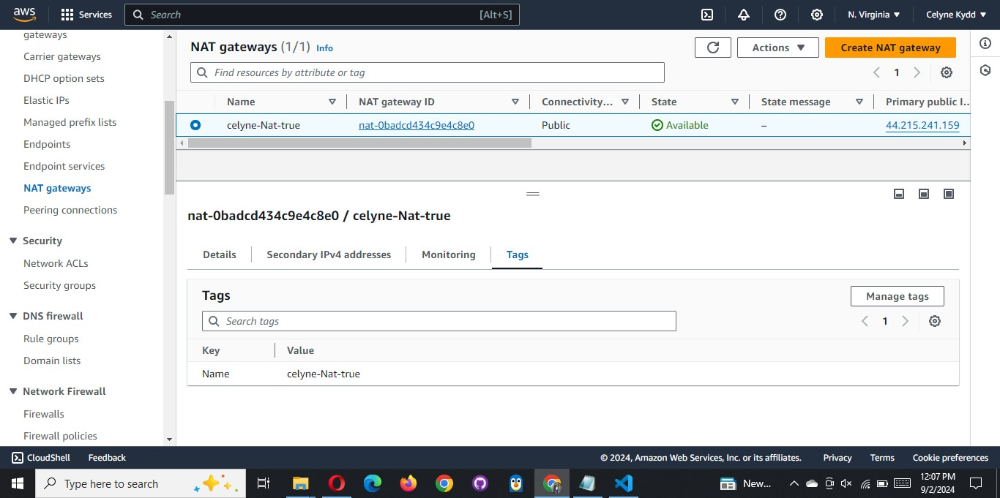

## REFACTOR YOUR PROJECT USING MODULES

Let us review the [repository](https://github.com/darey-devops/PBL-project-17) from project 17, you will notice that we had a single
list of long file for creating all of our resources, but that is not the best way to go about it because it makes our code base very
hard to read and understand therefore making future changes can be quite stressful.

QUICK TASK FOR YOU: Break down your Terraform codes to have all resources in their respective modules. Combine resources of a similar
type into directories within a ‘modules’ directory, for example, like this:

```js
- modules
  - ALB: For Apllication Load balancer and similar resources
  - EFS: For Elastic file system resources
  - RDS: For Databases resources
  - Autoscaling: For Autosacling and launch template resources
  - compute: For EC2 and rlated resources
  - VPC: For VPC and netowrking resources such as subnets, roles, e.t.c.
  - security: for creating security group resources
```


Each module shall contain following files:

```js
- main.tf (or %resource_name%.tf) file(s) with resources blocks
- outputs.tf (optional, if you need to refer outputs from any of these resources in your root module)
- variables.tf (as we learned before - it is a good practice not to hard code the values and use variables)
```




It is also recommended to configure providers and backends sections in separate files but should be placed in the root module.


After you have given it a try, you can check out this [repository](https://github.com/darey-devops/PBL-project-18)
for guidance and errors fixing.

IMPORTANT: In the configuration sample from the repository, you can observe two examples of referencing the module:

a. Import module as a source and have access to its variables via var keyword: in main.tf

```bash
module "VPC" {
  source = "./modules/VPC"
  region = var.region
  ...
```


b. Refer to a module’s output by specifying the full path to the output variable by using module.%module_name%.%output_name%
construction:

```bash
subnets-compute = module.network.public_subnets-1
```


# COMPLETE THE TERRAFORM CONFIGURATION

Complete the rest of the codes yourself, the resulting configuration structure in your working directory may look like this:

```js
└── PBL
    ├── modules
    |   ├── ALB
    |     ├── ... (module .tf files, e.g., main.tf, outputs.tf, variables.tf)
    |   ├── EFS
    |     ├── ... (module .tf files)
    |   ├── RDS
    |     ├── ... (module .tf files)
    |   ├── autoscaling
    |     ├── ... (module .tf files)
    |   ├── compute
    |     ├── ... (module .tf files)
    |   ├── network
    |     ├── ... (module .tf files)
    |   ├── security
    |     ├── ... (module .tf files)
    ├── main.tf
    ├── backends.tf
    ├── providers.tf
    ├── data.tf
    ├── outputs.tf
    ├── terraform.tfvars
    └── variables.tf
```


Now, the code is much more well-structured and can be easily read, edited and reused by your DevOps team members.

BLOCKERS: Your website would not be available because the userdata scripts we added to the launch template does not contain the
latest endpoints for EFS, ALB and RDS and also our AMI is not properly configured, so how do we fix this?

**In project 19**, WE would see how to use **packer to create AMIs**, Terrafrom to create the infrastructure and Ansible to configure the
infrasrtucture.

We will also see how to use terraform cloud for our backends.

**Pro-tips:**

1. You can validate your codes before running terraform plan with terraform validate command. It will check if your code is
   syntactically valid and internally consistent.

```bash
terraform validate
```


```bash
terraform plan
```


```bash
terraform apply
```


```bash
aws console
```





2. In order to make your configuration files more readable and follow canonical format and style – use terraform fmt command. It will
   apply Terraform language style conventions and format your .tf files in accordance to them.

Navigate to Your Project Directory

Simply run the terraform fmt command to format all Terraform files in your project directory

```bash
terraform fmt
```

```bash
terraform fmt -check

```


## The End of Project 18

we have done a great job developing and refactoring AWS Infrastructure as Code with Terraform!
