# Automate Infrastructure With IaC using Terraform 4 (Terraform Cloud)

### What Terraform Cloud is and why use it

By now, you should be pretty comfortable writing Terraform code to provision Cloud infrastructure using Configuration Language (HCL). Terraform is an open-source system, that you installed and ran a Virtual Machine (VM) that you had to create, maintain and keep up to date. In Cloud world it is quite common to provide a managed version of an open-source software. Managed means that you do not have to install, configure and maintain it yourself - you just create an account and use it "as A Service".

[Terraform Cloud]() is a managed service that provides you with Terraform CLI to provision infrastructure, either on demand or in response to various events.

By default, Terraform CLI performs operation on the server when it is invoked, it is perfectly fine if you have a dedicated role who can launch it, but if you have a team who works with Terraform - you need a consistent remote environment with remote workflow and shared state to run Terraform commands.

Terraform Cloud executes Terraform commands on disposable virtual machines, this remote execution is also called [remote operations](https://developer.hashicorp.com/terraform/cloud-docs/run/remote-operations).

## Migrate your `.tf` codes to Terraform Cloud

Let us explore how we can migrate our codes to Terraform Cloud and manage our AWS infrastructure from there:

## 1. Create a Terraform Cloud account

Follow [this link](https://app.terraform.io/public/signup/account), create a new account, verify your email and you are ready to start.

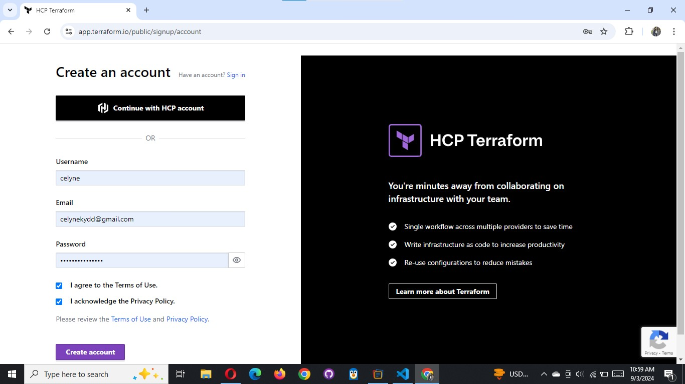

Most of the features are free, but if you want to explore the difference between free and paid plans - you can check it on [this page](https://www.hashicorp.com/products/terraform/pricing).

## 2. Create an organization

Select `Start from scratch`, choose a name for your organization and create it.


## 3. Configure a workspace

Before we begin to configure our workspace - [watch this part of the video](https://www.youtube.com/watch?v=m3PlM4erixY&t=287s) to better understand the difference between `version control workflow`, `CLI-driven workflow` and `API-driven workflow` and other configurations that we are going to implement.

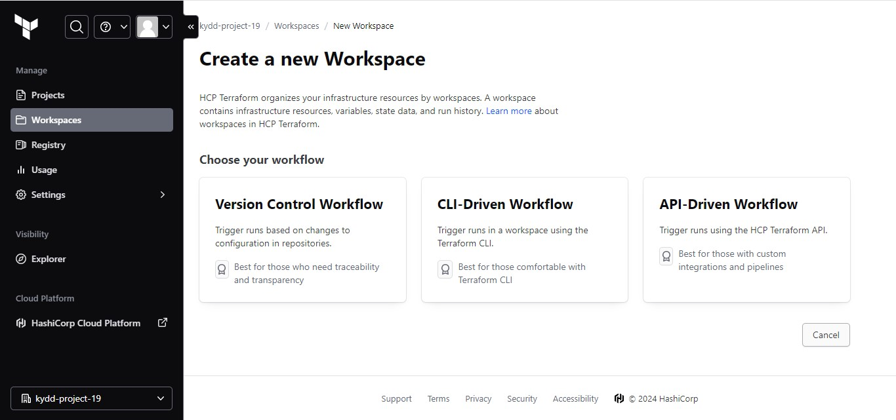

We will use `version control workflow` as the most common and recommended way to run Terraform commands triggered from our git repository.

Create a new repository in your GitHub and call it `terraform-cloud`, push your Terraform codes developed in the previous projects to the repository.

Choose `version control workflow` and you will be promped to connect your GitHub account to your workspace - follow the prompt and add your newly created repository to the workspace.

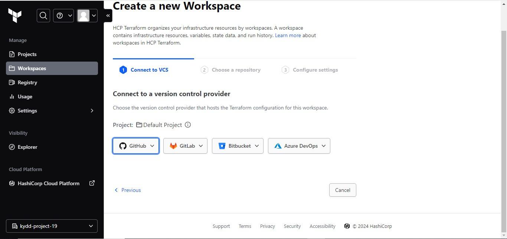

Move on to `Configure settings`, provide a description for your workspace and leave all the rest settings default, click `Create workspace`.

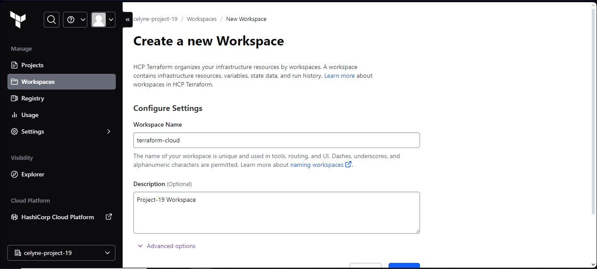

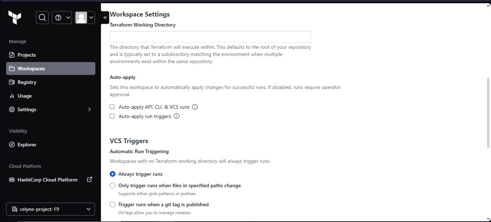

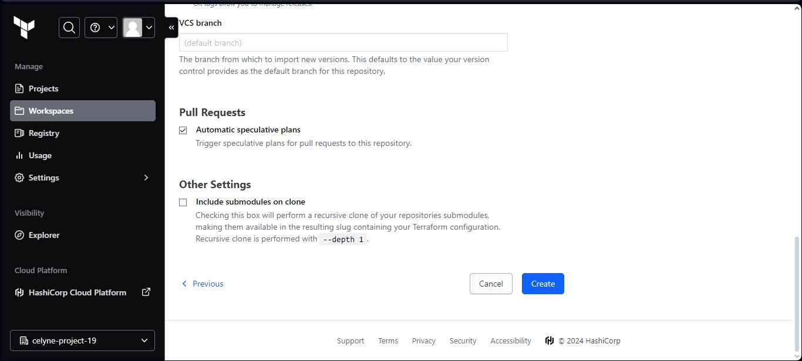

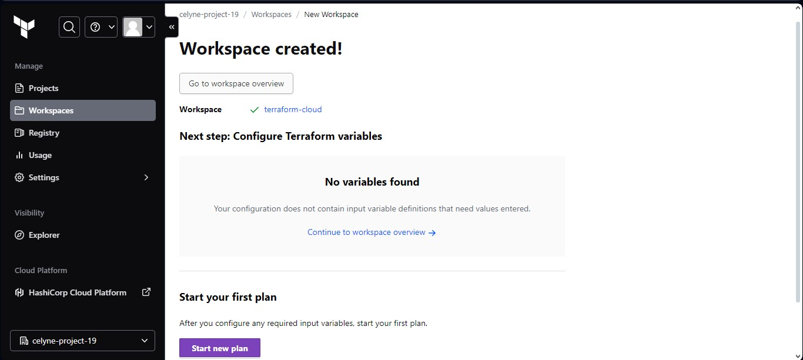

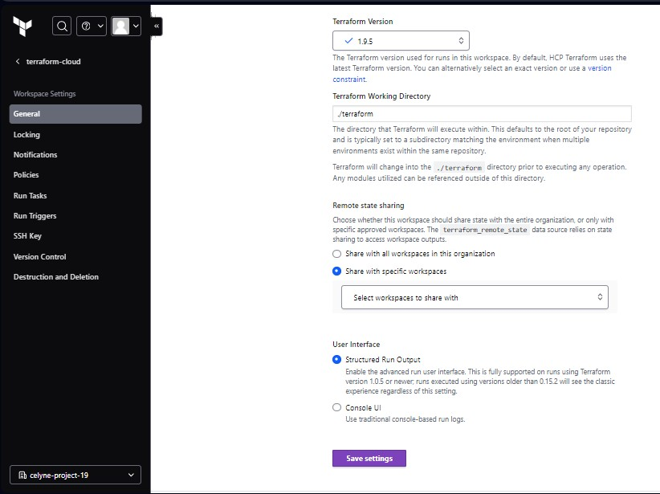

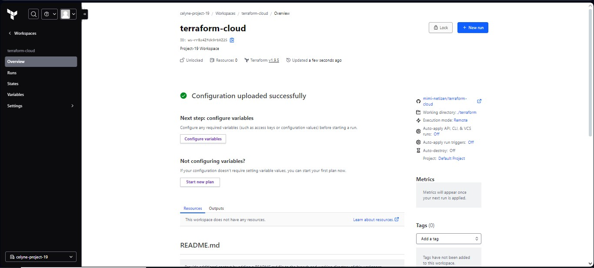

## 4. Configure variables

Terraform Cloud supports two types of variables: `environment variables` and `Terraform variables`. Either type can be marked as `sensitive`, which prevents them from being displayed in the Terraform Cloud web UI and makes them write-only.

Set two environment variables: **`AWS_ACCESS_KEY_ID`** and **`AWS_SECRET_ACCESS_KEY`**, set the values that you used in the last two projects. These credentials will be used to privision your AWS infrastructure by Terraform Cloud.

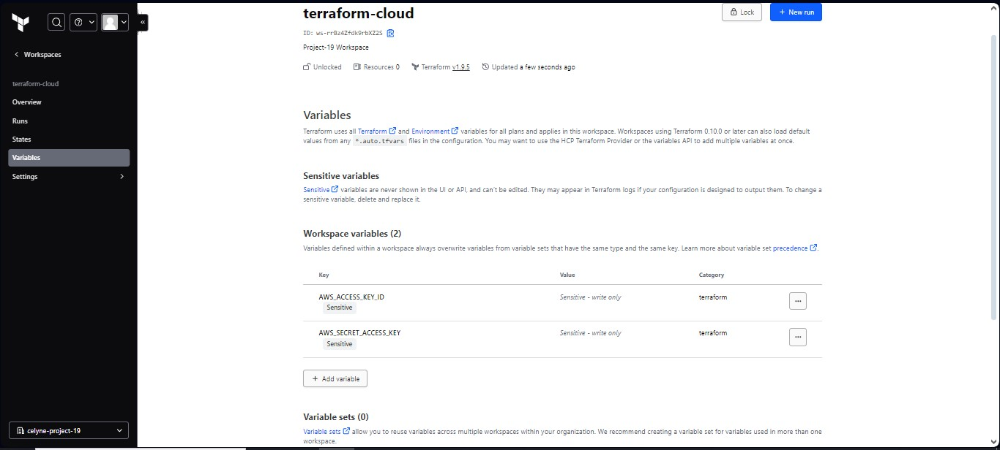

After you have set these 2 environment variables - your Terraform Cloud is all set to apply the codes from GitHub and create all necessary AWS resources.

## 5. Now it is time to run our Terrafrom scripts

But in our previous project, we talked about using `Packer` to build our images, and `Ansible` to configure the infrastructure, so for that we are going to make few changes to our our existing respository from the last project.

The files that would be Addedd is;

- **AMI:** for building packer images
- **Ansible:** for Ansible scripts to configure the infrastucture

Before we proceed, we need to ensure we have the following tools installed on our local machine;

- [packer](https://developer.hashicorp.com/packer/tutorials/docker-get-started/get-started-install-cli)

  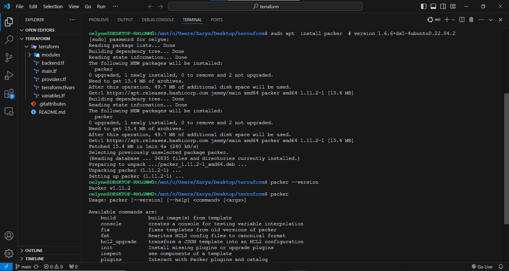

- [Ansible](https://docs.ansible.com/ansible/latest/installation_guide/intro_installation.html)

  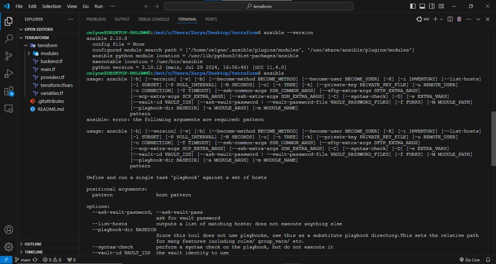

Refer to this [repository](https://github.com/StegTechHub/PBL-project-19) for guidiance on how to refactor your enviroment to meet the new changes above and ensure you go through the `README.md` file.

- Install `graphviz`

  Graphviz is a powerful open-source tool for creating diagrams and visualizations of graph structures

```bash
sudo apt install graphviz
```

- Generate a Terraform Dependency Graph

```bash
terraform graph -type=plan | dot -Tpng > graph.png
```

```bash
terraform graph | dot -Tpng > graph.png
graph
```

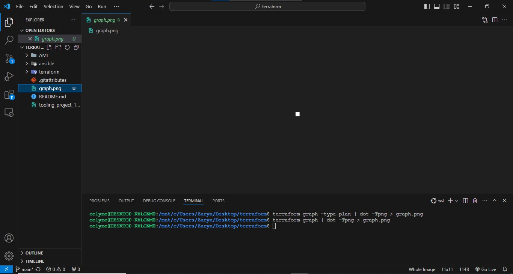

### Action Plan for this project

- Build images using packer
- confirm the AMIs in the console
- update terrafrom script with new ami IDs generated from packer build
- create terraform cloud account and backend
- run terraform script
- update ansible script with values from teraform output

  - RDS endpoints for wordpress and tooling
  - Database name, password and username for wordpress and tooling
  - Access point ID for wordpress and tooling
  - Internal load balancee DNS for nginx reverse proxy

- run ansible script
- check the website

To follow file structure create a new folder and name it `AMI`. In this folder, create Bastion, Nginx and Webserver (for Tooling and Wordpress) AMI Packer template (`bastion.pkr.hcl`, `nginx.pkr.hcl`, `ubuntu.pkr.hcl` and `web.pkr.hcl`).


Packer template is a `JSON` or `HCL` file that defines the configurations for creating an AMI. Each AMI Bastion, Nginx and Web (for Tooling and WordPress) will have its own Packer template, or we can use a single template with multiple builders.

## Create packer template code for each.

To get the `source AMI owner`, run this command

```bash
aws ec2 describe-images --filters "Name=name,Values=RHEL-9.4.0_HVM-20240605-x86_64-82-Hourly2-GP3" --query "Images[*].{ID:ImageId,Name:Name,Owner:OwnerId}" --output table
```

Ensure to update `Values` with the correct ami name

**Output**

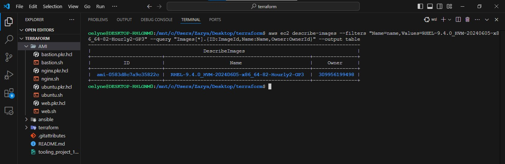

### Packer code for bastion

```bash
variable "region" {
  type    = string
  default = "us-east-1"
}

packer {
  required_plugins {
    amazon = {
      source  = "github.com/hashicorp/amazon"
      version = "~> 1"
    }
  }
}

locals {
  timestamp = regex_replace(timestamp(), "[- TZ:]", "")
}

# source blocks are generated from your builders; a source can be referenced in
# build blocks. A build block runs provisioners and post-processors on a
# source.
source "amazon-ebs" "terraform-bastion-prj-19" {

  ami_name      = "terraform-bastion-prj-19-${local.timestamp}"
  instance_type = "t2.small"
  region        = var.region

  source_ami_filter {
    filters = {
      name                = "RHEL-9.4.0_HVM-20240605-x86_64-82-Hourly2-GP3"
      root-device-type    = "ebs"
      virtualization-type = "hvm"
    }
    most_recent = true
    owners      = ["309956199498"]
  }
  ssh_username = "ec2-user"
  tag {
    key   = "Name"
    value = "terraform-bastion-prj-19"
  }
}

# a build block invokes sources and runs provisioning steps on them.
build {
  sources = ["source.amazon-ebs.terraform-bastion-prj-19"]

  provisioner "shell" {
    script = "bastion.sh"
  }
}

```


To format a specific Packer configuration file, use the following command

```bash
packer fmt <name>.pkr.hcl

packer fmt bastion.pkr.hcl
packer fmt nginx.pkr.hcl
packer fmt ubuntu.pkr.hcl
packer fmt web.pkr.hcl
```

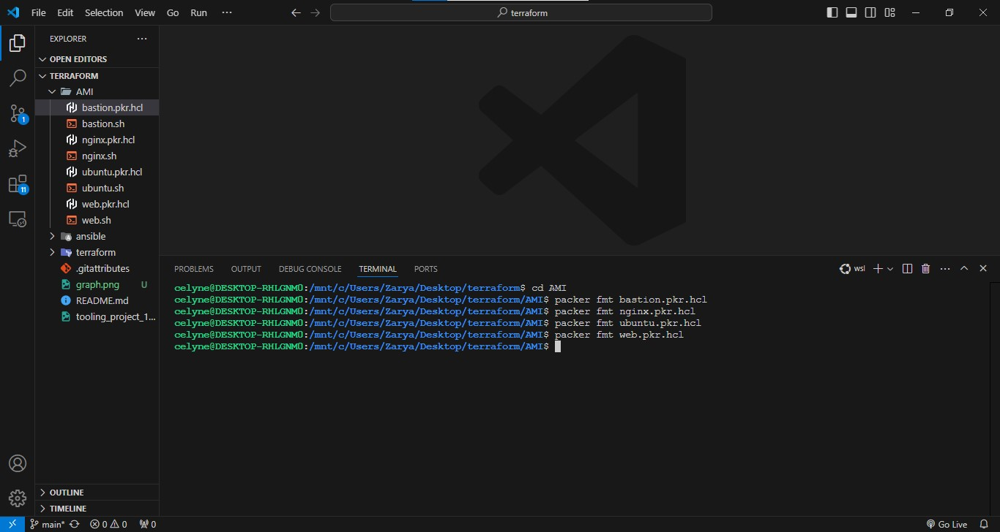

### Initialize the Plugins

```bash
packer init bastion.pkr.hcl
```

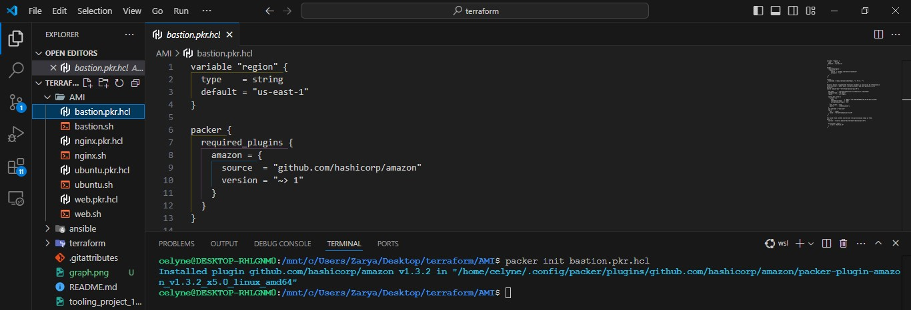

### Validate each packer template

```bash
packer validate bastion.pkr.hcl
packer validate nginx.pkr.hcl
packer validate ubuntu.pkr.hcl
packer validate web.pkr.hcl
```

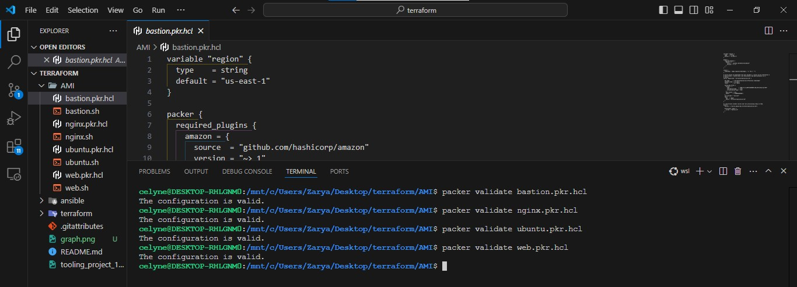

### Run the packer commands to build AMI for Bastion server, Nginx server and webserver

### For Bastion

```bash
packer build bastion.pkr.hcl
```


### For Nginx

```hcl
packer build nginx.pkr.hcl
```


### For Webservers

```hcl
packer build web.pkr.hcl
```


### For Ubuntu (Jenkins, Artifactory and sonarqube Server)

```hcl
packer build ubuntu.pkr.hcl
```


### The new AMI's from the packer build in the terraform script


In the terraform director, update the `terraform.auto.tfvars` with the new AMIs IDs built with packer which terraform will use to provision Bastion, Nginx, Tooling and Wordpress server


## 6. Run `terraform plan` and `terraform apply` from web console

- Switch to `Runs` tab and click on `Queue plan manualy` button.


- If planning has been successfull, you can proceed and confirm Apply - press `Confirm and apply`, provide a comment and `Confirm plan`


Check the logs and verify that everything has run correctly. Note that Terraform Cloud has generated a unique state version that you can open and see the codes applied and the changes made since the last run.

Check the AWS console


## 7. Test automated `terraform plan`

By now, you have tried to launch `plan` and `apply` manually from Terraform Cloud web console. But since we have an integration with GitHub, the process can be triggered automatically. Try to change something in any of `.tf` files and look at `Runs` tab again - `plan` must be launched automatically, but to `apply` you still need to approve manually.

Since provisioning of new Cloud resources might incur significant costs. Even though you can configure `Auto apply`, it is always a good idea to verify your `plan` results before pushing it to `apply` to avoid any misconfigurations that can cause 'bill shock'.

**Follow the steps below to set up automatic triggers for Terraform plans and apply operations using GitHub and Terraform Cloud:**

1. Configure a GitHub account as a Version Control System (VCS) provider in Terraform Cloud and follow steps

- Add a VCS provider


- Go to `Version Control` and click on `Change source`


- Click on `GitHub.com (Custom)`


- Select the repository


#### Make a change to any Terraform configuration file (.tf file)

Security group decription was edited in the variables.tf file and pushed to the repository on github that is linked to our Terraform Cloud workspace.

#### Check Terraform Cloud

Click on `Runs` tab in the Terraform Cloud workspace. Notice that a new plan has been automatically triggered as a result of the push.


**Note:** First, try to approach this project on your own, but if you hit any blocker and could not move forward with the project, refer to [support](https://www.youtube.com/watch?v=nCemvjcKuIA).
