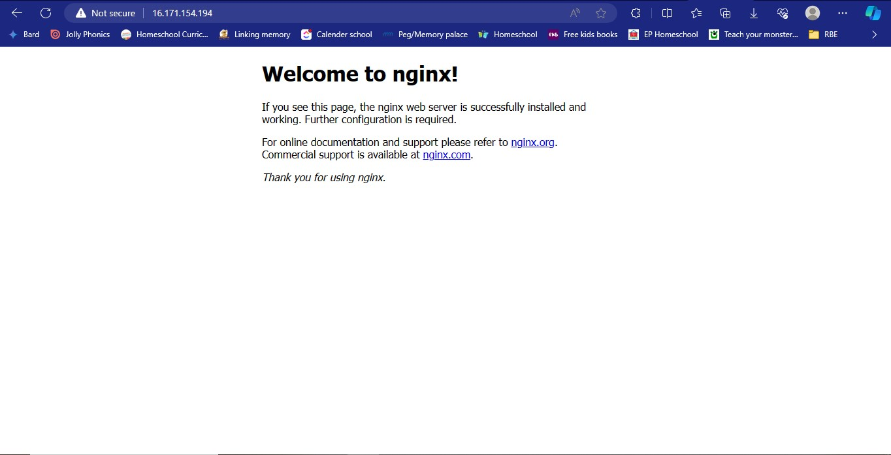

## Installing the Nginx Web Server

We need to install Nginx using these commands:

```bash
sudo apt-get update
sudo apt-get install nginx
```


To confirm nginx is running:

```bash
sudo systemctl status nginx
```


First, let's check if we can access our server locally in our ubuntu shell

```bash
curl http://localhost:80
```

Then we test how our nginx server responds to requests from the internet. We open the browser and inject

```
http://16.171.154.194:80
```

It should display this page if successful


